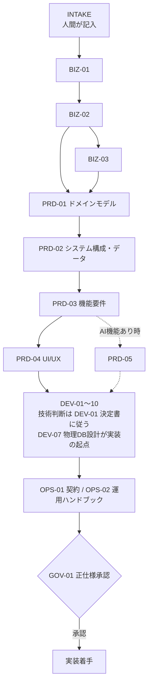

# 00_README.md — テンプレート全体ガイド

## 0. このテンプレートの目的

本テンプレートは、**コンテンツ主体サイト（コーポレートサイト・サービス LP・ブログ / お知らせ・ドキュメント）+ 軽量な管理画面（CMS）** の事業・プロダクト・開発・運用・ガバナンス仕様を、抜け漏れなく定義するための「正仕様書テンプレート」です。本テンプレート（Astro SSR + Svelte islands + Cloudflare Workers/D1/R2）は §0-1 の「パターン A」専用テンプレートであり、マルチテナント SaaS・業務システム（パターン B）は対象外です。

**使い方の前提**: 人間が `00_INTAKE.md` にシステム概要をまとめ、それを基に AI が各文書を順番に生成し、人間がレビューする（AI 8〜9 割・人間 1〜2 割）。完成した文書群を基に設計・実装を進める。**最速で、高い設計クオリティを維持したままリリースする** ための道具である。

**設計コンセプト**:

- 「AI ドリブンで埋めやすい構造」と「人間が読んで理解しやすい記述」の両立
- 仕様層（何を作るか）は技術非依存。技術選定は `DEV-01（技術スタック決定書）` に一元化し、他文書は DEV-01 を参照する
- スケジュール・会議体などのプロジェクト運営は文書化しない（本テンプレは「やりたいこと」と「システムの仕様」を明確にするためのもの）

---

## 0-1. 適用範囲の自己診断

本テンプレートが対象とするのは、コンテンツを読ませることが価値の中心で、トランザクション処理は Cloudflare ネイティブな機能（お問い合わせフォーム・軽量 EC 程度）に留まる案件（パターン A）である。マルチテナント SaaS や、CRUD・承認フロー等の業務ロジックそのものが価値の中心となる業務システム（パターン B）には使わない。その場合は別テンプレート（Laravel + Laravel Cloud 前提）を使う。

`00_INTAKE.md` の記入前にこの適用範囲に合致するか自己診断し、合致しない場合は本テンプレートの使用を中止する（GOV-02 に判断根拠を記録）。

---

## 1. 想定する利用シーン

| 利用区分 | 概要 | 推奨フロー |
| --- | --- | --- |
| **自社プロジェクト** | 自社が運営するコンテンツサイト/サービスサイトの新規立ち上げ | フルフロー（全 25 文書） |
| **受託案件** | クライアント企業の Web サイト開発受託 | 受託向けフロー（BIZ 軽量 + 契約厚め） |
| **提案・デモ開発** | クライアント提案用のデモ環境構築 | デモ向け軽量フロー（§4-3 の必要文書のみ） |

---

## 2. 想定スコープ

### 2-1. 適用範囲（対応する）

| 要素 | 対応レベル |
| --- | --- |
| コンテンツ主体サイト（コーポレート/LP/ブログ/ドキュメント/ニュース） | ◎ 標準対応 |
| SEO・初期表示速度の最適化（Astro SSR + Cloudflare エッジ配信） | ◎ 標準対応 |
| 認証（管理画面ログインのみ。メール認証が基本） | ◎ 標準対応 |
| 軽量な管理画面（CMS：記事/お知らせの作成・編集・公開） | ◎ 標準対応 |
| 権限管理（管理者/編集者程度の少数ロール） | ○ 標準対応 |
| 軽量なトランザクション機能（お問い合わせフォーム、簡易 EC のカート/チェックアウト） | ○ 標準対応（Cloudflare ネイティブ機能で実現。在庫同期・複雑な承認フローは含まない） |
| AI 機能（生成 / 要約 / 検索 / 対話） | ○ 任意対応 |
| 公開コンテンツのホスティング | ◎ 標準対応 |
| 小〜中規模スケール（コンテンツサイト相当のトラフィック） | ○ 標準対応 |

### 2-2. 適用範囲外（対応しない）

| 要素 | 理由 |
| --- | --- |
| 多ロール権限管理の多階層構造（Platform / Organization 等） | 本テンプレは単一組織・少数ロールの管理画面を前提とする |
| マルチテナント（組織単位・共有 DB 型） | 本テンプレは単一組織（自社/クライアント 1 サイト）を前提とする |
| サブスクリプション課金（Organization 単位の SaaS 課金） | 本テンプレの収益モデルは受託制作 + 保守が基本（BIZ-03） |
| チャット機能（1:1 / グループ / Bot）・リアルタイム性の高い通信 | コンテンツ主体サイトでの必要性は稀 |
| 在庫同期・複雑な承認フロー等の業務ロジック | トランザクション部分は静的コンテンツに対する軽量な付随機能の範囲に留める |
| 大規模スケール（同時接続 1 万+、マイクロサービス分割） | 別途専門設計が必要 |
| 物理 DB 分離型マルチテナント | 上記マルチテナント非対応の通り対象外 |
| リアルタイム分析基盤・DWH | 専門ツールチェーンの対象 |
| モバイルネイティブアプリ | Web 中心、PWA まで |
| 高度な ML パイプライン | LLM API 呼び出しまで |
| IoT・ハードウェア連携 | 別途専門設計が必要 |
| 規制業界（医療・金融）の深い対応 | 部分対応、深掘りは案件ごとに追加 |
| エンタープライズ SSO（SAML / OIDC） | 標準対象外。エンタープライズ要件時は派生テンプレートで対応 |
| Enterprise プラン（会員数・利用量無制限の大規模組織） | 本テンプレの適用上限（同時接続〜数千）を超えるため派生テンプレートで対応 |

該当案件は、本テンプレを起点に「派生テンプレート」として別管理する。

---

## 3. テンプレートの構造

### 3-1. ディレクトリ構成

```
docs/
├── 00_README.md             ← 本書
├── 00_INTAKE.md             ← 案件ヒアリング正本（全文書の入力源）
├── 00_DEV_GUIDE.md          ← AI と協働する開発者向け操作ガイド
├── 1-business/              ← 事業仕様（BIZ-01〜03）
├── 2-product/               ← プロダクト仕様（PRD-01〜05）
├── 3-development/           ← 開発仕様（DEV-01〜10。DEV-01 が技術スタック決定書）
├── 4-operations/            ← 運用仕様（OPS-01〜02。契約 + 運用ハンドブック）
└── 5-governance/            ← ガバナンス（GOV-01〜02。実案件用の器 — テンプレ層の記録は書かない）
```

### 3-2. 全ドキュメント一覧

owner は「責任の所在」であり専任を意味しない。少人数チーム（兼務前提）では 事業責任者 / PdM / Tech Lead の 2〜3 名で全 owner を兼務してよい。

| doc-id | ファイル | 役割 | phase | owner |
| --- | --- | --- | --- | --- |
| README | 00_README.md | テンプレート全体の利用ガイド | cross | PdM |
| INTAKE | 00_INTAKE.md | 案件ヒアリングの生記録正本（AI 入力源） | 0 | PdM |
| DEV_GUIDE | 00_DEV_GUIDE.md | AI と協働する開発者向け操作ガイド | cross | Tech Lead |
| BIZ-01 | 1-business/01-business-concept.md | 事業コンセプト・顧客課題・競争優位 | 1 | 事業責任者 |
| BIZ-02 | 1-business/02-value-kpi.md | KPI 体系・測定設計 | 1 | 事業責任者 / PdM |
| BIZ-03 | 1-business/03-pricing-model.md | 価格設計・収益モデル | 1 | 事業責任者 |
| PRD-01 | 2-product/01-domain-model.md | ドメインモデル・ユビキタス言語 | 2 | PdM / Tech Lead |
| PRD-02 | 2-product/02-system-and-data.md | システム構成・データモデル | 2 | Tech Lead / PdM |
| PRD-03 | 2-product/03-functional-requirements.md | 機能要件 | 2 | PdM |
| PRD-04 | 2-product/04-ui-ux-design.md | UI/UX・管理画面標準構成 | 2 | PdM |
| PRD-05 | 2-product/05-ai-feature-spec.md | AI 機能仕様（任意） | 2 | PdM / Tech Lead |
| DEV-01 | 3-development/01-architecture-rules.md | **技術スタック決定書**・アーキテクチャ原則（技術選定の唯一の正本） | 3 | Tech Lead |
| DEV-02 | 3-development/02-security-policy.md | セキュリティ・権限管理 | 3 | Tech Lead |
| DEV-03 | 3-development/03-quality-policy.md | 品質方針・テスト戦略 | 3 | Tech Lead |
| DEV-04 | 3-development/04-api-spec.md | API 仕様 | 3 | Tech Lead |
| DEV-05 | 3-development/05-backend-guide.md | バックエンド設計指針 | 3 | Tech Lead |
| DEV-06 | 3-development/06-frontend-guide.md | フロントエンド設計指針 + 管理画面パターン | 3 | Tech Lead |
| DEV-07 | 3-development/07-database-schema.md | 物理 DB 設計 | 3 | Tech Lead |
| DEV-08 | 3-development/08-deployment.md | デプロイ定義・検証完了ゲート | 3 | Tech Lead |
| DEV-09 | 3-development/09-state-machine-spec.md | 状態遷移仕様 | 3 | Tech Lead |
| DEV-10 | 3-development/10-integrations-spec.md | 統合・外部 API 仕様 | 3 | Tech Lead |
| OPS-01 | 4-operations/01-contract-policy.md | SLA・規約・契約 | 4 | 事業責任者 |
| OPS-02 | 4-operations/02-operations-handbook.md | 運用ハンドブック（サポート / インシデント / リリース実作業 / バックアップ） | 4 | Tech Lead |
| GOV-01 | 5-governance/01-decision-log.md | 意思決定ログ | 5 | PdM |
| GOV-02 | 5-governance/02-open-questions.md | 未決事項管理 | 5 | PdM |

---

## 4. 用途別フロー

### 4-1. 自社プロジェクト向け（フルフロー）

長期運用前提のサービス。全 25 文書をフェーズ 0〜5 の順で埋める。生成順序の詳細は §9（正本）を参照。

### 4-2. 受託案件向け

クライアント企業の代行開発。BIZ は軽量化、契約・SLA を厚く。

| 文書 | 自社案件比 | 重点 |
| --- | --- | --- |
| INTAKE | 同等 | クライアントの業務・既存資産を念入りに |
| BIZ-01 | 軽量化 | 事業仮説は提示済みが多い |
| BIZ-02 | 軽量化 | KPI はクライアント側で持つ |
| BIZ-03 | 軽量化 | 価格はクライアント側で決まっている |
| PRD-01〜05 | 同等 | プロダクト設計は自社案件と同じ厚み |
| DEV-01〜10 | 同等 | 技術仕様は同じ厚み |
| **OPS-01** | **厚め** | **契約・SLA・損害賠償・知的財産権を詳細化** |
| OPS-02 | 同等 | 引き渡し後の運用主体に応じて記述（必要なら旧分冊構成に展開可 — OPS-02 内の「旧 OPS-0N 相当」注記参照） |
| GOV | 同等 | 決定権者がクライアントに移ることに注意 |

### 4-3. デモ案件向け（軽量フロー）

提案資料兼デモ開発。最小限の文書で動くものを作る。

| 必要文書 | 内容 |
| --- | --- |
| INTAKE | クライアント業界・課題仮説のみ |
| BIZ-01 | 事業コンセプトの 1 ページ要約 |
| PRD-01 | ドメインモデル（簡易版） |
| PRD-02 | システム構成（標準テンプレほぼそのまま） |
| PRD-03 | 主要 5〜10 機能のみ |
| PRD-04 | 主要 3〜5 画面の ASCII モック |
| DEV-04 | デモで動かす API 一覧 |
| DEV-07 | デモ用テーブル数件 |

その他文書は **スキップ可**。リード獲得後にフルフローへ昇格させる。

---

## 5. SAMPLE マーカー仕様

本テンプレートは「テンプレ構造」と「サンプル値」を明示的に分離するために、SAMPLE マーカーを採用します。

### 5-1. マーカー記法

```markdown
<!-- TEMPLATE: このセクションで埋めるべき内容の説明 -->
<!-- SAMPLE START: プロジェクト名 -->
（具体的なサンプル内容）
<!-- SAMPLE END -->
```

### 5-2. 適用範囲

- 表のサンプル行（KPI 目標値、価格、ロール名等）
- Mermaid 図のサンプル内容（クラス名、フロー）
- コードブロック内のサンプルコード（モデル名、フィールド名）
- 具体的な数値（金額・期間・件数・閾値等）

### 5-3. サンプル一括削除（新規プロジェクト適用時）

```bash
# SAMPLE ブロックをすべて削除する（コンテンツごと）
find docs/ -name "*.md" -exec sed -i '/<!-- SAMPLE START/,/<!-- SAMPLE END/d' {} +

# 内容を置換済みの場合はタグ行だけ削除する
find docs/ -name "*.md" -exec sed -i '/<!-- SAMPLE START/d; /<!-- SAMPLE END/d' {} +

# または手動でブロックごとにレビューしながら置換する（推奨）
```

> **注意**: 手動で内容を書き換えた場合も、`<!-- SAMPLE START ... -->` と `<!-- SAMPLE END -->` のコメント行自体を必ず削除してください。タグが残ったままだと、ファイルが実プロジェクト資料なのかサンプルなのか判別できなくなります。

### 5-4. 「TEMPLATE:」 / 「SAMPLE:」 / 規約 の使い分け

| 区分 | マーカー | 例 |
| --- | --- | --- |
| 規約・固定ルール | マーカーなし | 「FormRequest を使う」「Raw SQL 禁止」等 |
| テンプレ構造の説明 | `<!-- TEMPLATE: ... -->` | 「ここにエンドポイント一覧を書く」等 |
| 具体的なサンプル値 | `<!-- SAMPLE START / END -->` で挟む | 「料金 ¥2,980 / 月」等 |

---

## 6. 記述状態ラベル（本文中で使う）

| ラベル | 意味 | 扱い方 |
| --- | --- | --- |
| `Confirmed` | 合意済みの確定情報 | 仕様・契約・実装判断に利用可 |
| `Assumed` | 仮説ベースの暫定情報 | 根拠と確認先を併記する |
| `Open` | 未決事項 | GOV-02 に転記して追跡 |
| `Decided` | 意思決定済み事項 | GOV-01 に記録して関連文書へ反映 |

なお、本テンプレで「Phase 1 / Phase 2」等と書かれた場合は機能リリース段階（機能ロードマップ）を指し、事業フェーズ（MVP 期 / 成長期 / 安定期 — BIZ-02 §3）とは別の軸である。

---

## 7. 文書ステータス（front-matter の `status`）

| status | 定義 | 次アクション |
| --- | --- | --- |
| `draft-ai` | AI が初稿を生成した状態 | owner が事実確認・修正 |
| `draft-human` | 人間が直接記入または修正中 | レビュー依頼前に整理 |
| `review` | レビュー待ち / レビュー反映中 | 承認者がコメント返却 |
| `approved` | 合意済みの正仕様 | 実装・運用へ反映、変更は GOV-01 経由 |

---

## 8. AI 運用ガイド（テンプレを AI に埋めさせる方法）

> **作業手順の詳細は `docs/00_DEV_GUIDE.md` を参照。** 本節はドキュメント生成に特化した概要です。

### 8-1. AI に依頼するときの定型プロンプト

```
このテンプレート（docs/）を会社「<会社名>」のサービス「<サービス名>」用に埋めてください。

入力源：
- 00_INTAKE.md（本プロジェクト用に既に記入済み）
- BIZ-01〜03（記入済み）
- ［上流文書を順次列挙］

ルール：
- 「TEMPLATE:」コメントは構造ヒントとして読み、削除不要
- 規約セクション（DoD チェックリスト等）はそのまま残す
- `Assumed` / `Open` は根拠を併記
```

### 8-2. AI 編集権限

| ファイル | AI の編集権限 |
| --- | --- |
| INTAKE | 読み取り専用（追記提案は別ファイル） |
| BIZ / PRD / DEV / OPS | 初稿生成・差分提案 |
| GOV-01 / GOV-02 | 候補抽出・整形 |

### 8-3. 人間レビュー必須項目

- 価格、契約、SLA
- 権限、認証、セキュリティ
- 法務表現、対外通知
- 著作権・知的財産権の扱い
- MVP スコープの最終判断

---

## 9. 文書の依存関係と生成順序（正本）

文書の生成順序を定義する図は本図のみとする（複数の図で二重管理しない）。各ステップで「読む文書」「確認ポイント」の詳細は `00_DEV_GUIDE.md` §3-1 の表を参照（本図と同期させること）。



- 生成順は **PRD-01（ドメインモデル）→ PRD-02 → PRD-03** の順とする（機能要件はドメインモデル・データモデルを踏まえて書く）
- INTAKE は全フェーズから継続参照する
- 未決事項は随時 GOV-02 に登録し、確定したら GOV-01 に記録して関連文書へ反映する
- 各フェーズの初稿は AI が生成し、owner（§3-2）が事実確認・修正する

---

## 10. 記入時の運用ルール

- 抽象表現ではなく判断可能な粒度まで具体化（例：「高可用性」ではなく「月間稼働率 99.9% 以上」）
- `related-docs` は実際に依存する文書を漏れなく記載
- Mermaid 図は、後続文書との関係性が読み取れる構造にする
- 文書更新時は `last-updated` も更新
- 大きな変更は `GOV-01` に意思決定として記録
