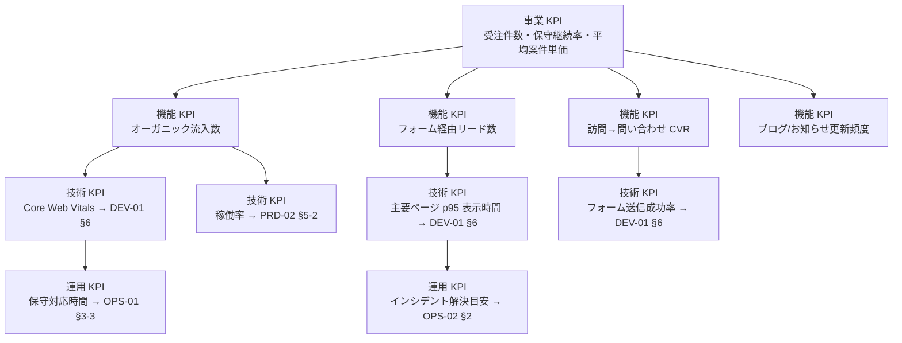

# 02-value-kpi.md — 価値指標・KPI 設計テンプレート

## このセクションの目的

事業・プロダクトの各レイヤーで何を成功とみなすかを統一する。**本ファイルは「事業・プロダクト KPI（KPI-01〜09）」の正本**である。性能・稼働率・サポート応答などの技術・運用系の数値は本書では定義せず、§2-2 の正本マップに従い各文書がオーナーシップを持つ。

## 0-H. ハイブリッド編集ガイド（要点）

- 推奨モード: Hybrid（AI 整理 + 事業責任者 / PdM 確定。兼務前提）
- 人間確認必須: KPI 算式、目標値、オーナー、他文書との参照整合

> 本テンプレートは **コンテンツ主体サイト + 軽量な管理画面** を前提とする（00_README §0-1）。以下の KPI 例は「Web サイトの受託制作 + 運用保守」を主業態とした場合のものであり、自社運営メディア/コンテンツサイトの場合は KPI-01〜03 を広告収益・アフィリエイト収益等に読み替える（§1 の分岐参照）。

---

## 1. KPI ツリー

<!-- TEMPLATE: 事業 KPI → 機能 KPI → 技術 KPI → 運用 KPI の因果を可視化する。技術・運用 KPI はここでは因果関係の表示のみで、定義・目標値は §2-2 の正本マップ先を参照 -->
<!-- SAMPLE START: フォーマット例 — 実際の内容に置き換えてください -->

<!-- SAMPLE END -->

---

## 2. KPI マスターテーブル

### 2-1. 事業・プロダクト KPI（本書が正本）

目標値の数値は **§3「フェーズ別 KPI 目標値」のみで管理**する（本表との二重管理を禁止）。本表は定義・計測方法・担当の正本。

<!-- SAMPLE START: フォーマット例 — 実際の内容に置き換えてください -->
| KPI-ID | 名称 | 定義 | 計測方法 | 目標値 | 頻度 | 担当 |
| --- | --- | --- | --- | --- | --- | --- |
| KPI-01 | 新規受注件数 | 月内に成約した新規制作案件数 | 受注管理台帳 | フェーズ別目標（§3）参照 | 月次 | 事業責任者 |
| KPI-02 | 保守契約継続率 | 更新対象のうち更新した保守契約の割合 | 契約管理台帳 | フェーズ別目標（§3）参照 | 月次 | 事業責任者 |
| KPI-03 | 平均案件単価 | 新規制作案件の平均受注金額 | 受注管理台帳 | フェーズ別目標（§3）参照 | 月次 | 事業責任者 |
| KPI-04 | オーガニック流入数 | 検索経由のセッション数（サイトごと集計・合算） | アクセス解析 | フェーズ別目標（§3）参照 | 週次 | PdM |
| KPI-05 | フォーム経由リード数 | お問い合わせ/資料請求フォームの送信完了数 | フォーム送信ログ | フェーズ別目標（§3）参照 | 週次 | PdM |
| KPI-06 | 訪問→問い合わせ CVR | セッション数のうちフォーム送信完了に至った割合 | アクセス解析 + フォーム送信ログ | フェーズ別目標（§3）参照 | 週次 | PdM |
| KPI-07 | ブログ/お知らせ更新頻度 | サイトあたり月間の新規公開記事数 | CMS 集計 | フェーズ別目標（§3）参照 | 月次 | PdM |
| KPI-08 | 顧客満足度（保守対応） | 保守対応後アンケートの満足度スコア | アンケート | フェーズ別目標（§3）参照 | 四半期 | 事業責任者 |
| KPI-09 | NPS | プロモーター % − デトラクター % | 四半期アンケート | フェーズ別目標（§3）参照 | 四半期 | PdM |
<!-- SAMPLE END -->

### 2-2. 技術・運用 KPI の正本マップ

以下の KPI は本書では定義しない。定義・目標値・計測方法はすべて右列の文書が正本である。**KPI-ID は他文書からの参照を壊さないため欠番のまま保持し、再採番しない。**

| KPI-ID（欠番） | 名称 | 区分 | 正本文書 |
| --- | --- | --- | --- |
| KPI-10 | Core Web Vitals（LCP/CLS/INP） | 技術（性能） | DEV-01 §6（非機能要件） |
| KPI-11 | 主要ページ p95 表示時間 | 技術（性能） | DEV-01 §6（非機能要件） |
| KPI-12a / KPI-12b | 稼働率（管理側 / 公開側） | 技術（可用性） | PRD-02 §5-2（可用性目標の正本） |
| KPI-13 | 一次応答時間 | 運用（サポート） | OPS-01 §3-3（プラン別一次応答 SLA の正本） |
| KPI-14 | MTTR | 運用（障害対応） | **廃止** — OPS-02 §2 の解決目安に一本化し、独立 KPI としては管理しない |

---

## 3. フェーズ別 KPI 目標値

フェーズ命名は BIZ-01 §7 と共通の **MVP 期 / 成長期 / 安定期**。本表が事業・プロダクト KPI の目標値の唯一の置き場所である。

<!-- SAMPLE START: フォーマット例 — 実際の内容に置き換えてください -->
| KPI-ID | MVP 期 | 成長期 | 安定期 |
| --- | --- | --- | --- |
| KPI-01 新規受注件数 | 1 件 / 月 | 3 件 / 月 | 5 件 / 月 |
| KPI-02 保守契約継続率 | 80% | 90% | 95% |
| KPI-03 平均案件単価 | 計測開始（参考値） | 前期比 +10% | 前期比 +10% |
| KPI-04 オーガニック流入数 | 500 / 月 | 2,000 / 月 | 5,000 / 月 |
| KPI-05 フォーム経由リード数 | 5 件 / 月 | 20 件 / 月 | 40 件 / 月 |
| KPI-06 訪問→問い合わせ CVR | 1% | 1.5% | 2% |
| KPI-07 ブログ/お知らせ更新頻度 | 2 件 / 月 | 4 件 / 月 | 4 件 / 月 |
| KPI-08 顧客満足度（保守対応） | 計測開始（参考値） | 4.0 / 5 | 4.3 / 5 |
| KPI-09 NPS | 計測開始（参考値） | +20 | +30 |
<!-- SAMPLE END -->

---

## 4. KPI ダッシュボード設計

### 4-1. 方針

<!-- SAMPLE START: フォーマット例 — 実際の運用に置き換えてください -->
- 閲覧者：事業責任者 / PdM（兼務前提。開発・サポート担当は必要時に閲覧）
- 更新頻度：技術 KPI は 1 時間ごと、事業 KPI は日次
- アラート対象：可用性、ページ表示速度、フォーム送信成功率、保守一次応答時間（数値の正本は §2-2 のマップ先）
- 可視化単位：サイト（プロジェクト）、流入経路、ページ種別、環境別
<!-- SAMPLE END -->

### 4-2. ダッシュボード構成

<!-- TEMPLATE: ビューの分け方の標準構成。技術・運用ビューの数値目標は §2-2 の正本文書に従う -->
<!-- SAMPLE START: フォーマット例 — 実際の内容に置き換えてください -->
| ビュー | 主な KPI |
| --- | --- |
| 経営 KPI ビュー | 新規受注件数、保守契約継続率、平均案件単価 |
| プロダクト KPI ビュー | オーガニック流入数、フォーム経由リード数、CVR、ブログ/お知らせ更新頻度 |
| 技術 KPI ビュー | Core Web Vitals、ページ表示時間、稼働率（正本: DEV-01 §6 / PRD-02 §5-2） |
| 運用 KPI ビュー | 保守一次応答、インシデント件数（正本: OPS-01 §3-3 / OPS-02） |
<!-- SAMPLE END -->

---

## 5. KPI 定義変更ルール

| 項目 | ルール |
| --- | --- |
| 定義変更権限 | 事業責任者 / PdM の合意で変更（兼務時は単独判断可、ただし GOV-01 に記録） |
| 変更記録先 | GOV-01 |
| 周知対象 | プロジェクト関係者全員 |
| 反映先 | §2-2 正本マップの各文書、DEV-03、OPS-02、ダッシュボード設定 |

<!-- SAMPLE START: 変更記録の例 -->
> 例：「オーガニック流入」の集計対象を「検索エンジン経由のみ」から「SNS 経由を含む自然流入」へ変更する場合、過去比較への影響を注記し GOV-01 に記録。
<!-- SAMPLE END -->

---

## 6. 記入時チェックポイント

- 事業 KPI と技術 KPI の因果がつながっているか（§1）
- 定義・算式・頻度・担当者が空欄になっていないか
- 目標値の数値が §3 以外の場所（§2 含む）に重複記載されていないか
- 技術・運用系の数値を本書に再定義していないか（§2-2 の正本マップ経由になっているか）
- フェーズごとの目標値が現実的かつ成長余地を示しているか
- BIZ-03 の採算前提（案件単価・保守継続率等）と §3 のフェーズ・数値が整合しているか
- 自社運営メディア/コンテンツサイトの場合、KPI-01〜03 を広告収益・アフィリエイト収益等に読み替えたか
