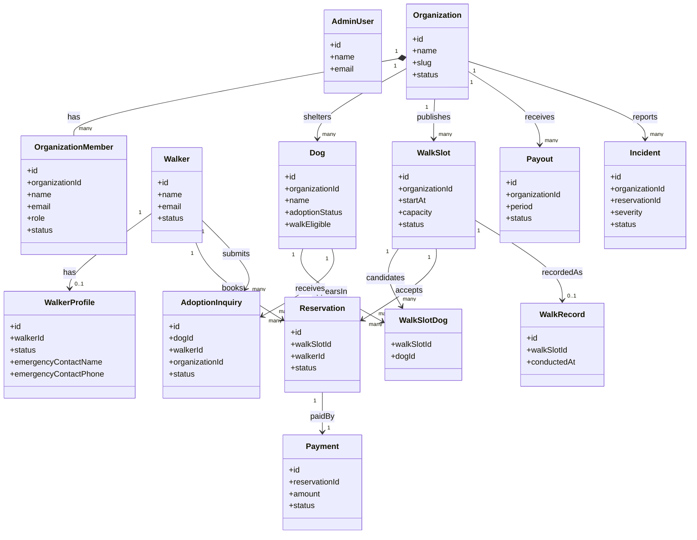

# 01-domain-model.md — ドメインモデル

## このセクションの目的

プロダクトの業務概念をエンティティ単位で整理し、共通言語を確立する。**本サービスは本テンプレート標準の「単一運営・少数ロール前提のコンテンツ主体サイト」ではなく、Organization（保護団体）と Walker（お散歩参加者）の二者間マーケットプレイスである** 点が最大の構造的差分。00_README §0-1 の自己診断基準ではテンプレート標準の適用範囲（パターン A）を超えるが、Astro + Cloudflare 基盤のまま拡張する方針が確定している（GOV-01 D-006）。本書 §1 でその差分を明示したうえで標準テンプレートの設計思想（アカウント系統の完全分離等）を踏襲する。

## 0-H. ハイブリッド編集ガイド（要点）

- 推奨モード: Hybrid（AI 整理 + PdM / Tech Lead レビュー）
- 人間確認必須: 用語の意味、責務境界、将来拡張との整合、営業用語との衝突

---

## 1. ドメインモデル（本プロジェクトの構造）

### 1-0. 標準テンプレートとの差分（重要）

| 観点 | 本テンプレート標準 | 本プロジェクト |
| --- | --- | --- |
| 想定パターン（00_README §0-1） | パターン A（コンテンツ主体サイト + 軽量な管理画面、単一運営）| パターン B（多ロール権限・マーケットプレイス）相当に該当するが、既存の Astro + Cloudflare 基盤のまま拡張する（`Decided` — GOV-01 D-006）|
| Organization の位置づけ | 概念なし（単一運営が前提。マルチテナント課金テーブルは持たない）| **保護団体**。テナントだが課金されず、参加費の一部を**受け取る側**（`apps/public` 側で管理 — GOV-01 D-007）|
| Organization に所属する一般ユーザー | 概念なし | Organization には**団体スタッフのみ**が所属（OrganizationMember = 団体スタッフ所属）。お散歩参加者（Walker）は Organization に所属しない |
| アカウント系統 | AdminUser（`apps/admin`）と Member（`apps/public`、マイページ機能採用時のみ、ロール階層なしの単一種別）の 2 系統・完全分離 | **3 系統・完全分離**（`Decided` — GOV-01 D-007）：AdminUser（`apps/admin`）、Walker（`apps/public` の Member 相当。お散歩参加者）、OrganizationMember（`apps/public`、団体スタッフ。`organization_id` + `role` 列を直書き） |
| ロール数 | AdminUser: 1〜2 ロール（admin/editor）。Member: ロール階層なし | Platform: 1 ロール（`admin`）+ Organization: 2 ロール（`org_admin`/`org_staff`）の計 3 ロール（`Decided` — GOV-01 D-011。D-004 を置換）。原文が「保護団体ユーザー」を単一区分としか言及していないため Organization 側は最小構成（INTAKE §4-6）|
| 課金対象 | Member（軽量 EC 採用時、都度注文）| Walker（都度課金）。Organization は課金されず還元を受け取る（Stripe Connect — GOV-01 D-008）|
| チャット・AI | 標準機能なし（採用可否は案件判断、PRD-05）| **不採用**（PRD-03 で FG 削除、PRD-05 は不採用 — GOV-01 D-005）|

### 1-1. 階層モデル

```
Platform（運営：自社。apps/admin）
  ├─ Platform ロール: admin（AdminUser）        ← 全 Organization・全 Walker を横断管理
  │
  ├─ Organization（テナント = 保護団体。apps/public）
  │    ├─ OrganizationMember（Organization ロール：org_admin / org_staff。apps/public）
  │    ├─ Dog（保護犬）
  │    ├─ WalkSlot（お散歩枠）─ WalkSlotDog（候補犬の紐付け）
  │    ├─ Payout（団体還元・振込。Stripe Connect 経由）
  │    └─ Incident / AdoptionInquiry（Organization に紐づくが Walker も関与）
  │
  └─ Walker（お散歩参加者。apps/public。Organization に非所属のプラットフォーム直属アカウント）
       ├─ WalkerProfile（本人確認・緊急連絡先等の拡張プロフィール）
       ├─ Reservation（予約。WalkSlot × Walker）
       │    └─ Payment（都度課金の決済記録。Stripe）
       ├─ AdoptionInquiry（里親相談。Dog × Walker × Organization）
       └─ Incident（事故・トラブル。Reservation 等に関連）
```

> **アプリ間のアカウント配置**: AdminUser は `apps/admin`、Organization / OrganizationMember / Walker / WalkerProfile は `apps/public` に存在する（GOV-01 D-007）。Media / Inquiry のような運営対応のデータは `apps/admin` が対応を書き込み・`apps/public` が読み取る（CLAUDE.md 参照）。3 系統のアカウントは別テーブル・別セッション（別クッキー名）で完全に分離し、単一の User テーブルに `platformRole` 等の区別フラグを持たせる実装は行わない（DEV-02 §1 参照）。

### 1-2. ロール構造（2 階層・計 3 ロール）

ロールは **Platform ロール + Organization ロール の 2 階層構造** とする。本テンプレート標準（AdminUser 1〜2 ロール、Member はロール階層なし）より多い **計 3 ロール** とする（INTAKE §4-6 の根拠に基づく拡張）。

| 階層 | ロール | 概要 |
| --- | --- | --- |
| Platform | `admin` | 運営者の全体管理（全 Organization・全 Walker 横断、全操作が可能。サポート等の読み取り専用ロールは設けない — `Decided` GOV-01 D-011）。`apps/admin` の AdminUser |
| Organization | `org_admin` | 保護団体の全権（団体情報・スタッフ管理・掲載設定・還元確認）。`apps/public` の OrganizationMember |
| Organization | `org_staff` | 保護犬・お散歩枠・予約者確認・実施記録等の日常運用。`apps/public` の OrganizationMember |

> Walker（お散歩参加者）は上記のいずれの階層にも属さない。認証済みの Walker アカウント（`apps/public` の Member 相当テーブル）が任意で `WalkerProfile` を作成し、その `status`（§7）が「利用可能」になることで予約機能が解禁される、**データ駆動の利用資格**であり、RBAC 上の「ロール」としては扱わない（DEV-02 §2 で詳細化）。

### 1-3. 階層・標準エンティティの役割

| 概念 | 役割 | 例 |
| --- | --- | --- |
| Platform | サービス全体の運営者（自社）。AdminUser が単一ロール `admin` を持つ（`apps/admin`）| 自社（運営者）|
| Organization | テナント。保護団体 1 団体（`apps/public`）| ○○動物保護の会 |
| OrganizationMember | 団体スタッフの認証アカウント兼 Organization ロール（`apps/public`。AdminUser・Walker とは別テーブル・別セッション）| スタッフ A が団体 B の org_staff |
| Walker | プラットフォーム直属のお散歩参加者の認証アカウント（`apps/public`）。Organization に非所属 | お散歩参加者 X が複数団体のお散歩枠を予約 |
| Dog / WalkSlot（プロダクト固有）| Organization 内のリソース。§3-2 で定義 | 保護犬プロフィール、お散歩募集枠 |
| Reservation / Payment | Walker が WalkSlot を予約し、都度課金（Stripe）で決済する単位 | 予約 1 件・決済 1 件 |
| Payout | Organization 単位の月次還元・振込集計（Stripe Connect 経由の Transfer。本テンプレ標準の Order/Subscription に代わる、課金ではなく**支払う**エンティティ）| 月次振込 1 件 |
| Channel / Message / AiJob | **不採用**（チャット・AI 機能なし）| — |

### 1-4. テンプレート標準エンティティとの対応（参考）

| 標準（テンプレート標準エンティティ） | 本プロジェクトでの対応 |
| --- | --- |
| Site（単一運営、マルチテナントではない）| Platform（運営。ただし多階層ロール・複数テナント（Organization）を持つ点で標準の Site 概念から拡張 — GOV-01 D-006）|
| AdminUser（`admin`/`editor` の 2 ロール）| Platform ロール（単一 `admin`）。`apps/admin` に配置する点は標準と同じ |
| Member（マイページ機能採用時、ロール階層なしの単一種別）| お散歩参加者（Walker）。標準の Member と同じく `apps/public` 側・AdminUser と別系統だが、`WalkerProfile` による拡張プロフィールと `status` 駆動の利用資格判定を追加している点で拡張 |
| （標準テンプレに概念なし：マルチテナント・自団体スタッフ管理）| 保護団体（Organization）+ 団体スタッフ所属（OrganizationMember、`org_admin`/`org_staff`。`apps/public` 側 — GOV-01 D-004・D-007）|
| Post / Page | **採用しない**（GOV-01 D-014）。記事型コンテンツはお知らせのみで、`packages/content/news/` の Content Collections として持つためエンティティにならない。保護犬プロフィール（Dog）やお散歩枠（WalkSlot）は記事とは責務が異なるプロダクト固有エンティティとして別に定義する（§3-2）。FAQ は TypeScript 定数、利用規約・利用ガイド等はページ直書き（GOV-01 D-016、DEV-06 §1-1）|
| Order（軽量 EC 採用時）| 該当なし。決済は Reservation に紐づく都度課金（Payment、Stripe）と、Organization への還元送金（Payout、Stripe Connect）という別体系で実装する（GOV-01 D-008）|

---

## 2. ドメインモデル図



> `AdminUser` は他クラスと直接の関連線を持たない（プラットフォーム横断の運営者であり、特定の Organization / Walker に紐づかないため）。旧仕様（単一の `users` テーブルが `platformRole` 属性や `WalkerProfile`/`OrganizationMember` へのリレーションを介して 3 者を兼務していた構造）から、`AdminUser` / `OrganizationMember` / `Walker` の完全に独立した 3 エンティティへ分離した点が本図の最大の変更点（GOV-01 D-004・D-007）。

---

## 3. 主要エンティティ定義

### 3-1. 標準エンティティ（マーケットプレイス雛形）

これらは二者間マーケットプレイスでほぼ必須のエンティティ。属性の型表現・一意制約は PRD-02 §6-1 を正とする。**本テンプレート標準の Order（軽量 EC）は本プロジェクトでは採用しない**（Organization は課金対象ではないため。代わりに Payout — §3-2 — が Organization 単位の資金授受を扱う）。

| エンティティ | 責務 | 主要属性 |
| --- | --- | --- |
| AdminUser | プラットフォーム運営者（単一ロール `admin`）のログインアカウント。`apps/admin` 内で完結し、他 2 系統とはテーブル・セッションを共有しない | name, email, status |
| Organization | テナント。保護団体 1 団体（`apps/public`）| name, slug, plan, status（審査ステータスを兼ねる）|
| OrganizationMember | 団体スタッフの認証アカウント兼 Organization ロール（`apps/public`。`organization_id`・`role` 列を直書き。本テンプレ標準の Membership に相当するが、ロールに加え認証情報自体も保持する点が標準の Member と異なる）| organizationId, name, email, passwordHash, role, status, joinedAt |
| Walker | プラットフォーム直属のお散歩参加者の認証アカウント（`apps/public`。本テンプレ標準の Member に相当）| name, email, passwordHash, status |
| Invitation | Organization への団体スタッフ招待 | email, organizationId, role, token, status, expiresAt |
| AuditLog | 重要操作の監査ログ。アカウント系統が 3 分離のため、単一の `actorId` では発行元を一意に特定できず `actorType` を併記する | actorType（admin_user/organization_member/walker）, actorId, action, targetType, targetId, before, after |
| Notification | 通知。AuditLog 同様、宛先アカウント系統を明示する（AdminUser 宛の通知は現時点で対象外）| recipientType（organization_member/walker）, recipientId, type, payload, readAt |
| Inquiry | お問い合わせフォームの送信 1 件（本テンプレ標準の Inquiry と同一パターン）| type, name, email, message, status, handledBy, submittedAt |

### 3-2. プロダクト固有エンティティ

| エンティティ | 責務 | 主要属性 |
| --- | --- | --- |
| WalkerProfile | お散歩参加者の拡張プロフィール・本人確認状態（Walker の 1:1 拡張）| walkerId, nameKana, birthdate, postalCode, address, emergencyContactName, emergencyContactPhone, dogExperience, largeDogWalkExperience, preferredArea, status |
| Dog | 保護団体が管理する保護犬 | organizationId, name, breed, size, temperament, walkEligible, adoptionStatus, publicProfile, internalNotes（非公開の健康・安全情報）|
| WalkSlot | 保護団体が公開するお散歩募集枠（予約の基本単位）| organizationId, title, startAt, meetingPlace, area, capacity, remainingCapacity, feePerPerson, staffAccompanied, beginnerAllowed, minAge, status |
| WalkSlotDog | WalkSlot と候補犬 Dog の多対多紐付け | walkSlotId, dogId |
| Reservation | Walker が WalkSlot を予約する単位 | walkSlotId, walkerId（Walker）, organizationId, participantCount, emergencyContactSnapshot, status |
| Payment | Reservation に対する都度課金の決済記録（Stripe Payment Intent — GOV-01 D-008）| reservationId, amount, organizationShareAmount, platformFeeAmount, status, stripePaymentIntentId |
| Payout | Organization 単位の月次還元・振込集計（Stripe Connect の Connected Account への Transfer — GOV-01 D-008）| organizationId, periodStart, periodEnd, totalReservations, totalPayoutAmount, status |
| WalkRecord | WalkSlot の実施結果（お散歩記録）| walkSlotId, conducted, conductedAt, staffInCharge, dogsWalked, photos, staffComment, incidentFlag |
| Incident | 事故・トラブル報告 | organizationId, reservationId, dogId, walkerId, severity, category, description, occurredAt, status |
| AdoptionInquiry | 里親相談 | dogId, walkerId, organizationId, motivation, livingEnvironment, status |

> すべてのプロダクト固有エンティティは `organizationId` または `walkerId`（Walker アカウントの ID、`apps/public` 側）でテナント境界を持つ（§6 参照）。

> **読み物系コンテンツはエンティティ化しない**（`Decided` — GOV-01 D-016）。お知らせは `packages/content/news/` の Content Collections、FAQ は `apps/public/src/lib/faq.ts` の TypeScript 定数、利用規約・プライバシーポリシーは `.astro` 直書き（版番号のみ `apps/public/src/lib/legal.ts` の定数）として持つ。**エンティティになるのは外部ユーザーが投入する取引データだけ**という切り分けで、判断根拠は DEV-06 §1-1。

---

## 4. ユビキタス言語定義

| 用語 | 定義 | 使用文脈 | 禁止言い換え |
| --- | --- | --- | --- |
| 保護団体（Organization）| 保護犬を管理し、お散歩枠を公開するテナント団体 | 全画面・全仕様書 | 「顧客」「テナント」（顧客向け画面では避ける）|
| お散歩参加者（Walker）| Organization に属さない、お散歩体験に参加するプラットフォーム利用者 | 全画面 | 「メンバー」「会員」（Organization 所属を連想させるため避ける。実装上のテーブル/変数名がテンプレート標準の Member パターンに従うこととは無関係にユーザー向け表記では使わない）|
| 団体スタッフ（OrganizationMember）| 保護団体に所属し、団体の管理業務を行うユーザー | 団体ページ・管理画面 | 「メンバー」単独（Walker と混同するため必ず「団体スタッフ」と明示）|
| お散歩枠（WalkSlot）| 保護団体が公開する、日時・場所・定員を持つ予約単位 | 全画面 | 「イベント」（汎用語のため避ける）|
| 団体還元対象額 | 参加費 ¥500 のうち保護団体に還元される ¥400 | 決済・還元関連画面・規約 | 「寄付金」（法務・会計整理完了まで使用禁止 — INTAKE §7）|
| システム利用料 | 参加費 ¥500 のうちプラットフォームが収受する ¥100 | 決済関連画面 | 「手数料」単独（決済手数料と混同するため必ず「システム利用料」と明示）|
| 里親相談（AdoptionInquiry）| 里親希望者から保護団体への相談受付。譲渡契約の成立自体は対象外 | 全画面 | 「里親申請」（契約成立を連想させるため避ける）|

---

## 5. 境界コンテキスト定義

| コンテキスト名 | 対象範囲 | 主責任 | 他コンテキストとの接点 |
| --- | --- | --- | --- |
| Platform Access | AdminUser, 認証（`apps/admin`）| プラットフォーム運営者の認証・横断権限管理 | 全コンテキスト（横断管理・審査承認） |
| Organization Management | Organization, OrganizationMember, Invitation | 保護団体の登録審査・団体スタッフ管理・掲載設定 | Walk Operations, Payment & Payout, Platform Access |
| Walker Access | Walker, WalkerProfile, 認証（`apps/public`）| お散歩参加者のアカウント・本人確認状態管理 | Walk Operations, Adoption |
| Walk Operations | Dog, WalkSlot, WalkSlotDog, Reservation, WalkRecord | 保護犬・お散歩枠の公開、予約受付、実施記録 | Organization Management, Walker Access, Payment & Payout, Safety & Incident |
| Payment & Payout | Payment, Payout | 都度課金決済（Stripe）と保護団体への還元送金（Stripe Connect）| Walk Operations, Organization Management |
| Safety & Incident | Incident | 事故・トラブルの報告受付と対応管理 | Walk Operations |
| Adoption | AdoptionInquiry | 里親相談の受付と保護団体への引き継ぎ | Walk Operations（Dog）, Organization Management |
| Content & Support | Inquiry | 問い合わせの受付と対応管理（`apps/public` が作成、`apps/admin` が対応）。お知らせ・FAQ・利用規約等の読み物系コンテンツはエンティティを持たない（§3-2 の注記）| 全コンテキスト |
| Audit & Notification | AuditLog, Notification | 重要操作の監査記録・通知配信（アカウント系統横断） | 全コンテキスト |

---

## 6. モデリング判断ルール

- **テナント境界を必須**：Organization に属するエンティティ（Dog / WalkSlot / Payout 等）はすべて `organization_id` を持つ。Walker に属するエンティティ（WalkerProfile / Reservation 等）は `walker_id`（Walker アカウントの ID）でスコープする。Reservation は WalkSlot 経由で `organization_id` も併せ持ち、団体スタッフ側の閲覧をスコープする（PRD-02 §2 参照）
- **UI の見え方ではなく業務上の意味でエンティティを切る**
- **将来機能を見越しすぎて過剰抽象化しない**：MVP では使わない属性は持たせない
- **PRD-03 の機能 ID と結びつけて責務を説明できる**
- **状態遷移を持つエンティティは PRD-01 で状態一覧を提示し、DEV-09 で遷移を詳細化**（単一の TypeScript 遷移関数/モジュールに集約する — DEV-01 §4）
- **集約ルート（Aggregate Root）を明確化**：WalkSlot が集約ルートで WalkSlotDog / WalkRecord を内包、Reservation が集約ルートで Payment を内包

---

## 7. 状態を持つエンティティの状態一覧

| エンティティ | 状態名 | 説明 |
| --- | --- | --- |
| Organization | pending_review（申請受付）| 登録申請を受け付けた直後 |
| Organization | under_review（審査中）| 運営が申請内容を確認中 |
| Organization | needs_more_info（追加確認）| 追加書類・情報を依頼中 |
| Organization | approved（承認・稼働中）| 審査通過。お散歩枠の公開が可能 |
| Organization | rejected（否認）| 審査不通過（終端状態）|
| Organization | suspended（掲載停止）| 一時的に掲載・募集を停止 |
| Organization | deactivated（活動停止）| 長期休止 |
| Organization | withdrawn（退会）| 団体側からの退会（終端状態）|
| OrganizationMember | invited / active / suspended | 団体スタッフの所属状態 |
| WalkerProfile | provisional（仮登録）| 登録直後、メール確認前 |
| WalkerProfile | pending_verification（確認待ち）| メール確認・規約同意の完了待ち |
| WalkerProfile | active（利用可能）| 予約可能な状態。ただし初回予約時に電話確認を別途求める（GOV-01 D-036）|
| WalkerProfile | restricted（利用制限）| 一部機能制限中 |
| WalkerProfile | suspended（利用停止）| 規約違反等による利用停止 |
| WalkerProfile | withdrawn（退会）| 退会済み（終端状態）|
| Dog | adoptionStatus: not_listed / listed / in_consultation / in_trial / adopted / listing_closed | 里親募集状況（お散歩参加可否 `walkEligible` とは独立したフラグ）|
| WalkSlot | draft / scheduled / open / full / closed / cancelled / completed / unpublished | お散歩募集の公開・受付状態 |
| Reservation | processing / awaiting_payment / confirmed / organization_reviewing / scheduled / completed / cancelled_by_walker / cancelled_by_organization / cancelled_by_platform / no_show / cancelled_weather / cancelled_dog_condition | 予約の状態（旧仕様を踏襲した詳細な列挙）|
| Payment | unpaid / processing / paid / failed / refund_processing / refunded / partially_refunded | 決済状態（Stripe の状態と整合させる — DEV-10 §2）|
| Payout | uncollected / aggregating / confirmed / scheduled / paid / on_hold / failed | 団体還元・振込状態（Stripe Connect の Transfer 状態と整合させる — DEV-10 §2）|
| Incident | reported / investigating / in_progress / resolved / closed | 事故・トラブル対応状態 |
| AdoptionInquiry | received / organization_reviewing / contacted / interview_scheduled / transferred_to_organization_process / closed / withdrawn | 里親相談の状態 |
| Invitation | pending / accepted / expired | 団体スタッフ招待の状態 |
| Inquiry | new / in_progress / resolved | お問い合わせ対応状態（テンプレート標準のまま — DEV-09 §2-12）|

> 状態遷移ルール（遷移マトリクス・トリガー）の詳細は DEV-09 を参照。実装は単一の TypeScript 遷移関数/モジュールに集約し、専用の状態遷移ライブラリは使わない（DEV-01 §4）。

---

## 8. 記入時チェックポイント

- 標準エンティティ（AdminUser / OrganizationMember / Walker / Organization 等）が含まれているか
- ロール構造が 2 階層・計 3 ロール（Platform: `admin`、Organization: `org_admin`/`org_staff`）で記述され、DEV-02 §2 と整合しているか
- Walker が Organization に非所属のプラットフォーム直属アカウントとして一貫して扱われているか
- AdminUser / OrganizationMember / Walker が完全に別テーブル・別セッションの 3 系統として記述されており、単一の User テーブルに退行していないか（GOV-01 D-004・D-007）
- プロダクト固有エンティティが業務観点で定義されているか
- ユビキタス言語がチーム内で統一されているか（「寄付金」表記の禁止を含む）
- 境界コンテキストが過剰でも過小でもないか
- 状態を持つエンティティの状態一覧が DEV-09 と整合しているか
- マルチテナント境界（`organization_id` / Walker の ID）が全主要エンティティで考慮されているか
- エンティティ名が PRD-02 §6 / DEV-07 と一致しているか
