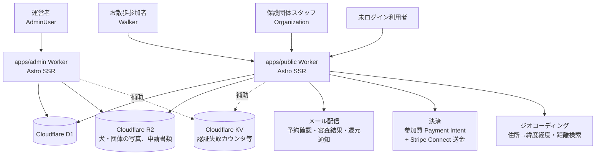
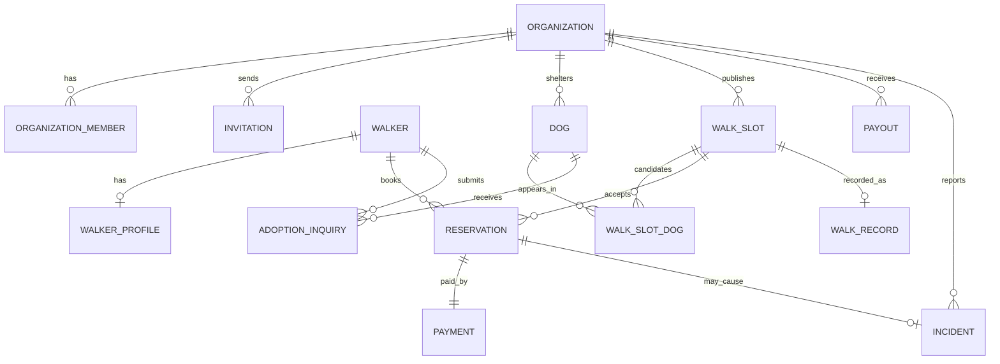

# 02-system-and-data.md — システム構成・データモデル

## このセクションの目的

システム全体の**論理構成**と、プロダクトで扱うエンティティの**論理データモデル**を一体で定義する。本プロジェクトは 00_README §0-1 が定義する「パターン A（コンテンツ主体サイト）」の適用範囲を超え、お散歩参加者（Walker）× 保護団体（Organization）の二者間マーケットプレイスを、プラットフォーム運営（Platform）が仲介する 3 者構造を持つ（`Decided` — GOV-01 D-006）。**本プロジェクトのマルチテナント境界は「Organization（保護団体）側」と「Walker（お散歩参加者）側」の二系統である**点が本テンプレート標準（単一運営・マルチテナント非対象）との差分（PRD-01 §1-0 相当、詳細は本書 §2）。

- 具体的な技術・ライブラリ・インフラの選定は **DEV-01（技術スタック決定書）** に一元化されており、本書には技術名を記載しない。
- 物理 DB 設計は DEV-07、環境・デプロイは DEV-08、バックアップ・データ保持の運用は OPS-02 に委譲。

## 0-H. ハイブリッド編集ガイド（要点）

- 推奨モード: Hybrid（AI 整理 + Tech Lead / PdM レビュー）
- 人間確認必須: 可用性目標、データ保持期間、マルチテナント境界方針
- 詳細は 00_README.md §6〜8

---

## 1. システム全体構成（論理）

### 1-1. 構成図

各コンポーネントの実体（採用プロダクト名）は DEV-01 §1・§2 を参照。本プロジェクトはチャット・リアルタイム通信（WebSocket）を採用しない（PRD-05 参照、`Decided` — GOV-01 D-005）ため標準構成図から WS コンポーネントを除外し、マーケットプレイス決済（Stripe Connect）とジオコーディング（エリア検索用、Google Maps Platform）を追加している。`apps/public`（公開ブラウジング + Walker マイページ + 保護団体ページ）と `apps/admin`（プラットフォーム運営者専用）は独立した Cloudflare Worker で、D1 / R2 のみを共有する（`Decided` — GOV-01 D-007。詳細は §1-3）。



### 1-2. 構成コンポーネントの責務

| コンポーネント | 責務 | 実体 |
| --- | --- | --- |
| `apps/public` Worker | 公開ブラウジング、Walker マイページ（`/mypage/*`）、保護団体ページ（`/organization/*`）のレンダリングと API 処理。Astro Page/API Route → Service → D1 のレイヤー構造を持つ（本プロジェクト固有の拡張 — `Decided` GOV-01 D-007、DEV-01 §1「アカウント系統」） | DEV-01 §1 |
| `apps/admin` Worker | プラットフォーム運営者専用（単一ロール `admin`）。団体審査・横断管理・決済/還元処理・お問い合わせ対応・監査ログ閲覧を担う。コンテンツ管理画面は持たない（GOV-01 D-016） | DEV-01 §1 |
| Cloudflare D1 | 全業務データの正本。両 Worker が共有 | DEV-01 §1 |
| Cloudflare R2 | 保護犬・保護団体の写真、団体審査の申請書類、お散歩記録の写真の実体。両 Worker が共有 | DEV-01 §2 |
| Cloudflare KV | 認証失敗カウンタ・メンテナンスフラグ等の補助ストア（Queues は不採用。セッションは D1） | DEV-01 §1 |
| メール配信 | 予約確認・審査結果・還元通知等のトランザクションメール | DEV-01 §1 |
| 決済 | 参加費の都度課金（Payment Intent）+ 保護団体への月次還元・振込（Stripe Connect Transfer）。`Decided` — GOV-01 D-008（旧仕様の判断を継承） | DEV-01 §2・DEV-10 §2 |
| ジオコーディング | 保護団体・お散歩枠の住所を緯度経度へ変換し、エリア・距離検索を実現。`Decided` — GOV-01 D-009（旧仕様の判断を継承） | DEV-01 §2・DEV-10 §9 |

> チャット・リアルタイム通知（WebSocket）、LLM / Vector DB は本プロジェクトでは**不採用**（PRD-03 で FG 削除、PRD-05 参照、`Decided` — GOV-01 D-005）。通知はメール + アプリ内通知（D1 テーブルのポーリング取得）のみとする。

### 1-3. 公開側・保護団体側・管理側の構成分離

旧リポジトリでは公開画面・保護団体ページ・プラットフォーム管理画面の 3 領域を単一アプリで提供していたが、本プロジェクトは `apps/public`（対外: 公開ブラウジング + Walker + Organization）と `apps/admin`（対内: プラットフォーム運営者専用）の 2 Worker 構成に再配置する（`Decided` — GOV-01 D-007）。

| 側 | アプリ | 主な利用者 | 主な内容 |
| --- | --- | --- | --- |
| 公開・Walker | `apps/public` | 一般利用者、お散歩参加者（Walker） | トップページ・団体紹介・お知らせ・FAQ、エリア検索・予約・決済、`/mypage/*`（プロフィール・予約履歴・里親相談） |
| 保護団体 | `apps/public`（同一 Worker） | 保護団体スタッフ（OrganizationMember） | `/organization/*`（犬・お散歩枠の登録公開、予約管理、実施記録、還元金確認） |
| プラットフォーム運営 | `apps/admin` | 運営者（AdminUser: 単一ロール `admin`） | 団体審査・横断管理、決済/還元処理、お問い合わせ対応、監査ログ閲覧 |

保護団体スタッフはプラットフォーム運営者ではなく外部の利用者であるため、内部運営専用の `apps/admin` に混在させず `apps/public` 側に置く（背景の詳細は GOV-01 D-007）。D1 データベースと R2 バケットのみを両アプリで共有し、レイアウト/スタイルシートの分離は `CLAUDE.md` Architecture 節に従う。

> **エンティティ所有**: AdminUser・Media・Inquiry（対応）は `apps/admin` の関心事。Walker・OrganizationMember・Organization・Dog・WalkSlot・Reservation 等のマーケットプレイス系エンティティは `apps/public` の関心事になる。スキーマ定義自体は `packages/schema` に一元化されており、アプリ間でのコピーずれは発生しない（DEV-01 §1「リポジトリ構成」）。

### 1-4. 公開側構成についての補足

本テンプレート標準が議論する「管理側アプリと分離した静的サイト生成 + CDN ホスティング」対「動的アプリケーション」という二択（本書 §9 相当）は、本プロジェクトでは論点にならない。`apps/public` は元々 Astro SSR（`output: 'server'`）を前提としており、エリア検索・予約・決済・マイページ等の動的機能と、トップページ・団体紹介・お知らせ等の静的寄りのコンテンツ配信を、インフラを分離することなく同一の Astro SSR アプリ内で両立できる。旧仕様にあった「インフラ分離を避けるために単一アプリにする」という判断そのものが不要である。

---

## 2. マルチテナント構造の実装方針

### 2-1. データ分離方式

**共有 D1 + テナント ID カラム方式** を採用するが、本プロジェクトはテナント軸が 2 系統ある。

```
✓ Organization 側データ（Dog / WalkSlot / Payout 等）: organizationId カラムでスコープ
✓ Walker 側データ（WalkerProfile / Reservation の閲覧等）: walkerId（Walker の ID）でスコープ
✓ Reservation は organizationId（団体スタッフ側の閲覧用）と walkerId（Walker 側の閲覧用）の両方を持つ
✓ Service 層で明示的に organizationId / walkerId を引数として要求し、Repository/クエリ関数はそれ無しでは呼び出せない設計にする
✗ ORM の Global Scope のような自動スコープ機構は使わない（Drizzle にその機構はなく、D1 + Drizzle 前提では自前実装で代替する）
✗ DB 物理分離（複数 DB / スキーマ）は対象外
```

### 2-2. テナント境界の強制

ライブラリに頼らず、Service 層での明示的な引数要求とチェック関数で境界を強制する（DEV-01 §4「認可チェックの徹底」）。

| レイヤー | 実装方法 |
| --- | --- |
| DB | Organization 系テーブルに `organizationId`（NOT NULL）を必須化。Walker 系テーブルは `walkerId`（Walker の ID、NOT NULL）を必須化（DEV-07 参照） |
| クエリ関数 | 関数シグネチャで Organization または Walker のスコープを必須引数化する（例: `findDogsForOrganization(db, organizationId)` / `findReservationsForWalker(db, walkerId)`）。スコープ引数を省略できるオーバーロードは作らない |
| Service | Service の入口で現在のセッションから Organization（`organizationId`）または Walker（`walkerId`）を取得し、以降の呼び出し全てにその値を明示的に渡す。横展開（他 Organization / 他 Walker のデータへのアクセス）を禁止する |
| 認可チェック関数 | `requireOrganizationMember(session, organizationId)` / `requireWalker(session, walkerId)` のような関数で、操作対象が現在の Organization / Walker 本人と一致することを検証する。運営（AdminUser）のみ横断アクセス可（AdminUser は単一ロールのため、`requireSession` でアカウント種別が AdminUser であることを確認すれば足り、ロールによる分岐は不要 — `Decided` GOV-01 D-011） |
| テスト | Service 関数が必ず `organizationId` または `walkerId` を要求し、他テナントの ID を渡した場合に例外をスローすることを Vitest で検証する（DEV-01 §1「Testing」。ORM の Architecture Test に相当する自前のユニットテスト） |

### 2-3. Organization 切替（団体スタッフが複数団体に所属する場合）

MVP では団体スタッフは単一 Organization に所属する運用を前提とする `[Assumed: INTAKE に複数所属の要件記載なし / 確認先: 事業責任者]`。将来複数所属を許容する場合は、セッションに現在の `organizationId` を保管し、ミドルウェア相当の処理（Astro の認証チェック関数、DEV-05 参照）で自動セットする方式を採用する。

---

## 3. 環境構成

環境は 3 面を標準とする。インフラ上の実体・環境変数の管理方法は DEV-08 を参照。

| 環境 | 用途 | 備考 |
| --- | --- | --- |
| local | 開発者ローカル | Dev Container 内で `pnpm dev`。D1/R2/KV はローカルエミュレーション |
| staging | 受入テスト | 本番同等構成。決済・ジオコーディング等の外部サービスはテストキー |
| production | 本番 | 本番キー。各 `wrangler.jsonc` の `replace-with-*` を実値に置換 |

---

## 4. 外部サービス連携（論理）

具体的なサービス選定は DEV-01 §2、連携仕様の詳細は DEV-10 を参照。本書では障害時の影響と方針のみ定義する。

| 機能 | 障害時影響 | 代替策 |
| --- | --- | --- |
| 決済（参加費・団体還元） | 新規予約の決済不可、還元振込の遅延 | リトライ（`ctx.waitUntil()` / Cron Triggers — DEV-01 §4）、参加者・団体への通知 |
| メール配信 | 予約確認・審査結果通知の遅延 | リトライ（`ctx.waitUntil()` / Cron） / 手動再送 |
| オブジェクトストレージ（R2） | 保護犬・団体の写真、申請書類が参照不可 | 一時リトライ |
| ジオコーディング | 新規団体・お散歩枠の位置情報登録が一時不可、既存の検索は影響なし | リトライ、手動での緯度経度再設定 |
| エラー監視 | 障害検知遅延 | Cloudflare Workers 標準ログ/メトリクスで補助（DEV-01 §2） |

---

## 5. 想定規模・可用性

### 5-1. 想定規模

<!-- SAMPLE START: フォーマット例 — 実績データがないための暫定値。事業責任者確認後に更新すること -->
| 項目 | 初期 | 6 ヶ月後 | 1 年後 |
| --- | --- | --- | --- |
| 提携保護団体数 | 20 | 100 | 300 |
| お散歩参加者（登録数） | 300 | 2,000 | 8,000 |
| 月間予約件数 | 100 | 800 | 3,000 |
| 同時接続数 | 30 | 150 | 500 |
| 月間 API リクエスト | 20 万 | 150 万 | 600 万 |
<!-- SAMPLE END -->

Cloudflare Workers のオートスケールに依存する部分が大きいが、ボトルネックになりやすいのは D1 への書き込み（予約・決済確定、団体側の枠登録更新）である。本テンプレの適用上限を超える規模（同時接続 1 万+）は別途専門設計とする（00_README §2-2）。

### 5-2. 可用性目標（全文書の正本）

可用性の数値目標は本表を正本とし、他文書（PRD-03 / DEV-01 / OPS）は本表を参照する。本サービスは公開側・Walker 側・保護団体側が単一 Worker（`apps/public`、§1-3）のため、稼働率目標は区分せず一本化する。管理側（`apps/admin`）はプラットフォーム運営者専用のため別枠とする。

| 区分 | 目標 |
| --- | --- |
| `apps/public`（公開・Walker・保護団体） | 月間 99.5% 以上 |
| `apps/admin`（プラットフォーム運営） | 月間 99.5% 以上 |
| 計画停止 | 月 1 回まで、利用の少ない時間帯（土日深夜帯） |

バックアップ・DR・データ保持の運用は OPS-02（運用ハンドブック）に委譲する。

---

## 6. エンティティ一覧（論理レベル）

物理カラム定義は DEV-07 を参照。本書は意味と型の表現のみ。エンティティ定義の正本は PRD-01。

本プロジェクトはアカウント系統が 3 系統・完全分離である（`Decided` — GOV-01 D-004・D-007、DEV-01 §1「アカウント系統」）。旧仕様にあった単一の `User` エンティティ（`platformRole` 列で Walker / 運営を判別する方式）は採用せず、`AdminUser`（`apps/admin`）・`Walker`（`apps/public`、お散歩参加者アカウント）・`OrganizationMember`（`apps/public`、保護団体スタッフアカウント）をそれぞれ別テーブル・別セッション Cookie として持つ。

### 6-1. 標準エンティティ（本テンプレート標準に由来）

| エンティティ | 主要属性 | 型表現 | 備考 |
| --- | --- | --- | --- |
| AdminUser | name, email, passwordHash, status | — | email UNIQUE。`apps/admin`。プラットフォーム運営者専用、単一ロール `admin`（サポート等の追加ロールなし。`Decided` — GOV-01 D-011。D-004 を置換） |
| Walker | name, email, passwordHash, status, createdAt | status: 列挙（PRD-01 §7） | email UNIQUE。`apps/public`。お散歩参加者のアカウント。ロール階層を持たず `status` で機能解禁を判定するデータ駆動方式（旧仕様の判断を踏襲、`Decided` — GOV-01 D-004） |
| Invitation | email, organizationId, role, token, status, expiresAt | token: ランダム文字列、status: 列挙（pending/accepted/expired） | token UNIQUE。`apps/public`。保護団体スタッフの招待 |
| AuditLog | actorType, actorId, action, targetType, targetId, before, after | actorType: 列挙（admin_user/organization_member/walker）、before/after: JSON | 保持期間は §8。3 系統のアカウントを横断して単一の `actorId` 空間を持たないため `actorType` で判別する |
| Notification | recipientType, recipientId, type, payload, readAt | recipientType: 列挙（walker/organization_member）、payload: JSON | AdminUser 宛の通知は現時点で対象外 |
| Media | key, mimeType, sizeBytes, altText | key: R2 オブジェクトキー | `apps/admin` がアップロードを管理。key はサーバーが生成する（`media/<ULID>`。DEV-10 §4-2） |

> **Post / Category / Tag は採用しない**（`Decided` — GOV-01 D-014）。対応する画面が PRD-04 に無い。記事型コンテンツはお知らせのみで、それも D1 ではなく Content Collections に置く（D-016）。

### 6-2. プロダクト固有エンティティ

| エンティティ | 主要属性 | 備考 |
| --- | --- | --- |
| Organization | name, slug, status | slug UNIQUE。`apps/public` |
| OrganizationMember | organizationId, email, passwordHash, role, status, joinedAt | role: 列挙（org_admin/org_staff）、直書き（`Decided` — GOV-01 D-004）。`apps/public`。旧仕様の `userId` 経由（共有 User テーブル参照）ではなく、本プロジェクトではアカウント情報（email/passwordHash）を自身のテーブルに持つ独立した認証系統 |
| WalkerProfile | walkerId, nameKana, birthdate, postalCode, address, phone, emergencyContactName, emergencyContactPhone, dogExperience, largeDogWalkExperience, preferredArea, status | status: 列挙（PRD-01 §7）。Walker の 1:1 拡張（`walkerId` で紐付け） |
| Dog | organizationId, name, breed, size, weight, temperament, walkNotes, requiredExperience, beginnerAllowed, childAllowed, multiDogAllowed, walkEligible, adoptionStatus, publicProfile, internalNotes | adoptionStatus: 列挙（PRD-01 §7）。internalNotes は健康・安全情報で非公開 |
| WalkSlot | organizationId, title, startAt, acceptanceStartAt, acceptanceEndAt, durationMinutes, meetingPlace, area, latitude, longitude, capacity, remainingCapacity, feePerPerson, staffAccompanied, beginnerAllowed, childAllowed, minAge, requiredExperience, weatherPolicy, cancellationPolicy, status | status: 列挙（PRD-01 §7）。latitude/longitude はジオコーディング結果（DEV-10 §9） |
| WalkSlotDog | walkSlotId, dogId | 多対多の中間テーブル |
| Reservation | walkSlotId, organizationId, walkerId, participantCount, emergencyContactSnapshot, status | walkerId は Walker の ID。emergencyContactSnapshot: 予約時点の緊急連絡先スナップショット（JSON）。status: 列挙（PRD-01 §7） |
| Payment | reservationId, amount, organizationShareAmount, platformFeeAmount, currency, status, stripePaymentIntentId, paidAt, refundedAt | status: 列挙（PRD-01 §7）。Stripe Payment Intent（`Decided` — GOV-01 D-008） |
| Payout | organizationId, periodStart, periodEnd, totalReservations, totalParticipants, grossAmount, platformFeeAmount, adjustmentAmount, payoutAmount, status, paidAt | status: 列挙（PRD-01 §7）。Stripe Connect の Connected Account への Transfer で送金（`Decided` — GOV-01 D-008）。月次集計は Cloudflare Cron Triggers（`Decided` — GOV-01 D-010） |
| WalkRecord | walkSlotId, conducted, conductedAt, staffInCharge, dogsWalked, photos, staffComment, incidentFlag | dogsWalked: JSON 配列（実施時に担当した犬） |
| Incident | organizationId, reservationId, dogId, walkerId, severity, category, description, occurredAt, location, reportedBy, status, preventionMeasures | walkerId は Walker の ID。severity: 列挙（P0〜P3 相当）。status: 列挙（PRD-01 §7） |
| AdoptionInquiry | dogId, walkerId, organizationId, motivation, livingEnvironment, status | walkerId は Walker の ID。status: 列挙（PRD-01 §7） |
| Inquiry | category, name, email, phone, message, status, priority | status: 列挙（PRD-01 §7）。本テンプレート標準の Inquiry（お問い合わせフォーム）をそのまま踏襲。里親相談は別エンティティ AdoptionInquiry として区別する |

> **読み物系コンテンツをエンティティにするかは「誰が編集するか」で決まる。** 開発者が git で
> 更新するものはエンティティ化しない — お知らせは `packages/content/news/` の Content
> Collections、FAQ は `apps/public/src/lib/faq.ts` の TypeScript 定数、利用規約・プライバシー
> ポリシー・利用ガイド・安全に利用するために・特定商取引法に基づく表示はページ直書き
> （`Decided` — GOV-01 D-016、判断根拠は DEV-06 §1-1）。**エンティティになるのは外部ユーザーが
> 投入する取引データだけ。**

---

## 7. エンティティ間リレーション



---

## 8. データライフサイクル方針

<!-- SAMPLE START: フォーマット例 — 保存期間は税務・個人情報保護の観点から Tech Lead / 事業責任者確認後に確定してください -->
| データ種別 | 保持期間 | 削除ポリシー | アーカイブ条件 |
| --- | --- | --- | --- |
| Reservation / Payment（決済関連） | 決済日から 7 年（帳簿書類保存の一般的な実務慣行 `[Assumed: 確認先: 税理士]`） | 保持期間経過後に物理削除 | — |
| Payout（振込記録） | 同上（7 年） | 同上 | — |
| Dog / WalkSlot | Organization の掲載終了後 1 年 | 1 年経過で物理削除 | 掲載終了時に unpublished / closed |
| WalkRecord（写真含む） | Organization の掲載終了後 1 年 | 同上 | — |
| Incident（事故・トラブル） | `[Open]`（GOV-02 TBD-22。暫定 5 年） | 保持期間経過後に物理削除 | — |
| AdoptionInquiry | `[Open]`（GOV-02 TBD-33。暫定 3 年） | 保持期間経過後に物理削除 | 相談終了・取下げ時にステータス変更 |
| 招待情報（Invitation） | 30 日 | 失効後物理削除 | — |
| 監査ログ（AuditLog） | 永続 | 削除不可 | — |
| Notification | 90 日 | 90 日で物理削除 | — |
<!-- SAMPLE END -->

データ保持期限の自動削除バッチは Cloudflare Cron Triggers（`apps/admin` の Scheduled Worker）で実行する（`Decided` — GOV-01 D-010、OPS-02 §4-3）。

---

## 9. 記入時チェックポイント

- 本書に技術名・ライブラリ名が書かれていないか（すべて DEV-01 参照になっているか）
- マルチテナント境界の実装方針（§2）が Organization 側・Walker 側の 2 系統として明確か、かつ D1 + Drizzle 前提の自前実装（Service 層での明示的な引数要求）で記述されているか（ORM の Global Scope 等ライブラリ依存の記法が残っていないか）
- アカウント系統が AdminUser / Walker / OrganizationMember の 3 系統・完全分離として記述され、旧仕様の単一 `User` エンティティが残っていないか（§6、GOV-01 D-004・D-007）
- 想定規模がテンプレ適用上限（同時接続〜数千）内か、可用性目標が現実的か
- データライフサイクルが OPS-01 / DEV-02 / OPS-02 と整合しているか
- エンティティ名が PRD-01 / PRD-03 / DEV-07 と一致しているか
- DEV-07 が物理設計に着手できる粒度か
