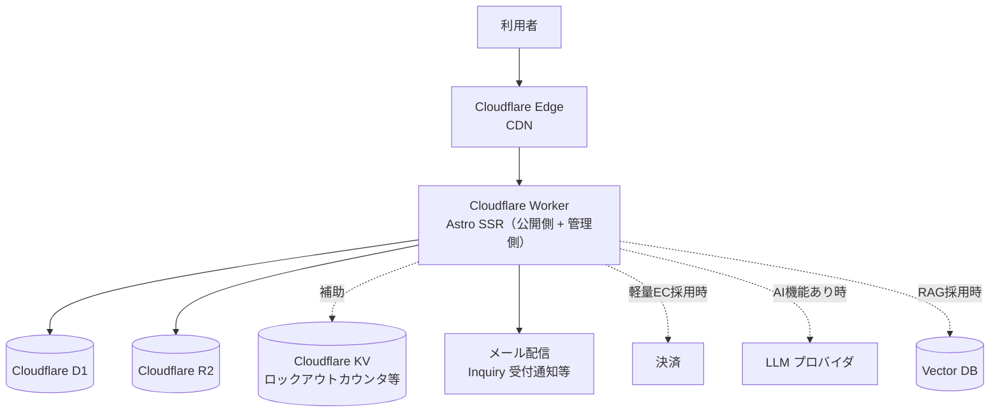
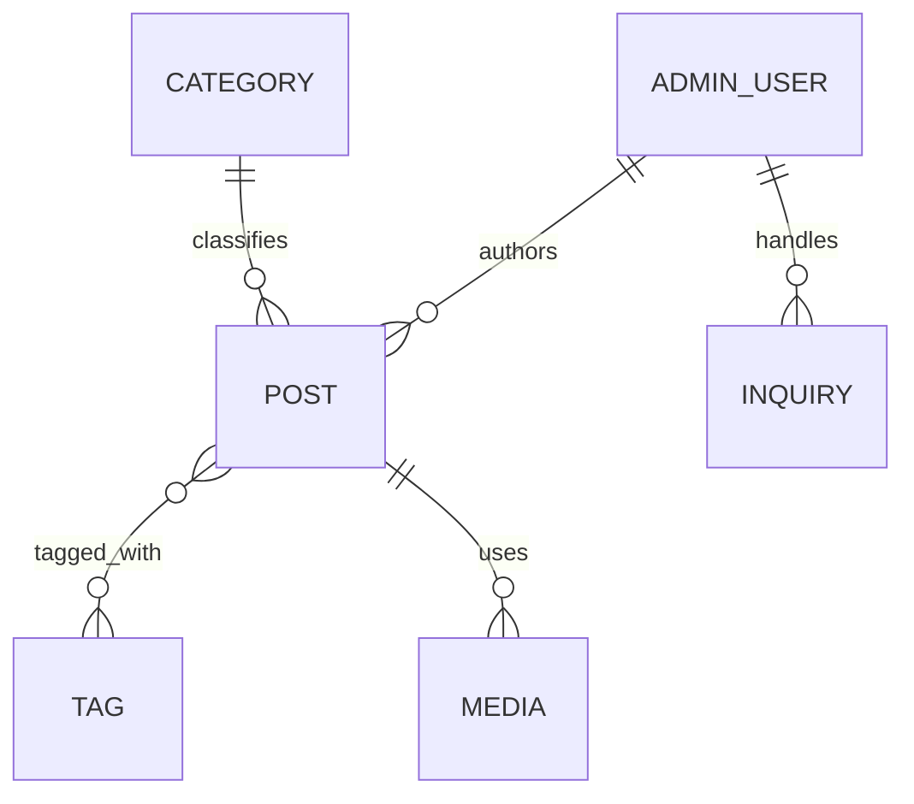

# 02-system-and-data.md — システム構成・データモデルテンプレート

## このセクションの目的

システム全体の**論理構成**と、プロダクトで扱うエンティティの**論理データモデル**を一体で定義する。本テンプレートは 00_README §0-1 の**パターン A**（コンテンツ主体サイト + 軽量な管理画面。単一運営、Astro SSR + Cloudflare Workers/D1/R2）を前提とし、マルチテナント構造・多階層ロール・サブスク課金・チャットのような構成は持たない（マルチテナントについては §2 で扱う）。

- 具体的な技術・ライブラリ・インフラの**選定**は **DEV-01（技術スタック決定書）** に一元化する。本書で技術名に言及する場合は構成の説明に必要な範囲にとどめ、必ず DEV-01 参照を併記する（選定理由・バージョン・代替比較は本書に書かない）。
- 物理 DB 設計は DEV-07、環境・デプロイは DEV-08、バックアップ・データ保持の運用は OPS-02 に委譲。

## 0-H. ハイブリッド編集ガイド（要点）

- 推奨モード: Hybrid（AI 整理 + Tech Lead / PdM レビュー）
- 人間確認必須: 可用性目標、データ保持期間、公開側/管理側の構成分離
- 詳細は 00_README.md §6〜8

---

## 1. システム全体構成（論理）

### 1-1. 構成図（標準テンプレート）

各コンポーネントの実体（採用プロダクト名）は DEV-01 §1・§2 を参照。本テンプレートは単一の Cloudflare Worker（Astro SSR）がアプリケーション層を担い、別建てのアプリケーションサーバー・DB サーバー・キューワーカー群を持たない（`astro build` の出力そのものが Worker になる）。

### 1-2. 構成コンポーネントの責務

| コンポーネント | 責務 | 実体 |
| --- | --- | --- |
| Cloudflare Worker | 公開側・管理側両方のレンダリングと API 処理（Astro Page/API Route → Service → D1 のレイヤー構造は DEV-01 §5） | DEV-01 §1 |
| Cloudflare D1 | 全業務データの正本 | DEV-01 §1 |
| Cloudflare R2 | アップロードファイル（Media）の実体 | DEV-01 §1 |
| Cloudflare KV | 認証失敗カウンタ・メンテナンスフラグ等の補助ストア（Queues は不採用、定期処理は Cron Triggers。セッションは D1 で確定 — DEV-02 §1-1） | DEV-01 §1 |
| メール配信 | Inquiry 受付通知等のトランザクションメール | DEV-01 §1 |
| 決済 | 軽量 EC（Order）採用時のみ | DEV-01 §2 |
| LLM / Vector DB | AI 機能（PRD-05 採用時のみ） | DEV-01 §2 / PRD-05 |

> チャット・リアルタイム通信（WebSocket / Durable Objects）は本テンプレートの標準構成に含まない（00_README §2-2）。

### 1-3. 公開側・管理側の構成分離

公開側と管理側は **1 リポジトリ内の pnpm workspaces + Turborepo モノレポ**を標準とし、`apps/public`（公開サイト）・`apps/admin`（管理 CMS）を独立した Cloudflare Worker として別々にデプロイする（`/admin` パスへの統合ではない）。D1 データベースと R2 バケットのみを両アプリで共有する（`CLAUDE.md` D1/R2 binding rules、DEV-08 §1。2 リポジトリ構成から移行した経緯は DEV-01 §1）。以下のレイアウト/スタイルシートの分離で切り分ける（実装詳細は `CLAUDE.md` Architecture 節、レイヤー構造は DEV-01 §5）。

| 側 | アプリ | レイアウト | スタイルシート | 主な内容 |
| --- | --- | --- | --- | --- |
| 公開側 | `apps/public` | `src/layouts/Layout.astro` | `src/styles/global.css`（プレーン Tailwind） | Post / Page 等のコンテンツ表示、Inquiry フォーム、軽量 EC（採用時） |
| 管理側 | `apps/admin` | `src/layouts/Layout.astro` | `src/styles/admin.css`（shadcn-svelte テーマ） | CMS（Post / Page / Media 管理）、Inquiry 対応、AdminUser 管理 |

両レイアウトは同一の props（`title`, `description`）を取り、`<head>` / favicon / CSS import はレイアウト側にのみ置く。公開専用または管理専用でフォークした場合は不要な側の `apps/*` ディレクトリ一式を削除する（README ブートストラップチェックリスト参照）。管理側を検索エンジンに公開しない場合は `X-Robots-Tag`（`apps/admin/src/middleware.ts`）と CSP（`apps/admin/astro.config.mjs` の `security.csp`）を有効化する（DEV-02 参照）。

> **エンティティ所有**: AdminUser・活動監査ログ（activity_log）は `apps/admin` の関心事、Member・Order は `apps/public` の関心事になる。Post/Category/Tag/Media/Inquiry は `apps/admin` が書き込み、`apps/public` が読み取る（PRD-01 §1-1 参照）。スキーマ定義自体は `packages/schema` に一元化されており、アプリ間でのコピーずれは発生しない。

---

## 2. マルチテナント構造（非対象）

本テンプレは単一運営（自社 1 サイト、または受託先クライアント 1 社 1 サイト）が前提であり、マルチテナント構造（Organization 階層、テナントごとのデータ分離、Organization 切替 UI 等）は不要（00_README §0-1、PRD-01 §6）。`organization_id` のようなテナント列は DB のどのテーブルにも持たせない（DEV-07 参照）。

マルチテナント SaaS が真に必要な案件は、そもそも本テンプレートの適用対象外である。00_README §0-1 で適用範囲を確認し、別テンプレートの使用を検討する。

---

## 3. 環境構成

環境分離は `apps/public`/`apps/admin` それぞれの `wrangler.jsonc` の environments 機能で実現する（`Confirmed` — DEV-01 §1。詳細は DEV-08 §2）。論理的な環境区分は以下を標準とする。

| 環境 | 用途 | 備考 |
| --- | --- | --- |
| local | 開発者ローカル | Dev Container 内で `pnpm dev`（`astro dev`、`APP_PORT_DEV_PUBLIC` / `APP_PORT_DEV_ADMIN`）。D1/R2 はローカルエミュレーション |
| staging | 受入テスト | 用意する（`Confirmed`）。本番同等構成、外部サービスはテストキー |
| production | 本番 | 本番キー。各 `wrangler.jsonc` の `replace-with-*` を実値に置換（`CLAUDE.md` D1/R2 binding rules 参照） |

---

## 4. 外部サービス連携（論理）

具体的なサービス選定は DEV-01 §2、連携仕様の詳細は DEV-10 を参照。本書では障害時の影響と方針のみ定義する。採用可否自体がプロジェクトごとに異なるもの（軽量 EC・AI 機能等）は明記する。

| 機能 | 障害時影響 | 代替策 |
| --- | --- | --- |
| メール配信（Resend） | Inquiry 通知遅延 | リトライ（`ctx.waitUntil()` / Cron — DEV-01 §1）/ 手動再送 |
| ファイルストレージ（R2） | Media 参照不可 | 一時リトライ |
| 決済（Stripe、軽量 EC 採用時） | 新規注文不可 | リトライ、利用者への通知 |
| 画像処理（Cloudflare Images、採用時） | 画像最適化配信不可 | 元画像をそのまま配信にフォールバック |
| エラー監視 | 障害検知遅延 | Cloudflare Workers 標準ログ/メトリクスで補助（DEV-01 §2） |
| LLM プロバイダ（AI 機能採用時、PRD-05） | AI 機能停止 | プロバイダフォールバック（PRD-05 で確定） |

---

## 5. 想定規模・可用性

### 5-1. 想定規模

<!-- TEMPLATE: プロジェクトの想定規模。コンテンツ主体サイトは、SaaS 型の「継続ログインセッションが積み上がる」トラフィックとは異なり、読み取り中心・バースト性（キャンペーン、SNS/検索流入、記事のバイラル等）を持つ点を踏まえて記入する。本テンプレの適用上限は「同時接続〜数千」（00_README §2-2） -->
<!-- SAMPLE START: フォーマット例 — 実際の内容に置き換えてください -->
| 項目 | 初期 | 6 ヶ月後 | 1 年後 |
| --- | --- | --- | --- |
| 月間ページビュー | 5 万 | 20 万 | 80 万 |
| ピーク時アクセス（RPS 目安） | 5 | 20 | 100（キャンペーン時バースト想定） |
| 管理画面ユーザー数（AdminUser） | 2 | 5 | 10 |
| 月間 Inquiry 件数 | 20 | 100 | 300 |
| 月間 Order 件数（軽量 EC 採用時） | 0 | 30 | 150 |
<!-- SAMPLE END -->

公開側はエッジ CDN 配信が主体のため、閲覧トラフィックのスケールは Cloudflare のインフラに委ねられる部分が大きい。ボトルネックになりやすいのは D1 への書き込み（Inquiry/Order 受付、管理画面での更新）であり、読み取りは可能な限りキャッシュ/エッジ配信を優先する（§9）。本テンプレの適用上限を超える規模（同時接続 1 万+）は別途専門設計とする（00_README §2-2）。

### 5-2. 可用性目標（全文書の正本）

可用性の数値目標は本表を正本とし、他文書（PRD-03 / DEV-01 / OPS）は本表を参照する。パターン A では公開側（コンテンツ配信）が事業成果に直結する主役であり、管理側より優先度が高い（SaaS 型のように管理側=製品そのものではない）。

| 区分 | 目標 |
| --- | --- |
| 公開側 | 月間 99.9% 以上（コンテンツ閲覧が事業価値の中心のため、管理側より高い目標） |
| 管理側 | 月間 99.5% 以上 |
| 計画停止 | 月 1 回まで、利用の少ない時間帯（管理側のみ。公開側は無停止デプロイを前提とする） |

バックアップ・DR・データ保持の運用は OPS-02（運用ハンドブック）に委譲する。

---

## 6. エンティティ一覧（論理レベル）

物理カラム定義は DEV-07 を参照。本書は意味と型の表現のみ。エンティティ定義の正本は PRD-01。

### 6-1. 標準エンティティ（コンテンツ主体サイトの雛形）

| エンティティ | 主要属性 | 型表現 | 備考 |
| --- | --- | --- | --- |
| AdminUser | name, email, role, status | email: メールアドレス、role: 列挙（admin / editor） | email UNIQUE。ロールは単一階層・少数（PRD-01 §1-2） |
| Member | name, email, passwordHash, status, lastLoginAt | status: 列挙（active / inactive） | 公開側ログイン。AdminUser とは完全に別系統（ロール構造なし・単一種別）。テーブル・クッキー・照合コードを共有しない（DEV-02 §1-2） |
| Media | key, mimeType, sizeBytes, altText | key: R2 オブジェクトキー | key はサーバーが生成する（`media/<ULID>`）。アップロードされたファイル名は使わない（DEV-10 §4-2） |
| Inquiry | type, name, email, message, status, handledBy | status: 列挙（new / in_progress / resolved） | 公開側から未認証で作成し、管理側で対応する。実装の参照実装（DEV-05 §2） |

> `organization_id` に相当するテナント列はいずれのエンティティにも持たせない（§2）。

> **記事・お知らせをエンティティとして持つかは更新者で決まる。** 開発者が git で更新するなら
> エンティティ化せず `packages/content` の Markdown（Content Collections）に置き、D1 の読み取りも
> 管理画面も発生させない。納品先の顧客が管理画面から更新する場合に限り Post / Category / Tag を
> §6-2 に追加する（DEV-01 §1、DEV-07 §3-2）。

### 6-2. プロダクト固有エンティティ

<!-- TEMPLATE: プロダクト固有のエンティティを論理レベルで定義。マルチテナント前提の organizationId は付与しない（§2 参照）。Page / Order を採用する場合はここに追記する -->
<!-- SAMPLE START: フォーマット例 — 実際の内容に置き換えてください -->
| エンティティ | 主要属性 | 備考 |
| --- | --- | --- |
| Page | slug, title, body, status | 固定ページ（会社概要等）。CMS 管理が不要なら Astro の静的ページで代替可（PRD-01 §1-1） |
| Post / Category / Tag | title, slug, body, status, authorId, publishedAt | 顧客が管理画面から記事を更新する場合のみ。開発者更新なら Content Collections（§6-1 の注記） |
| Order | customerName, customerEmail, memberId（任意・nullable FK）, items, status, amount | 軽量 EC 採用時のみ。memberId は Member への任意紐付け — ゲスト注文（customerName/customerEmail のみ、memberId は NULL）と会員紐付け注文の両方をサポート（PRD-01 §1-1・§1-3）。status: 列挙（pending / paid / fulfilled / cancelled）。物理カラム名は DEV-07 §7-1 を正とする。在庫同期は持たない（00_README §2-2） |
| [プロダクト固有エンティティ] | [主要属性] | [備考] |
<!-- SAMPLE END -->

---

## 7. エンティティ間リレーション

<!-- SAMPLE START: フォーマット例 — 実際の内容に置き換えてください -->

<!-- SAMPLE END -->

---

## 8. データライフサイクル方針

<!-- TEMPLATE: データの保持・削除・アーカイブ方針。運用（削除バッチ等）の実装は OPS-02 参照 -->
<!-- SAMPLE START: フォーマット例 — 実際の内容に置き換えてください -->
| データ種別 | 保持期間 | 削除ポリシー | アーカイブ条件 |
| --- | --- | --- | --- |
| Post | 永続（公開資産として） | 削除は明示操作のみ。公開停止は archived ステータスで表現 | 公開終了時に status を archived へ遷移（PRD-01 §7） |
| Media | 参照が切れてから 90 日 | 参照元 Post/Page が無い（孤立）状態が続いたら物理削除（バッチ） | — |
| Inquiry | 1 年 | 1 年経過後に物理削除（個人情報を含むため） | resolved から一定期間後に削除対象化 |
| Order（軽量 EC 採用時） | 契約・法令要件に応じて（例: 税務要件で 7 年） | 法令要件を満たす期間は削除不可 | — |
| AdminUser | 退職/契約終了後 1 年 | 1 年経過後に匿名化 or 削除 | 退職時点で status を inactive へ遷移 |
<!-- SAMPLE END -->

---

## 9. 公開側の構成方針

公開側（コンテンツ配信）は本テンプレートの主機能であり、管理側 CMS はそれを支える裏側の機能である。

| 項目 | 方針 |
| --- | --- |
| レンダリング | Astro SSR（`output: 'server'`）。ページ単位で SSR し、インタラクティブ部分のみ Svelte island として埋め込む（DEV-01 §1） |
| キャッシュ | Cloudflare エッジキャッシュ（CDN）を公開 GET リクエストで活用する想定。TTL・パージ契機の具体方針は **Open**（案件実装時に確定。公開側の参照実装時に確定し DEV-08 に記載） |
| SEO | サイトマップ / robots.txt の動的生成は現時点で未導入（**Open** — 案件実装時に確定）。導入時は管理画面ルートをサイトマップ・robots.txt 双方から除外する |
| ドメイン | プロジェクトごとのカスタムドメイン。管理側（`apps/admin`）は `/admin` パスへの統合ではなく、公開側（`apps/public`）とは別の Cloudflare Worker として同一リポジトリ内で独立デプロイする（`Confirmed` — DEV-01 §1、D1/R2 binding rules は `CLAUDE.md` に従う） |
| 認証 | 公開側は原則認証不要。管理画面ログインのみ認証必須（PRD-01 §1-2）。**例外**: マイページ機能（Member、採用時のみ）を導入する場合、マイページ・ログイン・会員登録・注文履歴等の関連ページのみ認証が必要になる。ブログ・トップページ・お問い合わせフォーム等、それ以外の公開側ページは引き続き認証不要（PRD-01 §1-1・§5「Member Access」） |

---

## 10. 記入時チェックポイント

- 本書の技術名への言及が構成説明に必要な範囲にとどまり、DEV-01 参照が併記されているか（選定理由・バージョン・代替比較を本書に書いていないか）
- マルチテナント構造（Organization 階層、`organization_id` 等）が紛れ込んでいないか（§2、単一運営が前提）
- ロールが少数（1〜2 種）で記述され、PRD-01 §1-2 / DEV-02 と整合しているか。3 ロール以上が必要になっていないか
- 想定規模（§5-1）がテンプレ適用上限（同時接続〜数千）内か、公開側の読み取り中心・バースト性を踏まえた記述になっているか
- 可用性目標（§5-2）が現実的か。公開側が管理側より優先されているか
- データライフサイクル（§8）が個人情報（Inquiry）や公開資産（Post/Media）の性質に応じて記述されているか
- エンティティ名が PRD-01 / DEV-07 と一致しているか（AdminUser / Post / Category / Tag / Media / Inquiry、採用時は Page / Order / Member）
- DEV-07 が物理設計に着手できる粒度か
- Member（採用時のみ）と Order の関係が PRD-01 と整合しているか：Order の memberId は任意（nullable）で、ゲスト注文と会員紐付け注文の両方をサポートしているか。Member が AdminUser のロール構造・認証実装と混同されていないか（§6-2、PRD-01 §1-1・§1-2）
