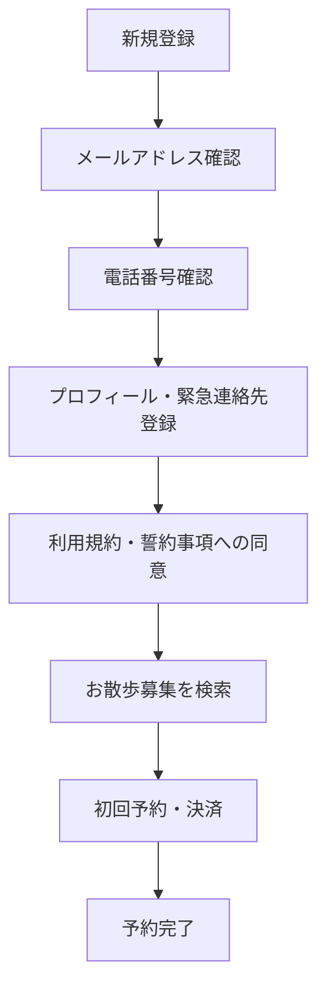
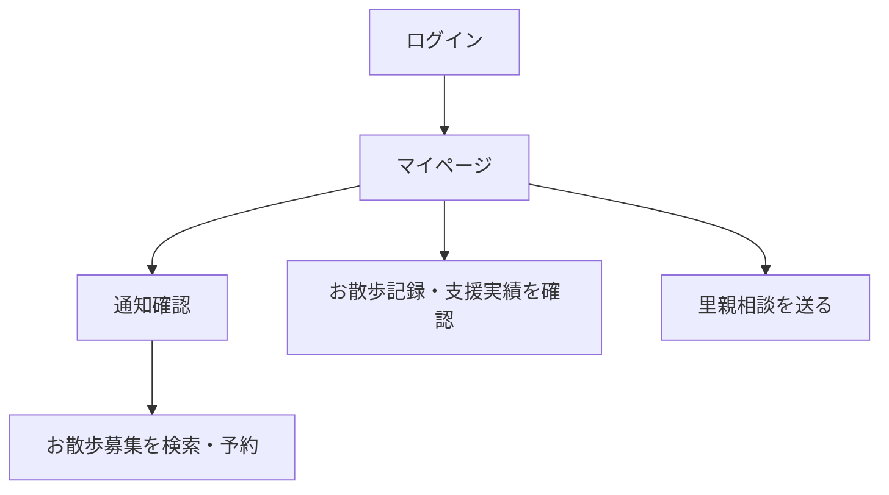
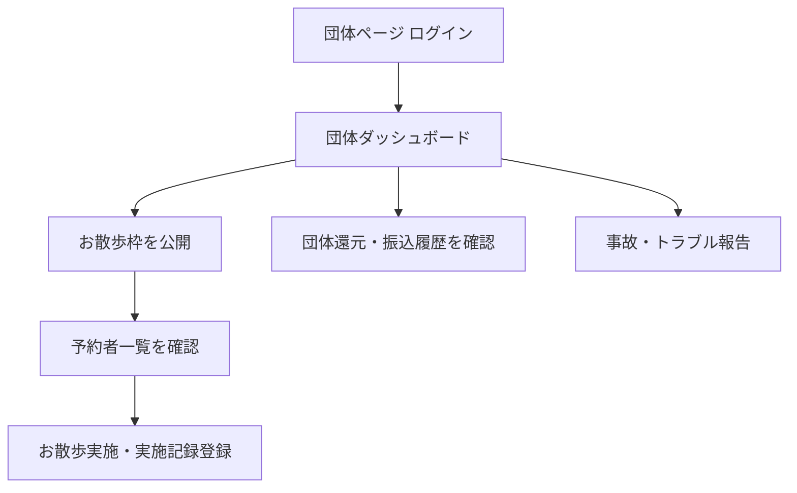
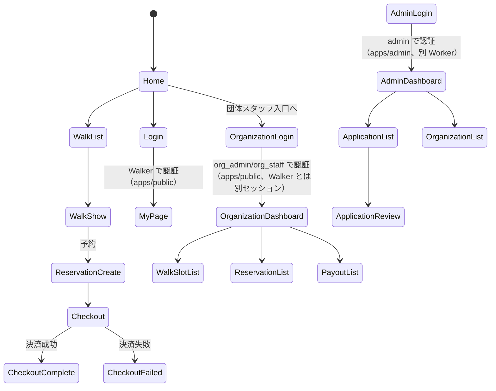

# 04-ui-ux-design.md — UI/UX 設計

## このセクションの目的

このドキュメントは、プロダクト体験の設計思想、主要導線、画面一覧、**保護団体ページ・プラットフォーム管理画面の標準構成**、コンポーネント方針、アクセシビリティ基準を定義する。**本サービスは公開画面（お散歩参加者）・保護団体ページ（org_admin/org_staff）・プラットフォーム管理画面（admin）の 3 領域を持つ**という業務上の構造は旧仕様から変わらない。ただし実装上のアプリ構成は 2 Worker（`apps/public` / `apps/admin`）であり、**保護団体ページは `apps/admin` ではなく `apps/public` 側に配置する**（`Decided` — GOV-01 D-007）。この点は旧仕様（3 領域＝単一アプリ）からの明確な変更であり、本書全体を通じて前提とする。

| 業務上の領域 | 実装上の配置 | 利用者 |
| --- | --- | --- |
| 公開画面 | `apps/public`（認証不要の一般公開部分） | 全ユーザー・お散歩参加者（Walker） |
| 保護団体ページ | `apps/public`（`/organization/*`、Walker とは別セッション） | org_admin / org_staff |
| プラットフォーム管理画面 | `apps/admin`（コンテンツ管理画面は持たない — GOV-01 D-016） | admin |

## 0-H. ハイブリッド編集ガイド（要点）

- 推奨モード: Hybrid（AI 構造化 + PdM 確定）
- 人間確認必須：体験原則、主要導線、管理画面の情報設計、アクセシビリティ
- AI 下書き可：画面一覧整形、フロー図初稿、コンポーネント分類

詳細は 00_README.md §7（文書ステータス）と §8（AI 運用ガイド）を参照。

---

## 1. 設計思想・デザイン原則

| 原則名 | 内容 |
| --- | --- |
| 安全・信頼感を最優先 | 団体審査済み・スタッフ同行等の安全性の担保を UI 上で明示し、不安なく予約できるようにする |
| 犬の魅力を伝える | 保護犬の写真・性格・お散歩時の特徴を中心に据えたビジュアル重視のレイアウト |
| 参加ハードルを下げる | 検索から予約・決済までの導線を最短にし、初めての利用者でも迷わない |
| 支援の実感を可視化 | 団体還元額・累計参加回数・お散歩記録を通じて「参加＝支援」の実感を伝える |
| 断定表現の禁止 | 「必ず安全」等の断定的な安全・成果保証表現を UI コピーに使わない（BIZ-01 §7）|
| 明快さ優先 | 1 画面 1 目的を徹底し、情報過多を避ける |
| 状態の可視化 | 予約状況・決済結果・審査状況を即時に伝える |

### 1-1. 画面領域ごとの設計トーン

| 領域 | 実装アプリ | 設計トーン | 重視する体験 |
| --- | --- | --- | --- |
| 公開画面（お散歩参加者）| `apps/public`（プレーン Tailwind、`public-design` チェーンで実装）| 親しみやすい、温度感のある UI | 滞在時間、犬との出会いのワクワク感、支援している実感 |
| 保護団体ページ（org_admin / org_staff）| `apps/public`（`/organization/*`、プレーン Tailwind + 手組みコンポーネント。§6 参照）| 機能的、効率重視、整然 | 予約・実施記録の管理工数削減、還元金の見通しやすさ |
| プラットフォーム管理画面（admin）| `apps/admin`（shadcn-svelte、`admin-design` チェーンで実装）| 機能的、横断管理重視 | 審査対応・安全管理対応の迅速さ、監査性 |

---

## 2. ユーザーフロー定義

### 2-1. 初回オンボーディング（お散歩参加者）



### 2-2. 日常利用（お散歩参加者）



### 2-3. 団体スタッフ運用（保護団体ページ）



---

## 3. 画面一覧

業務上の 3 領域（公開画面 / 保護団体ページ / プラットフォーム管理画面）を分けて管理する。この 3 つの表が、そのままプロダクトのサイトマップ（URL 一覧）を兼ねる。

- URL 中の可変部は auto-increment ID ではなく `public_id`（ULID）を使う（DEV-01 §4 アンチパターン「URL に内部 id を使う」）。保護団体・保護犬の詳細 URL のみ SEO・ブランディング目的で `slug` を使う（`organizations.slug` / `dogs.slug`。いずれも UNIQUE）。
- **URL / コンポーネント列は `scaffold` スキルの書き戻し対象ではない。** `scaffold` は `apps/admin` の Service / Zod バリデーション / API ルートのみを扱い、Astro ページには触れない（DEV-01 §1）。ページの実装は `public-design` / `admin-design` スキルが担当し、下表はその設計時点の想定である。
- 「コンポーネント」列は Astro のファイルベースルーティングに従い、対応する `.astro` ページファイルのパスを記載する。ページ内でインタラクティブな操作が必要な部分は `client:*` ディレクティブで Svelte アイランドを埋め込む（公開画面・保護団体ページ: `apps/public/src/lib/components/`、プラットフォーム管理画面: `apps/admin/src/lib/components/`）。個々のアイランドのコンポーネント名は実装時に確定する。
- **`/admin` プレフィックスは付与しない。** 旧仕様（3 領域を単一アプリで提供）ではプラットフォーム管理画面を `/admin` 配下に集約してパス衝突を避けていたが、本プロジェクトでは SYS-NN が最初から別 Worker（`apps/admin`）で提供されるため、そもそも公開画面・保護団体ページ（`apps/public`）との URL 衝突が起こり得ない。`apps/admin` 側の実際の画面はトップレベルパス直下に配置する（既存の `apps/admin/src/pages/index.astro`＝**ログイン**、`apps/admin/src/pages/dashboard/index.astro`＝ダッシュボードという実際の構成に合わせる。`/login` への分離は行わない）。

### 3-1. 公開画面（お散歩参加者・一般閲覧者、`apps/public`）

**配信**列は `SSG` = `export const prerender = true`（ビルド時生成・D1 読み取りなし）、`SSR` = リクエスト時レンダリング。**認証**列の「必要」は未ログイン時にリダイレクトする画面（401 を返さない — DEV-01 §5）。

| 画面 ID | 画面名 | URL | コンポーネント | 配信 | 認証 | 主目的 | 関連機能 |
| --- | --- | --- | --- | :---: | :---: | --- | --- |
| SCR-01 | トップページ | `/` | `apps/public/src/pages/index.astro` | SSR | — | サービス紹介・検索導線 | F-07-01〜03 |
| SCR-02 | 参加保護団体一覧 | `/organizations` | `apps/public/src/pages/organizations/index.astro` | SSR | — | 団体検索 | F-07-01 |
| SCR-03 | 保護団体詳細 | `/organizations/{slug}` | `apps/public/src/pages/organizations/[slug].astro` | SSR | — | 団体紹介・所属犬・お散歩枠表示 | F-07-01 |
| SCR-04 | 保護犬一覧 | `/dogs` | `apps/public/src/pages/dogs/index.astro` | SSR | — | 保護犬検索 | F-07-02 |
| SCR-05 | 保護犬詳細 | `/dogs/{slug}` | `apps/public/src/pages/dogs/[slug].astro` | SSR | — | 犬の紹介・里親相談導線 | F-07-02, F-11-01 |
| SCR-06 | お散歩募集一覧 | `/walks` | `apps/public/src/pages/walks/index.astro` | SSR | — | エリア・条件検索 | F-07-03, F-07-04 |
| SCR-07 | お散歩募集詳細 | `/walks/{public_id}` | `apps/public/src/pages/walks/[publicId].astro` | SSR | — | 詳細確認・予約導線 | F-07-05 |
| SCR-08 | 参加者登録 | `/register` | `apps/public/src/pages/register/index.astro` | SSR | — | 参加者アカウント登録 | F-02-01 |
| SCR-09 | 参加者登録受付完了 | `/register/complete` | `apps/public/src/pages/register/complete.astro` | SSR | — | 登録受付の案内 | F-02-01 |
| SCR-10 | メールアドレス確認 | `/verify/email/{token}` | `apps/public/src/pages/verify/email/[token].astro` | SSR | — | メール確認 | F-01-01 |
| SCR-11 | ログイン | `/auth/login` | `apps/public/src/pages/auth/login.astro` | SSR | — | 認証（Walker） | F-01-03 |
| SCR-12 | 外部ログイン連携 | `/auth/callback/{provider}` | `apps/public/src/pages/auth/callback/[provider].astro` | SSR | — | ソーシャルログイン | F-01-07 |
| SCR-13 | パスワード再設定申請 | `/auth/forgot-password` | `apps/public/src/pages/auth/forgot-password.astro` | SSR | — | 再設定申請 | F-01-04 |
| SCR-14 | パスワード再設定 | `/auth/reset-password/{token}` | `apps/public/src/pages/auth/reset-password/[token].astro` | SSR | — | 再設定実行 | F-01-04 |
| SCR-15 | 保護団体登録申請 | `/organization/apply` | `apps/public/src/pages/organization/apply/index.astro` | SSR | — | 団体登録申請フォーム | F-03-01, F-03-02 |
| SCR-16 | 保護団体登録申請完了 | `/organization/apply/complete` | `apps/public/src/pages/organization/apply/complete.astro` | SSR | — | 申請受付の案内 | F-03-03 |
| SCR-17 | お散歩予約入力 | `/walks/{public_id}/reserve` | `apps/public/src/pages/walks/[publicId]/reserve.astro` | SSR | **必要** | 予約条件入力 | F-07-06 |
| SCR-18 | 予約・決済内容確認 | `/checkout` | `apps/public/src/pages/checkout/index.astro` | SSR | **必要** | 決済前確認 | F-07-06, F-08-01 |
| SCR-19 | 予約・決済完了 | `/checkout/complete` | `apps/public/src/pages/checkout/complete.astro` | SSR | **必要** | 完了案内 | F-08-02 |
| SCR-20 | 決済失敗・キャンセル | `/checkout/failed` | `apps/public/src/pages/checkout/failed.astro` | SSR | **必要** | 失敗時の案内 | F-08-01 |
| SCR-21 | 参加者マイページトップ | `/mypage` | `apps/public/src/pages/mypage/index.astro` | SSR | **必要** | マイページ導線 | F-02-02 |
| SCR-22 | プロフィール編集 | `/mypage/profile` | `apps/public/src/pages/mypage/profile.astro` | SSR | **必要** | プロフィール・緊急連絡先の管理 | F-02-02, F-02-03 |
| SCR-23 | 本人・連絡先確認 | `/mypage/verification` | `apps/public/src/pages/mypage/verification.astro` | SSR | **必要** | 確認状況表示 | F-01-01, F-01-02 |
| SCR-24 | 予約履歴一覧 | `/mypage/reservations` | `apps/public/src/pages/mypage/reservations/index.astro` | SSR | **必要** | 予約履歴 | F-08-07 |
| SCR-25 | 予約詳細 | `/mypage/reservations/{public_id}` | `apps/public/src/pages/mypage/reservations/[publicId].astro` | SSR | **必要** | 予約詳細・キャンセル | F-08-03, F-08-07 |
| SCR-26 | お散歩記録一覧 | `/mypage/records` | `apps/public/src/pages/mypage/records/index.astro` | SSR | **必要** | 実施記録一覧 | F-10-02 |
| SCR-27 | お散歩記録詳細 | `/mypage/records/{public_id}` | `apps/public/src/pages/mypage/records/[publicId].astro` | SSR | **必要** | 実施記録詳細 | F-10-02 |
| SCR-28 | 支援実績 | `/mypage/support` | `apps/public/src/pages/mypage/support.astro` | SSR | **必要** | 累計支援額の可視化（グラフは LayerChart、DEV-01 §2） | F-10-03 |
| SCR-29 | お気に入り | `/mypage/favorites` | `apps/public/src/pages/mypage/favorites.astro` | SSR | **必要** | お気に入り管理 | F-02-04 |
| SCR-30 | 里親相談一覧 | `/mypage/adoption-inquiries` | `apps/public/src/pages/mypage/adoption-inquiries/index.astro` | SSR | **必要** | 相談履歴 | F-11-03 |
| SCR-31 | 里親相談詳細 | `/mypage/adoption-inquiries/{public_id}` | `apps/public/src/pages/mypage/adoption-inquiries/[publicId].astro` | SSR | **必要** | 相談詳細 | F-11-03 |
| SCR-32 | 通知一覧 | `/mypage/notifications` | `apps/public/src/pages/mypage/notifications.astro` | SSR | **必要** | 通知確認 | F-13-01 |
| SCR-33 | 退会申請 | `/mypage/withdrawal` | `apps/public/src/pages/mypage/withdrawal.astro` | SSR | **必要** | 退会手続き | F-02-06 |
| SCR-34 | お知らせ一覧 | `/news` | `apps/public/src/pages/news/index.astro` | SSR | — | お知らせ閲覧（Content Collections） | F-14-01 |
| SCR-35 | お知らせ詳細 | `/news/{slug}` | `apps/public/src/pages/news/[slug].astro` | **SSG** | — | お知らせ詳細 | F-14-01 |
| SCR-36 | よくある質問 | `/faq` | `apps/public/src/pages/faq.astro` | SSR | — | FAQ 閲覧 | F-14-02 |
| SCR-37 | 利用ガイド | `/guide` | `apps/public/src/pages/guide.astro` | SSR | — | 利用方法の案内 | — |
| SCR-38 | 安全に利用するために | `/safety` | `apps/public/src/pages/safety.astro` | SSR | — | 安全上の注意喚起 | — |
| SCR-39 | 利用規約 | `/terms` | `apps/public/src/pages/terms.astro` | SSR | — | 規約閲覧 | — |
| SCR-40 | プライバシーポリシー | `/privacy` | `apps/public/src/pages/privacy.astro` | SSR | — | ポリシー閲覧 | — |
| SCR-41 | お問い合わせ | `/contact` | `apps/public/src/pages/contact/index.astro` | SSR | — | 問い合わせ送信 | F-14-03 |
| SCR-42 | お問い合わせ完了 | `/contact/complete` | `apps/public/src/pages/contact/complete.astro` | SSR | — | 送信完了案内 | F-14-03 |
| SCR-43 | 特定商取引法に基づく表示 | `/law` | `apps/public/src/pages/law.astro` | SSR | — | 法定表記 | — |
| SCR-44 | 404 | `/404` | `apps/public/src/pages/404.astro`（実装済み） | SSR | — | エラー表示 | — |
| SCR-45 | 500 | `/500` | `apps/public/src/pages/500.astro`（実装済み） | SSR | — | エラー表示 | — |
| SCR-46 | サービス紹介・こだわり | `/about` | `apps/public/src/pages/about.astro` | SSR | — | サービスの価値訴求 | — |
| SCR-47 | 運営会社 | `/company` | `apps/public/src/pages/company.astro` | SSR | — | 運営者情報の開示 | — |
| SCR-48 | 通知設定 | `/mypage/notification-settings` | `apps/public/src/pages/mypage/notification-settings.astro` | SSR | **必要** | 通知種別ごとの ON/OFF | F-02-05, F-13-03 |
| SCR-49 | 里親相談フォーム | `/dogs/{slug}/adoption-inquiry` | `apps/public/src/pages/dogs/[slug]/adoption-inquiry/index.astro` | SSR | **必要** | 相談内容の入力・送信 | F-11-01 |
| SCR-50 | 里親相談送信完了 | `/dogs/{slug}/adoption-inquiry/complete` | `apps/public/src/pages/dogs/[slug]/adoption-inquiry/complete.astro` | SSR | **必要** | 送信完了案内 | F-11-01 |
| SCR-51 | 保護団体登録申請の状況確認・再提出 | `/organization/apply/{token}` | `apps/public/src/pages/organization/apply/[token].astro` | SSR | — | 差し戻し・追加確認依頼への対応 | F-03-05 |

> **SCR-46〜51 は 2026-09-16 の追加**。番号は既存画面を動かさないよう末尾に採番した。
>
> - SCR-46・47（GOV-01 D-016）: 運営者情報が `/law`（法定表記）にしか無く、サービスの価値訴求を担う面が `/` しか無かった。
> - SCR-48: `notification_settings` テーブル（DEV-07 §5-18）と F-02-05 / F-13-03 に対応する画面が無かった。SCR-32 は通知の**一覧**で設定ではない。
> - SCR-49・50: F-11-01 が SCR-05 の「導線」としか定義されておらず、送信画面が無かった。詳細ページ内のモーダルではなく独立ページとする（未ログイン時にリダイレクトで戻せる）。
> - SCR-51: F-03-05「追加確認依頼への対応」に対応する画面が無かった。申請中は団体アカウントが未発行のため、ログインではなく `organization_application_tokens`（DEV-07 §5-24、GOV-01 D-020）の URL トークンで本人性を担保する。

> **SSG は SCR-35 のみ。** Content Collections 由来のページだけがビルド時に解決でき、残りは D1 か
> セッションに依存する。`output: "server"` では `getStaticPaths()` が**黙って無視される**ため、
> SCR-35 には `export const prerender = true` を必ず書く — 書き忘れると一覧は出るのに個別ページ
> だけ 500 になる（DEV-06 §1-1）。

### 3-2. 保護団体ページ（org_admin / org_staff、`apps/public`）

団体スタッフは自団体の情報だけを閲覧・操作できる（テナント境界は DEV-02 §3）。**実装アプリは `apps/public`**（`Decided` — GOV-01 D-007。外部の利用者であり運営専用の `apps/admin` には置かない）。Walker のセッションとは別セッション・別クッキーとする（DEV-01 §1「アカウント系統」）。

> **[Assumed]** 旧仕様は単一アプリ内の複数ガードで Walker と org staff を区別すればよく、専用のログイン画面を独立して持つ必然性が薄かった。本プロジェクトでは 3 系統が完全に別セッションのため（DEV-01 §1）、団体スタッフ専用のログイン画面（`/organization/login`、`apps/public/src/pages/organization/login.astro`）が新たに必要になる。旧仕様の画面一覧にはなかった画面のため ADM-00 として追加した。

| 画面 ID | 画面名 | URL | コンポーネント | 主目的 | 主な利用者 | 関連機能 |
| --- | --- | --- | --- | --- | --- | --- |
| ADM-00 | 団体ログイン | `/organization/login` | `apps/public/src/pages/organization/login.astro` | 認証（org_admin / org_staff） | org_admin / org_staff | F-01-03 相当（団体スタッフ用）`[Assumed]` |
| ADM-01 | 団体ダッシュボード | `/organization` | `apps/public/src/pages/organization/index.astro` | KPI・直近予約の表示 | org_admin / org_staff | F-15-01 相当（団体単位）|
| ADM-02 | 団体情報編集 | `/organization/profile` | `apps/public/src/pages/organization/profile.astro` | 団体プロフィール管理 | org_admin | F-04-01, F-04-02 |
| ADM-03 | 団体スタッフ一覧 | `/organization/members` | `apps/public/src/pages/organization/members/index.astro` | スタッフ管理 | org_admin | F-04-03 |
| ADM-04 | 団体スタッフ追加 | `/organization/members/add` | `apps/public/src/pages/organization/members/add.astro` | スタッフ招待 | org_admin | F-04-03 |
| ADM-05 | 保護犬一覧 | `/organization/dogs` | `apps/public/src/pages/organization/dogs/index.astro` | 保護犬管理 | org_admin / org_staff | F-05-01 |
| ADM-06 | 保護犬追加 | `/organization/dogs/add` | `apps/public/src/pages/organization/dogs/add.astro` | 保護犬登録 | org_admin / org_staff | F-05-02 |
| ADM-07 | 保護犬詳細・編集 | `/organization/dogs/{public_id}` | `apps/public/src/pages/organization/dogs/[publicId].astro` | 保護犬編集 | org_admin / org_staff | F-05-02, F-05-03 |
| ADM-08 | お散歩募集一覧 | `/organization/walks` | `apps/public/src/pages/organization/walks/index.astro` | お散歩枠管理 | org_admin / org_staff | F-06-01 |
| ADM-09 | お散歩募集追加 | `/organization/walks/add` | `apps/public/src/pages/organization/walks/add.astro` | お散歩枠登録 | org_admin / org_staff | F-06-01 |
| ADM-10 | お散歩募集詳細・編集 | `/organization/walks/{public_id}` | `apps/public/src/pages/organization/walks/[publicId].astro` | お散歩枠編集・中止 | org_admin / org_staff | F-06-01, F-06-04 |
| ADM-11 | 予約一覧 | `/organization/reservations` | `apps/public/src/pages/organization/reservations/index.astro` | 予約者確認 | org_admin / org_staff | F-06-03 |
| ADM-12 | 予約詳細 | `/organization/reservations/{public_id}` | `apps/public/src/pages/organization/reservations/[publicId].astro` | 予約詳細確認 | org_admin / org_staff | F-06-03 |
| ADM-13 | お散歩実施記録一覧 | `/organization/records` | `apps/public/src/pages/organization/records/index.astro` | 実施記録一覧 | org_admin / org_staff | F-10-01 |
| ADM-14 | 実施記録詳細・編集 | `/organization/records/{public_id}` | `apps/public/src/pages/organization/records/[publicId].astro` | 実施結果登録 | org_staff | F-10-01 |
| ADM-15 | 団体還元・振込履歴 | `/organization/payouts` | `apps/public/src/pages/organization/payouts/index.astro` | 還元・振込確認 | org_admin | F-09-02, F-09-04 |
| ADM-16 | 還元・振込詳細 | `/organization/payouts/{public_id}` | `apps/public/src/pages/organization/payouts/[publicId].astro` | 明細確認 | org_admin | F-09-02 |
| ADM-17 | 事故・トラブル報告一覧 | `/organization/incidents` | `apps/public/src/pages/organization/incidents/index.astro` | 報告履歴 | org_admin / org_staff | F-12-01 |
| ADM-18 | 事故・トラブル報告 | `/organization/incidents/add` | `apps/public/src/pages/organization/incidents/add.astro` | 報告フォーム | org_staff | F-12-01 |
| ADM-19 | 事故・トラブル報告詳細 | `/organization/incidents/{public_id}` | `apps/public/src/pages/organization/incidents/[publicId].astro` | 対応状況確認 | org_admin / org_staff | F-12-03 |
| ADM-20 | 里親相談一覧 | `/organization/adoption-inquiries` | `apps/public/src/pages/organization/adoption-inquiries/index.astro` | 相談対応 | org_admin / org_staff | F-11-02 |
| ADM-21 | 里親相談詳細 | `/organization/adoption-inquiries/{public_id}` | `apps/public/src/pages/organization/adoption-inquiries/[publicId].astro` | 相談対応詳細 | org_admin / org_staff | F-11-02, F-11-03 |
| ADM-22 | 通知一覧 | `/organization/notifications` | `apps/public/src/pages/organization/notifications.astro` | 通知確認 | org_admin / org_staff | F-13-01 |
| ADM-23 | 団体退会・掲載終了申請 | `/organization/withdrawal` | `apps/public/src/pages/organization/withdrawal.astro` | 退会申請 | org_admin | F-04-05 |
| ADM-24 | 団体パスワード再設定申請 | `/organization/forgot-password` | `apps/public/src/pages/organization/forgot-password.astro` | 再設定申請 | org_admin / org_staff | F-01-04 相当（団体スタッフ用）`[Assumed]` |
| ADM-25 | 団体パスワード再設定 | `/organization/reset-password/{token}` | `apps/public/src/pages/organization/reset-password/[token].astro` | 再設定実行 | org_admin / org_staff | F-01-04 相当（団体スタッフ用）`[Assumed]` |
| ADM-26 | 招待受諾・初回パスワード設定 | `/organization/invitations/{token}` | `apps/public/src/pages/organization/invitations/[token].astro` | 招待されたスタッフのアカウント有効化 | 招待されたスタッフ | F-03-06, F-04-03 |
| ADM-27 | 団体通知設定 | `/organization/notification-settings` | `apps/public/src/pages/organization/notification-settings.astro` | 通知種別ごとの ON/OFF | org_admin / org_staff | F-13-03 |

> **ADM-24〜27 は 2026-09-16 の追加**。いずれもテーブルは DEV-07 に定義済みなのに画面が無かったもの。
>
> - ADM-24・25: ADM-00 のログインに対して再設定導線が無く、Walker 側（SCR-13・14）と非対称だった。トークンは `organization_member_password_reset_tokens`（DEV-07 §5-23、GOV-01 D-020）。
> - ADM-26: `invitations`（DEV-07 §5-7）と F-03-06「承認後の団体アカウント有効化」の**受け手側**が無かった。ADM-04 は招待を送る側だけ。
> - ADM-27: `notification_settings` は Walker / OrganizationMember 横断のテーブル（DEV-07 §5-18）なのに、団体側の設定画面が無かった。
>
> 保護団体ページは全画面が SSR・認証必須（ADM-00・24〜26 を除く）。`Cache-Control: private, no-store`
> はミドルウェアで付与する — `Astro.response.headers` はページから返した `Response` に届かないため、
> フロントマターで設定するとリダイレクトがキャッシュ可能な状態で出ていく（CLAUDE.md）。

### 3-3. プラットフォーム管理画面（運営者 admin 専用、`apps/admin`）

`apps/admin` が扱うのはマーケットプレイス運営機能・お問い合わせ対応・監査ログのみで、**コンテンツ管理画面を 1 つも持たない**（記事・固定ページ・カテゴリ/タグ・メディアライブラリ・サイト設定はいずれも不採用 — GOV-01 D-014・D-016）。AdminUser は単一ロール `admin` のみでロール区分を持たない（`Decided` — GOV-01 D-011）。AdminUser 自体の管理はテンプレート標準の管理画面機能をそのまま使い、本表では重複記載しない。

| 画面 ID | 画面名 | URL | コンポーネント | 主目的 | 主な利用者 | 関連機能 |
| --- | --- | --- | --- | --- | --- | --- |
| SYS-00 | 管理ログイン | `/` | `apps/admin/src/pages/index.astro`（実装済み） | 管理画面への認証 | admin | F-01-03 相当 |
| SYS-01 | 管理ダッシュボード | `/dashboard` | `apps/admin/src/pages/dashboard/index.astro`（実装済み） | 未審査申請・予約・障害等の一覧 | admin | F-15-01 |
| SYS-02 | お散歩参加者一覧 | `/walkers` | `apps/admin/src/pages/walkers/index.astro` | 参加者検索・管理 | admin | F-15-02 |
| SYS-03 | 参加者詳細・編集 | `/walkers/{public_id}` | `apps/admin/src/pages/walkers/[publicId].astro` | 利用制限・停止 | admin | F-15-02 |
| SYS-04 | 保護団体登録申請一覧 | `/organization-applications` | `apps/admin/src/pages/organization-applications/index.astro` | 審査待ち一覧 | admin | F-15-03 |
| SYS-05 | 申請詳細・審査 | `/organization-applications/{public_id}` | `apps/admin/src/pages/organization-applications/[publicId].astro` | 承認・否認・差し戻し | admin | F-15-03 |
| SYS-06 | 保護団体一覧 | `/organizations` | `apps/admin/src/pages/organizations/index.astro` | 団体管理 | admin | F-15-04 |
| SYS-07 | 保護団体詳細・編集 | `/organizations/{public_id}` | `apps/admin/src/pages/organizations/[publicId].astro` | 掲載停止・活動停止 | admin | F-15-04 |
| SYS-08 | 団体スタッフ一覧（横断） | `/organizations/{public_id}/members` | `apps/admin/src/pages/organizations/[publicId]/members.astro` | 横断的なスタッフ確認 | admin | F-15-04 |
| SYS-09 | 保護犬一覧（横断）| `/dogs` | `apps/admin/src/pages/dogs/index.astro` | 横断確認 | admin | F-15-05 |
| SYS-10 | 保護犬詳細・編集 | `/dogs/{public_id}` | `apps/admin/src/pages/dogs/[publicId].astro` | 横断編集 | admin | F-15-05 |
| SYS-11 | お散歩募集一覧（横断）| `/walks` | `apps/admin/src/pages/walks/index.astro` | 横断確認 | admin | F-15-06 |
| SYS-12 | お散歩募集詳細・編集 | `/walks/{public_id}` | `apps/admin/src/pages/walks/[publicId].astro` | 横断編集 | admin | F-15-06 |
| SYS-13 | 予約一覧 | `/reservations` | `apps/admin/src/pages/reservations/index.astro` | 予約検索・管理 | admin | F-15-07 |
| SYS-14 | 予約詳細・編集 | `/reservations/{public_id}` | `apps/admin/src/pages/reservations/[publicId].astro` | ステータス変更・キャンセル代行 | admin | F-15-07 |
| SYS-15 | 決済・返金一覧 | `/payments` | `apps/admin/src/pages/payments/index.astro` | 決済状況確認 | admin | F-15-08 |
| SYS-16 | 決済・返金詳細 | `/payments/{public_id}` | `apps/admin/src/pages/payments/[publicId].astro` | 返金処理 | admin | F-15-08 |
| SYS-17 | 団体還元・振込一覧 | `/payouts` | `apps/admin/src/pages/payouts/index.astro` | 月次集計確認（LayerChart によるグラフ表示可、DEV-01 §2） | admin | F-15-09 |
| SYS-18 | 団体還元・振込詳細 | `/payouts/{public_id}` | `apps/admin/src/pages/payouts/[publicId].astro` | 振込処理・調整額登録（Stripe Connect Transfer、DEV-01 §2） | admin | F-15-09 |
| SYS-19 | 事故・トラブル一覧 | `/incidents` | `apps/admin/src/pages/incidents/index.astro` | 横断確認 | admin | F-15-10 |
| SYS-20 | 事故・トラブル詳細 | `/incidents/{public_id}` | `apps/admin/src/pages/incidents/[publicId].astro` | 対応・完了処理 | admin | F-15-10 |
| SYS-21 | 里親相談一覧（横断）| `/adoption-inquiries` | `apps/admin/src/pages/adoption-inquiries/index.astro` | 横断確認 | admin | F-15-11 |
| SYS-22 | 里親相談詳細 | `/adoption-inquiries/{public_id}` | `apps/admin/src/pages/adoption-inquiries/[publicId].astro` | 横断詳細確認 | admin | F-15-11 |
| SYS-23 | お問い合わせ一覧 | `/inquiries` | `apps/admin/src/pages/inquiries/index.astro` | 問い合わせ対応 | admin | F-15-12 |
| SYS-24 | お問い合わせ詳細 | `/inquiries/{public_id}` | `apps/admin/src/pages/inquiries/[publicId].astro` | 対応記録 | admin | F-15-12 |
| SYS-25 | 管理操作履歴 | `/audit-logs` | `apps/admin/src/pages/audit-logs/index.astro` | 監査ログ確認 | admin | F-15-13 |
| SYS-26 | 404 | `/404` | `apps/admin/src/pages/404.astro`（実装済み） | エラー表示 | admin | — |
| SYS-27 | 500 | `/500` | `apps/admin/src/pages/500.astro`（実装済み） | エラー表示 | admin | — |

> **FAQ 管理画面は作らない**（`Decided` — GOV-01 D-016）。FAQ は `apps/public/src/lib/faq.ts` の TypeScript 定数として持つため（DEV-06 §1-1）、旧仕様にあった FAQ 一覧/追加/編集の 3 画面を削除し、以降の SYS 番号を繰り上げた。

> **お知らせ管理画面も作らない**（`Decided` — GOV-01 D-016）。お知らせは `packages/content/news/` の Content Collections に移したため、旧 SYS-23〜25（お知らせ一覧/追加/編集）を削除し、後続をさらに繰り上げた。**この結果 `apps/admin` の管理対象は「取引データ + お問い合わせ + 監査ログ」だけになり、コンテンツ管理画面を 1 つも持たない。**

---

## 4. 保護団体ページ・プラットフォーム管理画面の標準構成

### 4-1. 共通レイアウト

保護団体ページ・プラットフォーム管理画面はいずれも **サイドナビ + ヘッダー + コンテンツエリア** の 3 ペイン構造を標準とする。ただし実装アプリが異なるため、HTML スケルトンを担う `Layout.astro` は共有しない（CLAUDE.md「両アプリとも自分の `src/layouts/Layout.astro` を持つ、名前の共有は意図的」）。

| 領域 | ベースレイアウト | 3 ペインシェル | スタイル基盤 |
| --- | --- | --- | --- |
| 保護団体ページ | `apps/public/src/layouts/Layout.astro`（公開画面と共有） | `apps/public/src/layouts/OrganizationLayout.astro`（サイドナビ/ヘッダーを持つシェル。`Layout.astro` をラップする）`[Assumed]` | `apps/public/src/styles/global.css`（プレーン Tailwind）|
| プラットフォーム管理画面 | `apps/admin/src/layouts/Layout.astro` | `admin-design` チェーンが生成する shadcn-svelte 製のサイドバー/ヘッダーコンポーネント（`apps/admin/src/lib/components/`） | `apps/admin/src/styles/admin.css`（shadcn-svelte テーマ）|

```
┌──────────────────────────────────────────────────────────┐
│ Header: ロゴ / 検索 / 通知 / ユーザーメニュー              │
├────────────┬─────────────────────────────────────────────┤
│  Sidebar   │   Content Area                               │
│  (ナビ)    │   - ページタイトル / アクションボタン         │
│            │   - フィルタ / 検索                          │
│  保護団体ページ例:                                        │
│  - ダッシュボード / 保護犬 / お散歩枠 / 予約              │
│  - 実施記録 / 還元・振込 / 事故報告 / 里親相談             │
│  - 通知 / 団体設定                                         │
└────────────┴─────────────────────────────────────────────┘
```

### 4-2. 必須画面パターン（5 タイプ）

| パターン | 必須要素 | 例 |
| --- | --- | --- |
| **ダッシュボード** | KPI カード × 4〜6、直近イベント一覧 | ADM-01, SYS-01 |
| **一覧画面** | 検索、フィルタ、ソート、ページネーション、行ごとの詳細リンク | ADM-08 お散歩募集一覧、SYS-06 保護団体一覧 |
| **詳細画面** | タイトル、ステータス、メタ情報、アクション、関連データタブ | ADM-07 保護犬詳細、SYS-05 申請審査 |
| **フォーム画面** | 段階入力、バリデーション、保存 / キャンセル、確認ステップ | ADM-09 お散歩募集追加 |
| **設定画面** | カテゴリ別タブ、変更時の保存ボタン、危険操作の確認モーダル | ADM-02 団体情報編集、ADM-23 団体退会 |

### 4-3. 保護団体ページ固有の考慮事項

- 保護犬の非公開情報（健康・安全情報 — PRD-01 §3-2 の `internalNotes`）は団体スタッフのみが編集・閲覧できるタブとして分離する。
- お散歩枠のステータス変更（開催中止等）は必ず確認モーダルを経由し、予約済み参加者への通知を伴うことを画面上で明示する。
- 事故・トラブル報告フォームは、重大度が高い場合に運営へ即時共有される旨を送信前に明示する（PRD-03 F-12-02）。
- 保護団体ページは `apps/public` に実装されるが、`apps/public/src/lib/components/`（公開画面用アイランド）とは明確にディレクトリを分け、`apps/public/src/lib/components/organization/` 配下に集約する（§6 参照）。

### 4-4. 管理画面の操作原則

| 原則 | 内容 |
| --- | --- |
| 検索・フィルタは即時反映 | debounce 300ms、確定後 500ms 以内に結果反映 |
| 一括操作には確認ステップ | 削除等の不可逆操作は必ず確認モーダル |
| 危険操作の色分け | 削除・停止・否認等は赤系の色 + 確認文言 |
| 操作完了はトースト | 成功・失敗を画面右上のトーストで通知 |
| キーボード操作対応 | テーブル行移動・モーダル開閉等は Tab / Enter / Esc で操作可能 |
| パンくず or 戻るリンク | 階層が深い画面では必ず戻り導線を提供 |

### 4-5. レスポンシブ方針

保護団体ページ・プラットフォーム管理画面はモバイル対応「最小限」（緊急確認程度）とし、本格作業はデスクトップ前提とする。公開画面（§3-1）はモバイルファーストで実装する（利用シーンの多くが外出先での検索・予約のため）。

---

## 5. 画面遷移図



---

## 6. コンポーネント設計方針

公開画面・保護団体ページ・プラットフォーム管理画面で採用アプローチが異なる。DEV-01 §1「UI コンポーネント（公開画面）」「UI コンポーネント（管理画面）」が正本であり、本節はその適用を画面領域ごとに具体化する。

| 領域 | 採用アプローチ |
| --- | --- |
| 公開画面（`apps/public`、`/organization/*` を除く） | コンポーネントライブラリなし。`public-design` チェーンによるプレーン Tailwind の独自実装 |
| 保護団体ページ（`apps/public/organization/*`） | **[Assumed]** コンポーネントライブラリは追加しない。プレーン Tailwind + 手組みのテーブル/フォームコンポーネントを `apps/public/src/lib/components/organization/` 配下に集約する（詳細は下記） |
| プラットフォーム管理画面（`apps/admin`） | shadcn-svelte（DEV-01 §1）を最優先で使用、不足分のみカスタムコンポーネント。`admin-design` チェーンで実装 |

### 6-1. 保護団体ページのコンポーネント方針（重要な調整）

保護団体ページはテーブル・ダッシュボード・フォームなど管理画面的な密な UI を必要とする。一方で CLAUDE.md / DEV-01 §1 は「`apps/public` はコンポーネントライブラリを持たず、プレーン Tailwind で独自デザインする」という方針を確立しており、shadcn-svelte は `apps/admin` 専用（`components.json` が 1 アプリのスタイルシートと 1:1 対応するため、複数アプリでの共有に向かない）。

`Decided` — GOV-01 D-019。保護団体ページ向けに新しいコンポーネントライブラリを `apps/public` へ追加せず、プレーン Tailwind + 手組みのテーブル/フォーム/カード/モーダル/トーストコンポーネントを `apps/public/src/lib/components/organization/` 配下に集約する。理由：

- `apps/public` に第 2 のコンポーネントライブラリ（shadcn-svelte とは別物）を導入すると、DEV-01 §1 が明示的に見送った「`packages/ui`」相当の複雑さを個別アプリ内に持ち込むことになる。
- 保護団体ページは Walker 向け公開画面と同じ `apps/public` 内・同じ Tailwind 設定・同じ `global.css` を使うため、既存のプレーン Tailwind 資産（フォーム部品等）を流用しやすい。
- 画面数（ADM-00〜27、28 画面）は shadcn-svelte 規模のライブラリを正当化するほど多くない。

**着手順序**: ADM 系の最初の画面を作る前に、下記 5 種を 1 セット作り切る（GOV-01 D-019）。28 画面を都度実装すると、同じテーブルが微妙に違う実装で 10 個生まれる。

| 部品 | 使う画面 |
| --- | --- |
| データテーブル（検索・フィルタ・ソート・ページネーション） | ADM-03, 05, 08, 11, 13, 15, 17, 20 の一覧系 8 画面 |
| フォーム部品（入力・バリデーション表示・保存/キャンセル） | ADM-02, 04, 06, 09, 14, 18, 24〜27 |
| カード（KPI・サマリ） | ADM-01, 15 |
| モーダル（危険操作の確認） | ADM-10 の中止、ADM-23 の退会 |
| トースト（操作完了通知） | 全画面 |

**将来の再検討条件**: `apps/public/src/lib/components/organization/` 配下のコンポーネント数・重複実装が増え、保守コストが shadcn-svelte 導入コストを上回ると判断された場合は、GOV-01 で `apps/public` 向けの軽量コンポーネント層の追加を再検討する。

### 6-2. 共通方針

| 項目 | 方針 |
| --- | --- |
| 再利用対象 | データテーブル / フォーム入力 / カード / モーダル / ドロワー / トースト |
| 命名規則 | コンポーネント名は機能を表す（`WalkSlotList`、`ApplicationReview` 等）|
| 禁止事項 | 画面固有スタイルのベタ書き、同一意味の別名コンポーネント乱立、`apps/public` への新規コンポーネントライブラリ追加（§6-1）|
| デザイントークン（プラットフォーム管理画面） | `apps/admin/src/styles/admin.css` の CSS 変数（shadcn-svelte テーマ）に一元管理（DEV-01 §1）|
| デザイントークン（公開画面・保護団体ページ） | **ブランド色のみ**を `global.css` の Tailwind v4 `@theme` に定義し（`--color-brand-*`、§8）、それ以外のトークン層は持たない。余白・タイポグラフィ等は都度の Tailwind ユーティリティで決定する。ブランド確定時に全画面を書き換えずに済ませるための最小限の例外で、トークン体系を作る意図ではない（GOV-01 D-018）|

---

## 7. アクセシビリティ方針

| 項目 | 方針 |
| --- | --- |
| 準拠基準 | WCAG 2.2 |
| 対応レベル | AA 相当 |
| キーボード操作 | 主要操作は Tab / Enter / Space / Esc で実行可能 |
| コントラスト | 通常テキスト 4.5:1、大きいテキスト 3:1 以上 |
| 代替テキスト | 保護犬・保護団体の写真に必ず alt テキストを付与 |
| フォーカスリング | `:focus-visible` を必ず可視化 |
| ステータス | 色のみで状態を表現しない（アイコン + 色 + テキストの 3 要素）|
| スクリーンリーダー | 主要なランドマーク（`<nav>`、`<main>`、`<aside>`）を使い分け |

---

## 8. ブランド・トーン

| 項目 | 方針 |
| --- | --- |
| プライマリーカラー | **暫定パレットで着手する**（`Decided` — GOV-01 D-018）。正式ブランド名（GOV-02 TBD-35）の確定を待たず、温かみのある色調を暫定値として `public-design` の establishing run を回す |
| 色の定義場所 | `apps/public/src/styles/global.css` の Tailwind v4 `@theme` ブロックに**ブランド色だけ**を定義する（`--color-brand-*`）。ブランド確定時はここ 1 箇所の差し替えで全画面に反映される（GOV-01 D-018）|
| アクセントカラー | 温かみのある色調を想定（犬・保護活動の親しみやすさを表現）`[Assumed]` |
| フォント | Inter（英字）+ Noto Sans JP（日本語）|
| 角丸 | やや大きめ（親しみやすさを演出）`[Assumed]` |
| アイコン（公開画面・保護団体ページ） | Heroicons（線画）`[Assumed]` — `apps/public` はコンポーネントライブラリを持たないため強制されるアイコンセットはない |
| アイコン（プラットフォーム管理画面） | Lucide（線画。`apps/admin/components.json` の `iconLibrary` で固定、DEV-01 §2）|
| 言葉遣い | 断定的な安全・成果保証表現を避け、柔らかく誠実なトーン（BIZ-01 §7）|

---

## 9. 記入時チェックポイント

- 公開画面・保護団体ページ・プラットフォーム管理画面という業務上の 3 領域と、`apps/public` / `apps/admin` という実装上の 2 Worker 構成の対応関係が誤読されない書き方になっているか（保護団体ページは `apps/public` 側 — GOV-01 D-007）
- 管理画面（保護団体ページ・プラットフォーム管理画面）の必須 5 パターンが網羅されているか
- 画面名と機能 ID が対応しているか
- URL・コンポーネント列が Astro のファイルベースルーティングで実装可能な表記になっているか（旧仕様のクラスパス表記が残っていないか）
- アクセシビリティが後付けでなく原則として書かれているか
- 主要 3 導線（オンボーディング / 日常利用 / 団体スタッフ運用）が説明されているか
- 保護団体ページのコンポーネント方針（§6-1、`apps/public` への新規ライブラリ非導入・手組みコンポーネントの集約先）が `[Assumed]` として明記され、再検討条件が書かれているか
- プラットフォーム管理画面が shadcn-svelte、保護団体ページ・公開画面がプレーン Tailwind という区分が DEV-01 §1 と矛盾していないか
