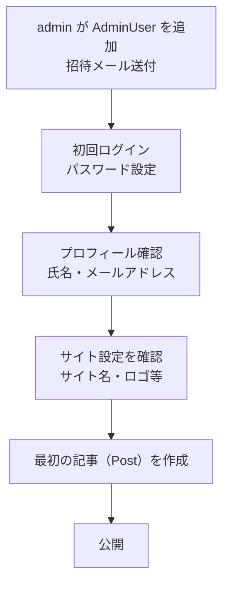
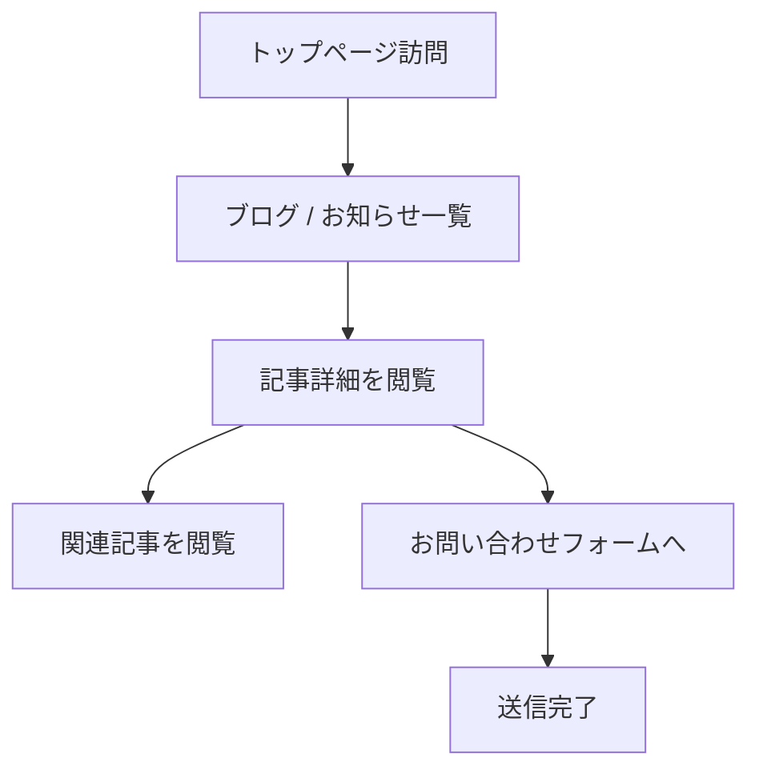
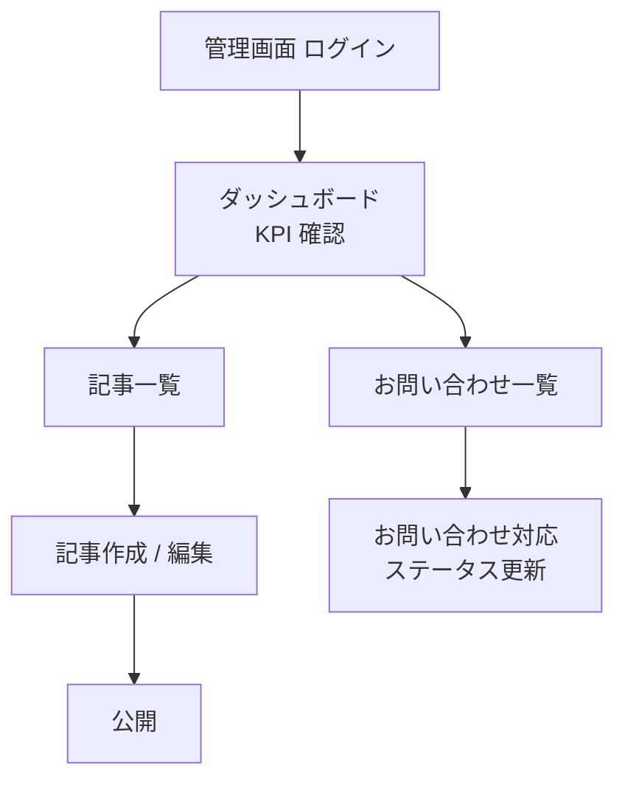
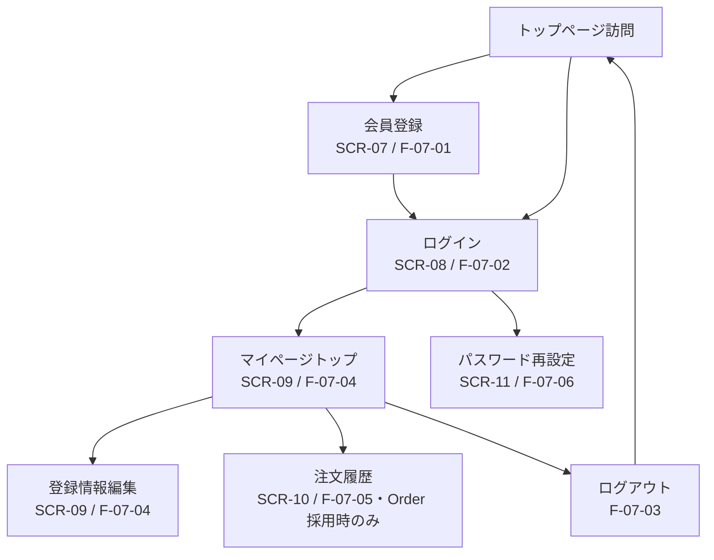
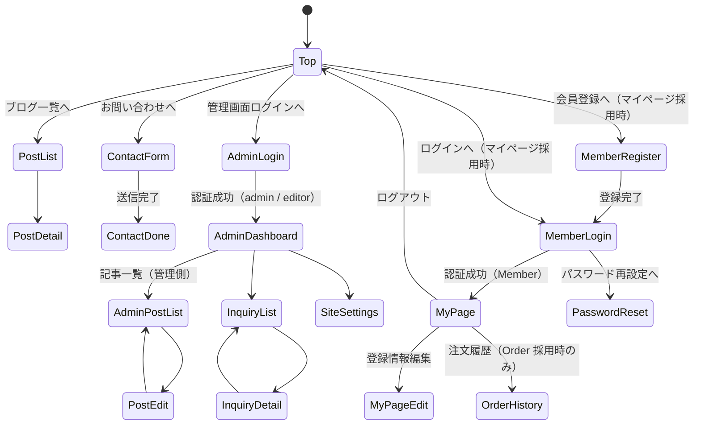

# 04-ui-ux-design.md — UI/UX 設計テンプレート

## このセクションの目的

このドキュメントは、プロダクト体験の設計思想、主要導線、画面一覧、**管理画面の標準構成**、コンポーネント方針、アクセシビリティ基準を定義します。デモ品質を決定づける管理画面のテンプレ化を含みます。

> 本テンプレートは 00_README §0-1 の**パターン A**（コンテンツ主体サイト + 軽量な管理画面）を前提とする。管理画面は少数ロール（admin / editor）向けの軽量 CMS であり、マルチテナント SaaS（Organization 階層、Platform 管理画面）の管理画面ではない（PRD-01 §1-2、PRD-03）。

## 0-H. ハイブリッド編集ガイド（要点）

- 推奨モード: Hybrid（AI 構造化 + Designer 確定）
- 人間確認必須：体験原則、主要導線、管理画面の情報設計、アクセシビリティ
- AI 下書き可：画面一覧整形、フロー図初稿、コンポーネント分類

詳細は 00_README.md §7（文書ステータス）と §8（AI 運用ガイド）を参照。

---

## 1. 設計思想・デザイン原則

<!-- TEMPLATE: プロダクト固有の設計原則を 5〜7 つ。共通の管理画面原則は維持して、上位にプロダクト固有を追記する -->
<!-- SAMPLE START: フォーマット例 — 実際のプロダクト原則に置き換えてください -->
| 原則名 | 内容 |
| --- | --- |
| 明快さ優先 | 1 画面 1 目的を徹底し、情報過多を避ける |
| 行動起点 | ユーザーが次に取るべき行動を明示する |
| 状態の可視化 | 進捗、保存結果、エラー理由を即時に伝える |
| 一貫性 | 同じ概念は同じ UI パターンで表現する |
| [プロダクト固有原則] | [この UI が重視する体験の言語化] |
<!-- SAMPLE END -->

### 1-1. 公開画面と管理画面の設計トーン

| 領域 | 設計トーン | 重視する体験 |
| --- | --- | --- |
| 公開画面（サイト訪問者） | 親しみやすい、温度感のある UI | 滞在時間、読みやすさ、また訪れたくなる印象 |
| 管理画面（admin / editor） | 機能的、効率重視、整然 | 操作時間短縮、一覧性、ミスを起こさない |

---

## 2. ユーザーフロー定義

最低 3 導線を Mermaid で記述：「初回オンボーディング」「日常利用」「管理者運用」。

### 2-1. 初回オンボーディング

<!-- SAMPLE START: フォーマット例 — 実際のオンボーディング導線に置き換えてください -->

<!-- SAMPLE END -->

> 本テンプレートは公開側の会員登録を前提としない（PRD-02 §9：公開側は原則認証不要）。オンボーディングの主体は管理画面へログインする AdminUser であり、SaaS 型の「新規登録 → Organization 作成」は発生しない（マイページ機能・FG-07 採用時の会員登録導線は例外であり、AdminUser のオンボーディングとは無関係。2-4 を参照）。

### 2-2. 日常利用

<!-- SAMPLE START: フォーマット例 — 実際の日常利用導線に置き換えてください -->

<!-- SAMPLE END -->

> 「日常利用」は本テンプレートでは主にサイト訪問者（公開側）の導線を指す。管理側の日常運用は 2-3 を参照。マイページ機能採用時の会員導線は 2-4 を参照。

### 2-3. 管理者運用

<!-- SAMPLE START: フォーマット例 — 実際の管理者導線に置き換えてください -->

<!-- SAMPLE END -->

### 2-4. 会員利用（マイページ機能採用時のみ）

<!-- SAMPLE START: フォーマット例 — 実際の会員導線に置き換えてください -->

<!-- SAMPLE END -->

> マイページ機能（FG-07）を採用しない場合は本フロー自体を削除する。Member の認証は AdminUser の認証・セッションとは別系統（PRD-01 §1-2）であり、2-3「管理者運用」の導線とは接続しない。注文履歴（F）は軽量 EC（FG-05）も採用している場合のみ表示する。

---

## 3. 画面一覧

公開画面（サイト訪問者向け）と管理画面（admin / editor 向け）を分けて管理する。

### 3-1. 公開画面（サイト訪問者）

<!-- SAMPLE START: フォーマット例 — 実際の画面一覧に置き換えてください -->
| 画面 ID | 画面名 | ルート | 主目的 | 主な利用者 | 関連機能 |
| --- | --- | --- | --- | --- | --- |
| SCR-01 | トップページ | `/` | サイトの入口、主要導線への誘導 | 全訪問者 | [プロダクト固有] |
| SCR-02 | サービス / 会社紹介ページ（Page） | `/[slug]` | サービス内容・会社情報の閲覧 | 全訪問者 | Page（採用時。PRD-01 §1-1） |
| SCR-03 | ブログ / お知らせ一覧 | `/blog` | 記事の一覧・絞り込み・検索 | 全訪問者 | F-02-01, F-02-03, F-02-04, F-02-05 |
| SCR-04 | ブログ / お知らせ詳細 | `/blog/[slug]` | 記事本文の閲覧 | 全訪問者 | F-02-02, F-02-06 |
| SCR-05 | お問い合わせフォーム | `/contact` | 問い合わせ・資料請求の送信 | 全訪問者 | Inquiry（PRD-01 §3-1）, F-06-03 |
| SCR-06 | 商品ページ / カート・決済（軽量 EC 採用時） | `/shop` | 商品情報の閲覧・注文 | 全訪問者 | F-05-01, F-05-02, F-05-03, F-05-04 |
| SCR-07 | 会員登録（マイページ機能採用時） | `/register` | Member アカウントの新規作成 | 全訪問者 | F-07-01 |
| SCR-08 | ログイン（マイページ機能採用時） | `/login` | Member としての認証 | 全訪問者 | F-07-02, F-07-03 |
| SCR-09 | マイページ（マイページトップ・登録情報編集、マイページ機能採用時） | `/mypage` | 会員情報の確認・編集 | 会員（Member） | F-07-04 |
| SCR-10 | 注文履歴（マイページ機能採用時、かつ Order 採用時のみ・FG-05 連動） | `/mypage/orders` | 過去の注文の確認 | 会員（Member） | F-07-05 |
| SCR-11 | パスワード再設定（マイページ機能採用時） | `/password/reset` | Member パスワードの再設定 | 全訪問者 | F-07-06 |
<!-- SAMPLE END -->

> SCR-06 は軽量 EC（FG-05）を採用しない場合は削除する。SCR-07〜SCR-11 はマイページ機能（FG-07）を採用しない場合はまとめて削除する。SCR-10（注文履歴）はさらに軽量 EC（FG-05）も採用している場合のみ有効（F-07-05）。SCR-08（ログイン、公開側・Member 用）は ADM-00（ログイン、管理画面・AdminUser 用）とは別系統の認証であり、実装（クッキー名・セッション・パスワードハッシュ等）を共有しない（PRD-01 §1-2）。SCR-07〜SCR-11 は公開画面のため、DEV-01 §1 の方針どおり shadcn-svelte は使わず、プレーン Tailwind（`apps/public/src/styles/global.css`）で実装する。

### 3-2. 管理画面（admin / editor）

<!-- TEMPLATE: 関連機能列は PRD-03 の機能 ID（F-NN-NN）と対応させる -->
<!-- SAMPLE START: フォーマット例 — 実際の管理画面一覧に置き換えてください -->
| 画面 ID | 画面名 | ルート | 主目的 | 主な利用者 | 関連機能 |
| --- | --- | --- | --- | --- | --- |
| ADM-00 | ログイン | `/` | 管理画面への認証 | admin / editor | F-01-01 |
| ADM-01 | 管理ダッシュボード | `/dashboard` | KPI・直近イベント表示 | admin / editor | F-04-01 |
| ADM-02 | 記事（Post）一覧 / 編集 | `/posts` · `/posts/[id]` | 記事の作成・編集・公開/非公開切替 | admin / editor | F-04-02 |
| ADM-03 | 固定ページ（Page）一覧 / 編集（採用時のみ） | `/pages` · `/pages/[id]` | 固定ページの作成・編集 | admin / editor | F-04-03 |
| ADM-04 | メディア（Media）ライブラリ | `/media` | 画像等のアップロード・一覧・削除 | admin / editor | F-04-04 |
| ADM-05 | カテゴリ / タグ管理 | `/taxonomies` | Post の分類管理 | admin / editor | F-04-05 |
| ADM-06 | お問い合わせ（Inquiry）一覧 / 対応 | `/inquiries` · `/inquiries/[id]` | 送信内容の確認・対応状況の更新 | admin | F-04-06 |
| ADM-07 | 管理者（AdminUser）管理 | `/admin-users` | AdminUser の追加・ロール変更・無効化 | admin | F-04-07 |
| ADM-08 | サイト設定 | `/settings` | サイト名・ロゴ・OGP 既定値等 | admin | F-04-08 |
| ADM-09 | 注文一覧（軽量 EC 採用時のみ） | `/orders` | 注文の一覧・状態確認 | admin | F-05-05 |
| ADM-10 | 会員一覧（参照専用・**標準外**。デフォルトでは実装しない — 下記注記参照） | `/members` | サポート対応時の会員情報・注文履歴の参照 | admin | F-07-04, F-07-05（参照のみ） |
<!-- SAMPLE END -->

> ADM-00（ログイン）の画面例は既存の `apps/admin/src/pages/index.astro`（`/` 自体がログイン画面。`/login` への分離は行わない）+ `apps/admin/src/lib/components/login-form.svelte`（DEV-06 §4-4）。**バックエンド（`POST /api/v1/auth/login`・セッション発行・ロックアウト）と UI の結線は実装済み**で、成功時は ADM-01（`/dashboard`）へ遷移する。ADM-00 / ADM-01 に残るのは見た目の作り込みのみ（DEV-06 §4-4 参照）。ADM-09 は軽量 EC（FG-05）を採用しない場合は削除する。

> **ADM-10 は本テンプレートの標準画面ではない（デフォルトでは実装しない、任意追加）。** マイページ機能（FG-07）採用時、サポート担当が会員からの問い合わせ対応で登録情報や注文履歴（Order 採用時）を参照する必要がある場合にのみ追加を検討する。参照専用（一覧・詳細の表示のみ）とし、Member の新規作成・編集・削除・状態変更・ロール付与等は持たせない — Member は AdminUser と完全に別系統のアカウントであり（PRD-01 §1-2）、AdminUser 側に会員の管理機能（変更権限）を持たせると意図的な分離方針に反するため。追加しない場合、Member はマイページ（SCR-09）でのみ自身の情報を確認・編集する。

> **旧 3-3「プラットフォーム管理画面（super_admin 専用）」は削除した。** Platform / Organization の 2 階層構造自体が本テンプレートに存在しないため（PRD-01 §1-2、00_README §2-2）。管理画面は上表の ADM-00〜10 のみであり、super_admin 専用の別階層画面は作らない。

---

## 4. 管理画面の標準構成

### 4-1. 共通レイアウト

管理画面は **サイドナビ + ヘッダー + コンテンツエリア** の 3 ペイン構造を標準とする。

```
┌──────────────────────────────────────────────────────────┐
│ Header: ロゴ / 検索 / 通知 / ユーザーメニュー              │
├────────────┬─────────────────────────────────────────────┤
│            │                                               │
│  Sidebar   │   Content Area                                │
│  (ナビ)    │   - ページタイトル                             │
│            │   - アクションボタン                           │
│  - ホーム  │   - フィルタ / 検索                            │
│  - 記事    │   - メインコンテンツ                           │
│  - 固定ページ│    （テーブル / フォーム / カード）          │
│  - メディア│                                               │
│  - お問い合わせ│                                           │
│  - 管理者  │                                               │
│  - 設定    │                                               │
│            │                                               │
└────────────┴─────────────────────────────────────────────┘
```

### 4-2. 必須画面パターン（管理画面に必ず含めるべき 5 タイプ）

| パターン | 必須要素 | 例 |
| --- | --- | --- |
| **ダッシュボード** | KPI カード × 4〜6、グラフ 1〜2（任意）、直近イベント一覧 | ADM-01 |
| **一覧画面** | 検索、フィルタ、ソート、ページネーション、一括操作、行ごとの詳細/編集リンク | ADM-02 記事一覧 |
| **詳細画面** | タイトル、ステータス、メタ情報、アクション、関連データタブ | ADM-06 お問い合わせ詳細 |
| **フォーム画面** | 段階入力、バリデーション、保存 / キャンセル、確認ステップ | ADM-02 記事編集 |
| **設定画面** | カテゴリ別タブ、変更時の保存ボタン、危険操作の確認モーダル | ADM-08 サイト設定 |

### 4-3. ASCII モックアップ例

#### 4-3-1. ダッシュボード（ADM-01）

<!-- SAMPLE START: フォーマット例 — サービス名・KPI 項目は実プロダクトに合わせて変更してください -->
```
┌──────────────────────────────────────────────────────────────┐
│ [サイト名]                       🔍 検索  🔔 (3)  👤 管理者  │
├────────────┬─────────────────────────────────────────────────┤
│            │  ダッシュボード                                   │
│ ⊞ ホーム   │  ── ── ── ── ── ── ── ── ── ── ── ── ── ──     │
│            │                                                   │
│ 📝 記事    │  ┌─────────┐ ┌─────────┐ ┌─────────┐ ┌─────────┐│
│            │  │公開記事数│ │下書き数 │ │今月のお問│ │本日の   ││
│ 📄 固定ページ│ │   42    │ │    5    │ │い合わせ │ │アクセス ││
│            │  │         │ │         │ │  12     │ │  1,204  ││
│ 🖼 メディア │  └─────────┘ └─────────┘ └─────────┘ └─────────┘│
│            │                                                   │
│ ✉ お問い合わせ│ ┌─ 直近の記事 ──────────────────────────────┐  │
│            │  │ • [記事タイトル A]（公開・3 時間前）        │  │
│ 👤 管理者  │  │ • [記事タイトル B]（下書き）                 │  │
│            │  └────────────────────────────────────────────┘  │
│ ⚙ 設定     │                                                   │
│            │  ┌─ 直近のお問い合わせ ───────────────────────┐  │
│            │  │ • [氏名 A] より「[件名]」(未対応・1 時間前) │  │
│            │  │ • [氏名 B] より「[件名]」(対応済み)          │  │
│            │  └────────────────────────────────────────────┘  │
└────────────┴─────────────────────────────────────────────────┘
```
<!-- SAMPLE END -->

#### 4-3-2. 一覧画面（ADM-02 記事一覧）

<!-- SAMPLE START: フォーマット例 — 列名は実プロダクトに合わせて変更してください -->
```
┌──────────────────────────────────────────────────────────────┐
│ 記事管理                                     [+ 新規記事]     │
│ ── ── ── ── ── ── ── ── ── ── ── ── ── ── ── ── ── ── ── ──│
│                                                                │
│ [🔍 タイトル検索]  カテゴリ: [すべて ▼]  ステータス: [すべて ▼]│
│                                                                │
│ [☐ 一括選択]      [一括操作 ▼]                                │
│                                                                │
│ ┌─────────────────────────────────────────────────────────┐  │
│ │ ☐ │ タイトル       │ ステータス │ 公開日     │ カテゴリ│操作│  │
│ ├─────────────────────────────────────────────────────────┤  │
│ │ ☐ │ [記事タイトルA] │ 公開      │ 2026-08-01 │ お知らせ│ ⋯  │  │
│ │ ☐ │ [記事タイトルB] │ 下書き    │ —          │ ブログ  │ ⋯  │  │
│ │ ☐ │ [記事タイトルC] │ 公開      │ 2026-07-20 │ ブログ  │ ⋯  │  │
│ │ ...                                                       │  │
│ └─────────────────────────────────────────────────────────┘  │
│                                                                │
│            << 前へ   1  2  3  ...  10   次へ >>                │
└──────────────────────────────────────────────────────────────┘
```
<!-- SAMPLE END -->

#### 4-3-3. 詳細・編集画面（フォームパターン、ADM-02 記事編集）

<!-- SAMPLE START: フォーマット例 — フィールド名は実プロダクトに合わせて変更してください -->
```
┌──────────────────────────────────────────────────────────────┐
│ ← 記事一覧へ戻る                                              │
│                                                                │
│ [記事タイトル]                             [公開] [下書き保存]│
│ ── ── ── ── ── ── ── ── ── ── ── ── ── ── ── ── ── ── ── ──│
│                                                                │
│ タイトル     [__________________________]                     │
│ スラッグ     [__________________________]                     │
│ カテゴリ     [お知らせ ▼]     タグ [ ＋タグを追加 ]           │
│ アイキャッチ [画像を選択 / メディアライブラリから選ぶ]        │
│                                                                │
│ 本文                                                           │
│ ┌────────────────────────────────────────────────────────┐   │
│ │ [リッチテキスト / Markdown エディタ]                      │   │
│ │                                                          │   │
│ └────────────────────────────────────────────────────────┘   │
│                                                                │
│ ステータス                                                     │
│   ◉ draft（下書き）                                           │
│   ○ published（公開）                                        │
│                                                                │
│ ⚠ 危険操作                                                    │
│   [この記事を削除]                                             │
└──────────────────────────────────────────────────────────────┘
```
<!-- SAMPLE END -->

### 4-4. 管理画面の操作原則

| 原則 | 内容 |
| --- | --- |
| 検索・フィルタは即時反映 | debounce 300ms、確定後 500ms 以内に結果反映 |
| 一括操作には確認ステップ | 削除等の不可逆操作は必ず確認モーダル |
| 危険操作の色分け | 削除・無効化等は赤系の色 + 確認文言 |
| 楽観的 UI 更新は避ける | 管理画面では保存完了まで状態を変えない |
| 操作完了はトースト | 成功・失敗を画面右上のトーストで通知 |
| キーボード操作対応 | テーブル行移動・モーダル開閉等は Tab / Enter / Esc で操作可能 |
| パンくず or 戻るリンク | 階層が深い画面では必ず戻り導線を提供 |

### 4-5. 管理画面のレスポンシブ方針

| ブレークポイント | 挙動 |
| --- | --- |
| デスクトップ（≥ 1280px） | 標準 3 ペイン |
| タブレット（768〜1279px） | サイドナビをアイコンのみに圧縮 |
| モバイル（≤ 767px） | サイドナビをドロワー化、コンテンツ全幅 |

管理画面はモバイル対応「最小限」（緊急対応・確認程度）。本格作業はデスクトップ前提とする。

---

## 5. 画面遷移図

<!-- SAMPLE START: フォーマット例 — 実際の画面名・遷移に置き換えてください -->

<!-- SAMPLE END -->

---

## 6. コンポーネント設計方針

> 本節は管理画面（shadcn-svelte）を主対象とする。公開画面（マイページ機能を含む）はプレーン Tailwind を採用し、コンポーネントライブラリは導入しない（DEV-01 §1、PRD-04 §3-1）。

| 項目 | 方針 |
| --- | --- |
| 採用アプローチ | 管理画面は標準 UI コンポーネントライブラリ（DEV-01 §1、shadcn-svelte）を最優先で使用、不足分のみカスタムコンポーネント |
| 再利用対象 | データテーブル / フォーム入力 / カード / モーダル / ドロワー / トースト |
| 命名規則 | コンポーネント名は機能を表す（`PostListTable`、`InquiryStatusForm` 等） |
| 禁止事項 | 画面固有スタイルのベタ書き、同一意味の別名コンポーネント乱立 |
| デザイントークン | 色・余白・角丸・タイポグラフィをデザイントークンとして一元管理（実装方式は DEV-01 §1） |

---

## 7. アクセシビリティ方針

| 項目 | 方針 |
| --- | --- |
| 準拠基準 | WCAG 2.2 |
| 対応レベル | AA 相当 |
| キーボード操作 | 主要操作は Tab / Enter / Space / Esc で実行可能 |
| コントラスト | 通常テキスト 4.5:1、大きいテキスト 3:1 以上 |
| 代替テキスト | 意味を持つアイコン・画像に必ず付与 |
| フォーカスリング | `:focus-visible` を必ず可視化 |
| ステータス | 色のみで状態を表現しない（アイコン + 色 + テキストの 3 要素） |
| スクリーンリーダー | 主要なランドマーク（`<nav>`、`<main>`、`<aside>`）を使い分け |

---

## 8. ブランド・トーン

<!-- SAMPLE START: フォーマット例 — 実際のブランド方針に置き換えてください -->
| 項目 | 方針 |
| --- | --- |
| プライマリーカラー | [ブランドカラー（例: 青系・紫系）と選定理由] |
| アクセントカラー | [CTA に使うカラー] |
| フォント | Inter（英字）+ Noto Sans JP（日本語） |
| 角丸 | [px 基準] |
| アイコン | Lucide（線画。`components.json` の `iconLibrary` で固定、DEV-01 §1） |
| 言葉遣い | [プロダクトの文脈に合った言葉遣いの方針] |
<!-- SAMPLE END -->

---

## 9. 記入時チェックポイント

- 公開画面と管理画面が分けて整理されているか
- 管理画面の必須 5 パターン（ダッシュボード / 一覧 / 詳細 / フォーム / 設定）が、実際の CMS 画面（記事・固定ページ・メディア・お問い合わせ・管理者・サイト設定）に対応づけて記述されているか
- 画面名と機能 ID（PRD-03 の F-NN-NN）が対応しているか
- アクセシビリティが後付けでなく原則として書かれているか
- 主要導線（オンボーディング / 日常利用 / 管理者運用 / 会員利用〈マイページ機能採用時〉）が説明されているか
- ASCII モックアップ等で「整った管理画面」が視覚的に伝わるか
- Organization 管理・プラットフォーム管理（super_admin 専用画面）等、マルチテナント SaaS 由来の画面が紛れ込んでいないか（本テンプレは単一運営の軽量 CMS 前提）
- マイページ機能（FG-07）採用時、Member 向け画面（SCR-07〜SCR-11）がプレーン Tailwind で設計され、shadcn-svelte や管理画面向けコンポーネントが誤って使われていないか（DEV-01 §1、PRD-04 §3-1・§6）
- Member 管理のための画面が AdminUser 側（ADM-NN）に意図せず追加されていないか。参照専用の任意画面（ADM-10 等）を追加する場合、その旨と参照専用である制限が明記されているか（§3-2）
