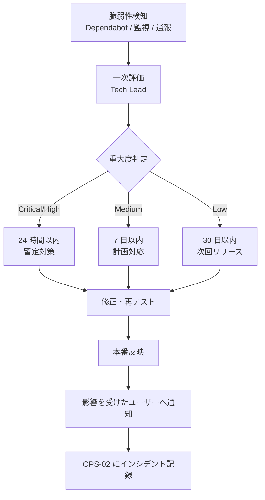

# 02-security-policy.md — セキュリティポリシー

## このセクションの目的

認証・認可・暗号化・脆弱性対応・機密情報保護に関する方針を集約する正仕様書。本プロジェクトは Platform（運営者）/ Organization（保護団体）/ Walker（お散歩参加者）の三者構造を持つ二者間マーケットプレイスであり、アカウント系統は **3 系統・完全分離**（AdminUser / Walker / OrganizationMember）、ロールは **Platform 1 ロール（`admin`）+ Organization 2 ロールの計 3 ロール**（Walker はロールを持たずプロフィール状態で利用資格を判定）で構成する（構造の正本は PRD-01 §1-2、GOV-01 D-011）。実装技術は Cloudflare D1 セッション + Web Crypto（PBKDF2）+ Zod + Astro 組み込み CSRF 対策という DEV-01 確定スタックに統一し、ロールライブラリ・JWT・専用マルチテナントライブラリは使わず自前実装で境界を強制する。

## 0-H. ハイブリッド編集ガイド（要点）

- 推奨モード: Hybrid（AI 草案 + Tech Lead 確認。個人情報・開示条件は必要に応じ法務確認）
- 人間確認必須: 認証・認可、個人情報、開示条件、鍵管理、Organization/Walker 境界の強制箇所
- 詳細は 00_README.md §6〜8

---

## 1. 認証・認可モデル

3 系統のアカウントは技術（D1 セッション + `httpOnly` 署名クッキー + Web Crypto PBKDF2）を共有するが、テーブル・クッキー名・セッション実装・認可コードパスはすべて分離する（DEV-01 §1「アカウント系統」、GOV-01 D-007）。信頼レベルが異なる（社内の少数運営者 vs 不特定多数のお散歩参加者 vs 保護団体という外部組織のスタッフ）ため、これは実装の手間を惜しんだ結果の見落としではなく意図的な多重防御である。

### 1-1. AdminUser 認証（`apps/admin`。Platform ロール）

`admin_users`（DEV-07）に紐づく認証であり、他 2 系統（Walker・OrganizationMember、いずれも `apps/public`）とは完全に別系統。`jose` / JWT は不採用 — 用途がステートレス API ではなく管理画面ログインのみのため、失効可能な D1 セッション方式を採用する（DEV-01 §2）。

| 経路 | 認証方式 | セッション / トークン保持 |
| --- | --- | --- |
| 管理画面（Web） | D1 の `admin_sessions` テーブルでセッションを管理し、`httpOnly` + `Secure` + `SameSite=Lax` 付き署名クッキー（クッキー名 `admin_session`）でセッション ID を保持する（クッキー属性の正本は本表。DEV-04 §2 はこれを参照する）| D1（`admin_sessions`）。ログアウト・強制失効は行削除で即時反映される |
| API（採用時）| 管理画面と同じ D1 セッション機構を使う。session token をクッキーまたは `Authorization` ヘッダで受け渡す | D1（`admin_sessions`）|
| メール認証 | **実装しない**（`Decided` — GOV-01 D-028）。AdminUser は自己登録の経路を持たず、既存の AdminUser が招待して発行する。招待リンクが当該アドレスに届いて開かれた時点で到達性は証明されており、確認ステップで防げる誤りが無い | — |
| パスワードリセット | 自前実装（`password_reset_tokens`。DEV-07 §4-6）。トークンは Web Crypto の HMAC 署名（`crypto.subtle.sign`）で発行・検証する | リンク 60 分有効 |
| パスワードハッシュ化 | Web Crypto API の PBKDF2（`crypto.subtle`）。Workers ランタイム標準実装で追加パッケージ不要 | — |
| OAuth（任意）| Arctic（DEV-01 §2）| Google 等 |

**`apps/admin` は Cloudflare Access で二重に塞ぐ**（`Decided` — GOV-01 D-031）。上表のアプリケーション層認証の**手前**に、エッジの ID ゲートを置く。

| 項目 | 方針 |
| --- | --- |
| 適用対象 | **Worker 名で指定**する（`walk-pet-kampo-admin`）。ホスト名・ルート単位では指定しない — ルートごとの設定漏れと `workers.dev` / Preview URL からの迂回を構造的に潰すため。Preview deployments も対象に含める |
| アプリ側の検証 | `ctx.access`（Astro からは `Astro.locals.cfContext.access`）の**存在**を `apps/admin/src/middleware.ts` で確認し、無ければ 403 を返す。Access アプリケーションが外れた・付け替え漏れがあった場合に、パスワードのみの状態へ黙って退行しないための fail-closed。**⚠ 未検証（GOV-02 TBD-60）**: Cloudflare 公式は Static Assets を伴う Worker では内部ルータが `ctx.access` を渡さないとしており、本構成（`assets` binding `ASSETS`）は該当しうる。その場合この検証は本番で全リクエストを 403 にするため、初回 staging デプロイで実測してから確定する |
| JWT の手動検証 | **行わない。** Access 有効時は `ctx.access` が提供され、`Cf-Access-Jwt-Assertion` を `jose` + JWKS で検証する必要はない（Cloudflare 公式）。`jose` / JWT 不採用の判断（本節冒頭）はそのまま維持される |
| 認可の正本 | **`admin_sessions` のまま。** Access は入口のゲートであって認可ではない。`activity_log.causer_id`（DEV-09 §3-5）に実行者を記録する以上、D1 セッションは必須 |
| MFA | Access の ID プロバイダ側で担保する。アプリ側に TOTP を実装しない（DEV-01 §2 の `otpauth` は引き続き不採用） |
| ローカル開発・E2E | `wrangler.jsonc` の `access.dev` ブロックで擬似 identity を注入する。上記 fail-closed は `import.meta.env.DEV` で本番ビルドに限定するため、`pnpm dev` と `pnpm test:e2e` は Access 無しで動く |
| 対象外 | `apps/public`（公開画面・保護団体ページ）。保護団体スタッフと Walker は外部利用者であり、かつ同一 Worker に同居しているため、Access を被せられない。2 Worker 構成（GOV-01 D-007）が admin だけを塞げる前提になっている |

> **Service Binding には効かない。** `ctx.access` は Worker 間で伝播しないと Cloudflare が明記しており、D-022 の `apps/admin` → `apps/public` RPC は Access の外側を通る。RPC 経路の信頼根拠は「バインディングを宣言した Worker からしか呼べない」ことであって Access ではない。

### 1-2. Walker 認証（`apps/public`。お散歩参加者）

Organization に非所属のプラットフォーム直属アカウント（PRD-01 §1-1）。`walkers` / `walker_sessions`（DEV-07）に紐づき、AdminUser・OrganizationMember とは別テーブル・別クッキー名・別実装コード（`apps/public/src/lib/server/` 配下、Walker 専用のモジュールに分離し OrganizationMember 用と共有しない）。

| 項目 | 内容 |
| --- | --- |
| テーブル | `walkers` / `walker_sessions`（DEV-07 が定義する正本。旧称 `members`/`member_sessions` からの改称を反映する — GOV-01 D-007） |
| クッキー名 | `walker_session`（AdminUser・OrganizationMember と異なる名前。同一クッキー名の使い回しは禁止） |
| セッション実装 | D1 セッション + httpOnly 署名クッキー（同じ技術だが実装コードは分離） |
| パスワードハッシュ | Web Crypto PBKDF2（ハッシュ関数自体の共通ヘルパー化は可だが、認証フロー・セッション管理コードは分離する） |
| 権限モデル | ロール階層なし。「ログイン済み Walker か否か」のみを判定する単純な認可に加え、**予約等の機能利用可否は `WalkerProfile.status` で判定するデータ駆動方式**（PRD-01 §1-2・§7）。`status = active` 以外（`provisional`/`pending_verification`/`restricted`/`suspended`/`withdrawn`）では予約系操作を拒否する |
| マイページ・予約履歴の認可 | 「本人の Walker か」の所有者チェックのみ（`requireWalker(session, walkerId)`、§3）。ロール検証は不要 |
| 招待・リセットトークン | パスワード再設定（F-01-04）・メールアドレス確認（F-01-01）で使用。方式は GOV-02 TBD-62（実装は D1 に行を持つ単発トークン、DEV-01 §2 は HMAC 署名と記述しており未整合） |
| 電話番号の確認 | 登録時ではなく**初回予約時**（`Decided` — GOV-01 D-036）。`walker_profiles.phone_verified_at` で表し、`status = active` とは独立した条件として予約作成時に検証する |

> Walker はロールを持たないため「利用資格の判定漏れ」が最大のリスク。予約・決済・里親相談などの Service 関数は `requireWalker(session, walkerId)` に加えて `requireActiveWalkerProfile(session)`（`status = active` を検証）を必ず通す（§3-2）。**予約作成のみ**、さらに `requirePhoneVerified`（`phone_verified_at` の検証）を通す — 電話確認は初回予約時に行うため（`Decided` — GOV-01 D-036）。

### 1-3. OrganizationMember 認証（`apps/public`。保護団体スタッフ）

保護団体（Organization）に所属する外部組織のスタッフアカウント（GOV-01 D-007 — プラットフォーム運営専用の `apps/admin` ではなく `apps/public` に配置する判断の背景を含む）。`organization_members` / `organization_sessions`（DEV-07）に紐づき、Walker・AdminUser とは別テーブル・別クッキー名・別実装コード。

| 項目 | 内容 |
| --- | --- |
| テーブル | `organization_members` / `organization_sessions`。`organization_members` は `organization_id`（NOT NULL）+ `role`（`org_admin` / `org_staff`）列を直書きする（DEV-01 §1「Permission」、GOV-01 D-004） |
| クッキー名 | `organization_session`（AdminUser・Walker と異なる名前） |
| セッション実装 | D1 セッション + httpOnly 署名クッキー（同じ技術だが実装コードは分離） |
| パスワードハッシュ | Web Crypto PBKDF2 |
| 権限モデル | Organization ロール 2 階層（`org_admin` / `org_staff`、§2）に加え、**Organization 境界**（`organization_id` が一致するデータのみ操作可、§3）の二重の認可が必要 |
| 招待・リセットトークン | 同じ技術（Web Crypto HMAC 署名）。団体スタッフ招待（F-04-03、`Invitation` テーブル）・パスワード再設定で使用 |
| Organization 切替 | MVP では 1 スタッフ = 1 団体所属を前提とし、切替機構は持たない（`[Assumed]` — PRD-02 §2-3、確認先: 事業責任者） |

### 1-4. 3 系統の分離原則（禁止事項）

| 項目 | AdminUser | Walker | OrganizationMember |
| --- | --- | --- | --- |
| 配置アプリ | `apps/admin` | `apps/public` | `apps/public` |
| テーブル | `admin_users` | `walkers` | `organization_members` |
| セッションテーブル | `admin_sessions` | `walker_sessions` | `organization_sessions` |
| クッキー名 | `admin_session` | `walker_session` | `organization_session` |
| ロール列 | なし（ロールが常に単一 `admin` のため role 列自体を持たない — GOV-01 D-011） | なし（`WalkerProfile.status` で判定） | `role`（`org_admin`/`org_staff`）+ `organization_id` |
| 境界の種類 | なし（横断管理が前提） | 本人（`walker_id`）のみ | Organization（`organization_id`）+ ロール |

**禁止事項**: 上記 3 系統のいずれか 2 つが、同一のセッションテーブル・同一のクッキー名・同一の認証コードパス（ログイン処理・セッション検証関数・パスワードハッシュ検証フロー）を共有すること。Walker と OrganizationMember はいずれも `apps/public` に同居するが、これは実装の重複を許容してでも境界を明確にする意図的な設計である。

共通化してよいのは `packages/server-kit/src/auth/` の純粋関数に限る（`Decided` — GOV-01 D-015）: PBKDF2 ハッシュ（`hashPassword` / `verifyPassword` / `burnPasswordVerification`）、セッショントークン生成・TTL 算出・期限判定（`newSessionToken` / `sessionExpiresAt` / `isActiveSession`）、ロックアウトカウンタ（§7）。**「どのテーブルを引くか」「どのクッキーを読むか」「誰を拒否するか」は共通化しない** — 各系統の `session.ts` に個別に書く。レビュー時は §11・§15 のチェックリストで確認する。

---

## 2. ロールモデル（Platform / Organization の 2 階層・計 3 ロール）

多ロール権限管理を **Platform / Organization の 2 階層・計 3 ロール**（Platform 1 ロール `admin` + Organization 2 ロール）で構成する（構造の正本は PRD-01 §1-2）。Organization 側は専用ロールライブラリを使わず D1 のテーブル設計（列への直書き）で表現し、Service 層に置く認可チェック関数（`requireRole` / `requireOrganizationMember` — §3）で境界を強制する。Platform 側（AdminUser）はロールが常に 1 種類のため role 列自体を持たず、`requireSession(cookies, db)` によるログイン検証のみで認可が足りる（DEV-01 §1「Permission」、GOV-01 D-011）。

### 2-1. 階層構造

```
Platform（運営者。apps/admin の AdminUser に付与、role 列は持たない単一ロール）
  └─ admin                   ← 全 Organization・全 Walker 横断管理、団体審査、決済・還元管理、障害対応

Organization ロール（テナント = 保護団体。apps/public の OrganizationMember に付与）
  ├─ org_admin               ← 保護団体の全権（団体情報・スタッフ管理・還元確認）
  └─ org_staff                ← 日常運用（保護犬・お散歩枠・予約確認・実施記録）

Walker（お散歩参加者）はロールではない
  └─ WalkerProfile.status = active（利用可能）で予約機能が解禁される
     データ駆動の利用資格（PRD-01 §1-2・§7、§1-2 参照）
```

### 2-2. 標準ロール定義

| 階層 | ロール | 概要 | 主な権限 |
| --- | --- | --- | --- |
| Platform | `admin` | 運営者 | 全 Organization・全 Walker 管理、団体審査、決済・還元管理、問い合わせ・事故報告対応、障害対応 |
| Organization | `org_admin` | 保護団体の代表・管理者 | 団体情報編集、スタッフ招待・ロール変更、還元・振込確認、団体退会申請 |
| Organization | `org_staff` | 保護団体スタッフ | 保護犬・お散歩枠の登録編集、予約者確認、実施記録登録、事故報告 |

### 2-3. 権限マトリクス

Walker 列は「本人のデータに対する操作」を示す（Organization ロールのような横断権限ではない）。

| 操作 | admin | org_admin | org_staff | Walker（本人）|
| --- | :---: | :---: | :---: | :---: |
| 全 Organization 一覧・審査 | ○ | ✕ | ✕ | ✕ |
| 自団体情報の編集 | ○ | ○ | ✕ | ✕ |
| 団体スタッフ招待・ロール変更 | ○ | ○ | ✕ | ✕ |
| 保護犬の登録・編集 | ○ | ○ | ○ | ✕ |
| お散歩枠の登録・編集・中止 | ○ | ○ | ○ | ✕ |
| 予約者情報の閲覧 | ○ | ○（自団体分）| ○（自団体分）| ✕ |
| 自分の予約・キャンセル | ○（代理操作可）| ✕ | ✕ | ○ |
| 参加費決済 | ✕ | ✕ | ✕ | ○（本人分のみ、`WalkerProfile.status = active` 必須）|
| 団体還元額・振込確認 | ○ | ○（自団体分）| ✕ | ✕ |
| 振込処理の実行（Stripe Connect Transfer）| ○（Cron Triggers 経由の自動実行含む）| ✕ | ✕ | ✕ |
| お散歩実施記録の登録 | ○ | ○ | ○ | ✕（閲覧のみ）|
| 事故・トラブル報告 | ○ | ○ | ○ | ✕（当事者として情報提供のみ）|
| 里親相談の送信 | ✕ | ✕ | ✕ | ○ |
| 里親相談への対応 | ○ | ○（自団体分）| ○（自団体分）| ✕ |
| 監査ログ（AuditLog）閲覧 | ○ | ✕ | ✕ | ✕ |

---

## 3. 認可チェック・マルチテナント境界の徹底

本プロジェクトはテナント軸を 2 系統持つ（Organization 側 = `organization_id`、Walker 側 = `walker_id`）。データ分離方式そのものの正本は PRD-02 §2（共有 D1 + テナント ID カラム方式、Global Scope 相当の自動適用機構は無し）。本節はセキュリティレビューの観点から、Service 層で必ず通すべき認可チェックを定義する（DEV-01 §4「認可チェックの徹底」）。

### 3-1. 権限チェック方針

| 対象 | 実装方法 |
| --- | --- |
| Platform 専用操作（団体審査・振込処理実行・全 Organization 横断閲覧等） | `apps/admin` は AdminUser のロールが単一（`admin`）のため、Service 層の入口で `requireSession(cookies, db)` によるログイン検証のみを必ず通せばよく、ロール引数による `requireRole` の絞り込みは不要（§2-3）|
| Organization 系操作全般 | `requireOrganizationMember(session, organizationId)`（操作対象の `organizationId` と現在の OrganizationMember の所属団体が一致することを検証）を必ず通す（PRD-02 §2-2）|
| org_admin 専用操作（スタッフ招待・ロール変更・団体退会申請） | `requireOrganizationMember` に加えて `requireRole(session, "org_admin")` を通す |
| Walker 本人操作全般（予約・決済・プロフィール編集・里親相談） | `requireWalker(session, walkerId)`（操作対象の `walkerId` と現在の Walker が一致することを検証）を必ず通す |
| 予約・決済等、利用資格が前提の操作 | `requireWalker` に加えて `requireActiveWalkerProfile(session)`（`WalkerProfile.status = active` を検証）を通す（§1-2）|
| 予約作成（`reservations` の新規作成のみ） | 上記に加えて `requirePhoneVerified(profile)`（`walker_profiles.phone_verified_at !== null`）を通す。電話確認は登録時ではなく初回予約時に行うため、`active` であることと連絡先が検証済みであることは別の条件になる（`Decided` — GOV-01 D-036、DEV-09 §2-7-3）|
| セッション/ロールの紐付け | ログイン時にロール・`organization_id`（該当する場合）をセッションに埋め込み、リクエストごとに検証する（§1 の決定に従う）|

### 3-2. 権限チェック漏れ・境界違反防止のコーディング規約

D1 には自動的にスコープを適用する機構がないため、Service 層の入口で明示的に検証する（DEV-01 §4、PRD-02 §2-2）。

```ts
// ❌ Bad: Organization 境界の検証なしで団体の保護犬を更新
async function updateDog(db: D1Database, dogId: string, input: DogInput) {
  return db.prepare("UPDATE dogs SET name = ? WHERE id = ?").bind(input.name, dogId).run();
}

// ✅ Good: Service の入口で必ず Organization 境界を検証してから実行する
async function updateDog(db: D1Database, session: OrganizationSession, organizationId: string, dogId: string, input: DogInput) {
  requireOrganizationMember(session, organizationId); // 所属団体不一致は例外をスロー
  return db.prepare("UPDATE dogs SET name = ? WHERE id = ? AND organization_id = ?").bind(input.name, dogId, organizationId).run();
}

// ✅ Good: Walker 本人 + 利用資格 + 連絡先検証の三重チェック
async function createReservation(db: DbClient, session: WalkerSession, walkerId: string, input: ReservationInput) {
  requireWalker(session, walkerId); // 本人以外は例外をスロー
  requireActiveWalkerProfile(session); // status !== "active" は例外をスロー
  requirePhoneVerified(profile); // phone_verified_at === null は例外（GOV-01 D-036）
  // ... 予約作成処理 ...
}

// requireOrganizationMember の実装例（apps/public/src/lib/server/organization/ 配下）
function requireOrganizationMember(session: OrganizationSession, organizationId: string) {
  if (session.organizationId !== organizationId) {
    throw new ForbiddenError();
  }
}
```

Platform 専用操作は `apps/admin` の AdminUser ロールが単一（`admin`）のため、上位/下位ロール間の権限の包含関係を考慮する必要がない。`requireSession(cookies, db)` によるログイン検証のみで Platform 専用操作の認可が完結し、Organization ロール（`org_admin`/`org_staff`）のような非対称な権限分岐は存在しない。

### 3-3. 権限チェック漏れ・境界違反の検出

- Vitest（DEV-01 §1「Testing」）で、Platform 専用操作の Service 関数が必ず `requireSession(cookies, db)` を通ること、Organization 系操作の Service 関数が必ず `requireOrganizationMember` を通ること、Walker 系操作の Service 関数が必ず `requireWalker`（利用資格が前提の操作は `requireActiveWalkerProfile` も）を通ることを検証する
- Pull Request レビューで「Organization 境界（`organization_id`）または Walker 境界（`walker_id`）でスコープしているか？」「Platform 専用操作に `requireSession` があるか？」を必須チェック項目に（§11）
- 監査ログ（AuditLog、PRD-01 §3-1。`actorType`（platform/organization/walker）+ `actorId` を記録）で管理操作を記録し、`admin` の Organization 横断アクセス（本来スコープを持たない越境アクセス）を含めて事後追跡できるようにする

---

## 4. 入力検証

| 経路 | 検証方法 |
| --- | --- |
| Web | Astro API Route / Service 層の入口で Zod（DEV-01 §2、Drizzle スキーマから `drizzle-zod` で導出）により検証する。フォーム値を検証せず直接 D1 へ書き込むことを禁止 |
| API | Service 層の入口で必ず検証を通す。リクエストボディを未検証のままハンドラの奥まで渡さない |
| ファイルアップロード | MIME / 拡張子 / サイズ / 実バイトの 4 重チェック（保存先は Cloudflare R2）。対象: 保護犬・お散歩記録の写真、団体審査書類・本人確認書類（F-03-02） |
| 外部 API 応答（ジオコーディング） | Google Maps Platform Geocoding API のレスポンスは信頼できる外部入力として扱い、緯度経度の範囲チェック・住所文字列のエスケープを行ってから D1 へ保存する（DEV-10 §9）|
| Webhook 受信（Stripe） | 署名検証（`stripe-signature` ヘッダ + Webhook Secret）を Zod 検証より前段で必須実施し、検証失敗時はペイロードをパースせず 400 で拒否する（DEV-10 §2、§6）|

---

## 5. 暗号化方針

| 項目 | 方針 |
| --- | --- |
| 通信時 | HTTPS 必須（TLS 1.2 以上）|
| 保存時（DB）| Cloudflare D1 標準の保存時暗号化（基盤側で提供。DEV-01 参照）|
| 保存時（ファイル）| Cloudflare R2 標準の保存時暗号化（DEV-01 参照）|
| 秘密情報 | ローカル開発は `.dev.vars`（gitignored）、本番は Cloudflare Workers Secrets（`wrangler secret put`）で管理。Git にコミット禁止 |
| Stripe API Key / Webhook Secret | Cloudflare Workers Secrets（`apps/public`・`apps/admin` の両方に同一値を配置 — 参加費決済は `apps/public`、Payout の Stripe Connect Transfer は `apps/admin` の Cron Triggers から呼び出すため。DEV-10 §1-3）。ローテーション時は Stripe ダッシュボード側の失効操作と合わせて OPS-02 に記録 |
| Google Maps Platform API Key | Cloudflare Workers Secrets。Google Cloud Console 側で API 制限（Geocoding API のみ）+ リファラ/IP 制限を併用する |
| 機密カラム（保護犬の非公開健康情報、緊急連絡先等）| アプリ層での列単位暗号化は行わない（D1 標準の保存時暗号化に委ねる）。代わりに §3 の Organization/Walker 境界チェックと §8 の第三者提供範囲の制限で、閲覧・開示自体を絞り込むアクセス制御中心の方針とする |
| 鍵管理 | アプリ全体の単一鍵という概念は無く、Cloudflare Workers Secrets 単位（`apps/public`/`apps/admin` それぞれ）で個別に管理し、ローテーション時は影響範囲を OPS-02 に記録する |

---

## 6. CSRF / XSS / SQL Injection 対策

| 攻撃区分 | 対策 |
| --- | --- |
| CSRF | Astro 組み込みの Origin チェック（`security.checkOrigin`、既定で有効。DEV-01 §2）で対応する。GET/HEAD/OPTIONS 以外かつ `Content-Type` が form 系または未指定のリクエストは Origin 不一致で自動的に 403 になる。追加ライブラリ・二重送信トークン等の自前実装は不要。AdminUser・Walker・OrganizationMember の 3 系統ともこの機構を共有してよい（アプリケーションではなく Astro 自体の機構のため、§1-4 の実装分離ルールの対象外）。Stripe Webhook のように外部サーバーからの POST（ブラウザ経由でない）はそもそも Cookie ベースの CSRF 対策の対象外であり、代わりに署名検証（§4・DEV-10 §2）で保護する |
| XSS | Astro は `{式}` 展開でデフォルトエスケープ、Svelte も `{式}` 展開でデフォルトエスケープ。`set:html` / `{@html ...}` はサニタイズ済みの値以外に使用禁止。保護犬プロフィール・団体紹介文等のユーザー投稿リッチテキストを扱う場合も同様 |
| SQL Injection | D1 へのアクセスは必ずプレースホルダ付きプリペアドステートメント（`env.DB.prepare(sql).bind(...)`）または Drizzle 経由。文字列連結による SQL 構築を禁止（DEV-01 §3）。距離検索の Haversine 計算（DEV-10 §9）もバインド変数を使用する |
| ファイルアップロード | MIME / 拡張子 / サイズ / 実バイトの 4 重チェック（保存先 R2）|
| マスアサインメント | 未検証のリクエストボディをそのまま書き込む防御機構は無い。Service 層で書き込み対象のフィールドを明示的にホワイトリスト指定する。特に Walker/OrganizationMember が自分で更新できない列（`role`、`organization_id`、`WalkerProfile.status` 等）をリクエストボディから誤って書き込まないよう、更新系 Service 関数は許可フィールドのみを受け取る型（Zod スキーマ）を分ける |

---

## 7. レート制限

IP ベースの汎用レート制限は Cloudflare の WAF / Rate Limiting Rules（アプリケーションコードには実装しない）。単なるブルートフォース対策を超え、**予約枠の在庫ロック濫用や決済試行の濫用といったマーケットプレイス特有の業務乱用**についてはアカウント単位（`walkerId` / `organizationId`）で Cloudflare KV カウンタをアプリ側に実装する。

| 対象 | 制限 | 実装方式 |
| --- | --- | --- |
| ログイン / パスワードリセット（3 系統それぞれ）| 5 回 / 分 / IP | Cloudflare WAF / Rate Limiting Rules |
| 一般画面操作 | 60 回 / 分 / ユーザー | Cloudflare WAF / Rate Limiting Rules |
| 予約作成 | 10 回 / 時 / Walker（連続予約試行による在庫ロック濫用を防止）| KV カウンタ（`walkerId` キー）|
| 決済試行 | 5 回 / 時 / Walker | KV カウンタ（`walkerId` キー）|
| 里親相談送信 | 5 回 / 日 / Walker | KV カウンタ（`walkerId` キー）|
| 事故・トラブル報告 | 20 回 / 日 / 団体スタッフ | KV カウンタ（`organizationMemberId` キー）|
| お問い合わせ送信 | 5 回 / 時 / IP（未認証の公開エンドポイントのためスパム対策として重要）| Cloudflare WAF / Rate Limiting Rules |
| ファイルアップロード（保護犬・お散歩記録の写真等）| 30 回 / 時 / ユーザー | Cloudflare WAF / Rate Limiting Rules または KV |
| 団体スタッフ招待 | 20 回 / 日 / Organization | KV カウンタ（`organizationId` キー）|

**ログイン等の認証コンポーネントへの実装（必須）**

3 系統（AdminUser / Walker / OrganizationMember）はそれぞれ別のログインエンドポイントを持つため、ブルートフォース対策のロックアウトも系統ごとに独立した KV カウンタとして数える。

カウンタ自体は両アプリ共通の `packages/server-kit/src/auth/lockout.ts`（`@app/server-kit/auth` の `assertNotLockedOut` / `recordAuthFailure` / `clearAuthFailures`）を使う（`Decided` — GOV-01 D-015）。IP とメールアドレスの 2 スコープを `auth-fail:{scope}`（試行回数、60 秒ウィンドウ）と `auth-lock:{scope}`（ロック中フラグ、`AUTH_LOCKOUT_MINUTES` の TTL）で保持する。

**キーは系統を含む**（`Decided` — GOV-01 D-021）。3 関数は `AuthScope = "admin" | "walker" | "organization"` を第 2 引数に必須で取り、キーは `auth-fail:{scope}:ip:{ip}` / `auth-fail:{scope}:email:{email}`（`auth-lock:` も同形）になる。

| 項目 | 内容 |
| --- | --- |
| なぜ必要か | Walker と OrganizationMember は `apps/public` の**同一 KV 名前空間を共有する**。系統を含まないキーでは、同一メールアドレスが両系統に存在した場合に片方の失敗がもう片方をロックし（正しいパスワードで 429 になる）、逆に攻撃者は 2 系統を合算して試行できる |
| なぜ必須引数か | デフォルト値を与えると付け忘れが型検査を素通りする。必須にすれば呼び出し側の漏れがコンパイルエラーで出る |
| `apps/admin` では冗長では | KV 名前空間が別なので衝突はしないが、シグネチャを 1 つに保つ方が取り違えが起きない |
| IP も分ける理由 | 1 IP あたりの総試行回数は系統数だけ増えるが、IP ベースの汎用レート制限は WAF 側の責務（本節冒頭の表）であり、アプリ側カウンタの目的はアカウント保護である |

閾値は各アプリの `wrangler.jsonc` の `AUTH_LOCKOUT_MAX_ATTEMPTS` / `AUTH_LOCKOUT_MINUTES` で管理する。**どちらかが未設定だと `Number(undefined)` が `NaN` になり比較が常に false になるため、`lockout.ts` は fail-closed に例外を投げる**（DEV-03 §3 の単体テスト対象）。

- 失敗時: カウンタを加算し、上限（5 回 / 分 / IP を基準値とする）を超えたら一定時間ロックアウト
- 成功時: カウンタをリセット
- メール送信を伴う操作（パスワードリセット再送等）も同様に、系統ごとに独立したカウンタで制限すること

---

## 8. 個人情報・機密情報の取扱い

### 8-1. 取得項目と保存期限

| データ項目 | 取得根拠 | 保存期限 | 第三者提供 |
| --- | --- | --- | --- |
| AdminUser の氏名・メールアドレス | 管理画面アカウント発行 | 退職・契約終了後 1 年（`[Assumed]`）| なし |
| Walker の氏名・氏名カナ・生年月日・性別（任意）| 参加者登録・年齢確認（F-01-05）| 退会後 90 日（`[Assumed]`）| なし |
| Walker の住所（郵便番号・住所）| 本人確認・活動エリア把握（F-02-02）| 退会後 90 日（`[Assumed]`）| なし |
| Walker のメールアドレス・電話番号 | サービス提供・本人確認（F-01-02）| 退会後 90 日（`[Assumed]`）| なし |
| Walker の緊急連絡先（氏名・電話番号）| お散歩実施時の安全管理目的に限定して利用（F-02-03）| 退会後 90 日（`[Assumed]`）| 予約確定後、当該お散歩枠の団体スタッフにのみ開示 |
| Walker の犬の飼育経験・大型犬散歩経験 | お散歩枠の参加条件判定（F-02-02）| 退会後 90 日（`[Assumed]`）| なし |
| OrganizationMember の氏名・メールアドレス・パスワードハッシュ | 団体スタッフアカウント発行（F-04-03）| 所属終了後 1 年（`[Assumed]`。パスワードは PBKDF2 ハッシュのみ保存し平文は保持しない）| なし |
| Organization の申請書類・本人確認書類（R2 保存）| 保護団体審査（F-03-02）| `[Open]`（GOV-02 TBD-24・TBD-25 の審査基準確定後に確定）| なし |
| 保護犬の非公開情報（健康・既往歴・投薬情報等、`Dog.internalNotes`）| 安全管理・団体内共有（F-05-02）| 保護団体の掲載終了後 1 年（PRD-02 §8）| 対象保護団体スタッフのみ |
| 予約・決済情報（Reservation / Payment）| サービス提供・会計記録 | 決済日から 7 年（帳簿保存の実務慣行、PRD-02 §8。`[Assumed: 確認先 税理士]`）| Stripe のみ |
| 決済情報（カード番号）| 取得しない（Stripe 委託）| — | Stripe のみ |
| 団体還元・振込情報（Payout）| 会計記録 | 決済情報と同じ 7 年（PRD-02 §8）| Stripe（Connect）のみ |
| 里親相談の内容（動機・飼育環境等、AdoptionInquiry）| 保護団体への相談仲介（F-11、運営は仲介せず受付・通知のみ — GOV-02 TBD-32）| 暫定 3 年（`[Open]` — GOV-02 TBD-33）| 相談先の保護団体のみ。相談内容・連絡先のみ開示し、住所等の詳細は非開示（`[Assumed]` — GOV-02 TBD-34）|
| 事故・トラブル報告内容（Incident）| 安全管理・再発防止 | 暫定 5 年（`[Open]` — GOV-02 TBD-22）| 関係する保護団体・運営内のみ |
| 監査ログ（AuditLog）| サービス改善・障害調査・不正検知 | 永続（PRD-02 §8）| なし |

### 8-2. プライバシー法令対応

| 法令 | 適用条件 | 対応 |
| --- | --- | --- |
| 個人情報保護法（日本）| 全プロジェクト | 必須。特に緊急連絡先・保護犬の非公開健康情報・里親相談内容は要配慮個人情報に準ずる取扱いとして開示範囲を §8-1 の第三者提供欄に限定する |
| GDPR | EU 圏ユーザー受付時 | 要対応（受付しない選択肢も）|
| 電気通信事業法（外部送信規律）| Cookie / 外部 API 連携時（Google Maps、Stripe 等）| 要対応 |

---

## 9. AI 固有のセキュリティ考慮（本プロジェクトでは不採用 — GOV-01 D-005、PRD-05 参照）

チャット・AI 機能は不採用（GOV-01 D-005）。DEV-01 §2 の LLM 統合レイヤー（Vercel AI SDK）・Vector DB（Vectorize）は導入しない。将来 AI 機能を追加する場合は本節をテンプレート標準の内容で再検討する。

| 観点 | 方針（採用時の参考） |
| --- | --- |
| プロンプトインジェクション | システムプロンプトでロール固定、ユーザー入力のサニタイズ |
| 生成物の不適切コンテンツ | 後段フィルタ（NG ワード・違法表現検出）|
| トークン消費攻撃 | レート制限 + Organization 単位の日次・月次上限 |
| 機密情報の漏出 | システムプロンプトに他 Organization・他 Walker の個人情報を含めない、ステートレス化 |

---

## 10. 脆弱性対応フロー



---

## 11. セキュリティレビュー基準（PR 時チェック）

- [ ] 認証・認可：Service 層の認可チェック関数（`requireRole` / `requireOrganizationMember` / `requireWalker`）経由でアクセス制御しているか（§2〜§3）
- [ ] Platform 専用操作：団体審査・振込処理実行・全 Organization 横断閲覧等に `requireSession(cookies, db)` があるか（§2-3・§3）
- [ ] Organization 境界：Organization 系操作が `organization_id` でスコープされているか、`requireOrganizationMember` を通っているか（§3）
- [ ] Walker 境界：Walker 系操作が `walker_id`（本人）でスコープされているか、利用資格が前提の操作で `requireActiveWalkerProfile` を通っているか（§1-2・§3）
- [ ] 入力検証：Service 層の入口（または API Route）で Zod 検証を通しているか（§4）
- [ ] 機密情報：ログに個人情報・セッショントークン・Stripe/Google Maps の Secret が出ていないか
- [ ] SQL Injection：`env.DB.prepare(...).bind(...)` または Drizzle を使い、文字列連結の Raw SQL を使っていないか
- [ ] XSS：Astro の `set:html` / Svelte の `{@html}` を未サニタイズの値に使っていないか
- [ ] ファイル：MIME / 拡張子 / サイズ検証あるか（保存先 R2）
- [ ] Webhook：Stripe Webhook の署名検証（`stripe-signature` + Webhook Secret）を実装しているか（DEV-10 §2）
- [ ] レート制限：新規エンドポイントに制限（エッジ設定 or アプリ側 KV カウンタ、§7）が適用されているか
- [ ] 3 系統分離：AdminUser・Walker・OrganizationMember のセッションテーブル・クッキー名（`admin_session`/`walker_session`/`organization_session`）・認証コードが一切共有・混在していないか（§1-4）

---

## 12. 個人情報インシデント対応

OPS-02（運用ハンドブック）のインシデント対応と連動。緊急連絡先・保護犬の非公開健康情報・里親相談内容など、開示範囲を限定している項目（§8-1）が想定外に漏洩した場合は特に優先度を上げて対応する。

| 区分 | 対応内容 | 対応期限 |
| --- | --- | --- |
| 内部報告 | 検知者 → Tech Lead / PdM（兼務前提）| 検知後 24 時間以内 |
| 行政報告 | 個人情報保護委員会への報告（要件該当時）| 法令期限内 |
| 本人通知 | 影響を受けた利用者（Walker / OrganizationMember / 保護団体）へメール通知 | 72 時間以内目安 |
| 再発防止 | OPS-02 に記録、原因分析・対策実装 | 30 日以内 |

---

## 13. プレリリース・セキュリティ監査

- `/security-review` スキルで自動チェック（PR 時）
- メジャーリリース前は本書 §11 の観点に基づく全体監査を実施
- 実装規約の正本: `CLAUDE.md`（技術固有のコーディングパターン・コード例はここに集約。DEV-01 §9 参照）

---

## 14. プライバシー対応チェックリスト

- [ ] 取得する個人情報の洗い出しが完了している（§8-1、AdminUser/Walker/OrganizationMember/Organization 全系統を含む）
- [ ] 利用目的・保存期限・第三者提供の有無が §8-1 に記載されている
- [ ] ユーザーの権利行使（開示・訂正・削除・利用停止）に応じる手順が存在する
- [ ] Cookie 同意管理の実装方針が確定している
- [ ] 外部サービス（Stripe、Google Maps Platform、Resend 等）への情報送信が把握されている
- [ ] 個人情報インシデント発生時の報告先・対応期限が明確
- [ ] GDPR 対応要否が確認されている
- [ ] 緊急連絡先・保護犬の非公開健康情報・里親相談内容の開示範囲が、対象の保護団体スタッフ以外に漏れない実装になっているか（§3・§8-1）

---

## 15. 記入時チェックポイント

- ロール・権限の定義が PRD-01 §1-2（構造の正本）と一致しているか（Platform 1 ロール `admin` + Organization 2 ロールの計 3 ロール、Walker はロールを持たない）
- AdminUser / Walker / OrganizationMember が完全に別テーブル・別セッション・別クッキー名の 3 系統として記述されており、単一の User テーブルや共有セッションテーブルに退行していないか（§1、GOV-01 D-007・D-011）
- Organization 境界（`organization_id`）・Walker 境界（`walker_id`）の強制箇所（Service 層の認可チェック関数）が漏れなく特定できているか（§3、PRD-02 §2 と整合）
- レート制限の閾値（§7）が業務乱用（予約・決済・里親相談の濫用）とブルートフォース対策の双方をカバーしているか
- 個人情報の取得項目・保存期限が §8-1 に具体的に列挙され、GOV-02 の TBD-22・TBD-33・TBD-34 等の暫定方針と整合しているか
- 技術名を選定として書いていないか（選定の正本は DEV-01）
