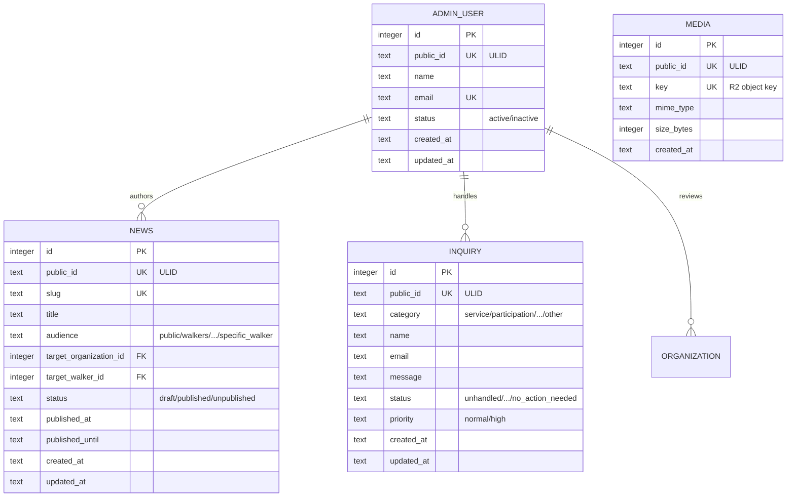

# 07-database-schema.md — データベース物理設計

## このセクションの目的

PRD-02（論理設計）を受けた物理 DB 設計。本プロジェクトは 00_README §0-1 の「パターン A（コンテンツ主体サイト）」の適用範囲を超え、お散歩参加者（Walker）× 保護団体（Organization）の二者間マーケットプレイスを Platform（運営）が仲介する 3 者構造を持つ（`Decided` — GOV-01 D-006）。本書は **CMS 標準テーブル（`admin_users` / `media` / `inquiries`、§4）とマーケットプレイス機能のテーブル群（`walkers` / `organizations` / `dogs` / `walk_slots` / `reservations` / `payments` 等、§5）を並列して持つ** 構造を取る。テンプレート標準のブログ CMS（`posts` / `categories` / `tags` / `post_tags`）は対応画面が無いため採用しない（`Decided` — GOV-01 D-014）。アカウント系統は `admin_users`（`apps/admin`）・`walkers`（`apps/public`、お散歩参加者）・`organization_members`（`apps/public`、保護団体スタッフ）の 3 系統・完全分離（`Decided` — GOV-01 D-004・D-007）。

## 0-H. ハイブリッド編集ガイド（要点）

- 推奨モード: Hybrid（AI 下書き + Tech Lead 確定）
- 人間確認必須: 制約の妥当性、書き込み負荷影響、無停止変更可否

---

## 1. 全体方針

- **DBMS**: Cloudflare D1（SQLite 互換。バインディング名は必ず `DB`。選定理由は DEV-01 §1 参照）
- **文字コード**: SQLite は UTF-8 固定（`utf8mb4` のような明示指定は不要）
- **PK**: `INTEGER PRIMARY KEY AUTOINCREMENT`（SQLite の rowid エイリアス）
- **外部公開 ID**: `public_id TEXT`（ULID、26 文字）を URL・API に露出するテーブルにのみ付与。保護団体・保護犬は SEO・ブランディング目的で `slug` も併用する（旧仕様を踏襲）
- **型の扱い**: SQLite は動的型付け（type affinity）。`VARCHAR(n)` の `n` は強制されないため、本書では列を `TEXT` で宣言し、想定される最大長は備考欄にコメントとして残す。真偽値は `INTEGER`（0/1）、日時は `TEXT`（ISO 8601、例 `strftime('%Y-%m-%dT%H:%M:%fZ','now')`）、緯度経度のような小数値は `REAL` で統一する（MySQL の `DECIMAL(10,7)` からの変換 — DEV-10 §9）
- **タイムスタンプ**: `created_at` / `updated_at` を全テーブルに。SQLite に自動タイムスタンプの機能はないため、`created_at` は `DEFAULT (strftime('%Y-%m-%dT%H:%M:%fZ','now'))` で付与し、`updated_at` は Service 層が更新時に明示的にセットする（自動更新が必要な場合は `AFTER UPDATE` トリガーを個別に用意する）。追記型テーブル（`stripe_event_logs` / `activity_log` / `walker_sessions` / `organization_sessions` 等のログ・セッション系）は `created_at` のみで可
- **テナント境界（本プロジェクト固有）**: Organization 系テーブル（`dogs` / `walk_slots` / `payouts` 等）は `organization_id` を必須化。Walker 系テーブル（`walker_profiles` 等）は `walker_id` を必須化。`reservations` / `incidents` / `adoption_inquiries` は両方のスコープ列を持つ（PRD-02 §2-1・§2-2）。ORM の Global Scope に相当する自動スコープ機構は D1 + Drizzle にはないため、Service 層での明示的な引数要求（`findDogsForOrganization(db, organizationId)` 等）で強制する（§11）
- **論理削除**: 原則使わない（明示的な `status` カラムで管理）
- **決済情報の非保持**: カード番号・銀行口座情報は D1 に保持しない。参加費決済は Stripe Payment Intent、保護団体への還元送金は Stripe Connect（Connected Account への Transfer）に委ね、DB には Stripe 側の ID のみを保持する（`Decided` — GOV-01 D-008、DEV-10 §2）
- **スキーマ管理・ORM**: Drizzle（`drizzle-orm` + `drizzle-kit`、D1/SQLite dialect。決定は DEV-01 §1）を導入する。**本書（DEV-07）の Markdown テーブル定義がスキーマの正本**であり、直接 TypeScript の Drizzle スキーマを手書きしない。`schema-build` スキル（実装済み — DEV-01 §1・§9、`.claude/skills/schema-build/`）が本書の記述から Drizzle スキーマ（TypeScript、`packages/schema/src/schema.ts`）を生成し、そこから `drizzle-kit generate`（`pnpm run db:generate`）が migration SQL（§9）を生成する 2 段階パイプラインとする。本節で定めた型規約（`INTEGER PRIMARY KEY` / `TEXT` / 真偽値は `INTEGER` 0-1 / `REAL`）は D1/SQLite dialect そのものであり、Drizzle 導入後も変わらない
- **マイグレーション**: 前方互換優先。`drizzle-kit generate` が生成する migration SQL（§9）、無停止で完了できる範囲の ALTER に限定する

---

## 2. ERD（Mermaid）

`packages/schema/src/schema.ts`（実体のスキーマ定義、`schema-build` スキルが本書から生成）とは別に、以下は**人間が読むための Markdown/Mermaid 表現**であり、生成元である本書（DEV-07）の記述として Tech Lead が直接更新する。生成方向は本書 → Drizzle スキーマ（TS）→ `drizzle-kit generate`（migration SQL、§9）の一方向（DEV-01 §1・§9）。テーブル数が多いため、CMS 標準ブロックとマーケットプレイス業務ブロックの 2 図に分割する。

### 2-1. CMS 標準ブロック（`apps/admin` が書き込み・`apps/public` が読み取り）

<!-- ERD:START -->



### 2-2. マーケットプレイス業務ブロック（`apps/public` が書き込み・読み取り）

```mermaid
erDiagram
    ORGANIZATION ||--o{ ORGANIZATION_MEMBER : has
    ORGANIZATION ||--o{ INVITATION : sends
    ORGANIZATION ||--o{ DOG : shelters
    ORGANIZATION ||--o{ WALK_SLOT : publishes
    WALK_SLOT ||--o{ WALK_SLOT_DOG : candidates
    DOG ||--o{ WALK_SLOT_DOG : appears_in
    WALK_SLOT ||--o{ RESERVATION : accepts
    WALKER ||--o| WALKER_PROFILE : has
    WALKER ||--o{ RESERVATION : books
    RESERVATION ||--|| PAYMENT : paid_by
    ORGANIZATION ||--o{ PAYOUT : receives
    WALK_SLOT ||--o| WALK_RECORD : recorded_as
    ORGANIZATION ||--o{ INCIDENT : reports
    RESERVATION ||--o| INCIDENT : may_cause
    DOG ||--o{ ADOPTION_INQUIRY : receives
    WALKER ||--o{ ADOPTION_INQUIRY : submits
    WALKER ||--o{ FAVORITE : saves

    ORGANIZATION {
        integer id PK
        text public_id UK "ULID"
        text name
        text slug UK
        text status "pending_review/.../withdrawn"
        text stripe_connect_account_id
        real latitude
        real longitude
        text created_at
        text updated_at
    }
    ORGANIZATION_MEMBER {
        integer id PK
        integer organization_id FK
        text role "org_admin/org_staff"
        text email UK
        text password_hash
        text status "invited/active/suspended"
        text created_at
        text updated_at
    }
    WALKER {
        integer id PK
        text public_id UK "ULID"
        text name
        text email UK
        text password_hash
        text status "active/suspended"
        text created_at
        text updated_at
    }
    WALKER_PROFILE {
        integer id PK
        integer walker_id FK UK
        text status "provisional/.../withdrawn"
        text emergency_contact_name
        text emergency_contact_phone
        text created_at
        text updated_at
    }
    DOG {
        integer id PK
        text public_id UK "ULID"
        integer organization_id FK
        text name
        text adoption_status
        integer walk_eligible
        text created_at
        text updated_at
    }
    WALK_SLOT {
        integer id PK
        text public_id UK "ULID"
        integer organization_id FK
        text start_at
        integer capacity
        text status
        real latitude
        real longitude
        text created_at
        text updated_at
    }
    RESERVATION {
        integer id PK
        text public_id UK "ULID"
        integer walk_slot_id FK
        integer organization_id FK
        integer walker_id FK
        text status
        text created_at
        text updated_at
    }
    PAYMENT {
        integer id PK
        text public_id UK "ULID"
        integer reservation_id FK UK
        integer amount
        text status
        text stripe_payment_intent_id UK
        text created_at
        text updated_at
    }
    PAYOUT {
        integer id PK
        text public_id UK "ULID"
        integer organization_id FK
        text period_start
        text status
        text stripe_transfer_id
        text created_at
        text updated_at
    }

    %% WALK_SLOT_DOG / WALK_RECORD / INCIDENT / ADOPTION_INQUIRY / INVITATION / FAVORITE /
    %% NOTIFICATION_SETTING / NOTIFICATION / STRIPE_EVENT_LOG / NEWS は §5 参照（FAQ は不採用 — §5-22）。
    %% draft.yaml / packages/schema/migrations/ と同期すること（DEV-01 §1・§9）。
```
<!-- ERD:END -->

> **同期ルール**: 上記の `<!-- ERD:START -->` 〜 `<!-- ERD:END -->` ブロックは `packages/schema/migrations/` 配下の SQL と完全に対応すること。テーブル追加・カラム変更・リレーション変更があれば AI が両方を同時に更新する。

---

## 3. テーブル一覧

### 3-1. 認証関連（3 系統・完全分離 — `Decided` GOV-01 D-004・D-007、DEV-02 §1）

D1 セッション + httpOnly 署名クッキー方式。`jose`/JWT・Cloudflare KV 等の外部セッションストアは使わない（DEV-01 §1・§2）。**AdminUser・Walker・OrganizationMember は完全に別系統**（別テーブル・別クッキー名・別実装コード）とする。

| テーブル | 役割 |
| --- | --- |
| `admin_sessions` | `admin_users` 向けセッション。`admin_session` クッキー。列定義は §4-5 |
| `password_reset_tokens` | `admin_users` 向けパスワードリセット。列定義は §4-6 |
| `walker_sessions` | `walkers` 向けセッション。`walker_session` クッキー。列定義は §5-2 |
| `organization_sessions` | `organization_members` 向けセッション。`organization_session` クッキー。列定義は §5-6 |

> `walkers` / `organization_members` 向けのパスワードリセット・招待受諾フローの単発トークン機構は本書時点では `invitations`（§5-7、招待固有）のみを確定済みとし、独立したリセットトークンテーブルの要否は `[Open]`（GOV-02 TBD-47）。実装時は `password_reset_tokens`（§4-6）と同じ Web Crypto HMAC 署名パターンを踏襲する想定。

### 3-2. 標準テーブル（コンテンツ主体サイトの雛形・必須）

本テンプレート標準のテーブルのうち、本プロジェクトでも引き続き使うもの（PRD-02 §6-1 と一致）。ブログ CMS のテーブル群は採用しない（本節末の注記）。

| テーブル | 役割 | 公開 ID |
| --- | --- | :---: |
| `admin_users` | 管理画面ログインユーザー（ロールは単一のため role 列なし） | ○ |
| `media` | アップロードファイルのメタデータ（実体は R2） | ○ |
| `inquiries` | お問い合わせフォームの送信記録（category 列を拡張してマーケットプレイス用途にも流用 — §4-3） | ○ |

> テンプレート標準の `posts` / `categories` / `tags` / `post_tags` は**採用しない**（`Decided` — GOV-01 D-014）。対応する公開画面・管理画面が PRD-04 に 1 つも無い。詳細は §4-2 直前の注記。

### 3-3. 監査ログ

| テーブル | 役割 | 公開 ID |
| --- | --- | :---: |
| `activity_log` | 管理・業務操作の監査ログ（自前テーブル — §4-4）。`causer_type` で `AdminUser` / `OrganizationMember` / `Walker` の 3 系統を判別する |  |

### 3-4. AI 機能テーブル（不採用）

チャット・AI 機能は本プロジェクトでは不採用（`Decided` — GOV-01 D-005）のため、`ai_jobs` / `prompts` / `vector_embeddings` は作成しない。

### 3-5. 軽量 EC テーブル（不採用・対象外）

本テンプレート標準の軽量 EC パターン（`orders` / `order_items`）は本プロジェクトの決済モデルに該当しない。本プロジェクトの資金授受はマーケットプレイス固有の `reservations` / `payments`（Walker の都度課金）と `payouts`（Organization への Stripe Connect 送金）で表現する（§5、`Decided` — GOV-01 D-008）。

### 3-6. アカウント系テーブル（マーケットプレイス、`apps/public`）

| テーブル | 役割 | 公開 ID |
| --- | --- | :---: |
| `walkers` | お散歩参加者の認証アカウント（Organization に非所属のプラットフォーム直属アカウント） | ○ |
| `walker_profiles` | お散歩参加者の拡張プロフィール（`walkers` の 1:1 拡張） | ○ |
| `organizations` | テナント（保護団体） | ○ |
| `organization_members` | 団体スタッフの認証アカウント兼 Organization ロール（`organization_id`・`role` 列を直書き） |  |
| `invitations` | 団体スタッフ招待 | ○ |

### 3-7. プロダクト固有テーブル（マーケットプレイス業務データ、`apps/public`）

| テーブル | 役割 | 公開 ID |
| --- | --- | :---: |
| `dogs` | 保護犬 | ○ |
| `walk_slots` | お散歩募集枠 | ○ |
| `walk_slot_dogs` | お散歩枠と候補犬の中間テーブル |  |
| `reservations` | 予約 | ○ |
| `payments` | 参加費決済記録 | ○ |
| `payouts` | 団体還元・振込集計 | ○ |
| `walk_records` | お散歩実施記録 | ○ |
| `incidents` | 事故・トラブル報告 | ○ |
| `adoption_inquiries` | 里親相談 | ○ |
| `favorites` | お気に入り（団体・保護犬。polymorphic） |  |
| `notification_settings` | 通知種別ごとの ON/OFF 設定（Walker / OrganizationMember 横断） |  |
| `notifications` | アプリ内通知の配信記録（PRD-02 §6-1 Notification に対応。`[Assumed]` 追加 — チャット非採用のため通知はメール + 本テーブルのポーリング取得のみ） | ○ |
| `stripe_event_logs` | Stripe Webhook 冪等性 |  |
| `news` | お知らせ。**D1 に置く**（`Decided` — GOV-01 D-013）。`audience` による配信範囲制御（一般公開/参加者限定/団体限定/特定団体/特定利用者）はログインセッションに依存するためビルド時に解決できず、`target_organization_id`・`target_walker_id` は FK。`published_until` の時限公開も同様（DEV-06 §1-1） | ○ |

---

## 4. 標準テーブル定義

### 4-1. admin_users

| カラム | 型 | NULL | 備考 |
| --- | --- | --- | --- |
| id | INTEGER | NO | PK（AUTOINCREMENT） |
| public_id | TEXT | NO | UNIQUE（ULID, 26 文字） |
| name | TEXT | NO | 最大 255 文字を想定 |
| email | TEXT | NO | UNIQUE、最大 255 文字を想定 |
| password_hash | TEXT | NO | Web Crypto PBKDF2 でハッシュ化（決定済み。DEV-01 §2） |
| status | TEXT | NO | active / inactive |
| last_login_at | TEXT | YES | ISO 8601 |
| created_at | TEXT | NO | DEFAULT (strftime(...)) |
| updated_at | TEXT | NO | Service 層で更新時にセット |

**Index**: UNIQUE(`public_id`), UNIQUE(`email`), `status`

> AdminUser は単一ロール（`admin`）のみで運用し、`role` 列を持たない（`Decided` — GOV-01 D-011、D-004 を置換。旧 D-004 時点の super_admin/support の 2 ロール構成から変更）。
> セッション管理は §4-5 の `admin_sessions` を参照（DEV-02 §1-1）。`admin_users` 自体はセッショントークンを保持しない。

> **`posts` / `categories` / `tags` / `post_tags` は作らない**（`Decided` — GOV-01 D-014）。テンプレート標準のブログ CMS だが、PRD-04 の公開サイトマップ（SCR-01〜45）にも管理画面（SYS-NN）にも対応画面が 1 つも無い。コーポレート発信の記事が必要になった時点で、まず `packages/content` の Content Collections を検討する（DEV-06 §1-1）。

### 4-2. media

| カラム | 型 | NULL | 備考 |
| --- | --- | --- | --- |
| id | INTEGER | NO | PK |
| public_id | TEXT | NO | UNIQUE（ULID） |
| uploader_id | INTEGER | YES | FK → admin_users.id |
| key | TEXT | NO | UNIQUE。R2 のオブジェクトキー（DEV-01 §2。公開 URL は署名付きで発行し、キーをそのまま公開しない） |
| mime_type | TEXT | NO |  |
| size_bytes | INTEGER | NO |  |
| alt_text | TEXT | YES | アクセシビリティ・SEO 用の代替テキスト |
| created_at | TEXT | NO |  |
| updated_at | TEXT | NO |  |

**Index**: UNIQUE(`public_id`), UNIQUE(`key`), `uploader_id`

### 4-3. inquiries

コーポレート発信用のお問い合わせフォームに加え、マーケットプレイス関連の一般的な問い合わせ（旧仕様の `inquiries`）も本テーブルに統合する（`category` 列を拡張）。里親相談は別エンティティ `adoption_inquiries`（§5-16）として区別する（PRD-01 §4 ユビキタス言語）。

| カラム | 型 | NULL | 備考 |
| --- | --- | --- | --- |
| id | INTEGER | NO | PK |
| public_id | TEXT | NO | UNIQUE（ULID） |
| type | TEXT | YES | フォーム種別が複数ある場合のみ（お問い合わせ / 資料請求 等。PRD-02 §6-1） |
| category | TEXT | NO | service / participation / organization_registration / reservation / payment / incident / adoption / other（旧仕様を踏襲。マーケットプレイス問い合わせの分類） |
| name | TEXT | NO |  |
| email | TEXT | NO |  |
| phone | TEXT | YES | 旧仕様の `inquiries.phone` を踏襲 |
| message | TEXT | NO |  |
| status | TEXT | NO | unhandled / in_progress / on_hold / resolved / no_action_needed（PRD-01 §7） |
| priority | TEXT | NO | normal / high（事故・安全関連は high。旧仕様を踏襲） |
| handled_by | INTEGER | YES | FK → admin_users.id（対応担当者） |
| handled_at | TEXT | YES |  |
| created_at | TEXT | NO |  |
| updated_at | TEXT | NO |  |

**Index**: UNIQUE(`public_id`), `status, priority`, `category`, `handled_by`

### 4-4. activity_log（自前テーブル — DEV-01 §2）

専用パッケージは使わず、以下の自前スキーマで監査ログを管理する。3 系統のアカウント（AdminUser / OrganizationMember / Walker）を横断するため `causer_type` で判別する（本プロジェクト固有の要件。単一運営前提のテンプレート標準からの拡張）。

| カラム | 型 | NULL | 備考 |
| --- | --- | --- | --- |
| id | INTEGER | NO | PK |
| log_name | TEXT | YES | ログ種別（content / organization_review / payout / incident 等） |
| description | TEXT | NO | 操作の説明 |
| subject_type | TEXT | YES | 操作対象の種別（`Post` / `Organization` / `Dog` 等） |
| subject_id | INTEGER | YES | 操作対象の ID |
| event | TEXT | YES | post.published / organization.approved / payout.paid 等 |
| causer_type | TEXT | YES | 操作者の種別。`AdminUser` / `OrganizationMember` / `Walker` のいずれか（システム処理時 NULL） |
| causer_id | INTEGER | YES | 操作者の ID（`causer_type` のテーブルに対する ID） |
| organization_id | INTEGER | YES | 操作が Organization に紐づく場合の FK → organizations.id（Platform 横断操作時は NULL。旧仕様の追加カラムを踏襲） |
| properties | TEXT | YES | JSON 文字列。変更前後（`old` / `attributes`）と ip_address / user_agent 等の付帯情報 |
| batch_id | TEXT | YES | 一括操作のグルーピング（UUID） |
| created_at | TEXT | NO |  |

**Index**: `subject_type, subject_id`、`causer_type, causer_id`、`log_name`、`organization_id`

### 4-5. admin_sessions（DEV-02 §1-1）

`admin_users` 向けセッション。ログアウト・強制失効は行削除で即時反映される。

| カラム | 型 | NULL | 備考 |
| --- | --- | --- | --- |
| id | INTEGER | NO | PK |
| admin_user_id | INTEGER | NO | FK → admin_users.id |
| session_token | TEXT | NO | UNIQUE。`admin_session` クッキーに保持する値 |
| expires_at | TEXT | NO | ISO 8601。期限切れ行の削除運用は §10 |
| created_at | TEXT | NO |  |

**Index**: UNIQUE(`session_token`), `admin_user_id`, `expires_at`

### 4-6. password_reset_tokens（DEV-02 §1-1）

`admin_users` 向けパスワードリセット。トークンは Web Crypto の HMAC 署名（`crypto.subtle.sign`）で発行し、値そのものを DB に保持する（`jose` は使わない）。1 回使用したら `used_at` を記録し再利用を防ぐ。

| カラム | 型 | NULL | 備考 |
| --- | --- | --- | --- |
| id | INTEGER | NO | PK |
| admin_user_id | INTEGER | NO | FK → admin_users.id |
| token | TEXT | NO | UNIQUE。リセットリンクに埋め込む値 |
| expires_at | TEXT | NO | ISO 8601。発行から 60 分 |
| used_at | TEXT | YES | 使用済みになった時刻。NULL の間のみ有効なリンクとして扱う |
| created_at | TEXT | NO |  |

**Index**: UNIQUE(`token`), `admin_user_id`, `expires_at`

---

## 5. プロダクト固有テーブル定義

### 5-1. walkers

お散歩参加者の認証アカウント（`apps/public`。本テンプレート標準の `members`/`member_sessions` パターンを踏襲した命名だが、PRD-01・PRD-02 のドメイン用語 `Walker` に合わせ複数形スネークケースで `walkers` とする）。

| カラム | 型 | NULL | 備考 |
| --- | --- | --- | --- |
| id | INTEGER | NO | PK |
| public_id | TEXT | NO | UNIQUE（ULID） |
| name | TEXT | NO | 最大 255 文字を想定 |
| email | TEXT | NO | UNIQUE、最大 255 文字を想定 |
| password_hash | TEXT | NO | Web Crypto PBKDF2 でハッシュ化（admin_users と同じ技術だが実装コードは共有しない） |
| status | TEXT | NO | active / suspended（アカウント自体の状態。予約可否等の詳細な利用資格は `walker_profiles.status` — §5-3 — が担う） |
| stripe_customer_id | TEXT | YES | Stripe Customer ID（決済手段の再利用用。旧仕様の `users.stripe_customer_id` を踏襲） |
| last_login_at | TEXT | YES | ISO 8601 |
| created_at | TEXT | NO |  |
| updated_at | TEXT | NO |  |

**Index**: UNIQUE(`public_id`), UNIQUE(`email`), `status`

> セッション管理は §5-2 の `walker_sessions` を参照。`admin_sessions`（§4-5）とはテーブル・クッキー名・実装コードを一切共有しない（DEV-02 §1-2 の禁止事項）。

### 5-2. walker_sessions

`walkers` 向けセッション。

| カラム | 型 | NULL | 備考 |
| --- | --- | --- | --- |
| id | INTEGER | NO | PK |
| walker_id | INTEGER | NO | FK → walkers.id |
| session_token | TEXT | NO | UNIQUE。`walker_session` クッキーに保持する値 |
| expires_at | TEXT | NO | ISO 8601。期限切れ行の削除運用は §10 |
| created_at | TEXT | NO |  |

**Index**: UNIQUE(`session_token`), `walker_id`, `expires_at`

### 5-3. walker_profiles

お散歩参加者の拡張プロフィール（`walkers` の 1:1 拡張。旧仕様の `walker_profiles` のカラムをそのまま踏襲）。

| カラム | 型 | NULL | 備考 |
| --- | --- | --- | --- |
| id | INTEGER | NO | PK |
| public_id | TEXT | NO | UNIQUE（ULID） |
| walker_id | INTEGER | NO | FK → walkers.id, UNIQUE |
| name_kana | TEXT | YES |  |
| birthdate | TEXT | NO | ISO 8601 日付。年齢確認 |
| gender | TEXT | YES | 任意項目 |
| postal_code | TEXT | YES |  |
| address | TEXT | YES |  |
| phone | TEXT | NO |  |
| phone_verified_at | TEXT | YES |  |
| emergency_contact_name | TEXT | NO |  |
| emergency_contact_phone | TEXT | NO |  |
| dog_experience | INTEGER | NO | DEFAULT 0（犬の飼育経験） |
| large_dog_walk_experience | INTEGER | NO | DEFAULT 0 |
| preferred_area | TEXT | YES | 希望する活動エリア |
| guardian_name | TEXT | YES | 未成年者の保護者氏名 |
| guardian_phone | TEXT | YES | 未成年者の保護者連絡先 |
| terms_agreed_at | TEXT | YES | 利用規約・誓約事項への同意日時 |
| terms_agreed_version | TEXT | YES | 同意した利用規約の版（`packages/content/legal/terms.md` の frontmatter `version`） |
| status | TEXT | NO | provisional / pending_verification / active / restricted / suspended / withdrawn（PRD-01 §7） |
| created_at | TEXT | NO |  |
| updated_at | TEXT | NO |  |

**Index**: UNIQUE(`public_id`), UNIQUE(`walker_id`), `status`

> 日時だけでは「どの版に同意したか」が復元できない。規約改定後に再同意を求める判定（F-01-06）はこの列の比較で行う。規約本文を Content Collections に置く決定（GOV-01 D-013、DEV-06 §1-1）と対で成立する。

### 5-4. organizations

| カラム | 型 | NULL | 備考 |
| --- | --- | --- | --- |
| id | INTEGER | NO | PK |
| public_id | TEXT | NO | UNIQUE（ULID） |
| name | TEXT | NO | 最大 255 文字を想定 |
| name_kana | TEXT | YES |  |
| slug | TEXT | NO | UNIQUE（URL 用、最大 63 文字を想定） |
| org_type | TEXT | YES | NPO法人 / 任意団体 等 |
| has_corporate_status | INTEGER | NO | DEFAULT 0 |
| representative_name | TEXT | NO |  |
| contact_name | TEXT | YES |  |
| postal_code | TEXT | YES |  |
| address | TEXT | YES | 詳細住所（非公開範囲は address_visibility で制御） |
| address_visibility | TEXT | NO | prefecture_only / city_only / reservation_confirmed_only |
| latitude | REAL | YES | ジオコーディング結果（`Decided` — GOV-01 D-009、DEV-10 §9） |
| longitude | REAL | YES | 同上 |
| phone | TEXT | YES |  |
| email | TEXT | YES |  |
| website | TEXT | YES |  |
| sns_links | TEXT | YES | JSON 文字列 |
| activity_area | TEXT | YES |  |
| activity_started_on | TEXT | YES | ISO 8601 日付 |
| introduction | TEXT | YES | 団体紹介文（公開） |
| protected_dog_count | INTEGER | YES |  |
| adoption_track_record | TEXT | YES |  |
| logo_key | TEXT | YES | R2 のオブジェクトキー（`media.key` と同様の規約） |
| status | TEXT | NO | pending_review / under_review / needs_more_info / approved / rejected / suspended / deactivated / withdrawn（PRD-01 §7） |
| reviewed_by | INTEGER | YES | FK → admin_users.id（審査担当の運営スタッフ） |
| reviewed_at | TEXT | YES |  |
| rejection_reason | TEXT | YES |  |
| stripe_connect_account_id | TEXT | YES | Stripe Connect Connected Account ID（還元送金先。銀行口座番号自体は保持しない） |
| created_at | TEXT | NO |  |
| updated_at | TEXT | NO |  |

**Index**: UNIQUE(`public_id`), UNIQUE(`slug`), `status`

### 5-5. organization_members

団体スタッフの認証アカウント兼 Organization ロール（`apps/public`）。旧仕様は専用ロールライブラリの teams 機能でロールを管理していたが、本プロジェクトは自前実装のため `role` 列を直書きする（`Decided` — GOV-01 D-004）。旧仕様と異なり、認証情報（`email` / `password_hash`）自体も本テーブルが保持する独立した認証系統である（PRD-01 §3-1）。

| カラム | 型 | NULL | 備考 |
| --- | --- | --- | --- |
| id | INTEGER | NO | PK |
| organization_id | INTEGER | NO | FK → organizations.id |
| role | TEXT | NO | org_admin / org_staff（`Decided` — GOV-01 D-004） |
| name | TEXT | NO | 最大 255 文字を想定 |
| email | TEXT | NO | UNIQUE、最大 255 文字を想定 |
| password_hash | TEXT | NO | Web Crypto PBKDF2 でハッシュ化 |
| status | TEXT | NO | invited / active / suspended |
| joined_at | TEXT | NO |  |
| left_at | TEXT | YES | 退会時の記録 |
| created_at | TEXT | NO |  |
| updated_at | TEXT | NO |  |

**Index**: UNIQUE(`email`), `organization_id, status`

> ロール変更は `role` 列を Service 層の遷移関数経由で更新する（DEV-01 §4）。1 スタッフが複数 Organization に所属する運用は MVP では対象外（PRD-02 §2-3）。

### 5-6. organization_sessions

`organization_members` 向けセッション。

| カラム | 型 | NULL | 備考 |
| --- | --- | --- | --- |
| id | INTEGER | NO | PK |
| organization_member_id | INTEGER | NO | FK → organization_members.id |
| session_token | TEXT | NO | UNIQUE。`organization_session` クッキーに保持する値 |
| expires_at | TEXT | NO | ISO 8601。期限切れ行の削除運用は §10 |
| created_at | TEXT | NO |  |

**Index**: UNIQUE(`session_token`), `organization_member_id`, `expires_at`

### 5-7. invitations

| カラム | 型 | NULL | 備考 |
| --- | --- | --- | --- |
| id | INTEGER | NO | PK |
| public_id | TEXT | NO | UNIQUE（ULID） |
| organization_id | INTEGER | NO | FK → organizations.id |
| email | TEXT | NO |  |
| role | TEXT | NO | org_admin / org_staff |
| token | TEXT | NO | UNIQUE |
| inviter_id | INTEGER | NO | FK → organization_members.id（招待した org_admin） |
| status | TEXT | NO | pending / accepted / expired（デフォルト pending） |
| expires_at | TEXT | NO |  |
| accepted_at | TEXT | YES |  |
| created_at | TEXT | NO |  |
| updated_at | TEXT | NO |  |

**Index**: UNIQUE(`public_id`), UNIQUE(`token`), `organization_id`, `email`, `status`

### 5-8. dogs

| カラム | 型 | NULL | 備考 |
| --- | --- | --- | --- |
| id | INTEGER | NO | PK |
| public_id | TEXT | NO | UNIQUE（ULID） |
| organization_id | INTEGER | NO | FK → organizations.id |
| slug | TEXT | NO | UNIQUE（公開 URL 用、最大 80 文字を想定） |
| name | TEXT | NO | 最大 100 文字を想定 |
| breed | TEXT | YES |  |
| size | TEXT | YES | small / medium / large |
| weight | REAL | YES | kg |
| gender | TEXT | YES |  |
| estimated_age | TEXT | YES | 年齢・推定年齢 |
| temperament | TEXT | YES | 性格（公開） |
| human_sociability | TEXT | YES | 人慣れ状況（公開） |
| dog_sociability | TEXT | YES | 犬慣れ状況（公開） |
| walk_notes | TEXT | YES | 散歩時の特徴（公開） |
| required_experience | TEXT | NO | none / some / experienced |
| beginner_allowed | INTEGER | NO | DEFAULT 1 |
| child_allowed | INTEGER | NO | DEFAULT 0 |
| multi_dog_allowed | INTEGER | NO | DEFAULT 1 |
| walk_eligible | INTEGER | NO | DEFAULT 1（お散歩参加可否） |
| adoption_status | TEXT | NO | not_listed / listed / in_consultation / in_trial / adopted / listing_closed（PRD-01 §7） |
| introduction | TEXT | YES | 公開用紹介文 |
| photo_key | TEXT | YES | R2 のオブジェクトキー |
| internal_notes | TEXT | YES | **非公開**: 健康状態・既往歴・投薬・ワクチン・去勢避妊・咬傷逃走注意事項・散歩中止条件。org_staff 以上のみ閲覧可（Service 層の認可チェックで強制） |
| is_published | INTEGER | NO | DEFAULT 0 |
| created_at | TEXT | NO |  |
| updated_at | TEXT | NO |  |

**Index**: UNIQUE(`public_id`), UNIQUE(`slug`), `organization_id, is_published`, `adoption_status`, `walk_eligible`

### 5-9. walk_slots

| カラム | 型 | NULL | 備考 |
| --- | --- | --- | --- |
| id | INTEGER | NO | PK |
| public_id | TEXT | NO | UNIQUE（ULID） |
| organization_id | INTEGER | NO | FK → organizations.id |
| title | TEXT | NO | 最大 255 文字を想定 |
| description | TEXT | YES | お散歩コース等 |
| start_at | TEXT | NO | 開催日時（ISO 8601） |
| acceptance_start_at | TEXT | NO | 受付開始日時 |
| acceptance_end_at | TEXT | NO | 受付終了日時 |
| duration_minutes | INTEGER | NO | 所要時間 |
| meeting_place | TEXT | NO | 集合場所 |
| area_prefecture | TEXT | NO | 検索用（都道府県） |
| area_city | TEXT | YES | 検索用（市区町村） |
| latitude | REAL | YES | 距離検索用（`Decided` — GOV-01 D-009、DEV-10 §9） |
| longitude | REAL | YES | 同上 |
| capacity | INTEGER | NO | 定員 |
| reserved_count | INTEGER | NO | DEFAULT 0（予約確定人数の集計。Reservation の作成・キャンセルに合わせて Service 層で更新） |
| fee_per_person | INTEGER | NO | DEFAULT 500（参加費。円） |
| staff_accompanied | INTEGER | NO | DEFAULT 1 |
| beginner_allowed | INTEGER | NO | DEFAULT 1 |
| child_allowed | INTEGER | NO | DEFAULT 0 |
| min_age | INTEGER | YES | 参加可能年齢の下限 |
| required_experience | TEXT | NO | none / some / experienced |
| clothing_notes | TEXT | YES | 服装・持ち物 |
| precautions | TEXT | YES | 注意事項 |
| weather_policy | TEXT | YES | 雨天時の対応 |
| cancellation_policy | TEXT | YES | キャンセル条件 |
| status | TEXT | NO | draft / scheduled / open / full / closed / cancelled / completed / unpublished（PRD-01 §7） |
| created_at | TEXT | NO |  |
| updated_at | TEXT | NO |  |

**Index**: UNIQUE(`public_id`), `organization_id, status`, `area_prefecture, start_at`, `status, start_at`

### 5-10. walk_slot_dogs

| カラム | 型 | NULL | 備考 |
| --- | --- | --- | --- |
| id | INTEGER | NO | PK |
| walk_slot_id | INTEGER | NO | FK → walk_slots.id |
| dog_id | INTEGER | NO | FK → dogs.id |
| created_at | TEXT | NO |  |

**Index**: UNIQUE(`walk_slot_id`, `dog_id`), `dog_id`

### 5-11. reservations

| カラム | 型 | NULL | 備考 |
| --- | --- | --- | --- |
| id | INTEGER | NO | PK |
| public_id | TEXT | NO | UNIQUE（ULID） |
| walk_slot_id | INTEGER | NO | FK → walk_slots.id |
| organization_id | INTEGER | NO | FK → organizations.id（walk_slot から非正規化。団体スタッフ側の絞込用） |
| walker_id | INTEGER | NO | FK → walkers.id |
| participant_count | INTEGER | NO | DEFAULT 1 |
| emergency_contact_name_snapshot | TEXT | NO | 予約時点の緊急連絡先スナップショット |
| emergency_contact_phone_snapshot | TEXT | NO | 同上 |
| status | TEXT | NO | processing / awaiting_payment / confirmed / organization_reviewing / scheduled / completed / cancelled_by_walker / cancelled_by_organization / cancelled_by_platform / no_show / cancelled_weather / cancelled_dog_condition（PRD-01 §7） |
| cancelled_reason | TEXT | YES |  |
| cancelled_at | TEXT | YES |  |
| created_at | TEXT | NO |  |
| updated_at | TEXT | NO |  |

**Index**: UNIQUE(`public_id`), `organization_id, status`, `walker_id`, `walk_slot_id`

### 5-12. payments

| カラム | 型 | NULL | 備考 |
| --- | --- | --- | --- |
| id | INTEGER | NO | PK |
| public_id | TEXT | NO | UNIQUE（ULID） |
| reservation_id | INTEGER | NO | FK → reservations.id, UNIQUE（1 Reservation につき 1 Payment） |
| amount | INTEGER | NO | 税込円（participant_count × fee_per_person） |
| organization_share_amount | INTEGER | NO | 団体還元対象額 |
| platform_fee_amount | INTEGER | NO | システム利用料 |
| currency | TEXT | NO | DEFAULT 'JPY' |
| status | TEXT | NO | unpaid / processing / paid / failed / refund_processing / refunded / partially_refunded（PRD-01 §7、Stripe の状態と整合 — DEV-10 §2） |
| stripe_payment_intent_id | TEXT | YES | UNIQUE |
| stripe_checkout_session_id | TEXT | YES |  |
| paid_at | TEXT | YES |  |
| refunded_at | TEXT | YES |  |
| refund_amount | INTEGER | YES |  |
| failure_reason | TEXT | YES |  |
| created_at | TEXT | NO |  |
| updated_at | TEXT | NO |  |

**Index**: UNIQUE(`public_id`), UNIQUE(`reservation_id`), `status`, UNIQUE(`stripe_payment_intent_id`)

### 5-13. payouts

| カラム | 型 | NULL | 備考 |
| --- | --- | --- | --- |
| id | INTEGER | NO | PK |
| public_id | TEXT | NO | UNIQUE（ULID） |
| organization_id | INTEGER | NO | FK → organizations.id |
| period_start | TEXT | NO | 集計対象期間の開始（ISO 8601 日付） |
| period_end | TEXT | NO | 集計対象期間の終了 |
| total_reservations | INTEGER | NO | DEFAULT 0 |
| total_participants | INTEGER | NO | DEFAULT 0 |
| gross_amount | INTEGER | NO | 団体還元対象額の合計 |
| adjustment_amount | INTEGER | NO | DEFAULT 0（返金・組戻し等の調整。マイナス可） |
| payout_amount | INTEGER | NO | gross_amount + adjustment_amount |
| status | TEXT | NO | uncollected / aggregating / confirmed / scheduled / paid / on_hold / failed（PRD-01 §7、Stripe Connect の Transfer 状態と整合 — DEV-10 §2） |
| stripe_transfer_id | TEXT | YES | Stripe Connect Transfer ID |
| scheduled_at | TEXT | YES |  |
| paid_at | TEXT | YES |  |
| notes | TEXT | YES |  |
| created_at | TEXT | NO |  |
| updated_at | TEXT | NO |  |

**Index**: UNIQUE(`public_id`), `organization_id, period_start`, `status`

> 月次集計は Cloudflare Cron Triggers（`apps/admin` の Scheduled Worker）で実行する（`Decided` — GOV-01 D-010）。

### 5-14. walk_records

| カラム | 型 | NULL | 備考 |
| --- | --- | --- | --- |
| id | INTEGER | NO | PK |
| public_id | TEXT | NO | UNIQUE（ULID） |
| walk_slot_id | INTEGER | NO | FK → walk_slots.id, UNIQUE |
| conducted | INTEGER | NO | 実施・中止（0/1） |
| conducted_at | TEXT | YES |  |
| staff_in_charge_id | INTEGER | YES | FK → organization_members.id（担当スタッフ） |
| dogs_walked | TEXT | YES | JSON 文字列。実施時に担当した dog_id の配列 |
| photo_keys | TEXT | YES | JSON 文字列。R2 のオブジェクトキー配列 |
| staff_comment | TEXT | YES | 参加者へのコメント |
| incident_flag | INTEGER | NO | DEFAULT 0（事故・トラブルの有無） |
| created_at | TEXT | NO |  |
| updated_at | TEXT | NO |  |

**Index**: UNIQUE(`public_id`), UNIQUE(`walk_slot_id`)

### 5-15. incidents

事故・トラブルの報告者は Walker / OrganizationMember / AdminUser のいずれもありうるため、`activity_log.causer_type`（§4-4）と同様のポリモーフィック列（`reported_by_type` / `reported_by_id`）で表現する（`[Assumed]` 拡張。旧仕様は単一 `users` テーブル前提で `reported_by` 単一列だった）。

| カラム | 型 | NULL | 備考 |
| --- | --- | --- | --- |
| id | INTEGER | NO | PK |
| public_id | TEXT | NO | UNIQUE（ULID） |
| organization_id | INTEGER | NO | FK → organizations.id |
| reservation_id | INTEGER | YES | FK → reservations.id |
| dog_id | INTEGER | YES | FK → dogs.id |
| walker_id | INTEGER | YES | FK → walkers.id |
| severity | TEXT | NO | P0 / P1 / P2 / P3（OPS-02 §2-1 の重大度定義と整合） |
| category | TEXT | NO | bite / escape / injury / dog_condition / walker_condition / property_damage / interpersonal_trouble / unauthorized_photo / harassment / other |
| description | TEXT | NO |  |
| occurred_at | TEXT | NO |  |
| location | TEXT | YES |  |
| reported_by_type | TEXT | NO | walker / organization_member / admin_user |
| reported_by_id | INTEGER | NO | `reported_by_type` のテーブルに対する ID |
| status | TEXT | NO | reported / investigating / in_progress / resolved / closed（PRD-01 §7） |
| prevention_measures | TEXT | YES |  |
| attachment_keys | TEXT | YES | JSON 文字列。R2 のオブジェクトキー配列 |
| resolved_at | TEXT | YES |  |
| created_at | TEXT | NO |  |
| updated_at | TEXT | NO |  |

**Index**: UNIQUE(`public_id`), `organization_id, status`, `severity`

### 5-16. adoption_inquiries

| カラム | 型 | NULL | 備考 |
| --- | --- | --- | --- |
| id | INTEGER | NO | PK |
| public_id | TEXT | NO | UNIQUE（ULID） |
| dog_id | INTEGER | NO | FK → dogs.id |
| organization_id | INTEGER | NO | FK → organizations.id（dog から非正規化） |
| walker_id | INTEGER | NO | FK → walkers.id |
| motivation | TEXT | NO | 希望理由 |
| living_environment | TEXT | NO | 飼育環境 |
| status | TEXT | NO | received / organization_reviewing / contacted / interview_scheduled / transferred_to_organization_process / closed / withdrawn（PRD-01 §7） |
| organization_contacted_at | TEXT | YES |  |
| closed_at | TEXT | YES |  |
| created_at | TEXT | NO |  |
| updated_at | TEXT | NO |  |

**Index**: UNIQUE(`public_id`), `organization_id, status`, `dog_id`, `walker_id`

### 5-17. favorites

| カラム | 型 | NULL | 備考 |
| --- | --- | --- | --- |
| id | INTEGER | NO | PK |
| walker_id | INTEGER | NO | FK → walkers.id |
| favoritable_type | TEXT | NO | Organization / Dog（polymorphic） |
| favoritable_id | INTEGER | NO |  |
| created_at | TEXT | NO |  |

**Index**: UNIQUE(`walker_id`, `favoritable_type`, `favoritable_id`)

### 5-18. notification_settings

通知の宛先は Walker / OrganizationMember の 2 系統にまたがるため、`subject_type` / `subject_id` のポリモーフィック列で表現する（旧仕様は単一 `users` テーブル前提で `user_id` 単一列だった。PRD-02 §6-1 の `Notification.recipientType` と同じパターン）。

| カラム | 型 | NULL | 備考 |
| --- | --- | --- | --- |
| id | INTEGER | NO | PK |
| subject_type | TEXT | NO | walker / organization_member |
| subject_id | INTEGER | NO | `subject_type` のテーブルに対する ID |
| notification_type | TEXT | NO | reservation / payout / news 等 |
| email_enabled | INTEGER | NO | DEFAULT 1 |
| app_enabled | INTEGER | NO | DEFAULT 1 |
| created_at | TEXT | NO |  |
| updated_at | TEXT | NO |  |

**Index**: UNIQUE(`subject_type`, `subject_id`, `notification_type`)

### 5-19. notifications（`[Assumed]` 追加 — PRD-02 §6-1 Notification に対応）

アプリ内通知の配信記録。チャット・リアルタイム通信は不採用（`Decided` — GOV-01 D-005）のため、通知はメール送信 + 本テーブルのポーリング取得のみで実現する。

| カラム | 型 | NULL | 備考 |
| --- | --- | --- | --- |
| id | INTEGER | NO | PK |
| public_id | TEXT | NO | UNIQUE（ULID） |
| recipient_type | TEXT | NO | walker / organization_member |
| recipient_id | INTEGER | NO | `recipient_type` のテーブルに対する ID |
| type | TEXT | NO | reservation_confirmed / payout_paid / news_published 等（`notification_settings.notification_type` と対応） |
| payload | TEXT | NO | JSON 文字列（表示内容・リンク先等） |
| read_at | TEXT | YES |  |
| created_at | TEXT | NO |  |

**Index**: UNIQUE(`public_id`), `recipient_type, recipient_id, read_at`

### 5-20. stripe_event_logs

| カラム | 型 | NULL | 備考 |
| --- | --- | --- | --- |
| id | INTEGER | NO | PK |
| stripe_event_id | TEXT | NO | UNIQUE |
| event_type | TEXT | NO |  |
| payload | TEXT | NO | JSON 文字列 |
| processed_at | TEXT | YES |  |
| created_at | TEXT | NO |  |

**Index**: UNIQUE(`stripe_event_id`)

> Webhook の冪等性確保に必要（Payment Intent・Stripe Connect Transfer 双方のイベントを扱う — DEV-10 §2）。

### 5-21. news

お知らせ。`audience` による配信範囲制御と `published_until` の時限公開を持つため D1 に置く（`Decided` — GOV-01 D-013、DEV-06 §1-1）。テンプレート標準のブログ CMS（`posts`）は採用していないため（§4-2 直前の注記）、本テーブルが公開サイト唯一の記事型コンテンツとなる。

| カラム | 型 | NULL | 備考 |
| --- | --- | --- | --- |
| id | INTEGER | NO | PK |
| public_id | TEXT | NO | UNIQUE（ULID） |
| slug | TEXT | NO | UNIQUE（最大 120 文字を想定） |
| title | TEXT | NO | 最大 255 文字を想定 |
| body | TEXT | NO |  |
| audience | TEXT | NO | public / walkers / organizations / all_registered / specific_organization / specific_walker |
| target_organization_id | INTEGER | YES | FK → organizations.id（audience = specific_organization の場合） |
| target_walker_id | INTEGER | YES | FK → walkers.id（audience = specific_walker の場合） |
| is_important | INTEGER | NO | DEFAULT 0 |
| status | TEXT | NO | draft / published / unpublished |
| published_at | TEXT | YES |  |
| published_until | TEXT | YES |  |
| created_at | TEXT | NO |  |
| updated_at | TEXT | NO |  |

**Index**: UNIQUE(`public_id`), UNIQUE(`slug`), `status, published_at`

### 5-22. faqs（不採用）

**FAQ はテーブルを作らない**（`Decided` — GOV-01 D-013）。全閲覧者に同一内容で他テーブルとの関係も無く、`/faq`（SCR-36）の 1 表示ごとに全行を読み取るコストに見合わないため、`apps/public/src/pages/faq.astro` に直書きする（DEV-06 §1-1）。FAQ 管理画面（旧 SYS-26〜28）も作らない — 削除に伴い PRD-04 の後続画面を繰り上げているため、現在の SYS-26〜28 はお問い合わせ一覧・詳細と管理操作履歴を指す。

運営がデプロイなしで FAQ を更新したいという要求が実際に出た時点で D1 へ移す（GOV-02 TBD-41）。その際は `id` / `public_id` / `question` / `body` / `category` / `sort_order` / `is_published` / `created_at` / `updated_at` の構成を想定する。

---

## 6. AI 機能テーブル（不採用）

チャット・AI 機能は不採用（`Decided` — GOV-01 D-005）。`ai_jobs` / `prompts` / `vector_embeddings` は作成しない。将来 AI 機能の採用を検討する場合は GOV-02 に起票の上、GOV-01 で決定してから本節を埋める。

---

## 7. 軽量 EC テーブル（対象外）

本テンプレート標準の軽量 EC パターン（`orders` / `order_items`）は本プロジェクトでは使わない。参加費の都度課金は `payments`（§5-12）、保護団体への還元送金は `payouts`（§5-13）という、マーケットプレイス固有の別体系で実装する（`Decided` — GOV-01 D-008）。

---

## 8. インデックス設計方針

| 区分 | 方針 |
| --- | --- |
| 必須 | 外部キー全カラム、`public_id`、`status` |
| テナント分離 | Organization 系テーブルは `organization_id`、Walker 系テーブルは `walker_id` を先頭に配置した複合インデックスを基本とする |
| 検索性能 | `walk_slots` は `area_prefecture, start_at` / `status, start_at` の複合インデックスでエリア・日付検索を高速化（DEV-10 §9 の距離検索は緯度経度の範囲絞り込み後に Haversine 計算する前提） |
| 複合インデックス | クエリパターンを `EXPLAIN QUERY PLAN` で確認しながら追加 |
| 過剰防止 | 書き込み多発テーブル（`activity_log` / `walk_slots.reserved_count` 更新等）は最小限に |
| 全文検索 | D1 の FTS5 virtual table を第一候補とする。MySQL FULLTEXT 相当の機能は使わない。本プロジェクトは全文検索を MVP で採用しない |

### 8-1. 標準命名規則

- `idx_<table>_<column>` ：単一カラム
- `idx_<table>_<col1>_<col2>` ：複合カラム
- `uq_<table>_<column>` ：UNIQUE
- 外部キーは SQLite の `FOREIGN KEY` 制約として定義（D1 は既定で外部キー制約が有効）

---

## 9. マイグレーション運用

| 項目 | 方針 |
| --- | --- |
| ツール | 手書きの migration SQL は作らない。**本書（DEV-07）のテーブル定義が正本** → `schema-build` スキル（実装済み — DEV-01 §1・§9、`.claude/skills/schema-build/`）が Drizzle スキーマ（TS、`packages/schema/src/schema.ts`）を生成 → `pnpm run db:generate`（`drizzle-kit generate`、`packages/schema` で実行）が migration SQL（`packages/schema/migrations/NNNN_<name>.sql`）を生成 → `wrangler d1 migrations apply <DB名>` で適用する、という 3 段階のパイプライン |
| 実行元 | `apps/admin` からのみ実行する（CLAUDE.md の D1/R2 ルール参照。`apps/public` から migration を作らない・適用しない）。`packages/schema` は共有パッケージだが migration の生成・適用は `apps/admin` 単独の責務 |
| 命名規則 | `drizzle-kit generate` が振る連番プレフィックス + 内容を表す名前 |
| 環境差分 | 全環境で同一 migration を順に適用（drift 禁止） |
| ロールバック | D1 migrations は前方適用のみで自動ロールバックは無い。取り消しが必要な場合は、本書のテーブル定義を戻した上で `schema-build` → `drizzle-kit generate` を再実行し、打ち消し用の新しい migration を追加する |
| 大きな変更 | ALTER の実行時間を試算し、無停止で完了できる範囲に分割する（§9-1）。特に `reservations` / `payments` / `walk_slots` は書き込み頻度が高いため慎重に段階分けする |
| シーダー | 初期データ投入用スクリプトは `apps/admin/scripts/` に置く。アカウント投入は `apps/admin/scripts/seed-user.mjs` を実装済みで、`pnpm --filter admin seed -- --table=admin_users --email=… --password=… --name=…` で実行する（値は `=` で渡す — 空白区切りは不可）。スクリプトの `TABLES` 定数は現在テンプレート標準の `admin_users` / `members` を受け付けるため、`members` → `walkers` の改称（§5-1）を反映する際に併せて書き換える。他のマスタデータが必要になったら同じスクリプトパターンで追加する |

### 9-1. 無停止変更の段階的アプローチ

```
カラム追加：
1. 本書（DEV-07）に NULL 許容の列として追記 → schema-build → drizzle-kit generate で無停止の ALTER を生成
2. アプリケーションコードで値を書き込むよう変更
3. backfill バッチで既存レコードを埋める
4. NOT NULL 制約が必要な場合は、新テーブルを作って移行する
   （SQLite は列に NOT NULL を後付けする ALTER をサポートしないため、
   `CREATE TABLE new_xxx` → `INSERT ... SELECT` → リネームの手順が必要。
   本書のテーブル定義・Drizzle スキーマ双方をこの新テーブル定義に合わせて更新する）
```

---

## 10. データ保管期限の運用

保持期間の論理的な正本は PRD-02 §8。削除バッチの運用（Cloudflare Cron Triggers、`apps/admin` の Scheduled Worker）は OPS-02 §4-3 参照（`Decided` — GOV-01 D-010）。

| データ | 期限 | 削除方式 |
| --- | --- | --- |
| News（`news`、unpublished） | 永続（公開資産として） | 削除は明示操作のみ |
| 添付ファイル（`media`、R2） | 参照が切れてから 90 日 | 孤立状態が続いたら日次バッチで R2 オブジェクトと `media` 行を物理削除 |
| Inquiry（`inquiries`） | 1 年 | 1 年経過後に物理削除（個人情報を含むため） |
| AdminUser（退職/契約終了、`admin_users`） | 1 年 | 1 年経過後に匿名化 or 削除 |
| `admin_sessions` / `walker_sessions` / `organization_sessions`（期限切れ） | 有効期限（`expires_at`）切れ後速やかに | 期限切れ行を日次バッチで物理削除。ログアウト・強制失効は即時の行削除で対応。3 テーブルとも独立運用（取り消しも独立） |
| Walker（退会、`walkers` / `walker_profiles`） | 1 年、または法令・契約上必要な期間 | 1 年経過後に匿名化 or 削除。パスワードハッシュ以外の平文パスワードは保持しない |
| Reservation / Payment（決済関連） | 決済日から 7 年（帳簿書類保存の一般的な実務慣行）`[Assumed: 確認先: 税理士]` | 保持期間経過後に物理削除 |
| Payout（振込記録） | 同上（7 年） | 同上 |
| Dog / WalkSlot | Organization の掲載終了後 1 年 | 1 年経過で物理削除。掲載終了時に `unpublished` / `closed` へ遷移 |
| WalkRecord（写真含む） | Organization の掲載終了後 1 年 | 同上 |
| Incident（事故・トラブル） | `[Open]`（GOV-02 TBD-22。暫定 5 年） | 保持期間経過後に物理削除 |
| AdoptionInquiry | `[Open]`（GOV-02 TBD-33。暫定 3 年） | 保持期間経過後に物理削除。相談終了・取下げ時にステータス変更 |
| Invitation（`invitations`） | 30 日 | 失効後物理削除 |
| 監査ログ（`activity_log`） | 永続 | 削除不可 |
| Notification（`notifications`） | 90 日 | 90 日で物理削除 |

---

## 11. D1 アクセス規約

- ORM は Drizzle（決定済み — `drizzle-orm` + `drizzle-kit`、D1/SQLite dialect。DEV-01 §1）。全クエリは Drizzle のクエリビルダ経由で発行し（内部でプレースホルダ付きのプリペアドステートメントにコンパイルされる）、文字列連結による SQL 構築を禁止する。Drizzle のクエリビルダで表現しづらい特殊なクエリ（Haversine 距離計算 — DEV-10 §9 等）に限り `env.DB.prepare(sql).bind(...)` の直書きを許容するが、この場合もプレースホルダ必須とする
- **ロール認可チェック**（`org_admin` / `org_staff`）は Service 層の共通ヘルパー（`requireRole(session, "org_admin" | "org_staff")` 等）で明示的に強制する（DEV-01 §4「認可チェックの徹底」）。`apps/admin` の AdminUser は単一ロール（`admin`）のため `role` 列を持たず、認可チェックは `requireSession` によるログイン確認のみで足りる（`Decided` — GOV-01 D-011、D-004 を置換）
- **テナント境界の強制**（本プロジェクト固有）: Organization 系のクエリ関数は `organizationId` を、Walker 系のクエリ関数は `walkerId` を必須引数とし、省略できるオーバーロードは作らない。`requireOrganizationMember(session, organizationId)` / `requireWalker(session, walkerId)` のような検証関数で操作対象が現在のセッションの Organization / Walker 本人と一致することを確認する。横断アクセスは AdminUser（単一ロール `admin`。`Decided` — GOV-01 D-011、D-004 を置換）のみ許可する（PRD-02 §2-2）
- 型安全性は Drizzle が `$inferSelect` / `$inferInsert` から自動導出する TypeScript の型で確保する。クエリ結果の戻り値型を別途手書きしない。入力検証（Zod）も `drizzle-zod` でこの型から導出することを優先する
- JSON 列（`sns_links` / `dogs_walked` / `photo_keys` / `attachment_keys` / `payload` 等）は `json_extract()` / `json_set()` 等の SQLite JSON1 関数でアクセスし、アプリ側でのパース前提の設計にしない
- 状態（`status`）を持つテーブルは、遷移を単一の遷移関数経由に限定する（DEV-01 §4、DEV-09）
- Drizzle スキーマ（`packages/schema/src/schema.ts`）は本書の生成物であり、直接手で書き換えない。変更が必要な場合は必ず本書（DEV-07）のテーブル定義を先に更新し、`schema-build` スキルで再生成する

---

## 12. 記入時チェックポイント

- 標準テーブル（§3-2: `admin_users` / `media` / `inquiries`）が全て揃っているか。不採用とした `posts` / `categories` / `tags` / `post_tags` / `faqs` が復活していないか（GOV-01 D-013・D-014）
- マーケットプレイス系のアカウント標準テーブル（§3-1・§3-6: `walkers` / `walker_sessions` / `walker_profiles` / `organizations` / `organization_members` / `organization_sessions` / `invitations`）が全て揃っているか
- `admin_users` / `walkers` / `organization_members` が完全に別テーブル・別セッション（`admin_sessions` / `walker_sessions` / `organization_sessions`）の 3 系統として記述されており、単一の User テーブルに退行していないか（GOV-01 D-004・D-007）
- Organization 系テーブルに `organization_id`、Walker 系テーブルに `walker_id` があるか。両方を持つべきテーブル（`reservations` / `incidents` / `adoption_inquiries`）が両方持っているか
- インデックスがテナント境界・検索パターンを考慮した複合構成になっているか
- 状態を持つテーブルの状態値が PRD-01 §7・DEV-09 と整合しているか
- 決済情報（カード番号・銀行口座）を保持していないか（Stripe / Stripe Connect の ID のみ保持）
- `activity_log` の `causer_type` が `AdminUser` / `OrganizationMember` / `Walker` の 3 系統を判別できるか
- `news` を D1 に置いた理由（`audience` による出し分け・`published_until`）と、FAQ・利用規約等を D1 に置かない理由が DEV-06 §1-1 と整合しているか
- `walker_profiles.terms_agreed_version` があり、`packages/content/legal/terms.md` の frontmatter `version` と対応が取れているか
- `inquiries` の `category` 拡張が本書に明記されているか
- 型が SQLite の affinity（INTEGER / TEXT / REAL）で一貫しているか（MySQL 型・MySQL の DECIMAL 等の書き残しがないか）
- Drizzle スキーマ（`packages/schema/src/schema.ts`）が本書のテーブル定義と完全に一致しているか（本書が正本。`schema-build` スキル実行後は差分がないことを確認する）
- マイグレーション運用ルールが OPS-02（運用ハンドブック）と整合しているか
- エンティティ名が PRD-01 §3・PRD-02 §6 と一致しているか（`Walker` エンティティが本書の `walkers` テーブルに対応しているか）
