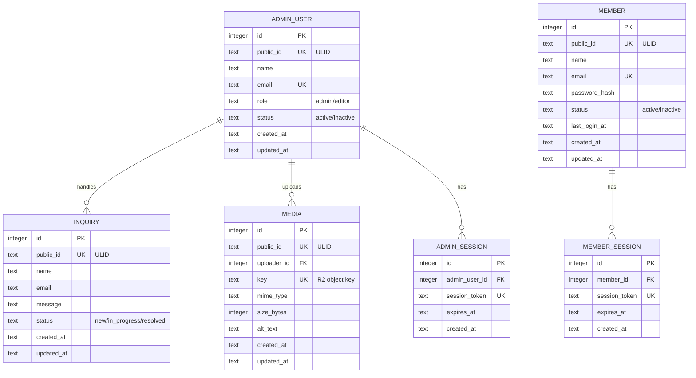

# 07-database-schema.md — データベース物理設計テンプレート

## このセクションの目的

PRD-02（論理設計）を受けた物理 DB 設計。**コンテンツ主体サイトの標準テーブル（`admin_users` / `members` / `media` / `inquiries`）と、採用時のみ追加するオプションテーブル（軽量 EC / AI 機能）、プロダクト固有テーブルの並列構造** を提供する。本テンプレートは単一運営（マルチテナントではない）が前提のため、`organizations` / `memberships` / `invitations` / `subscriptions` / `payments` のようなテナント課金テーブルは持たない（00_README §0-1・§2-2、PRD-01 §6、PRD-02 §2）。

## 0-H. ハイブリッド編集ガイド（要点）

- 推奨モード: Hybrid（AI 下書き + Tech Lead 確定）
- 人間確認必須: 制約の妥当性、書き込み負荷影響、無停止変更可否

---

## 1. 全体方針

- **DBMS**: Cloudflare D1（SQLite 互換。バインディング名は必ず `DB`。選定理由は DEV-01 §1 参照）
- **文字コード**: SQLite は UTF-8 固定（`utf8mb4` のような明示指定は不要）
- **PK**: `INTEGER PRIMARY KEY AUTOINCREMENT`（SQLite の rowid エイリアス）
- **外部公開 ID**: `public_id TEXT`（ULID、26 文字）を URL・API に露出するテーブルにのみ付与
- **型の扱い**: SQLite は動的型付け（type affinity）。`VARCHAR(n)` の `n` は強制されないため、本書では列を `TEXT` で宣言し、想定される最大長は備考欄にコメントとして残す。真偽値は `INTEGER`（0/1）、日時は `TEXT`（ISO 8601、例 `strftime('%Y-%m-%dT%H:%M:%fZ','now')`）で統一する
- **タイムスタンプ**: `created_at` / `updated_at` を全テーブルに。SQLite に Eloquent の自動タイムスタンプ相当の機能はないため、`created_at` は `DEFAULT (strftime('%Y-%m-%dT%H:%M:%fZ','now'))` で付与し、`updated_at` は Service 層が更新時に明示的にセットする（自動更新が必要な場合は `AFTER UPDATE` トリガーを個別に用意する）。追記型テーブル（`stripe_event_logs` / `activity_log` 等のログ系）は `created_at` のみで可
- **論理削除**: 原則使わない（明示的な `status` カラムで管理）
- **スキーマ管理・ORM**: Drizzle（`drizzle-orm` + `drizzle-kit`、D1/SQLite dialect。決定は DEV-01 §1）を導入する。**本書（DEV-07）の Markdown テーブル定義がスキーマの正本**であり、直接 TypeScript の Drizzle スキーマを手書きしない。`schema-build` スキル（実装済み — DEV-01 §1・§9、`.claude/skills/schema-build/`）が本書の記述から Drizzle スキーマ（TypeScript、`packages/schema/src/schema.ts`）を生成し、そこから `drizzle-kit generate`（`pnpm run db:generate`）が migration SQL（§9）を生成する 2 段階パイプラインとする。本節で定めた型規約（`INTEGER PRIMARY KEY` / `TEXT` / 真偽値は `INTEGER` 0-1）は D1/SQLite dialect そのものであり、Drizzle 導入後も変わらない — Drizzle はこれらの規約に従う SQL を生成するツールになるだけで、人間が本書に書く内容は変わらない
- **マイグレーション**: 前方互換優先。`drizzle-kit generate` が生成する migration SQL（§9）、無停止で完了できる範囲の ALTER に限定する

---

## 2. ERD（Mermaid）

Drizzle（DEV-01 §1）の導入により、実体のスキーマ定義レイヤーは `packages/schema/src/schema.ts`（Drizzle の TypeScript スキーマ、`schema-build` スキルが本書から生成。実装済み。`apps/public`/`apps/admin` 双方から参照される共有パッケージ）に存在する。ただし本ブロックはそれとは別の**人間が読むための Markdown/Mermaid 表現**であり、生成元である本書（DEV-07）の記述として Tech Lead が直接更新する。生成方向は本書 → Drizzle スキーマ（TS）→ `drizzle-kit generate`（migration SQL、§9）の一方向であり、Drizzle スキーマ側からこのブロックへの逆生成は行わない（DEV-01 §1・§9 参照）。
GitHub / VSCode / Cursor で追加設定なしに描画されます。

<!-- ERD:START -->



<!-- ERD:END -->

> **同期ルール**: 上記の `<!-- ERD:START -->` 〜 `<!-- ERD:END -->` ブロックは `packages/schema/migrations/` 配下の SQL と完全に対応すること。テーブル追加・カラム変更・リレーション変更があれば AI が両方を同時に更新する。

---

## 3. テーブル一覧

### 3-1. 認証関連（決定済み — DEV-01 §1・§2、DEV-02 §1-1・§1-2）

認証方式は DEV-01 §1・§2 で決定済み（Confirmed）。D1 セッション + httpOnly 署名クッキー方式とし、`jose`/JWT・Cloudflare KV 等の外部セッションストアは使わない。**AdminUser と Member は完全に別系統**（別テーブル・別クッキー名・別実装コード）とする（DEV-02 §1-2 の禁止事項）。

| テーブル | 役割 |
| --- | --- |
| `admin_sessions` | `admin_users` 向けセッション管理。`admin_session` クッキーで session token を保持する（DEV-02 §1-1）。列定義は §4-5 |
| `password_reset_tokens` | パスワードリセット（`admin_users` 向け）。トークンは Web Crypto の HMAC 署名（DEV-01 §2、DEV-02 §1-1） |
| `member_sessions` | `members` 向けセッション管理。`member_session` クッキーで session token を保持し、`admin_sessions` とテーブル・クッキー名・実装コードを一切共有しない（DEV-02 §1-2）。列定義は §4-7 |

> API 経路（採用時）は `admin_sessions` と同じセッション機構を再利用し、session token をクッキーまたは `Authorization` ヘッダで受け渡す（DEV-01 §2、DEV-02 §1-1）。別建ての Bearer トークン専用テーブル（旧候補 `api_tokens`）は持たない。
> 公開側ログインを持たない案件は、`member_sessions`（本節）と §3-6（`members`）を**初回 `pnpm db:generate` の前に**削除する。生成後に消すのは migration の作り直しになる。

### 3-2. 標準テーブル（コンテンツ主体サイトの雛形・必須）

コンテンツ主体サイト + 軽量管理画面でほぼ必須のテーブル（PRD-01 §3-1、PRD-02 §6-1 と一致）。

| テーブル | 役割 | 公開 ID |
| --- | --- | :---: |
| `admin_users` | 管理画面ログインユーザー（role: admin / editor） | ○ |
| `members` | 公開側ログインユーザー（§3-6） | ○ |
| `media` | アップロードファイルのメタデータ（実体は R2） | ○ |
| `inquiries` | お問い合わせフォームの送信記録。実装の参照実装（DEV-05 §2） | ○ |

> ブログ・お知らせを **開発者が更新する**なら D1 ではなく `packages/content` の Content
> Collections で持つ（DEV-01 §1）。DB 読み取りが発生せず、管理画面も不要になる。客先が更新する
> 場合に限り `posts` / `categories` / `tags` を §5 の手順で追加する。

### 3-3. 監査ログ（任意）

| テーブル | 役割 | 公開 ID |
| --- | --- | :---: |
| `activity_log` | 管理操作の監査ログ（自前テーブル — §4-4。単一運営前提のため `organization_id` は持たない） |  |

### 3-4. AI 機能テーブル（採用時のみ）

| テーブル | 役割 | 公開 ID |
| --- | --- | :---: |
| `ai_jobs` | 非同期 AI ジョブの実行履歴（AiJob。クエリ・応答の記録を含む） | ○ |
| `prompts` | プロンプトマスタ |  |
| `vector_embeddings` | ベクトル参照・メタデータ（embedding 本体は Vector DB（Cloudflare Vectorize — DEV-01 §2）側で管理。D1 側は Vectorize のベクトル ID 等の参照キーとメタデータのみ保持） |  |

> 旧 `ai_usages`（Organization 単位の利用量集計）は廃止。本テンプレは単一運営のため利用量上限はサイト単位の 1 本のみで、`ai_jobs` を集計すれば十分（Organization 別の内訳テーブルは不要。PRD-05 §8-1 参照）。

### 3-5. 軽量 EC テーブル（採用時のみ — PRD-03 FG-05 参照）

軽量 EC（カート/チェックアウト程度、在庫同期なし）を採用する場合のみ追加する。顧客アカウント（Member、§3-6）への紐付けは任意であり、Member 機能を採用しない/紐付けない場合はゲストチェックアウトとして扱う（`orders.member_id` が NULL、PRD-01 §1-1・§1-3）。詳細は §7。

| テーブル | 役割 | 公開 ID |
| --- | --- | :---: |
| `orders` | 注文 1 件（ゲストチェックアウト、在庫同期なし） | ○ |
| `order_items` | 注文明細（正規化する場合。単純な JSON 列 `orders.items` で代替も可。どちらを採るかは **Open** — 案件実装時に確定、軽量 EC 採用時に確定） |  |
| `stripe_event_logs` | Stripe Webhook 冪等性（決済採用時のみ） |  |

### 3-6. 会員機能テーブル（Member — 標準同梱）

公開側ログインは標準で同梱する（大半の案件が必要とし、後から足すのは設計作業だが外すのは削除で済むため）。AdminUser とは完全に別系統（ロール階層を持たない単一種別。DEV-02 §1-2）。セッションテーブルは §3-1 の `member_sessions` を参照。

| テーブル | 役割 | 公開 ID |
| --- | --- | :---: |
| `members` | 一般利用者アカウント。状態は active / suspended（PRD-01 §7） | ○ |

> 採用時、軽量 EC の `orders.member_id`（nullable FK、§7-1）から本テーブルへ任意で紐付けられる。ゲストチェックアウト（`member_id` が NULL）と会員紐付けチェックアウト（`member_id` を設定）の両方をサポートする（PRD-01 §1-1・§1-3）。列定義は §4-6。
> 公開側ログインを持たない案件は、本節・§3-1 の `member_sessions`、および `apps/public` の認証実装を削除する（削除対象の一覧は CLAUDE.md「Bootstrapping a new project」）。

### 3-7. プロダクト固有テーブル

<!-- TEMPLATE: プロダクトの中核テーブルを列挙 -->
<!-- SAMPLE START: フォーマット例 — 実際のプロダクト固有テーブルに置き換えてください -->
| テーブル | 役割 | 公開 ID |
| --- | --- | :---: |
| `[主要エンティティ]` | [役割] | ○ |
| `[サブエンティティ]` | [役割] |  |
<!-- SAMPLE END -->

---

## 4. 標準テーブル定義

### 4-1. admin_users

| カラム | 型 | NULL | 備考 |
| --- | --- | --- | --- |
| id | INTEGER | NO | PK（AUTOINCREMENT） |
| public_id | TEXT | NO | UNIQUE（ULID, 26 文字） |
| name | TEXT | NO | 最大 255 文字を想定 |
| email | TEXT | NO | UNIQUE、最大 255 文字を想定 |
| password_hash | TEXT | NO | Web Crypto PBKDF2 でハッシュ化（決定済み。DEV-01 §2） |
| role | TEXT | NO | admin / editor（PRD-01 §1-2） |
| status | TEXT | NO | active / inactive |
| last_login_at | TEXT | YES | ISO 8601 |
| created_at | TEXT | NO | DEFAULT (strftime(...)) |
| updated_at | TEXT | NO | Service 層で更新時にセット |

**Index**: UNIQUE(`public_id`), UNIQUE(`email`), `role`, `status`

> セッション管理は §4-5 の `admin_sessions` を参照（DEV-02 §1-1）。`admin_users` 自体はセッショントークンを保持しない。

### 4-2. media

| カラム | 型 | NULL | 備考 |
| --- | --- | --- | --- |
| id | INTEGER | NO | PK |
| public_id | TEXT | NO | UNIQUE（ULID） |
| uploader_id | INTEGER | YES | FK → admin_users.id |
| key | TEXT | NO | UNIQUE。R2 のオブジェクトキー。`media/<ULID>` を**サーバーが生成**し、アップロードされたファイル名は使わない（DEV-10 §4-2）。管理 API は認証必須のためキーを返すが、バケットは公開読み取り不可のままにすること — カスタムドメインを付けるとキーがそのまま URL になる |
| mime_type | TEXT | NO |  |
| size_bytes | INTEGER | NO |  |
| alt_text | TEXT | YES | アクセシビリティ・SEO 用の代替テキスト |
| created_at | TEXT | NO |  |
| updated_at | TEXT | NO |  |

**Index**: UNIQUE(`public_id`), UNIQUE(`key`), `uploader_id`

### 4-3. inquiries

| カラム | 型 | NULL | 備考 |
| --- | --- | --- | --- |
| id | INTEGER | NO | PK |
| public_id | TEXT | NO | UNIQUE（ULID） |
| type | TEXT | YES | フォーム種別が複数ある場合のみ（お問い合わせ / 資料請求 等。PRD-02 §6-1） |
| name | TEXT | NO |  |
| email | TEXT | NO |  |
| message | TEXT | NO |  |
| status | TEXT | NO | new / in_progress / resolved（PRD-01 §7） |
| handled_by | INTEGER | YES | FK → admin_users.id（対応担当者） |
| created_at | TEXT | NO | PRD-02 の `submittedAt` に相当（フォーム送信記録は作成時刻と同一のため別列を持たない） |
| updated_at | TEXT | NO |  |

**Index**: UNIQUE(`public_id`), `status`, `handled_by`, `created_at`

### 4-4. activity_log（自前テーブル・任意 — DEV-01 §2）

専用パッケージ（spatie/laravel-activitylog 等）は使わず、以下の自前スキーマで監査ログを管理する（DEV-01 §2）。単一運営前提のため `organization_id` は持たない（DEV-01 §4「認可チェックの徹底」）。

| カラム | 型 | NULL | 備考 |
| --- | --- | --- | --- |
| id | INTEGER | NO | PK |
| log_name | TEXT | YES | ログ種別（content / inquiry 等） |
| description | TEXT | NO | 操作の説明 |
| subject_type | TEXT | YES | 操作対象の種別（`Post` 等） |
| subject_id | INTEGER | YES | 操作対象の ID |
| event | TEXT | YES | post.published / inquiry.resolved 等 |
| causer_type | TEXT | YES | 操作者の種別（通常 `AdminUser`） |
| causer_id | INTEGER | YES | 操作者の ID（システム処理時 NULL — DEV-05 §9-1 相当の節） |
| properties | TEXT | YES | JSON 文字列。変更前後（`old` / `attributes`）と ip_address / user_agent 等の付帯情報 |
| batch_id | TEXT | YES | 一括操作のグルーピング（UUID） |
| created_at | TEXT | NO |  |

**Index**: `subject_type, subject_id`、`causer_type, causer_id`、`log_name`

### 4-5. admin_sessions（決定済み — DEV-02 §1-1）

`admin_users` 向けセッション。ログアウト・強制失効は行削除で即時反映される（JWT のような自己完結トークンではなく D1 が正本のため取り消し可能。DEV-01 §2）。

| カラム | 型 | NULL | 備考 |
| --- | --- | --- | --- |
| id | INTEGER | NO | PK |
| admin_user_id | INTEGER | NO | FK → admin_users.id |
| session_token | TEXT | NO | UNIQUE。`admin_session` クッキーに保持する値（十分なエントロピーを持つランダム文字列） |
| expires_at | TEXT | NO | ISO 8601。期限切れ行の削除運用は §10 |
| created_at | TEXT | NO |  |

**Index**: UNIQUE(`session_token`), `admin_user_id`, `expires_at`

### 4-6. members（標準同梱 — PRD-01 §1-1〜§1-4・§7、§3-6）

公開側ログインは標準で同梱する（§3-6）。AdminUser とは無関係の別系統（ロール階層を持たない単一種別）。

| カラム | 型 | NULL | 備考 |
| --- | --- | --- | --- |
| id | INTEGER | NO | PK |
| public_id | TEXT | NO | UNIQUE（ULID） |
| name | TEXT | NO | 表示名。最大 255 文字を想定（マイページの登録情報編集 F-07-04 の対象。PRD-02 §6-2） |
| email | TEXT | NO | UNIQUE、最大 255 文字を想定 |
| password_hash | TEXT | NO | Web Crypto PBKDF2 でハッシュ化。ハッシュ関数は `packages/server-kit` で共有するが、**セッションのテーブル・クッキー・照合コードは共有しない**（DEV-01 §2、DEV-02 §1-2） |
| status | TEXT | NO | active / inactive（`admin_users` と揃える。停止は論理削除ではなくこの列で表す — §1） |
| last_login_at | TEXT | YES | 最終ログイン時刻 |
| created_at | TEXT | NO |  |
| updated_at | TEXT | NO |  |

**Index**: UNIQUE(`public_id`), UNIQUE(`email`), `status`

> セッション管理は §4-7 の `member_sessions` を参照（DEV-02 §1-2）。`members` 自体はセッショントークンを保持しない。公開側ログインを持たない案件は、本節・§4-7・§3-6・§3-1 の `member_sessions` 行を削除する。

### 4-7. member_sessions（標準同梱 — DEV-02 §1-2）

`members` 向けセッション。`admin_sessions`（§4-5）とテーブル・クッキー名・実装コードを一切共有しない（DEV-02 §1-2 の禁止事項）。

| カラム | 型 | NULL | 備考 |
| --- | --- | --- | --- |
| id | INTEGER | NO | PK |
| member_id | INTEGER | NO | FK → members.id |
| session_token | TEXT | NO | UNIQUE。`member_session` クッキーに保持する値（`admin_sessions` とは別実装） |
| expires_at | TEXT | NO | ISO 8601。期限切れ行の削除運用は §10 |
| created_at | TEXT | NO |  |

**Index**: UNIQUE(`session_token`), `member_id`, `expires_at`

### 4-8. password_reset_tokens（決定済み — DEV-02 §1-1）

`admin_users` 向けパスワードリセット。トークンは Web Crypto の HMAC 署名（`crypto.subtle.sign`）で発行し、`admin_sessions`（§4-5）と同様に値そのものを DB に保持する（`jose` は使わない。DEV-01 §2）。1 回使用したら `used_at` を記録し再利用を防ぐ。

| カラム | 型 | NULL | 備考 |
| --- | --- | --- | --- |
| id | INTEGER | NO | PK |
| admin_user_id | INTEGER | NO | FK → admin_users.id |
| token | TEXT | NO | UNIQUE。リセットリンクに埋め込む値 |
| expires_at | TEXT | NO | ISO 8601。発行から 60 分（DEV-02 §1-1） |
| used_at | TEXT | YES | 使用済みになった時刻。NULL の間のみ有効なリンクとして扱う |
| created_at | TEXT | NO |  |

**Index**: UNIQUE(`token`), `admin_user_id`, `expires_at`

---

## 5. プロダクト固有テーブル定義（テンプレート）

### 5-1. [主要エンティティ]（投稿型コンテンツの標準パターン例）

<!-- TEMPLATE: コンテンツ系プロダクトの典型テーブル。実際のエンティティ名・カラムに置き換えてください -->
<!-- SAMPLE START: フォーマット例 -->
| カラム | 型 | NULL | 備考 |
| --- | --- | --- | --- |
| id | INTEGER | NO | PK |
| public_id | TEXT | NO | UNIQUE |
| author_id | INTEGER | NO | FK → admin_users.id |
| title | TEXT | NO | 最大 255 文字を想定 |
| body | TEXT | NO |  |
| status | TEXT | NO | [状態値 — DEV-09 と整合させる] |
| [追加カラム] | [型] | [NULL] | [備考] |
| created_at | TEXT | NO |  |
| updated_at | TEXT | NO |  |

**Index**: UNIQUE(`public_id`), `status`, `author_id`
<!-- SAMPLE END -->

### 5-2. [サブエンティティ]

<!-- SAMPLE START: フォーマット例 -->
| カラム | 型 | NULL | 備考 |
| --- | --- | --- | --- |
| id | INTEGER | NO | PK |
| [parent_id] | INTEGER | NO | FK → [親テーブル].id |
| [追加カラム] | [型] | [NULL] | [備考] |
| created_at | TEXT | NO |  |
| updated_at | TEXT | NO |  |

**Index**: `[parent_id], created_at`
<!-- SAMPLE END -->

---

## 6. AI 機能テーブル（採用時）

詳細は PRD-05 参照。要点：

- `ai_jobs`: 非同期 AI ジョブの実行履歴。§3-4 の一覧と一致させる — `type` / `input` / `result` / `status`（queued / processing / completed / failed）/ `tokens_used`。クエリと応答のログ（ユーザー満足度フィードバック含む）もここに記録する
- `prompts`: System Prompt のバージョン管理
- 利用量上限はサイト単位の 1 本のみ（PRD-05 §8-1）。`ai_usages` のような Organization 別内訳テーブルは持たず、`ai_jobs` を月次で集計（`SELECT count(*) / sum(tokens_used) ... WHERE created_at >= ...`）すれば十分

---

## 7. 軽量 EC テーブル定義（採用時のみ）

軽量 EC（PRD-03 FG-05。カート/チェックアウト程度、在庫同期なし）を採用する場合のみ埋める。顧客アカウント（Member、§3-6・§4-6）への紐付けは任意であり、Member 機能を採用しない、または紐付けない場合はゲストチェックアウトとして扱う（`orders.member_id` が NULL、PRD-01 §1-1・§1-3）。大半のプロジェクトが軽量 EC を採用しない場合は本節を削除する。

### 7-1. orders

| カラム | 型 | NULL | 備考 |
| --- | --- | --- | --- |
| id | INTEGER | NO | PK |
| public_id | TEXT | NO | UNIQUE（ULID）。注文確認ページ等、利用者に見せる ID はこれを使う |
| member_id | INTEGER | YES | FK → members.id（マイページ機能採用時のみ）。NULL はゲストチェックアウト、値ありは会員紐付けチェックアウト（PRD-01 §1-1・§1-3）。members テーブルを持たない構成では本カラムごと削除する |
| customer_name | TEXT | NO | ゲストチェックアウト時の入力値。会員紐付け時も注文時点のスナップショットとして保持する |
| customer_email | TEXT | NO |  |
| items | TEXT | YES | JSON 文字列。`order_items` テーブルを正規化しない場合はこちらを使う（併用不可） |
| amount | INTEGER | NO | 税込・単位は円（負数不可、Service 層でチェック） |
| status | TEXT | NO | pending / paid / fulfilled / cancelled（シンプルな 4 状態。複雑な承認フローは持たない） |
| stripe_payment_intent_id | TEXT | YES | UNIQUE |
| created_at | TEXT | NO |  |
| updated_at | TEXT | NO |  |

**Index**: UNIQUE(`public_id`), UNIQUE(`stripe_payment_intent_id`), `status`, `customer_email`, `member_id`

### 7-2. order_items（`orders.items` の JSON 列を正規化する場合のみ）

| カラム | 型 | NULL | 備考 |
| --- | --- | --- | --- |
| id | INTEGER | NO | PK |
| order_id | INTEGER | NO | FK → orders.id |
| product_name | TEXT | NO | 商品名（スナップショット。マスタ変更の影響を受けない） |
| unit_price | INTEGER | NO | 税込・単位は円 |
| quantity | INTEGER | NO |  |
| created_at | TEXT | NO |  |

**Index**: `order_id`

### 7-3. stripe_event_logs（決済採用時のみ）

| カラム | 型 | NULL | 備考 |
| --- | --- | --- | --- |
| id | INTEGER | NO | PK |
| stripe_event_id | TEXT | NO | UNIQUE |
| event_type | TEXT | NO |  |
| payload | TEXT | NO | JSON 文字列 |
| processed_at | TEXT | YES |  |
| created_at | TEXT | NO |  |

**Index**: UNIQUE(`stripe_event_id`)

> Webhook の冪等性確保は、単独の Stripe 連携でも重要（同一イベントの重複配信はプラットフォーム側の仕様上ありうる）。マルチテナントかどうかとは無関係に必要なテーブル。

---

## 8. インデックス設計方針

| 区分 | 方針 |
| --- | --- |
| 必須 | 外部キー全カラム、`public_id`、`status` |
| 複合インデックス | クエリパターンを `EXPLAIN QUERY PLAN` で確認しながら追加 |
| 過剰防止 | 書き込み多発テーブル（`activity_log` 等のログ系）は最小限に |
| 全文検索 | D1 の FTS5 virtual table を第一候補とする（DEV-01 §2）。対応状況は導入時に要確認。自前の `LIKE` 全文検索実装は避ける |

### 8-1. 標準命名規則

- `idx_<table>_<column>` ：単一カラム
- `idx_<table>_<col1>_<col2>` ：複合カラム
- `uq_<table>_<column>` ：UNIQUE
- 外部キーは SQLite の `FOREIGN KEY` 制約として定義（D1 は既定で外部キー制約が有効）

---

## 9. マイグレーション運用

| 項目 | 方針 |
| --- | --- |
| ツール | 手書きの migration SQL は作らない。**本書（DEV-07）のテーブル定義が正本** → `schema-build` スキル（実装済み — DEV-01 §1・§9、`.claude/skills/schema-build/`）が Drizzle スキーマ（TS、`packages/schema/src/schema.ts`）を生成 → `pnpm run db:generate`（`drizzle-kit generate`、`packages/schema` で実行）が migration SQL（`packages/schema/migrations/NNNN_<name>.sql`）を生成 → `pnpm db:migrate`（= `wrangler d1 migrations apply DB --local --persist-to ../../.wrangler-state`）で適用する、という 3 段階のパイプライン。`--persist-to` を落とすと `apps/public` と共有しているローカル D1 とは別の空データベースに適用される |
| 実行元 | `apps/admin` からのみ実行する（`CLAUDE.md` の D1/R2 ルール参照。`apps/public` から migration を作らない・適用しない）。`packages/schema` は 1 リポジトリ内の共有パッケージだが、migration の生成・適用は引き続き `apps/admin` 単独の責務とする |
| 命名規則 | `drizzle-kit generate` が振る連番プレフィックス + 内容を表す名前（`wrangler d1 migrations create` による空ファイル作成は使わない） |
| 環境差分 | 全環境で同一 migration を順に適用（drift 禁止） |
| 生成物の扱い | `packages/schema/migrations/` はテンプレートに同梱しない。各プロジェクトが初回に生成してコミットする。**消すときは `.wrangler-state/` もセットで消す** — 再生成でファイル名が変わり、`d1_migrations` の記録と食い違って次の適用が `table already exists` で失敗する。`.sql` だけ消すと `meta/` が残り、drizzle-kit は「変更なし」と判断して何も生成しない |
| ロールバック | D1 migrations は前方適用のみで自動ロールバックは無い。取り消しが必要な場合は、本書のテーブル定義を戻した上で `schema-build` → `drizzle-kit generate` を再実行し、打ち消し用の新しい migration を追加する |
| 大きな変更 | ALTER の実行時間を試算し、無停止で完了できる範囲に分割する（§9-1）。本書のテーブル定義もこの段階に合わせて分割して更新し、都度 `schema-build` → `drizzle-kit generate` を実行する |
| シーダー | 初期データ投入用の SQL/スクリプトを `apps/admin/scripts/` に用意する（Drizzle Kit / Wrangler 標準のシーダー機構は無い）。初期アカウントの投入は `pnpm --filter admin seed -- --table=admin_users|members --email=… --password=… --name=…` を実装済み（`apps/admin/scripts/seed-user.mjs`）。tsx 経由で実行し、実装済みの `hashPassword` / `ulid` をそのまま import するため、ハッシュ生成の重複実装は無い |

### 9-1. 無停止変更の段階的アプローチ

```
カラム追加：
1. 本書（DEV-07）に NULL 許容の列として追記 → schema-build → drizzle-kit generate で無停止の ALTER を生成
2. アプリケーションコードで値を書き込むよう変更
3. backfill バッチで既存レコードを埋める
4. NOT NULL 制約が必要な場合は、新テーブルを作って移行する
   （SQLite は列に NOT NULL を後付けする ALTER をサポートしないため、
   `CREATE TABLE new_xxx` → `INSERT ... SELECT` → リネームの手順が必要。
   本書のテーブル定義・Drizzle スキーマ双方をこの新テーブル定義に合わせて更新する）
```

---

## 10. データ保管期限の運用

<!-- SAMPLE START: フォーマット例 — 実際の期限・削除方式に置き換えてください -->
| データ | 期限 | 削除方式 |
| --- | --- | --- |
| Post（archived） | 永続（公開資産として） | 削除は明示操作のみ（PRD-02 §8） |
| 添付ファイル（media、R2） | 参照が切れてから 90 日 | 孤立状態が続いたら日次バッチ（Cloudflare Cron Triggers — DEV-01 §2）で R2 オブジェクトと `media` 行を物理削除 |
| Inquiry | 1 年 | 1 年経過後に物理削除（個人情報を含むため。PRD-02 §8） |
| Order（軽量 EC 採用時） | 法令要件に応じて（例: 税務要件で 7 年） | 法令要件を満たす期間は削除不可 |
| AdminUser（退職/契約終了） | 1 年 | 1 年経過後に匿名化 or 削除 |
| admin_sessions（期限切れ） | 有効期限（`expires_at`）切れ後速やかに | 期限切れ行を日次バッチ等で物理削除。ログアウト・強制失効は即時の行削除で対応（DEV-02 §1-1） |
| Member（マイページ機能採用時、退会/suspended） | 1 年、または法令・契約上必要な期間（PRD-01 §7、DEV-02 §8-1） | 1 年経過後に匿名化 or 削除。パスワードハッシュ以外の平文パスワードは保持しない |
| member_sessions（期限切れ、採用時） | 有効期限（`expires_at`）切れ後速やかに | 期限切れ行を日次バッチ等で物理削除。`admin_sessions` とは別運用（別テーブルのため取り消しも独立） |
| 監査ログ（activity_log、採用時） | 永続 | 削除不可 |
<!-- SAMPLE END -->

---

## 11. D1 アクセス規約

- ORM は Drizzle（決定済み — `drizzle-orm` + `drizzle-kit`、D1/SQLite dialect。DEV-01 §1）。全クエリは Drizzle のクエリビルダ経由で発行し（内部でプレースホルダ付きのプリペアドステートメントにコンパイルされる）、文字列連結による SQL 構築を禁止する（DEV-01 §3）。Drizzle のクエリビルダで表現しづらい特殊なクエリに限り `env.DB.prepare(sql).bind(...)` の直書きを許容するが、この場合もプレースホルダ必須（文字列連結は禁止）とする
- ロール認可チェック（`admin` / `editor`）は Eloquent の Global Scope のような自動適用機構がないため、Service 層の共通ヘルパー（`requireRole(session, "admin")` 等）で明示的に強制する（DEV-01 §4「認可チェックの徹底」。単一運営前提のためテナント境界ではなくロール境界の強制）
- 型安全性は Drizzle が `$inferSelect` / `$inferInsert` から自動導出する TypeScript の型で確保する。クエリ結果の戻り値型を別途手書きしない。入力検証（Zod）も `drizzle-zod` でこの型から導出することを優先し、手書きの重複定義を避ける（DEV-01 §2）
- JSON 列は `json_extract()` / `json_set()` 等の SQLite JSON1 関数でアクセスし、アプリ側でのパース前提の設計にしない（Drizzle のクエリビルダから素通しで使えない場合は上記の直書き例外に従う）
- 状態（`status`）を持つテーブルは、遷移を単一の遷移関数経由に限定する（DEV-01 §4、DEV-09）
- Drizzle スキーマ（`packages/schema/src/schema.ts`）は本書の生成物であり、直接手で書き換えない。変更が必要な場合は必ず本書（DEV-07）のテーブル定義を先に更新し、`schema-build` スキルで再生成する（§1・§9）

---

## 12. 記入時チェックポイント

- 標準テーブル（§3-2: `admin_users` / `members` / `media` / `inquiries`）が全て揃っているか
- 命名・型・インデックスの機械的な規約は `packages/schema/tests/conventions.test.ts` が強制する（`pnpm --filter @app/schema test`）。新しいテーブルを通すために規約を緩めない — テーブルが間違っているか、規約自体が変わって本書も変わるかのどちらか
- `organizations` / `memberships` / `invitations` / `subscriptions` / `payments` のようなマルチテナント課金テーブルが紛れ込んでいないか（本テンプレは単一運営が前提）
- いずれのテーブルにも `organization_id` 列が残っていないか（`activity_log` を含む）
- テーブル名・カラム名が PRD-01（ドメインモデル）・PRD-02 §6（論理データモデル）と一致しているか
- 状態を持つテーブルの状態値が DEV-09 と整合しているか（`inquiries`、採用時は `orders` / `ai_jobs`）
- AI・軽量 EC のテーブル（§3-4〜§3-5）は、採用しない場合にセクション自体が削除されているか
- AI 機能を採用する場合、`ai_usages` のような Organization 別内訳テーブルを再作成していないか（§6、利用量はサイト単位で `ai_jobs` を集計）
- マイグレーション運用ルールが OPS-02（運用ハンドブック）と整合しているか
- 型が SQLite の affinity（INTEGER / TEXT）で一貫しているか（MySQL 型の書き残しがないか）
- AdminUser 用（`admin_sessions`）と Member 用（`member_sessions`）のセッションテーブルが分離されており、共有の `sessions` テーブルに統合されていないか（§3-1・§4-5・§4-7、DEV-02 §1-2 の禁止事項）
- Drizzle スキーマ（`packages/schema/src/schema.ts`）が本書のテーブル定義と完全に一致しているか（本書が正本。DEV-01 §1・§9、`schema-build` スキル実行後は差分がないことを確認する）
- マイページ機能（Member）を採用しない場合、§3-1 の `member_sessions` 行・§3-6・§4-6・§4-7・§7-1 の `orders.member_id` が一貫して削除されているか（片方だけ削除して不整合になっていないか）
