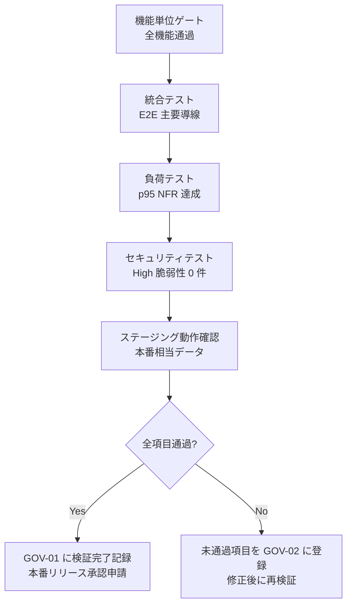

# 08-deployment.md — デプロイ定義・検証完了ゲートテンプレート

## このセクションの目的

リリース方式、ロールバック判断基準、環境別ゲート、検証完了ゲートを定義する。**本書は判断基準の定義であり、実作業手順（コマンド・当日のチェックリスト）は OPS-02 に委譲する**。

インフラは DEV-01 §1 の通り Cloudflare Workers を採用している。ホスティング・スケーリング・エッジでの実行は基盤（Cloudflare）に委ねられるが、Laravel Cloud のような git push 起点の自動ビルド・デプロイはこのテンプレートにまだ組み込まれていない — デプロイ実行（`wrangler deploy`）をどう起動するか（CI 経由か手動か）は §3 の通り **Open**。本書で定義するのは「基盤に何を設定するか」と「何をもってリリース可とするか」のみ。

## 0-H. ハイブリッド編集ガイド（要点）

- 推奨モード: Hybrid（AI 構造化 + Tech Lead 確定）
- 人間確認必須: 本番リスク受容、承認条件、ロールバック判断基準

---

## 1. デプロイ基盤（Cloudflare Workers）

基盤が提供するもの（本テンプレでは個別に設計・運用しない）:

| 項目 | 提供方法 |
| --- | --- |
| アプリケーション実行 | Cloudflare Workers。`astro build` の出力自体が Worker（`@astrojs/cloudflare` アダプタ）。デプロイは `wrangler deploy`（`wrangler.jsonc` の設定を使用） |
| DB（Cloudflare D1、SQLite 互換） | マネージド。バックアップ/エクスポートは `wrangler d1 export` 等（実作業は OPS-02） |
| Cache / Queue | Cloudflare KV 採用（認証失敗カウンタ・メンテナンスフラグ用）・Queues 不採用（`Confirmed` — DEV-01 §1）。KV バインディングは `wrangler.jsonc` で環境ごとに定義 |
| Session | D1（`admin_sessions` / `member_sessions`）で確定（DEV-01 §2、DEV-02 §1-1・§1-2、DEV-07 §3-1）。KV にはセッションを置かない |
| スケジューラ | Cloudflare Cron Triggers（`Confirmed` — DEV-01 §2）。`wrangler.jsonc` の `triggers.crons` + Scheduled Worker で日次バッチ（OPS-02 §4-3）を実行 |
| スケーリング | オートスケール（Cloudflare Workers 標準。エッジ実行のため個別のスケーリング設計は不要） |
| 環境変数・シークレット | 非機密は `wrangler.jsonc` の `vars`、機密は Workers Secrets（`wrangler secret put`）。ローカル専用の機密は `.dev.vars`（gitignore 対象）。`.env` 相当のファイルを git にコミットしない |
| オブジェクトストレージ | Cloudflare R2（`env.BUCKET`、テンプレート標準バインディング） |
| メトリクス・ログ | Cloudflare Workers Logs / Analytics（標準、追加設定不要）。エラー監視が必要になった時点で `@sentry/cloudflare`（Workers 専用 SDK）を追加（DEV-01 §2） |

このテンプレートは **1 リポジトリ内の pnpm workspaces + Turborepo モノレポ**構成で、`apps/public`（公開サイト）と `apps/admin`（管理 CMS）を独立した Cloudflare Worker として別々にデプロイする（`/admin` パスへの統合ではない。DEV-01 §1）。D1 データベースと R2 バケットは 1 サービスにつき 1 つを両アプリで共有する。作成（`wrangler d1 create` / `wrangler r2 bucket create`）はどちらか一方のアプリの `wrangler.jsonc` から一度だけ行い、生成された `database_id` / `bucket_name` をもう一方の `wrangler.jsonc` にそのままコピーする。D1 マイグレーション（`packages/schema/migrations/` ディレクトリ、`wrangler d1 migrations apply`）は**`apps/admin` からのみ**実行する（同一リポジトリ内の app 単位の所有権。`CLAUDE.md` D1/R2 バインディングルール参照）。

---

## 2. 環境構成

PRD-02 §3 の 3 面構成に対応する。環境分離は `apps/public`/`apps/admin` それぞれの `wrangler.jsonc` の environments 機能（`env.staging` / `env.production`。D1/R2/KV は環境ごとに別インスタンスを定義）で実現する（`Confirmed` — DEV-01 §1。プロジェクト丸ごと複製方式は不採用）。

| 環境 | 実体 | デプロイトリガー |
| --- | --- | --- |
| local | 開発者ローカル（Dev Container。D1 / R2 はローカルエミュレーション） | — |
| staging | Cloudflare Workers（各アプリの `wrangler.jsonc` の environments、テスト用 D1 / R2） | `dev` ブランチへの push（Cloudflare Workers Builds が `wrangler deploy --env staging` を実行 — §3） |
| production | Cloudflare Workers（本番 D1 / R2） | `main` ブランチへの push（同上、`wrangler deploy`） |

`dev` はこのテンプレートの既定ブランチ（統合ブランチ）。`main`（本番）はテンプレート自体がデプロイされないため未作成であり、案件の bootstrap 時に作成する（README のチェックリスト参照）。

変更されたアプリのみをデプロイするパスフィルタは、Workers Builds の **Build Watch Paths**（Worker ごとに include/exclude を指定）で実現する。`apps/public` の変更で `apps/admin` を再デプロイしない。

---

## 3. CI/CD パイプライン

CI（検査）と CD（デプロイ）で基盤を分ける（`Confirmed` — DEV-08 §3）。

| 役割 | 基盤 | 実体 |
| --- | --- | --- |
| CI（PR ゲート） | GitHub Actions | `.github/workflows/ci.yml` |
| CD（デプロイ） | Cloudflare Workers Builds（GitHub 連携） | Cloudflare ダッシュボード側の設定（リポジトリ内にワークフローを持たない） |

CD を GitHub Actions に置かないのは、Workers Builds が GitHub 連携でモノレポに必要な機能（Root directory / Build Watch Paths / Deploy command のカスタマイズ / Worker ごとの GitHub check run）を備えており、API トークンをリポジトリ側で管理せずに済むため。

### 3-1. PR 時（CI — 導入済み）

`main` / `dev` への push と、すべての PR で `.github/workflows/ci.yml` が動く。

```
1. pnpm/setup（Node + pnpm + 依存インストール。require-lockfile で lockfile 必須）
2. pnpm db:generate      ← check より前。migrations/ は同梱しないため、
                            check 内の単体テストも e2e もこれ無しでは動かない
3. pnpm check（format:check + lint + typecheck + 単体テストを Turborepo が fan out）
4. playwright install chromium（キャッシュあり）
5. pnpm test:e2e（--concurrency=1。両スイートが同じローカル D1 を使うため）
6. pnpm build（両 Worker のビルド成否）
7. 失敗時のみ test-results/ をアーティファクト化（trace: on-first-retry の回収）
```

> `corepack enable` ではなく `pnpm/setup` を使う。corepack は pnpm のダウンロード前に確認プロンプトを出し、ランナーには応答する手段がない。

すべて Pass で Merge 可能とする。編集ごとの hooks（`.claude/hooks/format-and-check.sh`）は Claude Code のセッション内でしか動かないため、CI がチーム全体に対する唯一の強制力となる。

依存パッケージのセキュリティスキャン（Dependabot 等）は未導入 — 必要になった時点で GOV-01 に記録して追加する。

### 3-2. マージ後（CD — Workers Builds 側の設定）

Worker を 2 つ作成し、どちらも同じリポジトリに接続する。設定はダッシュボードの **Settings > Builds**。

| 設定 | `apps/public` の Worker | `apps/admin` の Worker |
| --- | --- | --- |
| Root directory | `apps/public` | `apps/admin` |
| Build Watch Paths | `apps/public/**`, `packages/**` | `apps/admin/**`, `packages/**` |
| Deploy command（production branch） | `npx wrangler deploy` | `npx wrangler d1 migrations apply DB --remote && npx wrangler deploy` |

**D1 マイグレーションは Workers Builds が自動では実行しない。** 実行されるのは build と deploy のコマンドのみのため、上表のとおり `apps/admin` 側の Deploy command に前置する。これを怠ると、新しいカラムを前提としたコードが未適用の DB に対してデプロイされる。`wrangler d1 migrations apply` は適用済みを記録して冪等なので再実行は安全。`apps/public` 側には設定しない（マイグレーションは `apps/admin` からのみ — DEV-01 §1、`CLAUDE.md`）。API トークンには D1 の編集権限が必要。

破壊的変更を含むマイグレーションは自動適用の対象外とし、手動で段階適用する（§7）。デプロイ後の Health check（§9）と通知は OPS-02 の監視系に委ねる。

Cloudflare Workers のデプロイはエッジでアトミックに切り替わるため、Laravel Cloud のような「無停止デプロイ」のための特別な仕組み（グレースフルな再起動、ロングランニングプロセスのドレイン等）は不要。

---

## 4. デプロイ戦略

| 項目 | 方針 |
| --- | --- |
| 本番配備 | Cloudflare Workers の標準デプロイ（アトミック・即時反映。ドレインすべき常駐プロセスが無いため、無停止性は基盤の性質として担保される） |
| DB 変更 | 前方互換優先（カラム追加 → コード反映 → カラム使用）。D1 マイグレーションは forward-only（自動 `down()` はない）。破壊的変更は分割リリースとし、問題が起きた場合は新しい forward migration で修正する |
| 機能フラグ | **Open**（案件実装時に確定）。暫定: 環境変数（`wrangler.jsonc` の `vars`）による ON-OFF フラグで開始 [Assumed]。動的切替が必要になったら KV フラグを検討 |
| 大規模変更 | 機能フラグで限定公開 → 全公開（機能フラグ方式決定後に運用開始） |

---

## 5. ロールバック条件（正本）

ロールバックの判断基準は本表を正本とし、OPS-02 は実行手順のみを持つ。

| 区分 | 条件 | 対応 |
| --- | --- | --- |
| 即時ロールバック | エラー率 > 5% / 5 分連続 | 前デプロイメントへ戻す（Wrangler の Deployments 履歴から直前ビルドを再デプロイ） |
| 即時ロールバック | 認証・決済の致命的不具合 | 同上 |
| 計画ロールバック | パフォーマンス悪化（p95 がベースラインの 2 倍） | 監視後判断 |
| DB 変更 | マイグレーション適用後に問題が判明 | D1 マイグレーションは forward-only のため DB 自体は戻さず、修正用の新しい forward migration を書いて対応する。Worker のコードのみ前デプロイに戻すことは可能 |

承認: Tech Lead（兼務可）。

---

## 6. デプロイゲート（環境別）

### 6-1. staging への昇格

- 全テスト Pass（テスト基盤導入後は CI グリーン — DEV-03 §3）
- 主要画面の手動確認

### 6-2. staging → production への昇格

- staging で 24 時間以上の問題なし
- セキュリティレビュー完了（DEV-02 §11）
- リリースノート作成
- D1 マイグレーションが forward-only の制約内で安全に適用できることを確認（`apps/admin` 側で事前検証）

破壊的変更（API バージョン変更等）は GOV-01 で事前承認必須。

---

## 7. 検証完了ゲート（リリース前 1 回）

AI コーディング → 人間レビュー → 自動テスト の後、**何が通れば「完了」とみなすか**。

### 7-1. 機能単位の完了条件

| カテゴリ | 確認項目 | 判定基準 |
| --- | --- | --- |
| 仕様適合 | PRD-03 の受け入れ条件を全件テスト | 全件グリーン |
| API 仕様 | DEV-04 のエンドポイント定義と実装の一致 | 差異ゼロ |
| 権限境界 | `editor` ロールから `admin` 専用操作へのアクセスが拒否される | テストで証明 |
| セキュリティ | 認証なし / 権限外 / 不正入力が適切に処理される | 手動 + SAST |
| 自動テスト | DEV-03 のカバレッジ目標達成（Vitest） | CI 計測値（CI 導入後。それまではローカル計測） |

### 7-2. MVP 全体の完了条件



### 7-3. 検証完了チェックリスト

**機能・品質**

- [ ] MVP 全機能（PRD-03）が動作確認済み
- [ ] 受け入れ条件が自動テストで全件証明
- [ ] E2E テストが主要導線を通過
- [ ] 負荷テストで NFR（DEV-01 §6）を満たす

**セキュリティ・権限**

- [ ] 認証なしでの操作が全て拒否される
- [ ] ロール別権限（DEV-02 §2-3）が正しく動作
- [ ] SAST / 依存スキャンで High 以上 0 件

**運用準備**

- [ ] ログ・アラートの本番設定確認（OPS-02）
- [ ] ロールバック手順の実行方法確認（OPS-02）
- [ ] リリースノート準備済み

**承認**

- [ ] GOV-01 の承認記録に検証完了が記録されている

---

## 8. 環境変数（主要）

Cloudflare のバインディング（D1 / R2）は `wrangler.jsonc` で設定するため本節には記載しない。本節に記載するのは、非機密の環境変数（`wrangler.jsonc` の `vars`）と、Workers Secrets（`wrangler secret put`）または `.dev.vars`（ローカルのみ、gitignore 対象）で管理する機密値のみ。

```bash
# アプリケーション（wrangler.jsonc の vars、非機密）
APP_NAME=
APP_URL=
APP_ENV=production

# Cache / Queue（決定後 — DEV-01 §1。Session は D1 で確定のため環境変数不要。
# バインディング名・接続情報は wrangler.jsonc で管理）

# Mail（Resend — DEV-01 §1。Workers Secrets で管理）
RESEND_API_KEY=
MAIL_FROM_ADDRESS=
MAIL_FROM_NAME=

# 決済（採用時 — DEV-01 §2。Workers Secrets で管理。変数名は DEV-10 §11 と一致させる）
STRIPE_KEY=
STRIPE_SECRET=
STRIPE_WEBHOOK_SECRET=

# エラー監視（採用時 — DEV-01 §2。Workers Secrets で管理）
SENTRY_DSN=

# AI / LLM（採用時、Vercel AI SDK 経由 — 使用するプロバイダのキーのみ。Workers Secrets で管理）
ANTHROPIC_API_KEY=
GEMINI_API_KEY=
OPENAI_API_KEY=

# 認証（DEV-01 §2、DEV-02 §1-1。JWT は不採用 — セッションは D1 に保存する）
# セッション ID・招待/パスワードリセットトークンの HMAC 署名鍵（Web Crypto）
SESSION_SIGNING_KEY=
```

---

## 9. ヘルスチェック

| エンドポイント | 目的 |
| --- | --- |
| `GET /api/v1/health` | 死活監視 |
| `GET /api/v1/health/db` | D1 接続確認 |
| `GET /api/v1/health/kv` | KV 接続確認（KV 採用済み — DEV-01 §1） |
| `GET /api/v1/health/queue` | 不要（Queues 不採用。将来 Queues を採用した場合のみ追加） |

日常の監視・障害対応は OPS-02 を参照。

---

## 10. 記入時チェックポイント

- 環境（local / staging / production）の構成差分が明確か
- ロールバック条件が即時 / 計画で分かれているか
- 検証完了ゲートが本番リリース判断に使えるか
- 環境変数一覧がプロジェクトの採用機能（DEV-01 §2）と整合しているか
- 実作業手順が本書に紛れ込んでいないか（OPS-02 へ委譲されているか）
