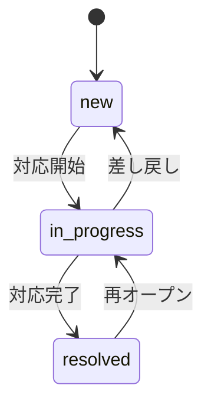
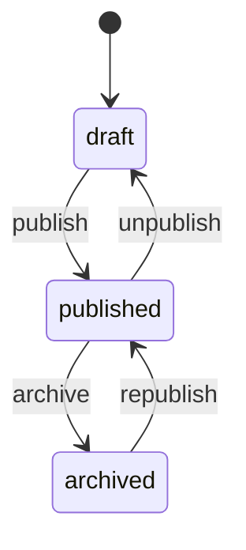
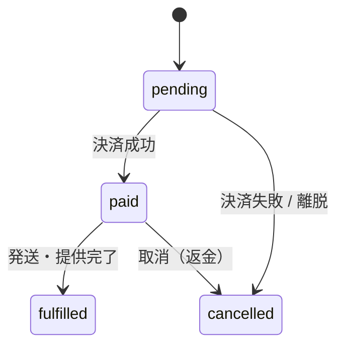

# 09-state-machine-spec.md — 状態遷移仕様テンプレート

## このセクションの目的

状態を持つエンティティの **状態一覧 / 遷移マトリクス / トリガー / 不正遷移時の挙動** を体系的に定義する。Service 層に集約する状態遷移関数の実装パターンも提供（DEV-01 §4「状態遷移の集約」参照）。

## 0-H. ハイブリッド編集ガイド（要点）

- 推奨モード: Hybrid（AI 整理 + Tech Lead レビュー）
- 人間確認必須: 遷移パスの妥当性、不正遷移時の挙動、監査ログ要件

---

## 1. 状態遷移を持つエンティティ一覧

PRD-01 §7 と整合させる。本テンプレート（パターン A）は単一運営・少数ロールが前提のため、Organization / Subscription / Invitation / Membership / Payment のようなマルチテナント SaaS 課金系のエンティティは存在しない（00_README §0-1・§2-2、PRD-01 §1）。標準エンティティ（Inquiry / Member）と、採用時のみ追加するオプションエンティティ（Post / AiJob / Order）を対象とする。参照実装は **Inquiry**（`apps/admin/src/lib/server/services/inquiries.ts`）。

<!-- TEMPLATE: PRD-01 §7 の状態一覧と対応 -->
<!-- SAMPLE START: フォーマット例 — 実際のエンティティに置き換えてください -->
| エンティティ | 状態数 | 主な遷移トリガー |
| --- | --- | --- |
| Inquiry | 3 | 対応開始・対応完了・差し戻し（管理者操作、PRD-01 §7）。**参照実装** |
| Member | 2 | 利用停止・復帰（管理者操作、PRD-01 §7） |
| Post（ブログを D1 で持つ場合のみ。DEV-07 §3-2） | 3 | 公開操作・非公開化・アーカイブ（管理者操作、PRD-01 §7） |
| [プロダクト固有エンティティ] | [N] | [遷移トリガー] |
| AiJob（AI 機能採用時のみ） | 4 | 非同期ジョブの実行（キュー投入・処理開始・完了・失敗） |
| Order（軽量 EC 採用時のみ。PRD-03 FG-05） | 4 | Stripe Webhook（決済成功等）・管理者操作（発送・提供完了等） |
<!-- SAMPLE END -->

---

## 2. エンティティ別の状態遷移定義

### 2-1. Inquiry（参照実装）

<!-- SAMPLE START: フォーマット例 — 実際の内容に置き換えてください -->
#### 2-1-1. 状態一覧

PRD-01 §7 / DEV-07 §4-3（`inquiries.status`）と一致させる。

| 状態 | 説明 |
| --- | --- |
| `new` | 新規受信・未対応 |
| `in_progress` | 対応中 |
| `resolved` | 対応完了 |

#### 2-1-2. 遷移マトリクス

| 遷移元 → 遷移先 | new | in_progress | resolved |
| --- | :---: | :---: | :---: |
| new | — | ✓ | ✗ |
| in_progress | ✓ | — | ✓ |
| resolved | ✗ | ✓ | — |

> 終端状態を持たない（`Confirmed` — 参照実装で確定）。誤って対応完了にした場合の復帰手段が無いと
> 運用が詰まるため、`resolved → in_progress` と `in_progress → new` を許可する。`new` への差し戻しは
> 担当を手放す操作であり、`handled_by` が NULL に戻る（§2-1-4）。

#### 2-1-3. 遷移トリガー

| 遷移 | トリガー | 実行者 |
| --- | --- | --- |
| new → in_progress | 対応開始（`POST /api/v1/inquiries/{id}/start`） | editor 以上 |
| in_progress → resolved | 対応完了（`POST /api/v1/inquiries/{id}/resolve`） | editor 以上 |
| in_progress → new | 差し戻し・担当解除（`POST /api/v1/inquiries/{id}/reopen`） | editor 以上 |
| resolved → in_progress | 再オープン（`POST /api/v1/inquiries/{id}/start`） | editor 以上 |

#### 2-1-4. 遷移時の副作用

| 遷移 | 副作用 |
| --- | --- |
| → in_progress | 操作者を `handled_by` に記録する（DEV-07 §4-3）。引き受けた者が担当になる |
| → new | `handled_by` を NULL に戻す（担当を手放す） |
| → resolved | `handled_by` は維持する。利用者への完了連絡を行うかは案件次第（**Open** — メール送信基盤が必要。PRD-03 FG-06 の受信時通知とは別の関心事） |

#### 2-1-5. Mermaid


<!-- SAMPLE END -->

### 2-2. Post（ブログを D1 で持つ場合のみ）

<!-- SAMPLE START: フォーマット例 — 実際の内容に置き換えてください -->
#### 2-2-1. 状態一覧

PRD-01 §7 / DEV-07 §4-2（`posts.status`）と一致させる。

| 状態 | 説明 |
| --- | --- |
| `draft` | 下書き（非公開） |
| `published` | 公開中 |
| `archived` | 公開終了（アーカイブ） |

#### 2-2-2. 遷移マトリクス

| 遷移元 → 遷移先 | draft | published | archived |
| --- | :---: | :---: | :---: |
| draft | — | ✓ | ✗ |
| published | ✓ | — | ✓ |
| archived | ✗ | ✓ | — |

> `draft → archived` の直接遷移は無し（一度公開してからアーカイブする運用を想定）。`archived → published`（再公開）は許可する。§3-2 の `TRANSITIONS` 定義と一致させること。

#### 2-2-3. 遷移トリガー

| 遷移 | トリガー | 実行者 |
| --- | --- | --- |
| draft → published | 記事編集画面で「公開」操作 | admin / editor（DEV-02 §2-3 ※1 の判断に依存） |
| published → draft | 「非公開化」操作（unpublish） | admin（editor まで許可するかは案件次第） |
| published → archived | 「アーカイブ」操作 | admin |
| archived → published | 「再公開」操作（republish） | admin |

#### 2-2-4. 遷移時の副作用

| 遷移 | 副作用 |
| --- | --- |
| → published | `published_at` を記録（DEV-07 §4-2）。公開側の一覧・サイトマップに反映 |
| → draft（unpublish） | 公開側から非表示化 |
| → archived | 公開側から除外（データ自体は保持。保管方針は DEV-07 §10） |

#### 2-2-5. Mermaid


<!-- SAMPLE END -->

### 2-3. [プロダクト固有エンティティ]

<!-- SAMPLE START: フォーマット例 — 実際のエンティティに置き換えてください -->
#### 2-3-1. 状態一覧

| 状態 | 説明 |
| --- | --- |
| `[状態名]` | [説明] |
| `[状態名]` | [説明] |

#### 2-3-2. 遷移マトリクス

| 遷移元 → 遷移先 | [状態 A] | [状態 B] | [状態 C] |
| --- | :---: | :---: | :---: |
| [状態 A] | — | ✓ | ✗ |
| [状態 B] | ✓ | — | ✓ |
| [状態 C] | ✗ | ✗ | — |

#### 2-3-3. 遷移トリガー

| 遷移 | トリガー | 権限 |
| --- | --- | --- |
| [状態 A] → [状態 B] | [ユーザー操作 / Webhook / バッチ] | [権限] |
<!-- SAMPLE END -->

### 2-4. AiJob（AI 機能採用時のみ）

<!-- SAMPLE START: フォーマット例 — 採用時に実際の内容を確認してください -->
#### 2-4-1. 状態一覧

DEV-07 §3-4 / §6（`ai_jobs.status`）と一致させる。

| 状態 | 説明 |
| --- | --- |
| `queued` | キュー投入済、実行待ち |
| `processing` | 実行中 |
| `completed` | 完了 |
| `failed` | 失敗（リトライ上限到達） |

#### 2-4-2. 遷移マトリクス

| 遷移元 → 遷移先 | queued | processing | completed | failed |
| --- | :---: | :---: | :---: | :---: |
| queued | — | ✓ | ✗ | ✓ |
| processing | ✓ | — | ✓ | ✓ |
| completed | ✗ | ✗ | — | ✗ |
| failed | ✗ | ✗ | ✗ | — |

> `processing → queued` はリトライ時の戻し。
<!-- SAMPLE END -->

### 2-5. Order（軽量 EC 採用時のみ — PRD-03 FG-05）

Order は FG-05（軽量注文・決済）採用時のみの **オプション例**。採用しない場合は本節を削除する。DEV-07 §7-1（`orders.status`）と一致させる。ゲストチェックアウトと Member への任意紐付け（FG-07 採用時、`orders.member_id`）の両方を前提とし、複雑な承認フロー・在庫同期は対象外（00_README §2-2、PRD-01 §1-1・§1-3）。

<!-- SAMPLE START: フォーマット例 — 実際の内容に置き換えてください -->
#### 2-5-1. 状態一覧

| 状態 | 説明 |
| --- | --- |
| `pending` | 注文受付・決済処理待ち |
| `paid` | 決済完了（`stripe_payment_intent_id` 確定） |
| `fulfilled` | 発送・提供完了 |
| `cancelled` | 取消（決済失敗・利用者キャンセル・返金等） |

#### 2-5-2. 遷移マトリクス

| 遷移元 → 遷移先 | pending | paid | fulfilled | cancelled |
| --- | :---: | :---: | :---: | :---: |
| pending | — | ✓ | ✗ | ✓ |
| paid | ✗ | — | ✓ | ✓ |
| fulfilled | ✗ | ✗ | — | ✗ |
| cancelled | ✗ | ✗ | ✗ | — |

> `fulfilled` / `cancelled` は終端状態。返金は Stripe 側の操作として記録し、本テーブルの `status` は `cancelled` に遷移させる運用を想定する（返金専用の状態は持たず、シンプルな 4 状態に留める — DEV-07 §7-1）。再決済は新規 Order レコードを作成する。

#### 2-5-3. 遷移トリガー（Stripe Webhook ベース）

| 遷移 | トリガー | 実行者 |
| --- | --- | --- |
| pending → paid | Stripe Webhook（`checkout.session.completed` 等） | system |
| pending → cancelled | Stripe Webhook（決済失敗）、または利用者の離脱タイムアウト | system |
| paid → fulfilled | 管理画面での発送・提供完了操作（FG-04 と連動） | admin |
| paid → cancelled | 管理画面での取消操作（返金処理と合わせて実施） | admin |

#### 2-5-4. 遷移時の副作用

| 遷移 | 副作用 |
| --- | --- |
| → paid | 注文確認メール送信（利用者宛、F-05-04）。`stripe_event_logs` へ Webhook イベントを記録（DEV-07 §7-3、冪等性確保） |
| → fulfilled | 発送・提供完了メールの送信有無は案件次第（**Open** — 案件実装時に確定） |
| → cancelled | 取消連絡メールの送信有無は案件次第（**Open** — 案件実装時に確定） |

#### 2-5-5. Mermaid


<!-- SAMPLE END -->

### 2-6. Member（標準同梱 — PRD-03 FG-07）

Member は FG-07 採用時のみの **オプション例**。採用しない場合は本節を削除する。DEV-07 §4-6（`members.status`）と一致させる。ロール階層を持たない単一種別のため、遷移は有効／利用停止の 2 状態のみ（PRD-01 §1-2・§7）。

<!-- SAMPLE START: フォーマット例 — 実際の内容に置き換えてください -->
#### 2-6-1. 状態一覧

| 状態 | 説明 |
| --- | --- |
| `active` | 有効（ログイン可） |
| `suspended` | 利用停止（ログイン不可。既存セッションも失効させる） |

#### 2-6-2. 遷移マトリクス

| 遷移元 → 遷移先 | active | suspended |
| --- | :---: | :---: |
| active | — | ✓ |
| suspended | ✓ | — |

#### 2-6-3. 遷移トリガー

| 遷移 | トリガー | 実行者 |
| --- | --- | --- |
| active → suspended | 規約違反・退会申請等による利用停止操作 | admin |
| suspended → active | 停止解除操作 | admin |

#### 2-6-4. 遷移時の副作用

| 遷移 | 副作用 |
| --- | --- |
| → suspended | `member_sessions` の該当行を全削除してログイン中のセッションを即時失効させる（DEV-02 §1-2、DEV-07 §4-7） |
| → active | 副作用なし（再ログインで新規セッションが発行される） |

<!-- SAMPLE END -->

---

## 3. Service 層での状態遷移関数実装パターン

状態遷移は DEV-01 §4「状態遷移の集約」の原則に従い、エンティティごとに単一の遷移関数へ集約する（PHP のクラスベース StateMachine ではなく、Service 層の関数としてまとめる）。

### 3-1. 設計方針

| 項目 | 方針 |
| --- | --- |
| 配置 | `apps/admin/src/lib/server/services/<entity>.ts` に `transition<Entity>(...)` 関数としてエクスポート |
| 責務 | 遷移可否の判定、遷移実行（D1 更新）、副作用の呼び出し |
| 状態の保管 | D1 の `status` 等 `TEXT` カラム。TypeScript 側は文字列リテラルのユニオン型（例 `InquiryStatus`）で表現し、Service 層で検証する（`casts()` 相当の専用機構はない） |
| 不正遷移 | `@app/server-kit/http` の `InvalidStateTransitionError`（409）を throw する。エンティティごとに独自のエラークラスを作らない |
| 副作用 | イベントバス／Listener に相当する仕組みはない。遷移関数内から直接関数呼び出し（メール送信等）。レスポンスをブロックする重い副作用は `ctx.waitUntil()` で後処理化する（DEV-01 §4、DEV-05 §4） |

### 3-2. 実装例

実装済みの参照実装をそのまま示す。抜粋ではなく実際のコードであり、テスト
（`apps/admin/tests/unit/inquiries.test.ts`）が下記の性質を検証している。

```typescript
// apps/admin/src/lib/server/services/inquiries.ts

export type InquiryStatus = "new" | "in_progress" | "resolved";

const TRANSITIONS: Record<InquiryStatus, InquiryStatus[]> = {
  new: ["in_progress"],
  in_progress: ["resolved", "new"],
  resolved: ["in_progress"],
};

export function allowedTransitions(status: InquiryStatus): InquiryStatus[] {
  return TRANSITIONS[status] ?? [];
}

export async function transitionInquiry(db: DbClient, publicId: string, to: InquiryStatus, session: Session) {
  const row = await findInquiryRow(db, publicId);
  const from = row.status;

  if (!allowedTransitions(from).includes(to)) {
    throw new InvalidStateTransitionError("Inquiry", from, to);
  }

  const [updatedRows] = await db.batch([
    db
      .update(inquiries)
      .set({
        status: to,
        handledBy: to === "in_progress" ? session.adminUserId : to === "new" ? null : row.handledBy,
        updatedAt: new Date().toISOString(),
      })
      .where(eq(inquiries.id, row.id))
      .returning(),
    activityLogInsert(db, {
      logName: "inquiry",
      description: `Inquiry ${from} -> ${to}`,
      subjectType: "Inquiry",
      subjectId: row.id,
      event: `inquiry.${to}`,
      causerId: session.adminUserId,
      properties: { from, to },
    }),
  ]);

  return toPublicInquiry(updatedRows[0]!);
}
```

この形が守っている規約は 4 つ。

- **引数は `publicId`（ULID）で、内部の整数 `id` は関数の外に出ない**（DEV-07 §1、DEV-05 §2）
- **`status` を書くのはこの関数だけ**。他のどの関数も `status` を代入しない（§3-1）
- **本体の UPDATE と `activity_log` の INSERT を `db.batch()` で 1 トランザクションにする**。
  遷移が拒否された場合はログも残らない（§3-4）
- **副作用は遷移関数の中に書く**。`handled_by` の割り当て/解放のように「その遷移固有の
  もの」は、汎用の仕組みでは表現できない（DEV-05 §2）

エラー型は `@app/server-kit/http` の `InvalidStateTransitionError`（409）を使う。エンティティごとに
独自のエラークラスを定義しない — API の応答形は `toErrorResponse` が一元的に決める（DEV-04 §5）。

### 3-3. API Route からの呼び出し

遷移関数が Service 層にあるため、Astro API Route は入出力ハンドリングのみを担う（DEV-01 §5「レイヤー責務」）。
**遷移ごとに 1 ルート**とし、`status` への PATCH では表現しない — 正当な遷移が URL 空間に現れ、
遷移ごとに異なるロールを設定できる。

```typescript
// apps/admin/src/pages/api/v1/inquiries/[id]/start.ts
import type { APIContext } from "astro";
import { env } from "cloudflare:workers"; // Astro.locals.runtime.env は v6 で削除済みの旧 API（DEV-05 §1）
import { createDb } from "@app/schema/client";
import { jsonItem, toErrorResponse } from "@app/server-kit/http";
import { requireRole, requireSession } from "$lib/server/auth/session";
import { transitionInquiry } from "$lib/server/services/inquiries";

export async function POST({ params, cookies }: APIContext): Promise<Response> {
  try {
    const db = createDb(env.DB);
    const session = await requireSession(cookies, db); // D1 セッション検証（DEV-02 §1-1）
    requireRole(session, "editor");

    return jsonItem(await transitionInquiry(db, params.id!, "in_progress", session));
  } catch (error) {
    return toErrorResponse(error);
  }
}
```

> D1 の `env.DB.batch()` は Eloquent の `DB::transaction()` のように任意ロジックを包むものではないが、
> **渡したステートメント列は 1 つの SQL トランザクションとして実行され、途中で失敗すれば全体が
> ロールバックされる**（Cloudflare D1 公式ドキュメント）。複数テーブルの更新はこれでまとめる。

### 3-4. 監査ログとの連携

状態遷移は監査ログの必須記録操作（DEV-05 §9-1）。専用パッケージは使わず、遷移関数内から
`activity_log` テーブル（DEV-01 §2 / DEV-07 §4-4）へ INSERT する。単一運営前提のため
`organization_id` は持たない（DEV-07 §4-4）。

書き込みヘルパーは**未実行のステートメントを返す**。呼び出し側が `db.batch()` に載せられるように
するためで、これがログと変更を同一トランザクションに置く仕組みそのものである。

```typescript
// apps/admin/src/lib/server/services/activity-log.ts

// 返り値は未実行の INSERT。呼び出し側が db.batch() に入れる
export function activityLogInsert(db: DbClient, entry: ActivityLogEntry) {
  return db.insert(activityLog).values({
    logName: entry.logName ?? null,
    description: entry.description,
    subjectType: entry.subjectType ?? null,
    subjectId: entry.subjectId ?? null,
    event: entry.event ?? null,
    causerType: entry.causerType ?? "AdminUser",
    causerId: entry.causerId ?? null,
    properties: entry.properties ? JSON.stringify(entry.properties) : null,
    batchId: null,
  });
}
```

> 削除も記録する。対象行が消えるため、`properties` に**後から特定できるだけの情報**を入れる
> （`media` なら R2 のキー、`inquiries` なら公開 ID とメールアドレス）。

---

## 4. UI 表示

### 4-1. 状態バッジの標準色

<!-- TEMPLATE: 標準エンティティ（Inquiry / Member）とオプションエンティティ（Post / AiJob / Order）の状態をカテゴリ化 -->

| 状態カテゴリ | 色 | アイコン例 |
| --- | --- | --- |
| Published / Resolved / Fulfilled / Completed / Paid | 緑 | check-circle |
| Draft / New / Pending / Queued | 黄 | clock |
| In Progress / Processing | 青 | arrow-path |
| Archived / Cancelled | グレー | archive-box |
| Failed | 赤 | exclamation-circle |

### 4-2. 状態遷移ボタンの表示

遷移可否の判定はコンポーネント側で個別実装せず、§3-2 の `allowedTransitions()` の結果を Astro ページ（または API Route）側で取得し、Svelte アイランドに props として渡して描画する。

```svelte
<!-- Svelte island: 許可された遷移のみボタン表示 -->
<script lang="ts">
  import type { InquiryStatus } from "$lib/server/services/inquiries";

  let { allowedTransitions, onSelect }: { allowedTransitions: InquiryStatus[]; onSelect: (status: InquiryStatus) => void } = $props();
</script>

{#each allowedTransitions as nextStatus}
  <button onclick={() => onSelect(nextStatus)}>{nextStatus}</button>
{/each}
```

遷移の確認は共通の確認モーダルに集約する（ブラウザ標準ダイアログ `confirm()` は使わない —
DEV-01 §3 / DEV-06 §5）。管理画面では shadcn-svelte の `AlertDialog` 等、標準の確認 UI コンポーネントを使う（`npx shadcn-svelte add alert-dialog`）。

```svelte
<script lang="ts">
  import * as AlertDialog from "$lib/components/ui/alert-dialog";
  import type { InquiryStatus } from "$lib/server/services/inquiries";

  // 公開 ID（ULID）。内部の整数 id はクライアントに渡らない（DEV-07 §1）
  let { inquiryId }: { inquiryId: string } = $props();
  let pendingAction: string | null = $state(null);

  async function applyTransition(): Promise<void> {
    if (!pendingAction) return;
    // 遷移ごとに 1 ルート。`status` への PATCH は使わない（§3-3）
    await fetch(`/api/v1/inquiries/${inquiryId}/${pendingAction}`, { method: "POST" });
    pendingAction = null;
  }
</script>

<AlertDialog.Root open={pendingStatus !== null}>
  <AlertDialog.Content>
    <AlertDialog.Title>状態を変更しますか？</AlertDialog.Title>
    <AlertDialog.Action onclick={applyTransition}>変更する</AlertDialog.Action>
  </AlertDialog.Content>
</AlertDialog.Root>
```

---

## 5. テスト戦略

テストは Vitest（DEV-01 §1）。**workerd 上で実行する**（`@cloudflare/vitest-plugin`）ため、
D1 も `db.batch()` も本物が動く — モックしない（DEV-03 §3）。実装済みの参照実装は
`apps/admin/tests/unit/inquiries.test.ts`。「全ての遷移パターンにテストがあること」を目標に維持する。

### 5-1. Unit Test

遷移そのものだけでなく、**拒否された遷移が監査ログを残さないこと**まで確認する。`db.batch()` が
1 トランザクションであるという前提を検証しているのはこのテストである。

```typescript
import { env } from "cloudflare:workers";
import { InvalidStateTransitionError } from "@app/server-kit/http";
import { describe, expect, it } from "vitest";
import { allowedTransitions, transitionInquiry } from "../../src/lib/server/services/inquiries";

it("allows only the moves the state machine declares", async () => {
  expect(allowedTransitions("new")).toEqual(["in_progress"]);
  const row = await arrive();

  await expect(transitionInquiry(db, row.publicId, "resolved", session)).rejects.toBeInstanceOf(InvalidStateTransitionError);
  await expect(transitionInquiry(db, row.publicId, "in_progress", session)).resolves.toMatchObject({ status: "in_progress" });
});

it("assigns the handler on start and releases it on reopen", async () => {
  const row = await arrive();

  await transitionInquiry(db, row.publicId, "in_progress", session);
  expect((await findRow(row.id)).handledBy).toBe(session.adminUserId);

  await transitionInquiry(db, row.publicId, "new", session);
  expect((await findRow(row.id)).handledBy).toBeNull();
});

it("leaves no audit entry when the transition is rejected", async () => {
  const row = await arrive();
  await transitionInquiry(db, row.publicId, "resolved", session).catch(() => {});

  expect(await db.select().from(activityLog)).toHaveLength(0);
});
```

### 5-2. データセットでマトリクス全網羅

遷移が増えたら個別テストではなくこちらを増やす。`allowedTransitions()` を真とせず、
**マトリクス（§2-N-2）を真として**関数の側を検証する — 両方が同じ定数を見ていては何も検証できない。

```typescript
it.each([
  ["new", "in_progress", true],
  ["new", "resolved", false],
  ["in_progress", "new", true],
  ["in_progress", "resolved", true],
  ["resolved", "in_progress", true],
  ["resolved", "new", false],
])("transition matrix: %s -> %s (allowed=%s)", async (from, to, allowed) => {
  const row = await arrive({ status: from as InquiryStatus });
  const call = transitionInquiry(db, row.publicId, to as InquiryStatus, session);

  if (allowed) await expect(call).resolves.toMatchObject({ status: to });
  else await expect(call).rejects.toBeInstanceOf(InvalidStateTransitionError);
});
```

---

## 6. 状態遷移の可視化

### 6-1. Mermaid 図の標準形


### 6-2. ドキュメント記載順序

各エンティティについて、以下の順序で記載：

1. 状態一覧表
2. 遷移マトリクス表
3. 遷移トリガー（操作主体）
4. 副作用（イベント・通知）
5. Mermaid 状態遷移図

---

## 7. 記入時チェックポイント

- 状態を持つエンティティが PRD-01 §7 と整合しているか
- 各エンティティの状態値が DEV-07 の `status` カラム定義（`inquiries` / `members`、採用時は `posts` / `orders` / `ai_jobs` 等）と一致しているか
- Organization / Subscription / Invitation / Membership / Payment のようなマルチテナント SaaS 課金系のエンティティが紛れ込んでいないか（本テンプレは単一運営が前提。00_README §0-1・§2-2）
- 遷移マトリクスで「不可能な遷移」が明示されているか
- 遷移トリガーが明確か（system / admin / editor / Webhook）
- 副作用が網羅されているか（メール通知、関連エンティティへの影響）
- 監査ログとの連携が組み込まれているか（`organization_id` のようなテナント列を持たない `activity_log` の実スキーマ、DEV-07 §4-4 と一致しているか）
- 状態遷移関数が Service 層に集約され、API Route から呼ばれる構造になっているか（引数は公開 ID と `session` のみ。内部の整数 id を関数の外に出していないか）
- 遷移ごとに 1 ルートになっているか（`status` への PATCH で表現していないか — §3-3）
- 不正遷移時の挙動（例外 / エラー画面）が明示されているか
- 採用しないオプションエンティティ（Post / AiJob / Order）の節が、不要な場合に削除されているか
