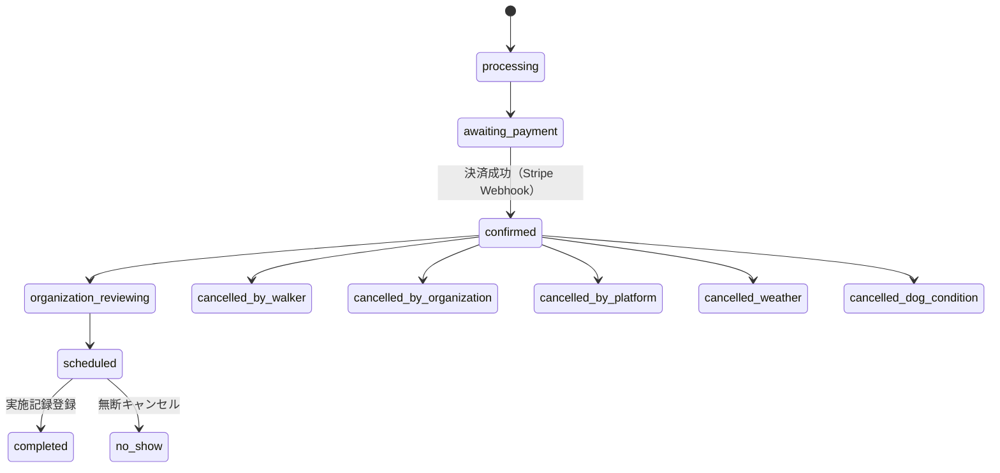
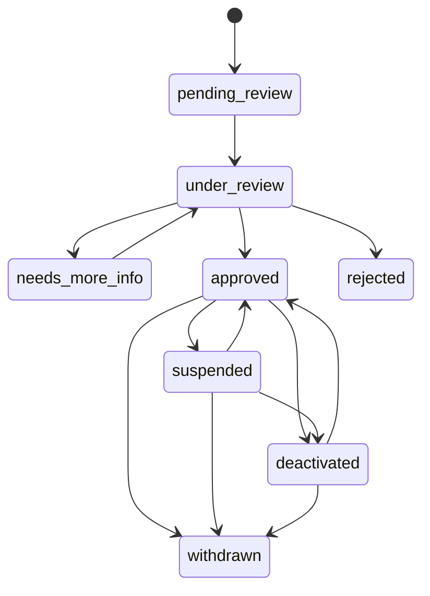

# 09-state-machine-spec.md — 状態遷移仕様

## このセクションの目的

状態を持つエンティティの **状態一覧 / 遷移マトリクス / トリガー / 不正遷移時の挙動** を体系的に定義する。Service 層に集約する状態遷移関数の実装パターンも提供（DEV-01 §4「状態遷移の集約」参照）。

本プロジェクトは二者間マーケットプレイス（お散歩参加者 Walker × 保護団体 Organization、運営 Platform の 3 者構造 — GOV-01 D-006）であり、状態を持つエンティティ数・遷移の複雑さは本テンプレート標準（パターン A）より大きい。実装パターン自体（Service 層への単一 TypeScript 遷移関数への集約）はテンプレート標準を踏襲し、対象エンティティのみ本プロジェクト固有のものに置き換える。

## 0-H. ハイブリッド編集ガイド（要点）

- 推奨モード: Hybrid（AI 整理 + Tech Lead レビュー）
- 人間確認必須: 遷移パスの妥当性、不正遷移時の挙動、監査ログ要件、キャンセル・返金条件（GOV-02 TBD-10〜13）

---

## 1. 状態遷移を持つエンティティ一覧

PRD-01 §7 と完全に一致させる。標準テンプレートが前提とする単一運営・少数ロールの Member/AiJob/Order は本プロジェクトには存在しない（PRD-01 §1-0）。テンプレート標準の Post も不採用のため状態遷移を持たない（GOV-01 D-014）。**記事型コンテンツの状態遷移は 1 つも無い** — 唯一の記事型コンテンツであるお知らせも Content Collections に置くため D1 の行を持たない（GOV-01 D-016、§2-13）。

| エンティティ | 状態数 | 主な遷移トリガー | 配置 |
| --- | --- | --- | --- |
| Organization | 8 | 運営（admin）の審査、団体（org_admin）の申請・退会 | `apps/public`（審査系トリガーのみ `apps/admin` から D1 を更新 — §3-4）|
| OrganizationMember | 3 | 招待受諾、org_admin による停止・解除 | `apps/public` |
| Invitation | 3 | 招待発行・受諾・期限切れバッチ | `apps/public` |
| WalkerProfile | 6 | メール確認、規約同意、admin の利用制限・停止操作（電話確認は初回予約時の別条件 — GOV-01 D-036）| `apps/public` |
| Dog（adoptionStatus）| 6 | 団体スタッフ（org_admin/org_staff）による里親募集状況の更新 | `apps/public` |
| WalkSlot | 8 | 団体スタッフの公開操作、予約充足、天候・犬の体調による中止 | `apps/public` |
| Reservation | 12 | Walker / 団体 / 運営の操作、Stripe Webhook、WalkSlot の中止連動 | `apps/public` |
| Payment | 7 | Stripe Webhook（決済成功・失敗・返金）| `apps/public` |
| Payout | 7 | Cron Triggers による月次集計、admin の振込確定操作、Stripe Connect Transfer | `apps/admin`（審査系と同じ D1 直接更新パターン。org_admin 向け参照専用クエリのみ `apps/public`）|
| Incident | 5 | 団体スタッフの報告・対応更新、admin の完了処理 | `apps/public` |
| AdoptionInquiry | 7 | Walker の相談送信、団体スタッフの対応更新 | `apps/public` |
| Inquiry | 3 | 運営（admin）の対応更新。**参照実装**（実装済み） | `apps/admin` |
| News | — | 状態遷移を持たない（Content Collections の `draft` フラグと git で表現 — GOV-01 D-016、§2-13） | — |

---

## 2. エンティティ別の状態遷移定義

### 2-1. Organization

#### 2-1-1. 状態一覧

PRD-01 §7 / DEV-07（`organizations.status`、案件着手時に確定）と一致させる。

| 状態 | 説明 |
| --- | --- |
| `pending_review` | 登録申請を受け付けた直後 |
| `under_review` | 運営が審査中 |
| `needs_more_info` | 追加確認依頼中 |
| `approved` | 承認済・稼働中。WalkSlot の公開が可能 |
| `rejected` | 否認（終端状態）|
| `suspended` | 一時的な掲載停止 |
| `deactivated` | 長期活動停止 |
| `withdrawn` | 団体からの退会（終端状態）|

#### 2-1-2. 遷移マトリクス

| 遷移元 → 遷移先 | pending_review | under_review | needs_more_info | approved | rejected | suspended | deactivated | withdrawn |
| --- | :---: | :---: | :---: | :---: | :---: | :---: | :---: | :---: |
| pending_review | — | ✓ | ✗ | ✗ | ✗ | ✗ | ✗ | ✗ |
| under_review | ✗ | — | ✓ | ✓ | ✓ | ✗ | ✗ | ✗ |
| needs_more_info | ✗ | ✓ | — | ✗ | ✗ | ✗ | ✗ | ✗ |
| approved | ✗ | ✗ | ✗ | — | ✗ | ✓ | ✓ | ✓ |
| rejected | ✗ | ✗ | ✗ | ✗ | — | ✗ | ✗ | ✗ |
| suspended | ✗ | ✗ | ✗ | ✓ | ✗ | — | ✓ | ✓ |
| deactivated | ✗ | ✗ | ✗ | ✓ | ✗ | ✗ | — | ✓ |
| withdrawn | ✗ | ✗ | ✗ | ✗ | ✗ | ✗ | ✗ | — |

> `rejected` / `withdrawn` は終端状態。再申請する場合は新規 Organization レコードを作成する。

#### 2-1-3. 遷移トリガー

| 遷移 | トリガー | 実行者 |
| --- | --- | --- |
| pending_review → under_review | 審査担当のアサイン | admin |
| under_review → needs_more_info | 追加書類・情報の依頼 | admin |
| under_review → approved / rejected | 審査結果確定 | admin |
| needs_more_info → under_review | 団体が追加情報を提出 | org_admin |
| approved → suspended | 規約違反・安全上の懸念等の運営判断 | admin |
| approved → deactivated | 長期休止の申請・運営判断 | org_admin または admin |
| approved/suspended/deactivated → withdrawn | 団体退会申請 | org_admin |
| suspended/deactivated → approved | 是正確認後の掲載再開 | admin |

#### 2-1-4. 遷移時の副作用

| 遷移 | 副作用 |
| --- | --- |
| → approved | 団体アカウント有効化通知（Resend）、WalkSlot の公開が可能に |
| → needs_more_info / rejected | 理由を添えて団体へ通知 |
| → suspended / deactivated | 公開中の WalkSlot を強制的に `unpublished` へ連鎖遷移（§2-6）。予約済み Reservation の扱いは admin が個別判断 |
| → withdrawn | 未実施の予約・未振込の Payout がないか事前確認（OPS-01 相当のチェック）|

#### 2-1-5. 実行者に関する注記

`under_review → approved/rejected` 等の審査系遷移は admin（`apps/admin` の AdminUser）が操作する。Organization テーブル自体は `apps/public` のドメインだが、D1 は `apps/public`/`apps/admin` の両 Worker が共有する同一インスタンスのため（CLAUDE.md「D1/R2/KV バインディングルール」）、審査系の `transitionOrganization()` は `apps/admin/src/lib/server/services/organizations.ts` に置き、団体自身の操作（`needs_more_info → under_review` の再提出、`withdrawn` への退会）に対応する遷移は `apps/public/src/lib/server/services/organizations.ts` に置く（実装例は §3-4）。1 テーブルに対して 2 つの Service ファイルが存在する点は例外的な配置であり、DEV-05 のレイヤー構成（DEV-01 §5-3）を更新する際に明記する。

---

### 2-2. OrganizationMember

#### 2-2-1. 状態一覧

| 状態 | 説明 |
| --- | --- |
| `invited` | 招待送信済・未受諾 |
| `active` | 所属中・利用可能 |
| `suspended` | 利用停止 |

#### 2-2-2. 遷移マトリクス

| 遷移元 → 遷移先 | invited | active | suspended |
| --- | :---: | :---: | :---: |
| invited | — | ✓ | ✗ |
| active | ✗ | — | ✓ |
| suspended | ✗ | ✓ | — |

#### 2-2-3. 遷移トリガー・副作用

| 遷移 | トリガー | 実行者 | 副作用 |
| --- | --- | --- | --- |
| invited → active | 招待受諾（Invitation の `accepted` と同一トランザクション — §2-3）| OrganizationMember 本人 | セッション確立 |
| active → suspended | 規約違反等の団体側判断 | org_admin | 該当ユーザーのセッションを全失効 |
| suspended → active | 是正確認後の復帰 | org_admin | — |

> 退会は状態遷移ではなく `left_at` の記録で扱う（旧仕様を踏襲）。

---

### 2-3. Invitation

#### 2-3-1. 状態一覧

| 状態 | 説明 |
| --- | --- |
| `pending` | 発行済・未受諾 |
| `accepted` | 受諾済（終端状態）|
| `expired` | 期限切れ（終端状態、発行から 7 日）|

#### 2-3-2. 遷移マトリクス

| 遷移元 → 遷移先 | accepted | expired |
| --- | :---: | :---: |
| pending | ✓ | ✓ |

#### 2-3-3. 遷移トリガー・副作用

| 遷移 | トリガー | 実行者 | 副作用 |
| --- | --- | --- | --- |
| pending → accepted | 招待リンクからの受諾操作 | 招待された本人（受諾時点で OrganizationMember レコードを作成）| OrganizationMember を `active` で作成（§2-2）|
| pending → expired | 発行から 7 日経過 | system（Cron Triggers 日次バッチ）| 招待リンクを無効化、再招待は新規 Invitation を発行 |

---

### 2-4. WalkerProfile

#### 2-4-1. 状態一覧

| 状態 | 説明 |
| --- | --- |
| `provisional` | 仮登録（Walker アカウント作成直後）|
| `pending_verification` | メール確認・規約同意待ち |
| `active` | 利用可能（予約可能）。電話確認は本状態の条件ではない（§2-4-4、GOV-01 D-036）|
| `restricted` | 利用制限（一部機能制限）|
| `suspended` | 利用停止 |
| `withdrawn` | 退会（終端状態）|

#### 2-4-2. 遷移マトリクス

| 遷移元 → 遷移先 | provisional | pending_verification | active | restricted | suspended | withdrawn |
| --- | :---: | :---: | :---: | :---: | :---: | :---: |
| provisional | — | ✓ | ✗ | ✗ | ✗ | ✓ |
| pending_verification | ✗ | — | ✓ | ✗ | ✗ | ✓ |
| active | ✗ | ✗ | — | ✓ | ✓ | ✓ |
| restricted | ✗ | ✗ | ✓ | — | ✓ | ✓ |
| suspended | ✗ | ✗ | ✓ | ✗ | — | ✓ |

#### 2-4-3. 遷移トリガー

| 遷移 | トリガー | 実行者 |
| --- | --- | --- |
| provisional → pending_verification | Walker アカウント登録完了 | system |
| pending_verification → active | メール確認 + 利用規約同意の全完了（**電話確認は本遷移の条件ではない** — `Decided` GOV-01 D-036。初回予約時に行う）| system |
| active → restricted | 無断キャンセル多発等の軽微な違反（基準は GOV-02 TBD-13 — 未確定）| admin |
| active/restricted → suspended | 規約違反・事故関与等の重大な違反 | admin |
| suspended/restricted → active | 是正確認後の解除 | admin |
| any → withdrawn | 退会申請 | WalkerProfile 本人 |

#### 2-4-4. 副作用

| 遷移 | 副作用 |
| --- | --- |
| → active | 予約機能が解禁される（PRD-01 §1-2 のデータ駆動な利用資格判定）。**ただし初回の予約作成時に電話確認（`walker_profiles.phone_verified_at`）を別途要求する** — `active` は「利用資格あり」であって「連絡先が検証済み」ではない（GOV-01 D-036、§2-7-3）|
| → suspended / withdrawn | 未実施の Reservation の扱いは admin が個別判断 |

---

### 2-5. Dog（adoptionStatus）

#### 2-5-1. 状態一覧

DEV-07 の `dogs.adoption_status` と一致させる。お散歩参加可否を表す `walkEligible` とは独立したフラグ（PRD-01 §3-2）。

| 状態 | 説明 |
| --- | --- |
| `not_listed` | 里親募集前 |
| `listed` | 里親募集中 |
| `in_consultation` | 相談中 |
| `in_trial` | トライアル中 |
| `adopted` | 譲渡決定（終端状態）|
| `listing_closed` | 募集終了（終端状態）|

#### 2-5-2. 遷移マトリクス

| 遷移元 → 遷移先 | not_listed | listed | in_consultation | in_trial | adopted | listing_closed |
| --- | :---: | :---: | :---: | :---: | :---: | :---: |
| not_listed | — | ✓ | ✗ | ✗ | ✗ | ✗ |
| listed | ✗ | — | ✓ | ✗ | ✗ | ✓ |
| in_consultation | ✗ | ✓ | — | ✓ | ✗ | ✓ |
| in_trial | ✗ | ✓ | ✗ | — | ✓ | ✓ |

#### 2-5-3. 遷移トリガー

| 遷移 | トリガー | 実行者 |
| --- | --- | --- |
| not_listed → listed | 団体が里親募集を開始 | org_admin / org_staff |
| listed → in_consultation | AdoptionInquiry の対応開始と連動（Service 層で自動遷移 — §2-11）| system |
| in_consultation → in_trial | トライアル開始の団体判断 | org_admin / org_staff |
| in_trial → adopted | 譲渡確定 | org_admin / org_staff |
| any → listing_closed | 募集終了の団体判断 | org_admin / org_staff |

#### 2-5-4. 副作用

| 遷移 | 副作用 |
| --- | --- |
| → adopted / listing_closed | `walkEligible` の見直しを団体スタッフへ促す通知（お散歩参加可否は別フラグのため自動変更しない）|

---

### 2-6. WalkSlot

#### 2-6-1. 状態一覧

| 状態 | 説明 |
| --- | --- |
| `draft` | 下書き |
| `scheduled` | 公開予定 |
| `open` | 募集中 |
| `full` | 定員到達 |
| `closed` | 受付終了 |
| `cancelled` | 開催中止 |
| `completed` | 実施完了 |
| `unpublished` | 非公開 |

#### 2-6-2. 遷移マトリクス

| 遷移元 → 遷移先 | draft | scheduled | open | full | closed | cancelled | completed | unpublished |
| --- | :---: | :---: | :---: | :---: | :---: | :---: | :---: | :---: |
| draft | — | ✓ | ✓ | ✗ | ✗ | ✗ | ✗ | ✓ |
| scheduled | ✗ | — | ✓ | ✗ | ✗ | ✓ | ✗ | ✓ |
| open | ✗ | ✗ | — | ✓ | ✓ | ✓ | ✗ | ✓ |
| full | ✗ | ✗ | ✓ | — | ✓ | ✓ | ✗ | ✓ |
| closed | ✗ | ✗ | ✗ | ✗ | — | ✓ | ✓ | ✗ |
| unpublished | ✓ | ✓ | ✗ | ✗ | ✗ | ✗ | ✗ | — |

#### 2-6-3. 遷移トリガー

| 遷移 | トリガー | 実行者 |
| --- | --- | --- |
| draft/scheduled → open | 受付開始日時到達 or 手動公開 | system（Cron Triggers）/ org_staff |
| open → full | `reserved_count` が `capacity` に到達 | system |
| full → open | キャンセル発生による空き復活 | system |
| open/full → closed | 受付終了日時到達 | system（Cron Triggers）|
| closed → completed | 開催日時経過 + WalkRecord 登録（実施済み記録）| org_staff |
| open/full/scheduled → cancelled | 開催中止（天候・団体都合等）| org_admin / org_staff |

#### 2-6-4. 遷移時の副作用

| 遷移 | 副作用 |
| --- | --- |
| → cancelled | 予約済み Reservation を `cancelled_weather` または `cancelled_by_organization` へ連鎖遷移し、Payment の全額返金判定を起動（§2-7・§2-8）|
| → completed | 参加者へお散歩記録公開の通知（Resend）|
| ← Organization の suspended/deactivated | Organization 側の遷移（§2-1-4）から `unpublished` へ連鎖遷移（admin/org_admin の操作起点ではなく Organization 側の Service から呼ばれる）|

---

### 2-7. Reservation

#### 2-7-1. 状態一覧（PRD-01 §7 準拠）

| 状態 | 説明 |
| --- | --- |
| `processing` | 予約手続き中 |
| `awaiting_payment` | 決済待ち |
| `confirmed` | 予約確定 |
| `organization_reviewing` | 団体確認中 |
| `scheduled` | 実施予定 |
| `completed` | 実施完了 |
| `cancelled_by_walker` | 参加者キャンセル |
| `cancelled_by_organization` | 団体キャンセル |
| `cancelled_by_platform` | 運営キャンセル |
| `no_show` | 無断キャンセル |
| `cancelled_weather` | 天候による中止 |
| `cancelled_dog_condition` | 犬の体調による中止 |

#### 2-7-2. 遷移マトリクス（`completed` / `cancelled_*` / `no_show` はすべて終端状態）

| 遷移元 → 遷移先 | awaiting_payment | confirmed | organization_reviewing | scheduled | completed | cancelled_by_walker | cancelled_by_organization | cancelled_by_platform | no_show | cancelled_weather | cancelled_dog_condition |
| --- | :---: | :---: | :---: | :---: | :---: | :---: | :---: | :---: | :---: | :---: | :---: |
| processing | ✓ | ✗ | ✗ | ✗ | ✗ | ✓ | ✗ | ✗ | ✗ | ✗ | ✗ |
| awaiting_payment | — | ✓ | ✗ | ✗ | ✗ | ✓ | ✗ | ✗ | ✗ | ✗ | ✗ |
| confirmed | ✗ | — | ✓ | ✓ | ✗ | ✓ | ✓ | ✓ | ✗ | ✓ | ✓ |
| organization_reviewing | ✗ | ✗ | — | ✓ | ✗ | ✓ | ✓ | ✓ | ✗ | ✓ | ✓ |
| scheduled | ✗ | ✗ | ✗ | — | ✓ | ✓ | ✓ | ✓ | ✓ | ✓ | ✓ |

#### 2-7-3. 遷移トリガー

> **予約作成（`processing` の生成）の前提条件**: `WalkerProfile.status = active` に加えて
> **`phone_verified_at` が NULL でないこと**（`Decided` — GOV-01 D-036）。未確認の場合は予約を
> 拒否せず、電話確認（SCR-23）へ誘導してから予約に戻す。確認は 1 回だけで、2 回目以降の予約では
> 通過する。**電話確認を登録時ではなくここに置く理由**は §2-4-3 と D-036 を参照。

| 遷移 | トリガー | 実行者 |
| --- | --- | --- |
| processing → awaiting_payment | 予約内容確定・決済画面遷移 | Walker |
| awaiting_payment → confirmed | Stripe 決済成功 Webhook（`payment_intent.succeeded`）| system |
| confirmed → organization_reviewing | 団体側の予約者確認フロー（任意）| system（自動）または org_staff |
| confirmed/organization_reviewing → scheduled | 開催日時が近づいた時点でのリマインド対象化 | system（Cron Triggers バッチ）|
| scheduled → completed | WalkRecord 登録（実施済み）| org_staff |
| confirmed/organization_reviewing/scheduled → cancelled_by_walker | 参加者都合キャンセル | Walker |
| confirmed/organization_reviewing/scheduled → cancelled_by_organization | 団体都合キャンセル | org_admin / org_staff |
| confirmed/organization_reviewing/scheduled → cancelled_by_platform | 運営判断によるキャンセル代行 | admin |
| scheduled → no_show | 当日不参加を団体スタッフが記録 | org_staff |
| confirmed/organization_reviewing/scheduled → cancelled_weather / cancelled_dog_condition | WalkSlot の中止に連動（§2-6-4）| system |

#### 2-7-4. 副作用

| 遷移 | 副作用 |
| --- | --- |
| → confirmed | 予約完了通知（Walker・団体双方、Resend）、WalkSlot.reserved_count 加算 |
| → cancelled_* | WalkSlot.reserved_count 減算、キャンセル条件に応じた Payment 返金判定（GOV-02 TBD-10〜12、未確定）|
| → no_show | 無断キャンセル履歴に記録（WalkerProfile の利用制限判断の材料 — §2-4、GOV-02 TBD-13）|
| → completed | Payout の還元対象集計にカウント（§2-9）|

---

### 2-8. Payment

#### 2-8-1. 状態一覧

Stripe の Payment Intent / Charge の状態と整合させる（DEV-10 §2）。

| 状態 | 説明 |
| --- | --- |
| `unpaid` | 未決済 |
| `processing` | 決済処理中 |
| `paid` | 決済済み |
| `failed` | 決済失敗（終端状態）|
| `refund_processing` | 返金処理中 |
| `refunded` | 返金済み（終端状態）|
| `partially_refunded` | 一部返金（終端状態）|

#### 2-8-2. 遷移マトリクス

| 遷移元 → 遷移先 | processing | paid | failed | refund_processing | refunded | partially_refunded |
| --- | :---: | :---: | :---: | :---: | :---: | :---: |
| unpaid | ✓ | ✗ | ✗ | ✗ | ✗ | ✗ |
| processing | — | ✓ | ✓ | ✗ | ✗ | ✗ |
| paid | ✗ | — | ✗ | ✓ | ✗ | ✗ |
| refund_processing | ✗ | ✗ | ✗ | — | ✓ | ✓ |

> 再決済は新規 Payment レコードを作成する。

#### 2-8-3. 遷移トリガー（Stripe Webhook ベース、DEV-10 §2 参照）

| 遷移 | トリガー |
| --- | --- |
| unpaid → processing | Checkout Session 開始 |
| processing → paid | `payment_intent.succeeded` |
| processing → failed | `payment_intent.payment_failed` |
| paid → refund_processing | Reservation のキャンセルによる返金判定（全額/一部、GOV-02 TBD-10〜12）|
| refund_processing → refunded / partially_refunded | `charge.refunded` |

> Webhook 受信エンドポイントは `apps/public/src/pages/api/v1/payments/webhook.ts`（Payment/Reservation のデータ保有元が `apps/public` のため — GOV-01 D-007）。冪等性確保のパターン自体（`stripe_event_logs` への記録）は DEV-10 §2-4 のサンプルコードに従う。DEV-10 §2 の現行サンプルは軽量 EC（Order）採用時の記述であり、本プロジェクトでは Order の代わりに Reservation/Payment を対象に読み替える。

---

### 2-9. Payout

#### 2-9-1. 状態一覧

Stripe Connect の Transfer 状態と整合させる（DEV-10 §2）。

| 状態 | 説明 |
| --- | --- |
| `uncollected` | 未集計 |
| `aggregating` | 集計中 |
| `confirmed` | 確定 |
| `scheduled` | 振込予定 |
| `paid` | 振込済み（終端状態）|
| `on_hold` | 保留 |
| `failed` | 組戻し・エラー |

#### 2-9-2. 遷移マトリクス

| 遷移元 → 遷移先 | aggregating | confirmed | scheduled | paid | on_hold | failed |
| --- | :---: | :---: | :---: | :---: | :---: | :---: |
| uncollected | ✓ | ✗ | ✗ | ✗ | ✗ | ✗ |
| aggregating | ✗ | ✓ | ✗ | ✗ | ✓ | ✗ |
| confirmed | ✗ | ✗ | ✓ | ✗ | ✓ | ✗ |
| scheduled | ✗ | ✗ | ✗ | ✓ | ✓ | ✓ |
| on_hold | ✗ | ✓ | ✗ | ✗ | — | ✗ |
| failed | ✗ | ✗ | ✓ | ✗ | ✗ | — |

#### 2-9-3. 遷移トリガー

| 遷移 | トリガー | 実行者 |
| --- | --- | --- |
| uncollected → aggregating | 月次集計バッチ起動 | system（Cron Triggers、GOV-01 D-010）|
| aggregating → confirmed | 集計完了・調整額確定 | admin |
| aggregating/confirmed → on_hold | Organization の状態異常（suspended 等）や金額異常の検知 | admin |
| confirmed → scheduled | 振込予定日の確定 | admin |
| scheduled → paid | Stripe Connect Transfer 成功 | system |
| scheduled/on_hold → failed | Transfer 失敗（Connected Account 未設定等）| system |
| on_hold → confirmed / failed → scheduled | 問題解消後の再開 | admin |

> 月次集計バッチは Cloudflare Cron Triggers（`apps/admin` の Scheduled Worker、GOV-01 D-010）が起動する。Payout の集計・確定・Transfer 実行は admin 専用の運営操作であるため、`apps/admin/src/lib/server/services/payouts.ts` にロジックを置き、共有 D1（`payments`/`reservations`/`payouts`）へ直接アクセスする（Organization の審査系遷移 §2-1-5 と同じパターン。`apps/admin` の API Route → `apps/public` 側の Service を直接 import することはできないため — DEV-01 §5「apps/public と apps/admin は互いの source を import できない」— D1 バインディング経由でアクセスする。詳細は DEV-05 §7-2）。org_admin 向けの参照専用クエリ（振込履歴確認、PRD-04 ADM-15/16）のみ `apps/public` 側に置く。

---

### 2-10. Incident

#### 2-10-1. 状態一覧

| 状態 | 説明 |
| --- | --- |
| `reported` | 報告受付 |
| `investigating` | 調査中 |
| `in_progress` | 対応中 |
| `resolved` | 解決 |
| `closed` | クローズ（終端状態）|

#### 2-10-2. 遷移とトリガー

`reported → investigating → in_progress → resolved → closed` が基本の一直線遷移。重大事故（`severity` = P0/P1）は `reported` から直接 `in_progress` へ遷移可（調査ステップを省略）。トリガーは団体スタッフ（org_admin/org_staff）・運営（admin）の対応更新操作。

#### 2-10-3. 副作用

| 遷移 | 副作用 |
| --- | --- |
| → reported（P0/P1）| 運営へ即時通知（Resend、`ctx.waitUntil()`）|
| → closed | 関連 Reservation・Payment への影響（返金判定等）を最終確認 |

---

### 2-11. AdoptionInquiry

#### 2-11-1. 状態一覧

| 状態 | 説明 |
| --- | --- |
| `received` | 受付 |
| `organization_reviewing` | 団体確認中 |
| `contacted` | 連絡済み |
| `interview_scheduled` | 面談予定 |
| `transferred_to_organization_process` | 団体手続きへ移行（終端状態。以降は各団体の譲渡手続きに従う — PRD-01 §1-0）|
| `closed` | 相談終了（終端状態）|
| `withdrawn` | 取下げ（終端状態）|

#### 2-11-2. 遷移とトリガー

基本フローは `received → organization_reviewing → contacted → interview_scheduled → transferred_to_organization_process`。各状態から `closed` / `withdrawn` へも遷移可。トリガーは団体スタッフ（org_admin/org_staff）の対応更新、または Walker 本人の取下げ操作。

#### 2-11-3. 副作用

| 遷移 | 副作用 |
| --- | --- |
| received → organization_reviewing | 対象 Dog の `adoptionStatus` を `listed → in_consultation` へ自動遷移（§2-5-3、system が Service 内から呼び出す）|

---

### 2-12. Inquiry

#### 2-12-1. 状態一覧

PRD-01 §7 / DEV-07 §4-3（`inquiries.status`）と一致させる。テンプレート標準の 3 状態をそのまま採用する。

| 状態 | 説明 |
| --- | --- |
| `new` | 新規受信・未対応 |
| `in_progress` | 対応中 |
| `resolved` | 対応完了 |

#### 2-12-2. 遷移マトリクス

| 遷移元 → 遷移先 | new | in_progress | resolved |
| --- | :---: | :---: | :---: |
| new | — | ✓ | ✗ |
| in_progress | ✓ | — | ✓ |
| resolved | ✗ | ✓ | — |

#### 2-12-3. 遷移トリガー

| 遷移 | トリガー | 実行者 |
| --- | --- | --- |
| new → in_progress | 対応開始（`handled_by` に実行者を記録）| admin |
| in_progress → new | 差し戻し（`handled_by` を NULL に戻す）| admin |
| in_progress → resolved | 対応完了 | admin |
| resolved → in_progress | 再オープン | admin |

> Inquiry は運営（`apps/admin` の AdminUser）が対応するプラットフォーム横断のお問い合わせであり、`apps/admin/src/lib/server/services/inquiries.ts` に**実装済み**（本プロジェクトの参照実装そのもの — DEV-05 §1）。状態・遷移は実装をそのまま正とする。

---

### 2-13. News（状態遷移を持たない）

**お知らせは状態遷移の対象外**（`Decided` — GOV-01 D-016）。`packages/content/news/` の Content Collections に置くため D1 の行を持たず、公開・非公開は frontmatter の `draft` フラグと git の commit で表現する（DEV-06 §1-1）。時限公開（旧 `published_until`）も要件から外れたため、対応する日次バッチも持たない。

参照実装: `apps/admin/src/lib/server/services/inquiries.ts`（§3-2 の実装パターンの元になった参照実装 — DEV-05 §1）。

---

## 3. Service 層での状態遷移関数実装パターン

状態遷移は DEV-01 §4「状態遷移の集約」の原則に従い、エンティティごとに単一の遷移関数へ集約する（Service 層の関数としてまとめる）。本プロジェクトは 3 系統のアカウント（AdminUser / OrganizationMember / Walker、GOV-01 D-004・D-007）が横断的に遷移を起こすため、`actor` の表現をテンプレート標準（`actorId: number` 固定）から拡張する。

### 3-1. 設計方針

| 項目 | 方針 |
| --- | --- |
| 配置 | 本書対象のエンティティのうち Organization/OrganizationMember/WalkerProfile/Dog/WalkSlot/Reservation/Payment/Incident/AdoptionInquiry/Invitation は `apps/public/src/lib/server/services/<entity>.ts` に `transition<Entity>(...)` 関数としてエクスポートする（GOV-01 D-007。テンプレート標準の「`apps/public` は D1 アクセスを持たない」前提からの逸脱）。Payout は例外的に `apps/admin/src/lib/server/services/payouts.ts` に置く（下記「例外配置」参照）。Inquiry は従来どおり `apps/admin/src/lib/server/services/inquiries.ts` |
| 例外配置 | ①admin が主体となる Organization の審査系遷移（`under_review → approved/rejected` 等）は `apps/admin/src/lib/server/services/organizations.ts` に置く（詳細は §2-1-5）。②Payout は集計・確定・Stripe Connect Transfer 実行のすべてを `apps/admin/src/lib/server/services/payouts.ts` に置く（GOV-01 D-010、詳細は §2-9）。いずれも D1 は両 Worker が共有する同一インスタンスのため、`apps/admin` から対象テーブルへ直接書き込むことは可能（`apps/public` の source を import するわけではない — DEV-01 §5 のレイヤー境界に抵触しない） |
| 責務 | 遷移可否の判定、遷移実行（D1 更新）、副作用の呼び出し |
| 状態の保管 | D1 の `status` 等 `TEXT` カラム。TypeScript 側は文字列リテラルのユニオン型（例 `ReservationStatus`）で表現し、Service 層で検証する |
| 不正遷移 | `@app/server-kit/http` の `InvalidStateTransitionError`（実装済み。409 / `INVALID_STATE_TRANSITION` — DEV-04 §4）を throw する。エンティティごとに Error クラスを作らない |
| actor の表現 | テンプレート標準は `actorId: number`（AdminUser 固定）だが、本プロジェクトは 3 系統のアカウントが遷移を起こすため `{ type: "walker" \| "organization_member" \| "platform" \| "system"; id: number \| null }` の判別可能ユニオン（`Actor` 型）を使う。`type: "system"` は Cron Triggers / Webhook 起点の遷移で `id: null` を許容する（DEV-05 §9-1 の「system ユーザーを発明しない」方針を型で表現）|
| 副作用 | イベントバス／Listener に相当する仕組みはない。遷移関数内から直接関数呼び出し（メール送信・関連エンティティの連鎖遷移等）。レスポンスをブロックする重い副作用は `ctx.waitUntil()` で後処理化する（DEV-01 §4、DEV-05 §4）|

### 3-2. 実装例 1: Reservation（`apps/public`）

Reservation は本プロジェクトで最も遷移数が多く（12 状態）、WalkSlot の残数連動・Payment の返金判定・監査ログ記録のすべてを含むため代表例とする。

```typescript
// apps/public/src/lib/server/services/reservations.ts

export type ReservationStatus =
  | "processing"
  | "awaiting_payment"
  | "confirmed"
  | "organization_reviewing"
  | "scheduled"
  | "completed"
  | "cancelled_by_walker"
  | "cancelled_by_organization"
  | "cancelled_by_platform"
  | "no_show"
  | "cancelled_weather"
  | "cancelled_dog_condition";

export type Actor = { type: "walker" | "organization_member" | "platform" | "system"; id: number | null };

const TRANSITIONS: Record<ReservationStatus, ReservationStatus[]> = {
  processing: ["awaiting_payment", "cancelled_by_walker"],
  awaiting_payment: ["confirmed", "cancelled_by_walker"],
  confirmed: ["organization_reviewing", "scheduled", "cancelled_by_walker", "cancelled_by_organization", "cancelled_by_platform", "cancelled_weather", "cancelled_dog_condition"],
  organization_reviewing: ["scheduled", "cancelled_by_walker", "cancelled_by_organization", "cancelled_by_platform", "cancelled_weather", "cancelled_dog_condition"],
  scheduled: ["completed", "no_show", "cancelled_by_walker", "cancelled_by_organization", "cancelled_by_platform", "cancelled_weather", "cancelled_dog_condition"],
  completed: [],
  cancelled_by_walker: [],
  cancelled_by_organization: [],
  cancelled_by_platform: [],
  no_show: [],
  cancelled_weather: [],
  cancelled_dog_condition: [],
};

// 不正遷移の Error クラスは実装済み（`@app/server-kit/http` の `InvalidStateTransitionError`、
// error_code `INVALID_STATE_TRANSITION` — DEV-04 §4）。エンティティごとに再定義しない。

export async function transitionReservation(db: DbClient, reservationId: number, to: ReservationStatus, actor: Actor): Promise<void> {
  const reservation = await getReservationById(db, reservationId); // 取得処理は省略

  const allowed = TRANSITIONS[reservation.status] ?? [];
  if (!allowed.includes(to)) {
    throw new InvalidStateTransitionError("Reservation", reservation.status, to);
  }

  const from = reservation.status;

  // 本体の UPDATE と付随する書き込みは 1 バッチ = 1 トランザクション（DEV-05 §3）。
  // 逐次の .run() は「遷移だけ成功しログだけ失敗する」不整合を許す。
  await db.batch([
    db.update(reservations).set({ status: to, updatedAt: new Date().toISOString() }).where(eq(reservations.id, reservationId)),
    ...walkSlotCountAdjustment(db, to, reservation.walkSlotId), // 予約数の加減算（confirmed / キャンセル系）
    ...notificationInserts(db, reservation, to), // アプリ内通知の配信記録（DEV-05 §4-1）
    activityLogInsert(db, { logName: "reservation", description: `Reservation ${from} -> ${to}`, subjectType: "Reservation", subjectId: reservationId, event: `reservation.${to}`, actor, organizationId: reservation.organizationId }),
  ]);

  // 外部 I/O はバッチの外・レスポンスの後（DEV-05 §3・§4）。
  if (isCancelled(to)) {
    await judgeRefund(db, reservation, to); // 返金条件は GOV-02 TBD-10〜12（未確定）
  }

  // メール送信（Resend）はレスポンスをブロックしない（DEV-05 §4）。
  ctx.waitUntil(sendReservationMail(reservation, to));
}

export function allowedTransitions(status: ReservationStatus): ReservationStatus[] {
  return TRANSITIONS[status] ?? [];
}
```

> 上記は骨格を示す簡略例（取得・通知組み立ての中身は省略）だが、**シグネチャと書き込み方は実装規約そのもの**である: 第 1 引数は `db: DbClient`（`env` ではない — D1 アクセスは Drizzle 経由、DEV-05 §2）、状態遷移に伴う複数テーブルの書き込みは `db.batch([...])` で 1 トランザクション（DEV-05 §3）、監査ログは同じバッチに同居（DEV-05 §9-1）、外部 I/O はバッチの外（DEV-05 §3・§4）。参照実装は `apps/admin/src/lib/server/services/inquiries.ts` の `transitionInquiry()`。

### 3-3. API Route / Astro Page からの呼び出し

`apps/public` に認証済みルート（Walker マイページ・団体ページ）を持たせる決定（GOV-01 D-007）により、`apps/public` も `apps/admin` と同様に API Route → Service → D1 のレイヤー構造を持つ（DEV-01 §5 のレイヤー構造は今後 `apps/public` にも拡張される）。

```typescript
// apps/public/src/pages/api/v1/reservations/[id]/cancel.ts
import type { APIContext } from "astro";
import { env } from "cloudflare:workers"; // Astro.locals.runtime.env は v6 で削除済みの旧 API（採用する v7 にも無い — DEV-05 §1）
import { transitionReservation } from "../../../../lib/server/services/reservations";

export async function POST({ params, cookies }: APIContext): Promise<Response> {
  const db = createDb(env.DB); // 取得処理は省略。実際は Service 層で Drizzle 経由（DEV-05 §2）
  const session = await requireWalkerSession(cookies, db); // Walker 専用のセッション検証（DEV-02 参照。AdminUser のセッションとは完全に別実装）
  const reservation = await getReservationByPublicId(db, params.id!); // URL キーは public_id（DEV-07 §1）
  requireOwnsReservation(session, reservation); // Walker 本人の予約のみキャンセル可能
  await transitionReservation(db, reservation.id, "cancelled_by_walker", { type: "walker", id: session.walkerId });
  return new Response(null, { status: 204 });
}
```

### 3-4. 実装例 2: Organization の審査（`apps/admin` から `apps/public` のドメインを更新するケース）

§2-1-5 のとおり、Organization の審査系遷移は admin の操作のため `apps/admin` の Service に置く。

```typescript
// apps/admin/src/lib/server/services/organizations.ts
// Organization は apps/public のドメインだが、審査（under_review → approved/rejected 等）は
// admin（AdminUser）の操作のため apps/admin 側の Service に置く（§2-1-5）。
// D1 は apps/public/apps/admin で共有する同一インスタンス（CLAUDE.md「D1/R2/KV バインディングルール」）。

export type OrganizationStatus = "pending_review" | "under_review" | "needs_more_info" | "approved" | "rejected" | "suspended" | "deactivated" | "withdrawn";

const TRANSITIONS: Record<OrganizationStatus, OrganizationStatus[]> = {
  pending_review: ["under_review"],
  under_review: ["needs_more_info", "approved", "rejected"],
  needs_more_info: ["under_review"],
  approved: ["suspended", "deactivated", "withdrawn"],
  rejected: [],
  suspended: ["approved", "deactivated", "withdrawn"],
  deactivated: ["approved", "withdrawn"],
  withdrawn: [],
};

export async function transitionOrganization(db: DbClient, organizationId: number, to: OrganizationStatus, actor: Actor): Promise<void> {
  const organization = await getOrganizationById(db, organizationId);

  const allowed = TRANSITIONS[organization.status] ?? [];
  if (!allowed.includes(to)) {
    throw new InvalidStateTransitionError("Organization", organization.status, to);
  }

  const from = organization.status;

  await db.batch([
    db.update(organizations).set({ status: to, updatedAt: new Date().toISOString() }).where(eq(organizations.id, organizationId)),
    ...cascadeUnpublishWalkSlots(db, to, organizationId), // §2-6-4。suspended / deactivated のみ行を返す
    activityLogInsert(db, { logName: "organization_review", description: `Organization ${from} -> ${to}`, subjectType: "Organization", subjectId: organizationId, event: `organization.${to}`, actor, organizationId }),
  ]);
}
```

> `apps/public` 側の団体自身の操作（`needs_more_info → under_review` の再提出、`approved/suspended/deactivated → withdrawn`）は別ファイル `apps/public/src/lib/server/services/organizations.ts` に実装する。
>
> **遷移表と status 型の正本は `packages/schema/src/transitions.ts`**（`Decided` — GOV-01 D-023）。上のコード例の `OrganizationStatus` と `TRANSITIONS` は説明のために展開しているが、実装では両ファイルとも `import { ORGANIZATION_TRANSITIONS, type OrganizationStatus } from "@app/schema"` で引く。遷移の妥当性判定そのものは `packages/server-kit` の `assertTransition()` に置く（D1 にもセッションにも触らない純粋関数のため — GOV-01 D-015）。遷移表を 2 ファイルに複製すると、片方だけ更新した時に「admin では通るが public では弾かれる」不整合が生まれ、テストも 2 つに分かれているため気付きにくい。

### 3-5. 監査ログとの連携

状態遷移は監査ログの必須記録操作（DEV-05 §9-1）。専用パッケージは使わず、遷移関数内から `activity_log` テーブル（DEV-01 §2 / DEV-07 §4-4）へ直接 INSERT する。テンプレート標準の `causer_type` は `AdminUser` 固定だったが、本プロジェクトは 3 系統のアカウントが actor になりうるため、`Actor` 型（§3-1）の `type` をそのまま `causer_type` に記録する。

記録用ヘルパーは実装済み（`apps/admin/src/lib/server/services/activity-log.ts` の `activityLogInsert()`。`apps/public` 側にも同型のものを置く — DEV-05 §9-1）。**実行済みのクエリではなく未実行のクエリを返す**ので、遷移本体と同じ `db.batch([...])` に載せられる。

```typescript
// 状態遷移を行った関数内で、遷移本体と同じバッチに載せる（DEV-05 §3・§9-1）
await db.batch([
  db.update(organizations).set({ status: to, updatedAt: new Date().toISOString() }).where(eq(organizations.id, organizationId)),
  activityLogInsert(db, {
    logName: "state_transition",
    description: `Organization #${organizationId} status changed: ${from} -> ${to}`,
    subjectType: "Organization",
    subjectId: organizationId,
    event: "organization.status_changed",
    actor, // causer_type = actor.type、causer_id = actor.id（DEV-07 §4-4）
    organizationId,
    properties: { old: { status: from }, attributes: { status: to } },
  }),
]);
```

> `actor.type === "system"` の場合は `causer_id` が NULL になる（`SYSTEM_ACTOR` が `id: null` を持つ — DEV-05 §9-1「system ユーザーを発明しない」方針）。Organization の審査（承認・否認）、Payout の振込確定、Reservation のキャンセル、Incident の解決は特に必ず記録する（旧仕様の必須記録操作を踏襲）。カラム定義の正本は DEV-07 §4-4。

---

## 4. UI 表示

### 4-1. 状態バッジの標準色

| 状態カテゴリ | 色 | アイコン例 |
| --- | --- | --- |
| Active / Approved / Confirmed / Completed / Paid / Resolved | 緑 | check-circle |
| Pending / Under Review / Processing / Reported / Received | 黄 | clock |
| In Progress / Aggregating / Scheduled | 青 | arrow-path |
| Suspended / On Hold / Restricted / Needs More Info | オレンジ | exclamation-triangle |
| Unpublished / Closed / Withdrawn / Archived / Listing Closed | グレー | archive-box |
| Cancelled / Rejected / No Show | 赤 | x-circle |
| Failed | 赤 | exclamation-circle |

### 4-2. 状態遷移ボタンの表示

遷移可否の判定はコンポーネント側で個別実装せず、§3-2 の `allowedTransitions()` の結果を Astro ページ（または API Route）側で取得し、Svelte アイランドに props として渡して描画する。

```svelte
<!-- Svelte island: 許可された遷移のみボタン表示 -->
<script lang="ts">
  import type { ReservationStatus } from "../lib/server/services/reservations";

  let { allowedTransitions, onSelect }: { allowedTransitions: ReservationStatus[]; onSelect: (status: ReservationStatus) => void } = $props();
</script>

{#each allowedTransitions as nextStatus}
  <button onclick={() => onSelect(nextStatus)}>{nextStatus}</button>
{/each}
```

遷移の確認は共通の確認モーダルに集約する（ブラウザ標準ダイアログ `confirm()` は使わない — DEV-01 §3）。ただし確認 UI のコンポーネント実装は **アプリごとに異なる**：

- **`apps/admin`**（admin 向け。例: Organization 審査、Inquiry 対応）: shadcn-svelte の `AlertDialog`（`npx shadcn-svelte add alert-dialog`）
- **`apps/public`**（org_admin/org_staff・Walker 向け。例: Reservation キャンセル、WalkSlot 中止）: shadcn-svelte は導入しない（DEV-01 §1「UI コンポーネント（公開画面）」。管理画面専用）。プレーン Tailwind + ネイティブ `<dialog>` 要素で同等の確認モーダルを実装する

```svelte
<!-- apps/admin: shadcn-svelte の AlertDialog（Organization 審査等） -->
<script lang="ts">
  import * as AlertDialog from "$lib/components/ui/alert-dialog";
  import type { OrganizationStatus } from "../../lib/server/services/organizations";

  let { organizationId }: { organizationId: number } = $props();
  let pendingStatus: OrganizationStatus | null = $state(null);

  async function applyTransition(): Promise<void> {
    if (!pendingStatus) return;
    await fetch(`/api/v1/organizations/${organizationId}/transition`, {
      method: "POST",
      body: JSON.stringify({ to: pendingStatus }),
    });
    pendingStatus = null;
  }
</script>

<AlertDialog.Root open={pendingStatus !== null}>
  <AlertDialog.Content>
    <AlertDialog.Title>審査ステータスを変更しますか？</AlertDialog.Title>
    <AlertDialog.Action onclick={applyTransition}>変更する</AlertDialog.Action>
  </AlertDialog.Content>
</AlertDialog.Root>
```

```svelte
<!-- apps/public: ネイティブ <dialog> によるプレーン Tailwind 確認モーダル（Reservation キャンセル等） -->
<script lang="ts">
  import type { ReservationStatus } from "../lib/server/services/reservations";

  let { reservationId }: { reservationId: number } = $props();
  let dialogEl: HTMLDialogElement;
  let pendingStatus: ReservationStatus | null = $state(null);

  function openConfirm(status: ReservationStatus): void {
    pendingStatus = status;
    dialogEl.showModal();
  }

  async function applyTransition(): Promise<void> {
    if (!pendingStatus) return;
    await fetch(`/api/v1/reservations/${reservationId}/cancel`, { method: "POST" });
    dialogEl.close();
    pendingStatus = null;
  }
</script>

<dialog bind:this={dialogEl} class="rounded-lg p-6 shadow-lg backdrop:bg-black/40">
  <p class="mb-4">予約をキャンセルしますか？</p>
  <button class="rounded bg-red-600 px-4 py-2 text-white" onclick={applyTransition}>キャンセルする</button>
</dialog>
```

---

## 5. テスト戦略

テストツールは Vitest に確定済み（DEV-01 §1）。「全ての状態遷移パターンにテストがあること」を目標として維持する。以下は Reservation を例にした Vitest での実装イメージ。

### 5-1. Unit Test

```typescript
import { describe, it, expect } from "vitest";
import { InvalidStateTransitionError } from "@app/server-kit/http";
import { transitionReservation } from "../../lib/server/services/reservations";

it("allows confirmed to cancelled_by_walker", async () => {
  const reservation = await createTestReservation({ status: "confirmed" });

  await transitionReservation(db, reservation.id, "cancelled_by_walker", { type: "walker", id: reservation.walkerId });

  const updated = await getReservationById(db, reservation.id);
  expect(updated.status).toBe("cancelled_by_walker");
});

it("rejects completed to confirmed", async () => {
  const reservation = await createTestReservation({ status: "completed" });

  await expect(transitionReservation(db, reservation.id, "confirmed", { type: "walker", id: reservation.walkerId })).rejects.toThrow(InvalidStateTransitionError);
});

it("decrements WalkSlot.reserved_count on cancellation", async () => {
  const reservation = await createTestReservation({ status: "confirmed" });

  await transitionReservation(db, reservation.id, "cancelled_by_walker", { type: "walker", id: reservation.walkerId });

  // スパイではなく D1 の行を読む: 加減算は同じ batch の中で起きるので、呼び出しの有無より結果を見る
  const slot = await getWalkSlotById(db, reservation.walkSlotId);
  expect(slot.reservedCount).toBe(0);
});
```

### 5-2. データセットでマトリクス全網羅

```typescript
it.each([
  ["confirmed", "cancelled_by_walker", true],
  ["completed", "confirmed", false],
  ["scheduled", "no_show", true],
  ["cancelled_by_walker", "confirmed", false],
  // ... 全組み合わせ（§2-7-2 のマトリクスと 1:1 対応させる）
])("transition matrix: %s -> %s (allowed=%s)", async (from, to, allowed) => {
  const reservation = await createTestReservation({ status: from as ReservationStatus });
  const actor = { type: "walker" as const, id: reservation.walkerId };

  if (allowed) {
    await expect(transitionReservation(db, reservation.id, to as ReservationStatus, actor)).resolves.not.toThrow();
  } else {
    await expect(transitionReservation(db, reservation.id, to as ReservationStatus, actor)).rejects.toThrow(InvalidStateTransitionError);
  }
});
```

特に以下は必ずテストする：

- Reservation: `confirmed → cancelled_by_walker` は許可、`completed → confirmed` は例外
- Payment: `paid → refund_processing → refunded` の一連の流れ
- Organization: `rejected` / `withdrawn` からの遷移がすべて拒否される（終端状態の保証）
- Payout: `on_hold` からの復帰（`confirmed`）と `scheduled/on_hold → failed` の両経路

---

## 6. 状態遷移の可視化

各エンティティについて、状態一覧表 → 遷移マトリクス表 → 遷移トリガー → 副作用 → （必要に応じ）Mermaid 状態遷移図の順で記載する。

### 6-1. Reservation



### 6-2. Organization



### 6-3. ドキュメント記載順序

各エンティティについて、以下の順序で記載：

1. 状態一覧表
2. 遷移マトリクス表
3. 遷移トリガー（操作主体）
4. 副作用（イベント・通知）
5. Mermaid 状態遷移図（複雑なエンティティのみ、§6-1・§6-2）

---

## 7. 記入時チェックポイント

- 状態を持つエンティティが PRD-01 §7 と完全に一致しているか（Organization / OrganizationMember / Invitation / WalkerProfile / Dog / WalkSlot / Reservation / Payment / Payout / Incident / AdoptionInquiry / Inquiry）
- 各エンティティの状態値が DEV-07 の `status` 系カラム定義と一致しているか
- 遷移マトリクスで「不可能な遷移」が明示されているか
- 遷移トリガーが明確か（system / Walker / org_admin / org_staff / admin / Stripe Webhook / Cron Triggers）
- 副作用が網羅されているか（メール通知、WalkSlot 残数、Payout 集計への影響、Dog の adoptionStatus 連動等）
- 監査ログとの連携が組み込まれているか（特に Organization 審査・Payout 振込確定・Reservation キャンセル・Incident 解決）
- 状態遷移関数が Service 層に集約され、API Route / Astro Page から呼ばれる構造になっているか
- `apps/public`/`apps/admin` それぞれの配置（§3-1）が GOV-01 D-007 と矛盾していないか。Organization のように審査系だけ `apps/admin` に置く例外がある場合、その理由（実行者が admin）が明記されているか
- 不正遷移時の挙動（`InvalidStateTransitionError`）が明示されているか
- キャンセル・返金条件（GOV-02 TBD-10〜13）が未確定のまま実装に落とし込まれていないか（暫定方針にはコメントで TBD 番号を残す）
- 記事型コンテンツ（Post / News）の状態遷移を復活させていないか（§2-13。いずれも D1 に行を持たない — GOV-01 D-014・D-016）
