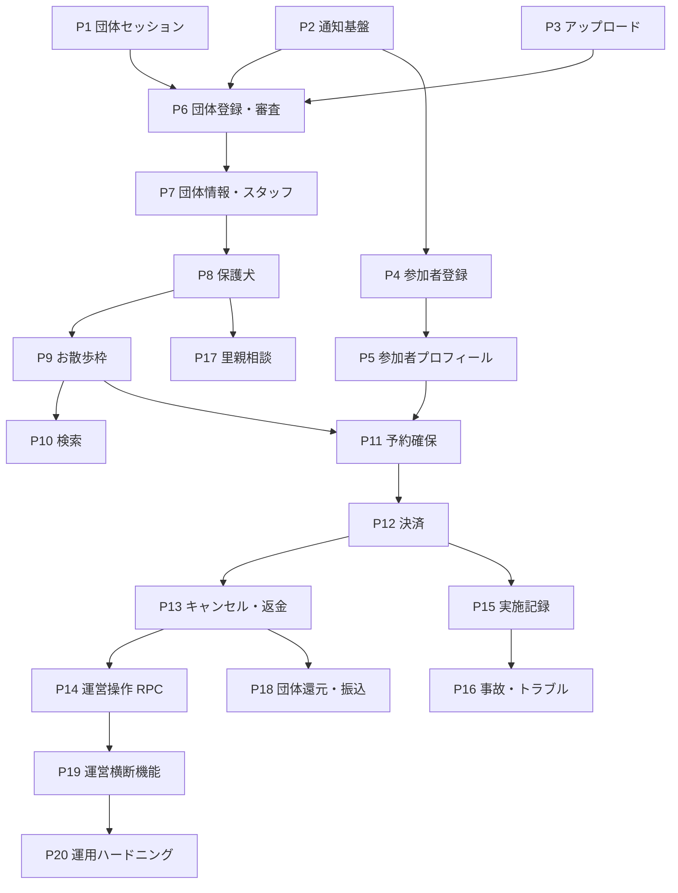

# 11-implementation-phases.md — 実装フェーズ計画

## このセクションの目的

スケルトン完成後の機能実装を、**どの順番で・どこで区切って進めるか**を定義する。順序と依存関係
のみを扱い、**日程・工数・担当者は書かない**（00_README §0 の方針）。

- 各フェーズが実装する機能グループ（PRD-03 の FG）・画面（PRD-04 の SCR/ADM/SYS）・状態遷移
  （DEV-09）の対応を定義する
- フェーズ間の依存と、GOV-02 の未決事項によるブロッカーを明示する
- 何を作るか（仕様）は各 FG の元文書が正本。本書は**順序だけ**を持つ

## 0-H. ハイブリッド編集ガイド（要点）

- 推奨モード: Hybrid（AI が依存関係を整理 + Tech Lead が順序を承認）
- 人間確認必須: フェーズ境界の妥当性、ブロッカー（GOV-02）の解決順、並行作業の可否

---

## 1. 前提：実装は「画面を作る」作業ではない

全画面のスケルトンは作成済みで、各画面は view model 型に束縛した `const` に `lib/mocks/` の仮
データを代入した状態にある（`Decided` — GOV-01 D-029）。したがって各フェーズの作業は:

1. `packages/schema` のテーブルは**既に存在する**（DEV-07、29 テーブル）ので変更は原則不要
2. Service + Zod バリデーション + API ルートを実装する（`scaffold` スキル。参照実装は `inquiries`）
3. 画面の `const` を mock から Service 呼び出しに差し替える（1 行）
4. 通知・監査ログ・認可・テナント境界を結線する

スケルトンを作り直す作業は含まれない。テーブル定義の変更が必要になった場合は DEV-07 を先に直す
（`schema-build` スキル）。

### 1-1. フェーズの単位

**1 フェーズ = 1 ブランチ = 1 PR**（`Decided` — GOV-01 D-034）。フェーズをまたぐ変更が必要に
なった場合は、そのフェーズの依存が間違っている合図なので、本書を先に直す。

ブランチは §3 の表の名前で **20 本すべてを `dev` から作成済み**（2026-09-23 時点）。着手時に
`dev` の最新を取り込んでから作業する — 先行フェーズがマージされた後は、作成時点の `dev` が
古くなっているため。

### 1-2. 全フェーズ共通の完了条件（DoD）

| # | 条件 | 確認方法 |
| --- | --- | --- |
| 1 | 対象画面が mock を参照しなくなっている | `pnpm test` が出力する mock 残数が画面数だけ減る（`screens.test.ts`） |
| 2 | 状態遷移を含む場合、遷移マトリクスが全網羅でテストされている | Vitest（DEV-09 §5-2 の `it.each` パターン） |
| 3 | `/organization/*` を触る場合、**テナント境界**のテストがある | 他団体の行が一覧・詳細に混入しないこと（DEV-06 §12。認可と同格） |
| 4 | 主要導線の E2E が 1 本ある | ハイドレーション漏れは E2E でしか検出できない（DEV-03 §4） |

状態を変更する Service 関数には `activity_log` への記録が要る（DEV-05 §9-1）。テストで検出でき
ないため、PR レビューの必須確認項目とする。

---

## 2. 依存関係の全体像

> **P1・P2・P3 は他のほぼ全フェーズを塞いでいる。** 特に P1（団体セッション）は `/organization/*`
> の 21 画面が待っている状態であり、D-030 の dev 限定仮セッションが生きているのもこのフェーズ
> までである。

---

## 3. フェーズ定義

`状態` 列は実装の進捗を記録する運用列（`未着手` / `進行中` / `完了`）。フェーズ完了時に更新する。

### 3-1. Stage 0 — 土台

| # | ブランチ | 範囲 | 依存 | ブロッカー | 状態 |
| --- | --- | --- | --- | --- | --- |
| P1 | `feature/org-session` | ADM-00/24/25/26。OrganizationMember のセッション発行・ログアウト・パスワード再設定・招待受諾。**D-030 の dev 限定仮セッションを撤去**し、`organization-session.ts` を読み取り専用から発行可能にする | — | なし（前提だった D-021 のスコープ付きロックアウトは実装済み） | 未着手 |
| P2 | `feature/notifications` | FG-13（F-13-01/02）。Resend 連携（DEV-10 §3）+ `notifications` / `notification_settings`。SCR-32/48、ADM-22/27 | — | なし | 未着手 |
| P3 | `feature/uploads` | `apps/public` 側の R2 サービス（DEV-10 §4）。MIME / 拡張子 / サイズ / 実バイトの 4 重検証、ULID リネーム。`vitest.config.ts` に `r2Buckets` 追加 | — | なし | 未着手 |

> P2 は以降のほぼ全フェーズが呼ぶ。通知種別が OFF のとき `notifications` への INSERT とメール
> 送信の**両方**をスキップすることをテストで固定する（DEV-05 §4-1）。

### 3-2. Stage 1 — Walker 基盤

| # | ブランチ | 範囲 | 依存 | ブロッカー | 状態 |
| --- | --- | --- | --- | --- | --- |
| P4 | `feature/walker-registration` | FG-01。SCR-08/09/10/13/14。WalkerProfile `provisional → pending_verification → active`（DEV-09 §2-4）、規約同意の版番号記録 | P2 | **TBD-61（SMS 送信手段が未定義）**。TBD-42（規約改定時の再同意） | 未着手 |
| P5 | `feature/walker-profile` | FG-02。SCR-21/22/23/29/33。緊急連絡先、お気に入り、退会（`withdrawn`） | P4 | なし | 未着手 |

> **TBD-61 は P4 の着手前に解決が必要。** `pending_verification → active` の条件が「メール確認 +
> 電話確認 + 規約同意」であり（DEV-09 §2-4-3）、`active` は予約の前提（`requireActiveWalkerProfile`）
> のため、コアフローのクリティカルパス上にある。

### 3-3. Stage 2 — 団体オンボーディング

| # | ブランチ | 範囲 | 依存 | ブロッカー | 状態 |
| --- | --- | --- | --- | --- | --- |
| P6 | `feature/org-application` | FG-03。SCR-15/16/51 + SYS-04/05。Organization の審査遷移 8 状態（DEV-09 §2-1）、申請書類のアップロード、審査結果通知。審査系の書き込みは `apps/admin` から D1 直接（DEV-05 §1 の例外パターン） | P1,P2,P3 | TBD-24/25/28（審査基準） | 未着手 |
| P7 | `feature/org-profile-staff` | FG-04。ADM-02/03/04/23 + SYS-06/07/08。Invitation（3 状態）、OrganizationMember（3 状態）、団体退会申請、**住所のジオコーディング**（DEV-10 §9） | P6 | TBD-40（Google Maps API キー） | 未着手 |

> **P6 が「団体が存在できる」分岐点**で、Stage 3 以降の全フェーズの前提になる。P7 で初めて
> `org_admin` 限定操作が登場するため、ロール認可のテストはここから必須（DEV-06 §12）。

### 3-4. Stage 3 — カタログ

| # | ブランチ | 範囲 | 依存 | ブロッカー | 状態 |
| --- | --- | --- | --- | --- | --- |
| P8 | `feature/dogs` | FG-05。ADM-05/06/07 + SCR-04/05 + SYS-09/10。Dog `adoptionStatus` 6 状態（DEV-09 §2-5）、写真、`internalNotes` の団体限定タブ（PRD-04 §4-3） | P7 | なし | 未着手 |
| P9 | `feature/walk-slots` | FG-06。ADM-08/09/10 + SCR-06/07 + SYS-11/12。WalkSlot 8 状態（DEV-09 §2-6）、`walk_slot_dogs`、開催地のジオコーディング | P8 | TBD-14/15（複数名参加の可否が枠の定員設計に影響） | 未着手 |
| P10 | `feature/search` | FG-07 の検索部分。SCR-01/02/03 の実データ化、エリア・日付フィルタ（URL クエリ保持）、**Haversine 距離検索**。絞り込みを先に適用してから距離計算する（DEV-05 §8） | P9 | TBD-40 | 未着手 |

### 3-5. Stage 4 — 取引

| # | ブランチ | 範囲 | 依存 | ブロッカー | 状態 |
| --- | --- | --- | --- | --- | --- |
| P11 | `feature/reservation-hold` | SCR-17。Reservation `processing → awaiting_payment`（DEV-09 §2-7）、`walk_slots.reserved_count` の加算を同一 `batch()` に、予約作成の KV レート制限（10 回/時/Walker、DEV-02 §7） | P5,P9 | TBD-14/15 | 未着手 |
| P12 | `feature/payments` | FG-08 前半。SCR-18/19/20。Stripe Checkout / Payment Intent、Webhook 受信 + `stripe_event_logs` による冪等性（DEV-10 §2）、Payment 7 状態、Reservation `confirmed` 遷移 | P11 | **TBD-01/02/08/09**（料金）、**TBD-37/38/39**（ドメイン・メール・Stripe 設定） | 未着手 |
| P13 | `feature/cancel-refund` | FG-08 後半。SCR-24/25。キャンセル規定の判定、返金 API、WalkSlot 中止と予約の連動（DEV-09 §2-6-4） | P12 | **TBD-10/11/12**（キャンセル・返金条件） | 未着手 |
| P14 | `feature/admin-ops-rpc` | D-022 の `AdminOps`（`WorkerEntrypoint`）+ SYS-13/14/15/16。`apps/public` の `main` を `src/worker.ts` へ変更 | P13 | **TBD-58 を解決するフェーズ** | 未着手 |

> **P11 で一度区切る**のは、Stripe 関連の TBD が埋まらない間も予約導線の骨格を進められるように
> するため。P12 は単独で最長のフェーズになる見込みで、ブロッカーも最多である。

### 3-6. Stage 5 — 実施後と運営

| # | ブランチ | 範囲 | 依存 | ブロッカー | 状態 |
| --- | --- | --- | --- | --- | --- |
| P15 | `feature/walk-records` | FG-10。ADM-13/14 + SCR-26/27/28 | P12 | なし | 未着手 |
| P16 | `feature/incidents` | FG-12。ADM-17/18/19 + SYS-19/20。Incident 5 状態（DEV-09 §2-11）、P1 重大度の運営への即時メール（F-12-02） | P15 | TBD-17/18/20（保険・責任分担。**画面文言のみ**の依存でフロー自体は進められる） | 未着手 |
| P17 | `feature/adoption-inquiries` | FG-11。SCR-49/50/30/31 + ADM-20/21 + SYS-21/22。AdoptionInquiry 7 状態（DEV-09 §2-12） | P8 | TBD-30〜34 | 未着手 |
| P18 | `feature/payouts` | FG-09。Cron Triggers の月次集計 + admin の確定操作 + Stripe Connect Transfer + ADM-15/16 + SYS-17/18。集計・確定は `apps/admin`、参照専用クエリのみ `apps/public`（DEV-05 §7） | P13 | **TBD-29**（振込サイクル） | 未着手 |
| P19 | `feature/admin-platform` | FG-15 残り。SYS-02/03（WalkerProfile の `restricted` / `suspended`）、SYS-25 管理操作履歴、SYS-01 ダッシュボードの実データ化 | P14 | TBD-13（利用制限の基準） | 未着手 |
| P20 | `chore/ops-hardening` | 残りの KV レート制限（DEV-02 §7）、データ保管期限の削除バッチ（OPS-02 §4-3）、**TBD-60 の Access 実測**（DEV-08 §4）、staging → production | P19 | なし | 未着手 |

---

## 4. 並行作業

1 フェーズ = 1 ブランチのため、依存の無いフェーズは並行できる。

| 組 | 条件 |
| --- | --- |
| P1 / P2 / P3 | 相互に独立。Stage 0 は 3 本同時に進められる |
| (P4,P5) と (P8,P9) | Walker 系とカタログ系は独立。ただし P8 は P7 の完了が前提 |
| P15 と P17 | 実施記録と里親相談は互いに独立 |

D1 のテーブルは共有だがフェーズごとに触る行が異なるため、マイグレーションの競合は原則発生し
ない。DEV-07 の変更を伴うフェーズが 2 本並行する場合のみ、`pnpm db:generate` の実行順に注意
する（CLAUDE.md「Local database」）。

---

## 5. マイルストーン

| マイルストーン | 完了フェーズ | 意味 |
| --- | --- | --- |
| M1 団体が存在できる | P1〜P7 | 申請 → 審査 → 承認 → 団体情報の編集が一気通貫で動く |
| M2 カタログが見える | P8〜P10 | 公開画面が実データで、エリア・距離検索が効く |
| M3 取引が成立する | P11〜P14 | 予約 → 決済 → キャンセル・返金まで通る（MVP のコア） |
| M4 運営が回る | P15〜P19 | 実施記録・事故対応・還元・横断管理が揃う |
| M5 リリース可能 | P20 | DEV-08 §4 のリリース前チェックリストが全項目クリア |

---

## 6. 記入時チェックポイント

- 各フェーズの範囲が PRD-03 の FG と PRD-04 の画面 ID に対応しているか（対応の無い作業が紛れて
  いないか）
- 依存が §2 の図と §3 の表で一致しているか
- ブロッカーが GOV-02 の TBD-ID で書かれているか（散文で「未確定」と書かない）
- フェーズ完了時に `状態` 列と `last-updated` を更新したか
- 日程・工数・担当者を書いていないか（00_README §0）
