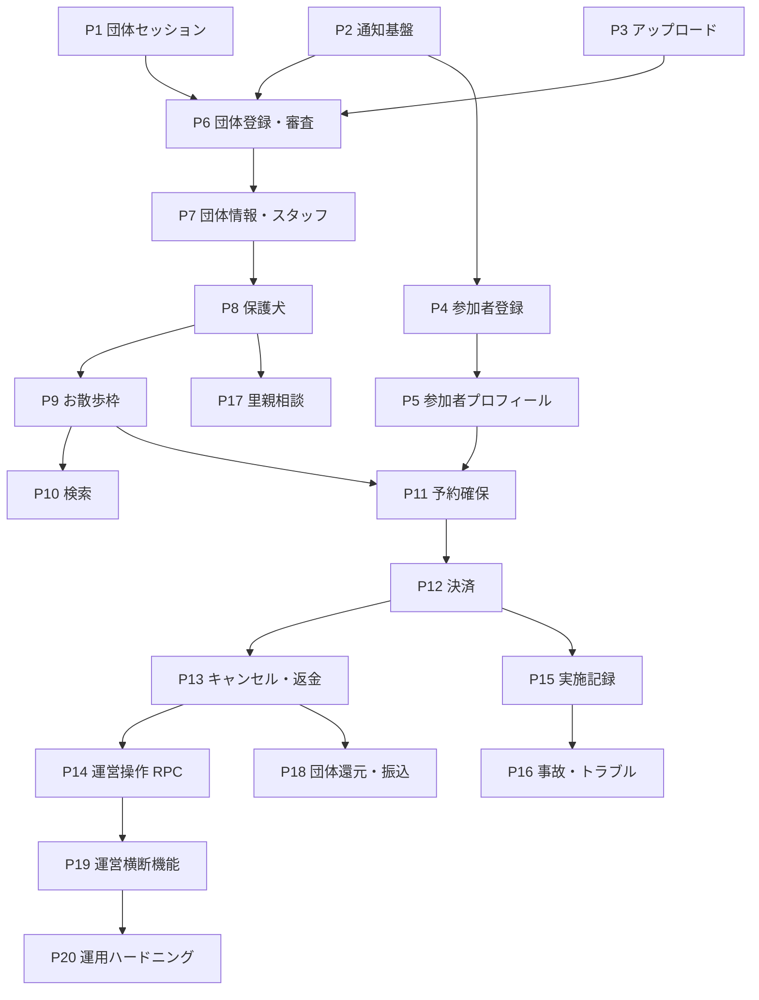

# 11-implementation-phases.md — 実装フェーズ計画

## このセクションの目的

スケルトン完成後の機能実装を、**どの順番で・どこで区切って進めるか**を定義する。順序と依存関係
のみを扱い、**日程・工数・担当者は書かない**（00_README §0 の方針）。

- 各フェーズが実装する機能グループ（PRD-03 の FG）・画面（PRD-04 の SCR/ADM/SYS）・状態遷移
  （DEV-09）の対応を定義する
- フェーズ間の依存と、GOV-02 の未決事項によるブロッカーを明示する
- 何を作るか（仕様）は各 FG の元文書が正本。本書は**順序だけ**を持つ

## 0-H. ハイブリッド編集ガイド（要点）

- 推奨モード: Hybrid（AI が依存関係を整理 + Tech Lead が順序を承認）
- 人間確認必須: フェーズ境界の妥当性、ブロッカー（GOV-02）の解決順、並行作業の可否

---

## 1. 前提：実装は「画面を作る」作業ではない

全画面のスケルトンは作成済みで、各画面は view model 型に束縛した `const` に `lib/mocks/` の仮
データを代入した状態にある（`Decided` — GOV-01 D-029）。したがって各フェーズの作業は:

1. `packages/schema` のテーブルは**既に存在する**（DEV-07、29 テーブル）ので変更は原則不要
2. Service + Zod バリデーション + API ルートを実装する（`scaffold` スキル。参照実装は `inquiries`）
3. 画面の `const` を mock から Service 呼び出しに差し替える（1 行）
4. 通知・監査ログ・認可・テナント境界を結線する

スケルトンを作り直す作業は含まれない。テーブル定義の変更が必要になった場合は DEV-07 を先に直す
（`schema-build` スキル）。

### 1-1. フェーズの単位

**1 フェーズ = 1 ブランチ = 1 PR**（`Decided` — GOV-01 D-034）。フェーズをまたぐ変更が必要に
なった場合は、そのフェーズの依存が間違っている合図なので、本書を先に直す。

ブランチは §3 の表の名前で **20 本すべてを `dev` から作成済み**（2026-09-23 時点）。着手時に
`dev` の最新を取り込んでから作業する — 先行フェーズがマージされた後は、作成時点の `dev` が
古くなっているため。

### 1-2. 全フェーズ共通の完了条件（DoD）

| # | 条件 | 確認方法 |
| --- | --- | --- |
| 1 | 対象画面が mock を参照しなくなっている | `pnpm test` が出力する mock 残数が画面数だけ減る（`screens.test.ts`） |
| 2 | 状態遷移を含む場合、遷移マトリクスが全網羅でテストされている | Vitest（DEV-09 §5-2 の `it.each` パターン） |
| 3 | `/organization/*` を触る場合、**テナント境界**のテストがある | 他団体の行が一覧・詳細に混入しないこと（DEV-06 §12。認可と同格） |
| 4 | 主要導線の E2E が 1 本ある | ハイドレーション漏れは E2E でしか検出できない（DEV-03 §4） |

状態を変更する Service 関数には `activity_log` への記録が要る（DEV-05 §9-1）。テストで検出でき
ないため、PR レビューの必須確認項目とする。

---

## 2. 依存関係の全体像

> **P1・P2・P3 は他のほぼ全フェーズを塞いでいる。** 特に P1（団体セッション）は `/organization/*`
> の 21 画面が待っている状態であり、D-030 の dev 限定仮セッションが生きているのもこのフェーズ
> までである。

---

## 3. フェーズ定義

`状態` 列は実装の進捗を記録する運用列（`未着手` / `進行中` / `完了`）。フェーズ完了時に更新する。

### 3-1. Stage 0 — 土台

| # | ブランチ | 範囲 | 依存 | ブロッカー | 状態 |
| --- | --- | --- | --- | --- | --- |
| P1 | `feature/org-session` | ADM-00/24/25/26。OrganizationMember のセッション発行・ログアウト・パスワード再設定・招待受諾。**D-030 の dev 限定仮セッションを撤去**し、`organization-session.ts` を読み取り専用から発行可能にする | — | 再設定リンクの**送信**は P2（Resend）待ち。トークン発行と消費は本フェーズで完結 | 進行中 |
| P2 | `feature/notifications` | FG-13（F-13-01/02/03）。Resend 連携（DEV-10 §3）+ `notifications` / `notification_settings`。SCR-32/48、ADM-22/27。通知種別のカタログは `apps/public/src/lib/notification-types.ts`（DEV-07 §5-18 が型を列挙していないため） | — | 本番送信は TBD-38（ドメイン認証）待ち。キー未設定時は送信をスキップしてログに残す | 進行中 |
| P3 | `feature/uploads` | `apps/public` 側の R2 サービス（DEV-10 §4）。4 重検証と署名は `@app/server-kit/files` に集約（GOV-01 D-035）、ULID リネーム、バケット構造（§4-2）、非公開ファイルの配信ルート（§4-3、D-024）。`vitest.config.ts` に `r2Buckets` 追加 | — | 申請書類のアップロードは P6（申請トークン経由のため） | 進行中 |

> P2 は以降のほぼ全フェーズが呼ぶ。通知種別が OFF のとき `notifications` への INSERT とメール
> 送信の**両方**をスキップすることをテストで固定する（DEV-05 §4-1）。

### 3-2. Stage 1 — Walker 基盤

| # | ブランチ | 範囲 | 依存 | ブロッカー | 状態 |
| --- | --- | --- | --- | --- | --- |
| P4 | `feature/walker-registration` | FG-01。SCR-08/09/10/13/14。WalkerProfile `provisional → pending_verification → active`（DEV-09 §2-4。**条件はメール確認 + 規約同意** — 電話確認は P11 へ、GOV-01 D-036）、規約同意の版番号記録。メール確認・再設定トークンは P1 の団体側（`organization-auth.ts`）と同じ形で Walker 用に実装する（コードは系統ごとに分ける — DEV-02 §1-4） | P2 | TBD-62（単発トークンの方式。P1 と同じ D1 トークン方式を踏襲して進行中）、TBD-42（規約改定時の再同意） | 進行中 |
| P5 | `feature/walker-profile` | FG-02。SCR-21/22/23/29/33。プロフィール編集・緊急連絡先・お気に入り・退会（`withdrawn`）。P4 からの持ち越しのうち①（`refreshWalkerProfileStatus()` の結線）と③（`any → withdrawn` のテスト）は解決済み。**②確認メールの再送導線は未実装**（期限切れ時はお問い合わせへ誘導）。`restricted` / `suspended` の遷移は admin 操作のため P19 | P4 | なし | 進行中 |

> **電話確認は P4 では実装しない**（`Decided` — GOV-01 D-036）。`pending_verification → active`
> の条件は「メール確認 + 規約同意」で、電話確認は初回予約時の別条件として P11 で実装する。
> P4 では `active` への遷移可否を 1 つの述語関数に閉じ、電話確認の欠落を `TODO(TBD-61)` として
> その 1 箇所に残す — SMS を足すときの変更点を 1 行に保つため。

### 3-3. Stage 2 — 団体オンボーディング

| # | ブランチ | 範囲 | 依存 | ブロッカー | 状態 |
| --- | --- | --- | --- | --- | --- |
| P6 | `feature/org-application` | FG-03。SCR-15/16/51 + SYS-04/05。Organization の審査遷移 8 状態（DEV-09 §2-1）、審査結果通知。審査系の書き込みは `apps/admin` から D1 直接（DEV-05 §1 の例外パターン）。**申請書類（F-03-02）は TBD-25 待ちで未実装** — 必須提出書類が決まらないとフォーム項目も R2 のキー構造も確定しないため、当面は運営が `needs_more_info` の差し戻しで依頼する。**P3 からの持ち越し 3 点も TBD-25 と同時に着手**: ①申請トークンで認可するアップロード経路（`UPLOAD_KINDS.applicationDocument` は定義済み、`/api/v1/uploads` は明示的に拒否中）②`apps/admin` 側の非公開ファイル配信ルート ③署名リンクの発行側 | P1,P2,P3 | TBD-24/25/28（審査基準・必須提出書類） | 進行中 |
| P7 | `feature/org-profile-staff` | FG-04。ADM-02/03/04/23 + SYS-06/07/08。Invitation（3 状態）、OrganizationMember（3 状態）、団体退会申請。P6 からの持ち越し 2 点（`approved → withdrawn` の実装、SYS-06/07 の一覧・詳細 = `listOrganizations()`）はいずれも解決済み。**住所のジオコーディングは未実装**（TBD-40 待ち。住所変更時は緯度経度を `null` に戻すところまでで、`updateOrganizationProfile()` に `TODO(P10)` を 1 箇所だけ残した） | P6 | TBD-40（Google Maps API キー） | 進行中 |

> **P6 が「団体が存在できる」分岐点**で、Stage 3 以降の全フェーズの前提になる。P7 で初めて
> `org_admin` 限定操作が登場するため、ロール認可のテストはここから必須（DEV-06 §12）。

> **P7 の申し送り 3 点**
>
> 1. **F-03-06（承認後の団体アカウント有効化）がどのフェーズにも割り当たっていない**
>    （GOV-02 **TBD-63**）。DEV-04 §5-9 には `POST /api/v1/organization/activate` があるが、
>    それを検証するトークンの表が DEV-07 に無い。現状、承認された団体には 1 人目の管理者を作る
>    経路が存在せず（`invitations.inviter_id` は NOT NULL なので招待でも作れない）、ローカルでは
>    seed コマンドでしか `/organization/*` に入れない。**P8 の着手前に TBD-63 を解決する。**
> 2. **Organization の運用系遷移（`suspended` / `deactivated` / 再開）は SYS-07 から押せる状態に
>    なった**が、判断基準（TBD-28）と団体への通知は P19 のまま。審査結果メールは
>    `approved` / `rejected` / `needs_more_info` の 3 つだけを送る（DEV-09 §2-1-4）。
> 3. **退会理由は `activity_log.properties` にだけ残る。** DEV-07 §5-2 に理由の列は無く、
>    運営は SYS-27 から読む前提。列が要るなら DEV-07 の変更が先。

### 3-4. Stage 3 — カタログ

| # | ブランチ | 範囲 | 依存 | ブロッカー | 状態 |
| --- | --- | --- | --- | --- | --- |
| P8 | `feature/dogs` | FG-05。ADM-05/06/07 + SCR-04/05 + SYS-09/10。Dog `adoptionStatus` 6 状態（DEV-09 §2-5）、写真、`internalNotes`（PRD-04 §4-3）。**公開画像の配信ルート（`/images/[...key]`）もここで追加**（DEV-10 §4-3） | P7 | なし | 進行中 |
| P9 | `feature/walk-slots` | FG-06。ADM-08/09/10 + SCR-06/07 + SYS-11/12。WalkSlot 8 状態（DEV-09 §2-6）、`walk_slot_dogs`、空席計算（GOV-01 D-025）、SCR-06 のエリア・日付フィルタ。**開催地のジオコーディングは未実装**（TBD-40 待ち。P7 と同じ扱い） | P8 | TBD-14/15（複数名参加の可否が枠の定員設計に影響） | 進行中 |
| P10 | `feature/search` | FG-07 の検索部分。SCR-01/02/03 の実データ化、エリア・日付・初心者可否・団体フィルタ（URL クエリ保持）、**Haversine 距離検索**（絞り込みを先に適用してから距離計算 — DEV-05 §8）、SCR-04 の保護犬検索、**団体所在地の公開範囲の実装**（DEV-07 §5-4） | P9 | TBD-40 | 進行中 |

> **P8 の申し送り 3 点**
>
> 1. **SYS-10 は読み取り専用で結線した。** 運営の書き込みは `updateDogByPlatform`（RPC。DEV-04
>    §5-15）で、それを叩く admin 側ルートが GOV-02 **TBD-58** で未決のため、`dog-edit-sheet.svelte`
>    と公開/非公開の確認ダイアログは画面から外してある（存在しないパスへ POST するボタンを
>    出さないため）。**P14 で戻す。** 共通フォーム部品の E2E は SYS-12（まだモック）側に移した。
> 2. **SCR-04 は絞り込み・ページネーションなしの一覧**（60 件上限）。エリア・日付フィルタは
>    P10 の範囲。
> 3. **写真は 1 枚だけ**（`dogs.photo_key` が単数カラム。DEV-07 §5-8）。複数枚が要るなら
>    DEV-07 の変更が先で、`walk_records.photo_keys` と同じ JSON 配列方式になる。

> **P9 の申し送り 4 点**
>
> 1. **SYS-11/12 も読み取り専用**（SYS-10 と同じ理由。GOV-02 TBD-58 → P14）。これにより
>    admin 側で編集シートを持つ画面が 0 になったため、`apps/admin/tests/e2e/edit-forms.spec.ts`
>    を `describe.skip` にしてある。**P14 で編集シートを戻すときに必ず un-skip する** —
>    `boolean-field.svelte` の「hidden 0 + checkbox 1」と `select-field.svelte` の hidden input
>    は、この 3 テストだけが担保している。
> 2. **system 起点の遷移（受付開始で `open`、受付終了で `closed`、`reserved_count` 到達で
>    `full`）は未実装**（DEV-09 §2-6-3）。現状はすべて団体スタッフの手動操作。Cron Triggers は
>    P20 の範囲で、`full ⇄ open` は予約側（P11）から呼ぶ。
> 3. **中止時の連鎖（予約 → `cancelled_*`、返金判定）は未実装**（DEV-09 §2-6-4）。`transitionWalkSlot()`
>    に `TODO(P13)` を 1 箇所だけ残した。予約が存在しない今は実害が無い。
> 4. **F-06-03（予約者一覧）は P11**。ADM-10 には予約一覧のセクションをまだ置いていない。
>    空席数の計算（D-025 の期限切れ `awaiting_payment` 除外）は P9 で実装・テスト済みで、
>    P11 はそれを使う。

> **P10 の申し送り 3 点**
>
> 1. **距離検索は「動くが、当たる行がまだ無い」状態**。Haversine の SQL・半径・並び順は実装
>    してテスト済みだが、`walk_slots.latitude/longitude` を埋めるジオコーディング（DEV-10 §9、
>    TBD-40）が未実装のため、実データでは 0 件になる。**TBD-40 が解決したら、住所登録・更新時に
>    ジオコーディングを呼ぶ実装（ADM-09/10 と ADM-02）を足すだけで機能が立ち上がる。**
> 2. **`Permissions-Policy` を `geolocation=(self)` に変更した**（`apps/public` のみ）。従来の
>    `geolocation=()` は、利用者が許可しても F-07-04 がブラウザ側で拒否される設定だった
>    （E2E で検出）。`apps/admin` は `geolocation=()` のまま。
> 3. **ページネーションは未実装**。SCR-02/04/06 はいずれも上限 60 件（SCR-01 は 6 件）で打ち切る。
>    件数が増えたらカーソル方式（GOV-01 D-032）を足す — 一覧 API と同じ方式にすること。

### 3-5. Stage 4 — 取引

| # | ブランチ | 範囲 | 依存 | ブロッカー | 状態 |
| --- | --- | --- | --- | --- | --- |
| P11 | `feature/reservation-hold` | SCR-17 + SCR-23。Reservation `processing → awaiting_payment`（DEV-09 §2-7）、予約作成の KV レート制限（10 回/時/Walker、DEV-02 §7）、**電話確認**（F-01-02。`walker_phone_verification_tokens` を DEV-07 §5-27 に追加、6 桁 10 分 5 回まで）。未確認なら SCR-23 へ誘導し、確認後は `next` で予約に戻す（GOV-01 D-036、DEV-09 §2-7-3） | P5,P9 | TBD-14/15、TBD-61（SMS プロバイダ） | 進行中 |
| P12 | `feature/payments` | FG-08 前半。SCR-18/19/20。Stripe Checkout / Payment Intent、Webhook 受信 + `stripe_event_logs` による冪等性（DEV-10 §2）、Payment 7 状態、Reservation `confirmed` 遷移 | P11 | **TBD-01/02/08/09**（料金）、**TBD-37/38/39**（ドメイン・メール・Stripe 設定） | 未着手 |
| P13 | `feature/cancel-refund` | FG-08 後半。SCR-24/25。キャンセル規定の判定、返金 API、WalkSlot 中止と予約の連動（DEV-09 §2-6-4） | P12 | **TBD-10/11/12**（キャンセル・返金条件） | 未着手 |
| P14 | `feature/admin-ops-rpc` | D-022 の `AdminOps`（`WorkerEntrypoint`）+ SYS-13/14/15/16。`apps/public` の `main` を `src/worker.ts` へ変更 | P13 | **TBD-58 を解決するフェーズ** | 未着手 |

> **P11 で一度区切る**のは、Stripe 関連の TBD が埋まらない間も予約導線の骨格を進められるように
> するため。P12 は単独で最長のフェーズになる見込みで、ブロッカーも最多である。

> **P11 の申し送り 4 点**
>
> 1. **SMS は送っていない**（GOV-02 TBD-61）。`lib/server/sms/client.ts` が送信の唯一の出口で、
>    プロバイダ未定の間はログに落とすだけ（`mail/client.ts` が鍵なしのときと同じ挙動）。
>    **確定後に変わるのは `deliver()` の中身だけ**で、呼び出し側・コードの生成・検証は変わらない。
>    E2E は D1 のトークン行からコードを読んで確認フローを通している。
> 2. **`walk_slots.reserved_count` は増やしていない。** 席の確保は予約行を数える側（GOV-01 D-025、
>    P9 の `countTakenSeats()`）で成立しており、DEV-09 §2-7-4 は加算を `→ confirmed` の副作用と
>    定めているため、**加算・減算は P12/P13 で実装する**。それまで SYS-11/12 に出る
>    `reserved_count` は「確定済みの数」であって「押さえられている席数」ではない。
> 3. **参加人数は 1〜20 で受け付けている**（`participant_count`）。TBD-14/15（複数名参加の可否）が
>    「1 予約 = 1 名」に決まった場合は、`reservationSchema` の上限と SCR-17 の `max` を 1 にするだけ
>    で足りる形にしてある。
> 4. **離脱した予約の席は 30 分で開く**が、**行の掃除は未実装**。`expires_at` は作成時
>    （`processing`）から入れ、空き枠計算は期限切れの `processing` / `awaiting_payment` を
>    除外する（DEV-07 §5-11 に追記）。D-025 のとおり在庫計算は Cron に依存しないので席は開くが、
>    行は残り続ける — `cancelled_by_platform` + `payment_timeout` への一括遷移（D-025 が「掃除
>    目的の任意実装」とした Cron）は P12/P20 で足す。

### 3-6. Stage 5 — 実施後と運営

| # | ブランチ | 範囲 | 依存 | ブロッカー | 状態 |
| --- | --- | --- | --- | --- | --- |
| P15 | `feature/walk-records` | FG-10。ADM-13/14 + SCR-26/27/28 | P12 | なし | 未着手 |
| P16 | `feature/incidents` | FG-12。ADM-17/18/19 + SYS-19/20。Incident 5 状態（DEV-09 §2-10）、P0/P1 の運営への即時メール（F-12-02。`OPS_ALERT_EMAIL` 宛、`waitUntil()`）、報告の KV レート制限（20 回/日/スタッフ）。添付は非公開（`UPLOAD_KINDS.incidentAttachment`）で、**P3 からの持ち越しだった署名リンクの発行側（`lib/server/files.ts`）もここで実装**し、P3 の `/api/v1/files/[...key]` 経由で開く。**P15 への依存は実際には無い**（`incidents` で必須の FK は `organization_id` だけで、`reservation_id` / `dog_id` / `walker_id` はいずれも NULL 可）ため、P12 を待たずに実装した | ~~P15~~ なし | TBD-17/18/20（保険・責任分担。**画面文言のみ**の依存でフロー自体は進められる） | 進行中 |
| P17 | `feature/adoption-inquiries` | FG-11。SCR-49/50/30/31 + ADM-20/21 + SYS-21/22。AdoptionInquiry 7 状態（DEV-09 §2-12） | P8 | TBD-30〜34 | 未着手 |
| P18 | `feature/payouts` | FG-09。Cron Triggers の月次集計 + admin の確定操作 + Stripe Connect Transfer + ADM-15/16 + SYS-17/18。集計・確定は `apps/admin`、参照専用クエリのみ `apps/public`（DEV-05 §7） | P13 | **TBD-29**（振込サイクル） | 未着手 |
| P19 | `feature/admin-platform` | FG-15 残り。SYS-02/03（WalkerProfile の `restricted` / `suspended`。**P5 までに実装済みの遷移は前進のみ**で、制限・停止・解除は admin 操作としてここで足す）、**Organization の `approved → suspended` / `→ deactivated` / `suspended,deactivated → approved`**（P6 は審査系のみ。掲載停止の基準は TBD-28）、SYS-25 管理操作履歴、SYS-01 ダッシュボードの実データ化 | P14 | TBD-13（利用制限の基準）、TBD-28（団体掲載停止基準） | 未着手 |
| P20 | `chore/ops-hardening` | 残りの KV レート制限（DEV-02 §7）、データ保管期限の削除バッチ（OPS-02 §4-3）、**TBD-60 の Access 実測**（DEV-08 §4）、staging → production | P19 | なし | 未着手 |

> **P16 の申し送り 4 点**
>
> 1. **SYS-20 は読み取り専用**（SYS-10/12 と同じ理由。GOV-02 TBD-58 → P14）。`incidents.status`
>    の書き手は `apps/public` の Service 1 つ（DEV-09 §3-1）なので、運営の対応更新は RPC 経由に
>    なる。**その間は団体スタッフが ADM-19 で自分の報告を進められる** — DEV-09 §2-10-2 が
>    トリガーとして団体スタッフを挙げているため、スケルトンにあった「対応状況の更新は運営が
>    行います」という文言の方が誤りだった。
> 2. **`MAIL_ADMIN_ALERTS` を `apps/public` にも置いた**（DEV-10 §11 が正本。従来は apps/admin
>    だけの想定だったが、報告が書き込まれるのは `apps/public` 側）。未設定の間は送信をスキップ
>    してログに残す（`RESEND_API_KEY` 未設定時と同じ挙動）。**本番では必ず設定すること** —
>    設定漏れは「重大事故が誰にも届かない」形で表面化する。
> 3. **署名付きリンクの発行側を実装した**（P3 の持ち越し ③）。`lib/server/files.ts` の
>    `signedFileUrl()` が 15 分の署名を付ける。**`FILE_SIGNING_KEY` が未設定のときは添付の
>    ファイル名だけを表示してリンクにしない** — 壊れたリンクを出すよりよいため。E2E はこの
>    フォールバック側を、署名の形は `tests/unit/files.test.ts` を見る。
> 4. **参加者からの報告経路は未実装。** `incidents.reported_by_type` は `walker` も取るが、
>    PRD-04 に参加者が報告する画面が無い。現状の入口は ADM-18 だけで、参加者からの申告は
>    お問い合わせ（F-14-03）経由になる。必要になったら PRD-04 の画面追加が先。

---

## 4. 並行作業

1 フェーズ = 1 ブランチのため、依存の無いフェーズは並行できる。

| 組 | 条件 |
| --- | --- |
| P1 / P2 / P3 | 相互に独立。Stage 0 は 3 本同時に進められる |
| (P4,P5) と (P8,P9) | Walker 系とカタログ系は独立。ただし P8 は P7 の完了が前提 |
| P15 と P17 | 実施記録と里親相談は互いに独立 |

D1 のテーブルは共有だがフェーズごとに触る行が異なるため、マイグレーションの競合は原則発生し
ない。DEV-07 の変更を伴うフェーズが 2 本並行する場合のみ、`pnpm db:generate` の実行順に注意
する（CLAUDE.md「Local database」）。

---

## 5. マイルストーン

| マイルストーン | 完了フェーズ | 意味 |
| --- | --- | --- |
| M1 団体が存在できる | P1〜P7 | 申請 → 審査 → 承認 → 団体情報の編集が一気通貫で動く |
| M2 カタログが見える | P8〜P10 | 公開画面が実データで、エリア・距離検索が効く |
| M3 取引が成立する | P11〜P14 | 予約 → 決済 → キャンセル・返金まで通る（MVP のコア） |
| M4 運営が回る | P15〜P19 | 実施記録・事故対応・還元・横断管理が揃う |
| M5 リリース可能 | P20 | DEV-08 §4 のリリース前チェックリストが全項目クリア |

---

## 6. 記入時チェックポイント

- 各フェーズの範囲が PRD-03 の FG と PRD-04 の画面 ID に対応しているか（対応の無い作業が紛れて
  いないか）
- 依存が §2 の図と §3 の表で一致しているか
- ブロッカーが GOV-02 の TBD-ID で書かれているか（散文で「未確定」と書かない）
- フェーズ完了時に `状態` 列と `last-updated` を更新したか
- 日程・工数・担当者を書いていないか（00_README §0）
