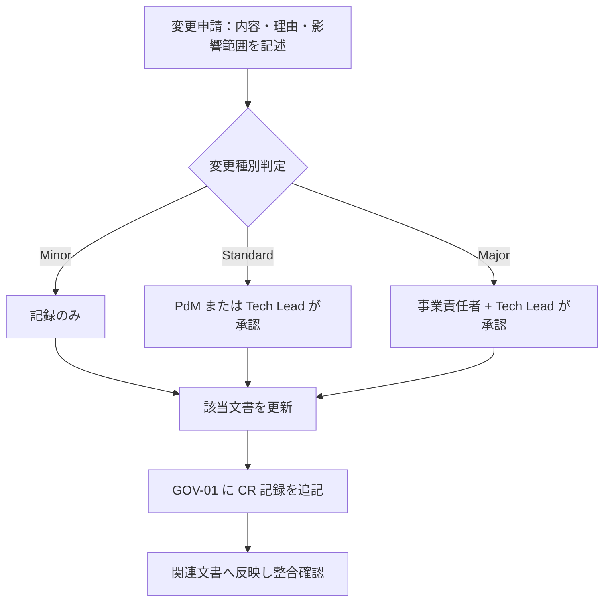

# 01-decision-log.md — 意思決定ログ

## このセクションの目的

重要な意思決定を時系列で記録し、背景と影響範囲を追跡できるようにする。**全フェーズ横断・プロジェクト開始初日から運用する**。

## 0-H. ハイブリッド編集ガイド（要点）

- 推奨モード: Human-first または Hybrid
- 人間確認必須: 本当に決定済みか、決定者の明確性、影響範囲の漏れ

---

## 1. 凡例

| 区分 | 内容 |
| --- | --- |
| D-ID | 決定 ID（D-NNN 連番） |
| 日付 | 決定確定日（YYYY-MM-DD） |
| カテゴリ | 事業 / プロダクト / 設計 / 運用 |
| 決定内容 | 確定した方針・選択 |
| 背景 | 議論の発端、選択肢、選定理由 |
| 影響範囲 | 反映が必要な文書・コード |
| 決定者 | 最終承認者 |
| 関連 TBD | 解決された GOV-02 の TBD-ID |

---

## 2. 決定ログ

### D-001：2 リポジトリ構成 → pnpm workspaces + Turborepo モノレポへの移行

| 項目 | 内容 |
| --- | --- |
| 日付 | 2026-08-17 |
| カテゴリ | 設計 |
| 決定内容 | 2 リポジトリ構成（public/admin）・npm から、1 リポジトリ内 `apps/public`/`apps/admin` + `packages/schema` の pnpm workspaces + Turborepo モノレポへ移行（`packages/types` は実際の利用箇所が出てから切り出す方針とし、見送り） |
| 背景 | 複数リポジトリ間の DB スキーマ手動コピーによる同期漏れ事故を構造的に防ぎ、ドキュメントも1箇所に集約して運用コストを下げるため（Cloudflare 公式推奨のモノレポ構成に合わせた）。`packages/config`/`packages/ui` は検討の上、実体のある共有内容がないため見送った。 |
| 影響範囲 | DEV-01 §1/§2/§3・§5, DEV-02, DEV-03, DEV-04, DEV-05, DEV-06, DEV-07 §9, DEV-08 §1/§2, DEV-09, DEV-10, PRD-01 §1-1, PRD-02 §1-3/§3, PRD-04, OPS-02 §3, 00_DEV_GUIDE.md, CLAUDE.md, README.md, 各 skill（schema-build/scaffold/admin-design/public-design/design-review）, ルート設定（package.json / pnpm-workspace.yaml / turbo.json / eslint.config.js / .prettierrc / .devcontainer） |
| 決定者 | Tech Lead |
| 関連 TBD | — |

### D-002：CI は GitHub Actions、CD は Cloudflare Workers Builds

| 項目 | 内容 |
| --- | --- |
| 日付 | 2026-08-18 |
| カテゴリ | 運用 |
| 決定内容 | 検査（CI）と デプロイ（CD）で基盤を分ける。CI は GitHub Actions（`.github/workflows/ci.yml`。`dev` 宛 PR で `pnpm check` + `pnpm build`）、CD は Cloudflare Workers Builds の GitHub 連携（リポジトリ内にデプロイ用ワークフローを持たない）。デプロイトリガーは staging ← `dev`、production ← `main`（`main` は案件 bootstrap 時に作成）。D1 マイグレーションは Workers Builds が自動実行しないため、`apps/admin` 側の Deploy command に `wrangler d1 migrations apply` を前置する |
| 背景 | DEV-08 §3 で Open だった CI/CD 基盤の決定。Workers Builds が Root directory / Build Watch Paths / Deploy command のカスタマイズ / Worker ごとの GitHub check run を備え、モノレポ 2 Worker 構成の要件（DEV-08 §2 のパスフィルタ）を満たすうえ、Cloudflare API トークンをリポジトリ側で管理せずに済むため CD はそちらに寄せた。一方 PR 時の品質ゲートは Workers Builds の範囲外で、hooks（`.claude/hooks/format-and-check.sh`）は Claude Code のセッション内でしか動かず強制力にならないため、CI は GitHub Actions で別途用意した。ブランチ名は docs が指していた `develop` が実在せず既定が `dev` であったため、docs 側を実態に合わせた |
| 影響範囲 | DEV-08 §2/§3, `.github/workflows/ci.yml`, CLAUDE.md, README.md |
| 決定者 | Tech Lead |
| 関連 TBD | — |

### D-003：事業仕様を別リポジトリから本リポジトリへ移行し、Astro + Cloudflare の技術スタックへ全面置換

| 項目 | 内容 |
| --- | --- |
| 日付 | 2026-08-18 |
| カテゴリ | 設計 |
| 決定内容 | 「保護犬おさんぽマッチングサービス」の事業・プロダクト仕様（旧リポジトリ `old-docs/`）を、本リポジトリの `docs/` に移行する。事業・プロダクト内容（BIZ / PRD の大部分）はそのまま踏襲し、技術記述（DEV 系）はすべて DEV-01 が定義する Cloudflare スタック（Astro SSR + Svelte + D1 + R2 + KV + Drizzle）に置き換える |
| 背景 | 旧リポジトリは事業立ち上げ初期に別の技術スタックを前提として書かれたが、本プロジェクトは `site-template`（Astro + Cloudflare）を基盤として開発を進める方針に転換した。事業内容・ドメインモデル・機能要件は技術非依存であり再利用可能なため、仕様の再検討コストを避けて移行する |
| 影響範囲 | docs/ 全体（1-business, 2-product, 3-development, 4-operations） |
| 決定者 | Tech Lead / 事業責任者 |
| 関連 TBD | — |

### D-004：ロール構成は super_admin/support（apps/admin）+ org_admin/org_staff（apps/public、organization_members の列で直書き）の 2 系統 4 ロール → D-011 で置換

| 項目 | 内容 |
| --- | --- |
| 日付 | 2026-08-18 |
| カテゴリ | 設計 |
| 決定内容 | 旧仕様（Platform 2 ロール + Organization 2 ロールの計 4 ロール、専用ロールライブラリの teams 機能で実装）を踏襲しつつ、ライブラリを使わず自前実装に変更する。`apps/admin` の AdminUser に `super_admin` / `support`、`apps/public` の OrganizationMember に `organization_id` + `role`（`org_admin` / `org_staff`）列を持たせる。Walker（お散歩参加者）はロールを持たずプロフィールの `status` で機能解禁を判定する（旧仕様のデータ駆動方式をそのまま踏襲） |
| 背景 | D1 + Drizzle 環境では旧仕様が使っていたようなロールライブラリが存在せず、DEV-01 の「自前実装」方針（ロールを列で持つ既存パターン）と整合させる方が実装が単純 |
| 影響範囲 | DEV-01 §2、DEV-02 §2、DEV-07（organization_members / admin_users）、PRD-01 §1-2 |
| 決定者 | Tech Lead |
| 関連 TBD | — |
| 置換 | 2026-08-19 付 D-011 により、Platform 側は `super_admin`/`support` の 2 ロールから単一 `admin` ロールへ変更。Organization 側（org_admin/org_staff）は変更なし |

### D-005：チャット・AI 機能は不採用（旧仕様の判断を継承）

| 項目 | 内容 |
| --- | --- |
| 日付 | 2026-08-18 |
| カテゴリ | プロダクト |
| 決定内容 | 旧仕様の決定（チャット・AI 機能不採用）をそのまま継承する。PRD-05 は不採用のまま、DEV-01 §2 の LLM 統合レイヤー（Vercel AI SDK）・Vector DB（Vectorize）は導入しない |
| 背景 | 事業要件（INTAKE 移行版）にチャット・AI 関連の要件がなく、通知はメール + アプリ内通知（DB）で足りるため |
| 影響範囲 | PRD-03（FG 一覧から除外）、PRD-05（不採用として記入） |
| 決定者 | PdM |
| 関連 TBD | — |

### D-006：本プロジェクトはテンプレート標準の「パターン A（コンテンツ主体サイト）」の適用範囲を超えるマーケットプレイス事業として実装する

| 項目 | 内容 |
| --- | --- |
| 日付 | 2026-08-18 |
| カテゴリ | 事業 |
| 決定内容 | 00_README §0-1 の自己診断基準ではパターン B（業務システム・マルチテナント SaaS）に該当し、本来は別テンプレートの対象だが、既に Astro + Cloudflare での実装を進めている本リポジトリ上でそのまま拡張する。多ロール権限・マーケットプレイス決済（Stripe Connect）・ジオコーディングを DEV-01 に追加することで対応する |
| 背景 | 事業自体（お散歩参加者 × 保護団体の二者間マーケットプレイス）を変更する選択肢はなく、技術基盤を `site-template` 前提で進める意思決定が先に確定していたため、テンプレートの適用範囲外を承知の上で拡張する判断をした |
| 影響範囲 | DEV-01 §0、00_README（本リポジトリでは §0-1 の基準を適用外とする）、PRD-01〜04 全体 |
| 決定者 | 事業責任者 / Tech Lead |
| 関連 TBD | — |

### D-007：保護団体ページ（org_admin/org_staff 用の管理画面）は apps/admin ではなく apps/public 側に配置する

| 項目 | 内容 |
| --- | --- |
| 日付 | 2026-08-18 |
| カテゴリ | 設計 |
| 決定内容 | 旧仕様では公開画面・保護団体ページ・プラットフォーム管理画面の 3 領域を単一アプリで提供していたが、本プロジェクトでは `apps/public` が「公開ブラウジング + Walker マイページ + 保護団体ページ（`/organization/*`）」を、`apps/admin` が「プラットフォーム運営者専用（admin）」を担当する 2 Worker 構成に再配置する |
| 背景 | 保護団体スタッフは外部の利用者（プラットフォーム運営者ではない）であり、性質上 Walker と同じ「サービス利用者」に近い。内部運営専用の `apps/admin` に外部利用者のログインを混在させるより、既存の 2 Worker 構成（apps/public = 対外、apps/admin = 対内）の境界に忠実な方が権限境界の説明が単純になる |
| 影響範囲 | DEV-01 §1、DEV-02 §1〜§3、DEV-05、DEV-06、PRD-01 §1-1、PRD-04 §3、CLAUDE.md（apps/public の D1 アクセス・認証ルートに関する記述、`eslint.config.js` の `boundaries/elements` は反映済み） |
| 決定者 | Tech Lead |
| 関連 TBD | — |

### D-008：決済は Stripe SDK 直接利用 + Stripe Connect を採用（旧仕様の判断を継承）

| 項目 | 内容 |
| --- | --- |
| 日付 | 2026-08-18 |
| カテゴリ | 設計 |
| 決定内容 | 参加費の都度課金は Stripe Payment Intent / Checkout、保護団体への還元送金は Stripe Connect（Connected Account への Transfer）を用いる |
| 背景 | 旧仕様の決定（サブスク課金向けの決済ライブラリではなく Stripe SDK 直接利用）をそのまま踏襲。DEV-01 §2 の Stripe（`stripe` npm パッケージ、`nodejs_compat` 要）に Connect 利用を明記した |
| 影響範囲 | DEV-01 §2、DEV-07、DEV-09、DEV-10 §2 |
| 決定者 | Tech Lead |
| 関連 TBD | — |

### D-009：エリア・距離検索は Google Maps Platform Geocoding API を採用（旧仕様の判断を継承）

| 項目 | 内容 |
| --- | --- |
| 日付 | 2026-08-18 |
| カテゴリ | 設計 |
| 決定内容 | 保護団体・お散歩枠の住所を Google Maps Platform Geocoding API で緯度経度へ変換し、距離計算は D1 に対する SQL（バインド変数使用）による Haversine 公式で行う |
| 背景 | 旧仕様の決定を踏襲。D1（SQLite）に専用の空間拡張はないため、想定規模であれば Haversine 公式による計算で十分と判断 |
| 影響範囲 | DEV-01 §2、DEV-02、DEV-07、DEV-10 §9 |
| 決定者 | Tech Lead |
| 関連 TBD | — |

### D-010：非同期処理（旧仕様の Queue Job 相当）は Cloudflare Queues ではなく `ctx.waitUntil()` + Cron Triggers で代替する

| 項目 | 内容 |
| --- | --- |
| 日付 | 2026-08-18 |
| カテゴリ | 設計 |
| 決定内容 | 旧仕様で非同期ジョブキューが担っていた処理（Stripe Webhook 後処理・メール送信・監査ログ記録・月次 Payout 集計・データ保持期限の自動削除）を、リクエスト内の後処理は `ctx.waitUntil()`、定期バッチは Cloudflare Cron Triggers（`apps/admin` の Scheduled Worker）に置き換える |
| 背景 | CLAUDE.md のハード制約（Cloudflare Queues 不採用）および DEV-01 §3 の既定方針に従う。マーケットプレイス特有の月次集計・送金処理も Cron Triggers で対応可能と判断 |
| 影響範囲 | DEV-01 §4、DEV-05、DEV-08、DEV-09、DEV-10、OPS-02 §4-3 |
| 決定者 | Tech Lead |
| 関連 TBD | — |

### D-011：ロール構成を「apps/admin: admin 単一ロール」+「apps/public: org_admin/org_staff」の 1 系統 3 ロールに簡素化（D-004 を置換）

| 項目 | 内容 |
| --- | --- |
| 日付 | 2026-08-19 |
| カテゴリ | 設計 |
| 決定内容 | D-004 で決定した「Platform 2 ロール（`super_admin`/`support`）+ Organization 2 ロールの計 4 ロール」構成を撤回する。`apps/admin` の AdminUser は、読み取り専用のサポート担当ロールを設けず、単一ロール `admin`（全操作を実行可能）とする。ロールが常に 1 種類のみとなるため、AdminUser テーブルは `role` 列を持たない（列自体を廃止）。`apps/public` の OrganizationMember（`org_admin`/`org_staff` の 2 ロール）・Walker（ロールなし、`status` で機能解禁を判定）は D-004 のまま変更しない |
| 背景 | 事業側の確定方針として、プラットフォーム管理者はサポート担当などの追加ロールを持たない 1 ロール構成とすることが決まった。D-004 時点では旧仕様の Platform 2 ロール構成をそのまま踏襲していたが、実際の運用体制は Tech Lead / PdM 等の兼務前提の少人数チームであり、書き込み不可の read-only ロールを分けて運用する実態がないため撤回する |
| 影響範囲 | DEV-01 §2、DEV-02 §2、DEV-03、DEV-04、DEV-05、DEV-06、DEV-07（admin_users）、DEV-08、DEV-09、DEV-10、PRD-01 §1-2、PRD-02、PRD-03、PRD-04、OPS-02、00_INTAKE.md |
| 決定者 | 事業責任者 / Tech Lead |
| 関連 TBD | — |

### D-012：コードジェネレータを持たず、実装系スキルは `schema-build` と `scaffold` の 2 つとする

| 項目 | 内容 |
| --- | --- |
| 日付 | 2026-09-09 |
| カテゴリ | 設計 |
| 決定内容 | 旧リポジトリの仕様書が前提としていた Plop ベースの雛形生成器（`backend-scaffold` / `page-skeleton` / `resource-scaffold` の 3 スキルと `apps/admin/plopfile.mjs`）は採用しない。実装系スキルは `schema-build`（DEV-07 → Drizzle スキーマ → migration）と `scaffold`（`inquiries` の参照実装に倣って Service / Zod バリデーション / API ルートを書く）の 2 つのみとする |
| 背景 | 移行先リポジトリには該当スキルも `plopfile.mjs` も存在せず、実在する `scaffold` スキルは「正解は動く参照実装であって雛形ではない」という方針で作られている。旧仕様書の記述は移行元リポジトリの構想を写したもので、実装と食い違っていた。雛形生成器は生成直後から実装とドリフトするため、参照実装（`apps/admin/src/lib/server/services/inquiries.ts` と `apps/admin/tests/unit/inquiries.test.ts`）を正とする方式を維持する |
| 影響範囲 | 00_DEV_GUIDE §1・§3・§4、DEV-01 §1・§9、DEV-05 §1・§12、PRD-04 §3 |
| 決定者 | Tech Lead |
| 関連 TBD | — |

### D-013：読み物系コンテンツの置き場所を「D1 / Content Collections / ページ直書き」の 3 択で振り分ける → D-016 で置換

| 項目 | 内容 |
| --- | --- |
| 日付 | 2026-09-09 |
| カテゴリ | 設計 |
| 決定内容 | 公開画面のコンテンツは、**閲覧者によって出し分けるか**と**改定履歴が要るか**で置き場所を決める。①お知らせ（News）は `audience` によるログイン状態依存の出し分けと `published_until` の時限公開を持つため **D1**。②利用規約・プライバシーポリシーは改定履歴が同意記録と対になるため **Content Collections**（`packages/content/legal/`、frontmatter に `version`）。③トップページのコピー・FAQ・利用ガイド・安全に利用するために・特定商取引法に基づく表示・各種完了案内ページは全閲覧者に同一内容で改定履歴も不要のため **ページ直書き**。④メール文面は `render*Email()` テンプレート関数としてコードで管理する。この結果 `faqs` テーブルと FAQ 管理画面（旧 SYS-26〜28。削除に伴い後続画面を繰り上げ、現在の SYS-26〜28 はお問い合わせ一覧・詳細と管理操作履歴）は作らない。**PRD-04 の全画面（SCR-01〜45 / ADM-00〜23 / SYS-01〜28）を DEV-06 §1-1 の ①〜⑥ に振り分け済みで、未判断の画面は残していない** |
| 背景 | 旧リポジトリの仕様書は Content Collections が存在しなかった時代のもので、コンテンツを一律 D1 に置く前提で書かれていた。Cloudflare の課金は D1 の行読み取りに乗るため、閲覧数の多い公開ページを D1 で賄うと管理画面の実装コストと運用コストの両方を払うことになる。一方で利用規約は F-01-06 の同意記録が「どの版に同意したか」を指す必要があり、git による版管理がそのまま証跡になる Content Collections が適する。あわせて `walker_profiles` に `terms_agreed_version` 列を追加する（同意日時だけでは版が復元できないため） |
| 影響範囲 | PRD-01 §1-1・§3-2・§5、PRD-02 §6-1・§6-2、PRD-03 FG-14・FG-15、PRD-04 §3-1・§3-3、DEV-01 §1、DEV-04 §5-5・§5-14、DEV-06 §1-1、DEV-07 §3-2・§5-3・§5-21・§5-22 |
| 決定者 | 事業責任者 / Tech Lead |
| 関連 TBD | GOV-02 TBD-41（FAQ を運営が自己編集する要求が出た場合の D1 移行） |
| 置換 | 2026-09-16 付 D-016 により、判断軸を「誰が編集するか」に一本化。お知らせは D1 → Content Collections、利用規約・プライバシーポリシーは Content Collections → `.astro` 直書き、FAQ は直書き → TypeScript 定数へ変更 |

### D-014：テンプレート標準のブログ CMS（Post / Category / Tag / PostTag）は採用しない

| 項目 | 内容 |
| --- | --- |
| 日付 | 2026-09-09 |
| カテゴリ | 設計 |
| 決定内容 | テンプレート標準の `posts` / `categories` / `tags` / `post_tags` の 4 テーブルと対応する Service / API / 管理画面を作らない。記事型コンテンツはお知らせ（Content Collections、D-016）のみとする |
| 背景 | 旧 DEV-07 §3-2 は 4 テーブルを「必須」としていたが、PRD-04 の公開サイトマップ（SCR-01〜45）にも管理画面（SYS-NN）にも対応する画面が 1 つも定義されていなかった。テンプレートから引き継いだまま残っていた残骸である。CLAUDE.md の制約により不要機能の削除は最初の `pnpm db:generate` より前に行う必要があり、本リポジトリは `packages/schema/migrations/` が未生成のため今が最後のタイミングだった。将来コーポレート発信の記事が必要になった場合は、まず `packages/content` の Content Collections を検討する（D-013 の判断軸） |
| 影響範囲 | PRD-01 §1-1・§3-2、PRD-02 §1-2・§1-3・§6-1、DEV-05 §1、DEV-07 §2-1・§3-2・§4・§10・§12、DEV-09 §1・§2-13、DEV-10 §4-2 |
| 決定者 | Tech Lead |
| 関連 TBD | — |

### D-015：サーバー共通基盤は `packages/server-kit` に置き、両アプリが import する（アプリ内 `db/`・`http/` の二重実装を置換）

| 項目 | 内容 |
| --- | --- |
| 日付 | 2026-09-15 |
| カテゴリ | 設計 |
| 決定内容 | D1 クライアント（`createDb`）は `packages/schema/src/client.ts`、HTTP エンベロープ・`AppError` 系・カーソルページネーションは `packages/server-kit/src/http/`、パスワードハッシュ・セッショントークン/TTL/期限判定・ロックアウトカウンタは `packages/server-kit/src/auth/` に置き、`apps/public` と `apps/admin` が `@app/schema/client` / `@app/server-kit/http` / `@app/server-kit/auth` として同じ実装を import する。アプリ配下に `src/lib/server/db/` および `src/lib/server/http/` を作らない。ワークスペースのパッケージ名は `@app/*` スコープ（`@app/schema` / `@app/server-kit` / `@app/content`） |
| 背景 | 旧リポジトリの仕様書は共有パッケージが `packages/schema` だけだった時期に書かれており、レスポンス整形・ページネーション・ロックアウトを「アプリごとに独立実装する」と定めていた（旧 DEV-04 §3-2、旧 DEV-05 §1）。移行先リポジトリには `packages/server-kit` が既に存在し、`apps/admin` の実装もそこを import している。エンベロープとエラー形は 2 つの Worker で同一でなければ API 仕様（DEV-04 §3）が成立せず、二重実装はドリフトの温床になる。一方で「どのテーブルを引くか・どのクッキーを読むか」は系統ごとに分離したまま（DEV-02 §1-4 の禁止事項は維持）とし、共有するのは純粋関数に限る |
| 影響範囲 | DEV-01 §1・§5-3・§8、DEV-02 §1-4・§7、DEV-03 §3-1、DEV-04 §3-2・§8、DEV-05 §1・§2、DEV-06 §1 |
| 決定者 | Tech Lead |
| 関連 TBD | GOV-02 TBD-45（`apps/public` 内 2 系統のロックアウトキーのスコープ分け） |

### D-016：読み物系コンテンツの判断軸を「誰が編集するか」に一本化し、D1 には取引データのみを置く（D-013 を置換）

| 項目 | 内容 |
| --- | --- |
| 日付 | 2026-09-16 |
| カテゴリ | 設計 |
| 決定内容 | 置き場所の判断軸を「誰が編集するか」に統一する。**開発者が更新し、運営・保護団体による編集を要件としないものはリポジトリ側に置き、D1 には取引データのみを置く。**①**Content Collections**（`packages/content/news/`）：お知らせ。`audience` による出し分けと `published_until` の時限公開は要件から外し、公開側に表示するお知らせのみを扱う。`news` テーブル・`/api/v1/news`・お知らせ管理画面（旧 SYS-23〜25）は作らず、参加者個別・団体個別への配信は既存の `notifications`（アプリ内通知、F-13-01）が担う。②**TypeScript 定数**（`apps/public/src/lib/faq.ts`）：FAQ。③**`.astro` 直書き**：トップページ・利用ガイド・安全に利用するために・特定商取引法に基づく表示・**利用規約・プライバシーポリシー**・運営会社（`/company`、新設）・サービス紹介（`/about`、新設）・各種完了案内・404/500・各フォーム画面。`packages/content/legal/` は作らない。④**コード定数**：規約・ポリシーの版番号は `apps/public/src/lib/legal.ts`（`TERMS_VERSION` / `PRIVACY_VERSION`）、参加費・団体還元額・返金規定は `apps/public/src/lib/pricing.ts`。⑤**メール文面**：`render*Email()`（D-013 から変更なし）。⑥**D1**：保護団体・保護犬・お散歩枠・予約・決済・団体還元・実施記録・里親相談・事故報告・会員・通知・お問い合わせ・監査ログのみ |
| 背景 | 同一テンプレート由来で先行実装されている `team-natural/pet-kampo` の D-002（コンテンツは Content Collections、取引データのみ D1）に考え方を揃える。D-013 の「出し分けの有無 × 改定履歴の要否」は分岐が多く、画面を足すたびに 2 軸で判定する必要があった。「誰が編集するか」の 1 軸なら、外部ユーザーが投入するデータ（保護犬・お散歩枠・予約）は自動的に D1、開発者が git で更新するものはリポジトリ側、と迷わず決まる。お知らせの `audience` 出し分けは事業側の確認の結果、公開側に表示するお知らせのみを扱うため不要と確定し、D-013 が D1 を選んだ唯一の根拠が消えた。利用規約を直書きに戻しても、版番号をコード定数に持てば git がそのまま改定履歴になり F-01-06 の同意記録は成立する（pet-kampo が送料を `lib/commerce.ts` に集約したのと同じ「単一真実源をコードに置く」流儀）。**ただし pet-kampo には規約同意の記録自体が無く、`terms_agreed_version` 相当の列も持たない。** 当プロジェクトは F-01-06 が High 機能のため、版管理だけは pet-kampo に無い形で残す |
| 影響範囲 | PRD-01 §1-1・§3-2・§5、PRD-02 §2・§3・§6-1・§6-2、PRD-03 FG-14・FG-15、PRD-04 §3-1・§3-3、DEV-04 §5-5・§5-14・§8、DEV-05 §1、DEV-06 §1-1、DEV-07 §3-2・§5-3・§5-21、DEV-09 §1・§2-13、DEV-10 §4-2、00_DEV_GUIDE §5 |
| 決定者 | 事業責任者 / Tech Lead |
| 関連 TBD | GOV-02 TBD-41（FAQ の編集要求）、TBD-42（規約改定時の再同意条件）、TBD-44（利用ガイド等の長文化） |

### D-017：公開画面の SEO は `@astrojs/sitemap` + `site` 設定の 1 箇所生成に寄せる

| 項目 | 内容 |
| --- | --- |
| 日付 | 2026-09-16 |
| カテゴリ | 設計 |
| 決定内容 | `apps/public` に `@astrojs/sitemap` を導入し、`astro.config.mjs` の `site` に正式 URL を置く。canonical・OGP の絶対 URL は `Layout.astro` が `site` から組み立て、ページ側で URL 文字列を書かない。サイトマップから除外するルート（会員専用・取引・認証・エラー・トークン付き）は `astro.config.mjs` の定数 + `sitemap({ filter })` で弾く。`robots.txt` は `apps/public/public/` に静的配置。構造化データはお散歩枠に `Event`、保護団体に `Organization` の JSON-LD を置く（`[Assumed]`）。保護団体ページ・`apps/admin` は検索対象外 |
| 背景 | PRD-04 のサイトマップにも DEV-06 にも SEO の記述が 1 行も無く、`@astrojs/sitemap` も未導入だった。保護犬・お散歩枠は検索流入が集客の主線になるため、実装が進んでから後付けすると全ページの `<head>` を触り直すことになる。`team-natural/pet-kampo` が同じ構成（`site` + `EXCLUDED_FROM_SITEMAP` + filter）で先行しており、移植コストが低い |
| 影響範囲 | DEV-06 §11-1（新設）、PRD-04 §3-1、`apps/public/astro.config.mjs`、`apps/public/src/layouts/Layout.astro`、`apps/public/package.json` |
| 決定者 | Tech Lead |
| 関連 TBD | GOV-02 TBD-35・TBD-37（`site` に入れる正式ドメイン）、TBD-52（アクセス解析） |

### D-018：ブランド確定を待たず暫定パレットで着手し、色の定義を `@theme` 1 箇所に集約する

| 項目 | 内容 |
| --- | --- |
| 日付 | 2026-09-16 |
| カテゴリ | 設計 |
| 決定内容 | 正式ブランド名（GOV-02 TBD-35）の確定を待たず、温かみのある暫定パレットで `public-design` の establishing run を回す。ブランド色は `apps/public/src/styles/global.css` の Tailwind v4 `@theme` ブロックに `--color-brand-*` として定義し、ブランド確定時はここ 1 箇所の差し替えで全画面へ反映する。**定義するのはブランド色のみ**で、余白・タイポグラフィ等のトークン層は作らない |
| 背景 | TBD-35 は P0 だが確定時期が読めず、待つと公開画面の実装が 1 画面も始められない。一方で色を各画面の Tailwind ユーティリティに直書きすると、確定時に全画面の書き換えが発生する。CLAUDE.md / PRD-04 §6-2 の「`global.css` は意図的にトークンレス」という方針とは衝突するが、ブランド色に限った最小限の例外とし、トークン体系を作る意図ではないことを明記して両立させる |
| 影響範囲 | PRD-04 §6-2・§8、DEV-06 §6、`apps/public/src/styles/global.css` |
| 決定者 | 事業責任者 / Tech Lead |
| 関連 TBD | GOV-02 TBD-35（正式ブランド名・確定後に色を差し替え） |

### D-019：保護団体ページは共通部品 5 種を先に作り切ってから画面実装に入る

| 項目 | 内容 |
| --- | --- |
| 日付 | 2026-09-16 |
| カテゴリ | 設計 |
| 決定内容 | 保護団体ページ（ADM-00〜27、28 画面）に新しいコンポーネントライブラリを追加せず、プレーン Tailwind + 手組みの部品を `apps/public/src/lib/components/organization/` に集約する（PRD-04 §6-1 の `[Assumed]` を確定に格上げ）。あわせて、**ADM 系の最初の画面に着手する前に データテーブル / フォーム部品 / カード / モーダル / トースト の 5 種を 1 セット作り切る** |
| 背景 | 一覧系だけで 8 画面・フォーム系で 10 画面あり、画面ごとに都度実装すると同じテーブルが微妙に違う実装で並ぶ。shadcn-svelte を `apps/public` に入れない方針（`components.json` が 1 アプリのスタイルシートと 1:1 対応する）は維持したまま、ライブラリの代わりになる最小セットを先に用意する |
| 影響範囲 | PRD-04 §6-1、DEV-06 §5、`apps/public/src/lib/components/organization/` |
| 決定者 | Tech Lead |
| 関連 TBD | — |

> **「着手」の範囲**（2026-09-17 追記）: ここで言う「最初の画面に着手する前」は **UI 実装**の前を指し、D-029 のスケルトン作成は含まない。スケルトンは部品を 1 つも使わず（見出しと素の `<table>` / `<form>` のみ）、部品が揃った時点で中身を差し替える前提のため、先に 28 枚を作っても「同じテーブルが微妙に違う実装で 10 個生まれる」という D-019 が防ぎたい事態は起きない。**5 種の部品は ADM 画面の UI 実装に入る前に作り切る**という制約は変わっていない。

### D-020：単発トークンは系統ごとに別テーブルとする（polymorphic 1 テーブルにまとめない）

| 項目 | 内容 |
| --- | --- |
| 日付 | 2026-09-16 |
| カテゴリ | 設計 |
| 決定内容 | パスワードリセット等の単発トークンを、既存の `password_reset_tokens`（`admin_users` 向け、DEV-07 §4-6）に加えて **`walker_password_reset_tokens`**（§5-22）・**`organization_member_password_reset_tokens`**（§5-23）・**`organization_application_tokens`**（§5-24、SCR-51 の差し戻し対応）の 3 テーブルとして持つ。`subject_type` + `subject_id` の polymorphic 1 テーブルにはまとめない。列構成は 4 テーブルとも同一（`token` UNIQUE / `expires_at` / `used_at` / `created_at` + 系統ごとの FK）で、Web Crypto HMAC 署名でトークンを発行し `used_at` で 1 回限りの使用を強制する。招待受諾（ADM-26）は既存の `invitations`（§5-7）が担当する |
| 背景 | GOV-02 TBD-47 の解決。polymorphic 1 テーブルは引くたびに `AND subject_type = 'walker'` 相当の絞り込みが必要で、**書き忘れると Walker のトークンで団体スタッフのパスワードを変更できる** — 3 系統分離（DEV-02 §1-4）が防ごうとしている取り違えそのものになる。テーブルを分ければこの事故は構造的に起こり得ない。DEV-02 §1-4 は既に「実装の重複を許容してでも境界を明確にする」と明言しており、認証境界については重複を選ぶ方針が確定している。テーブルを持たない HMAC 署名のみの方式も検討したが、使用済みを記録できずリセットリンクが有効期限内は何度でも使えるため、パスワードリセットには採れない。`notification_settings` が polymorphic なのは通知設定が漏れても実害が小さいためで、認証情報とは重みが違う |
| 影響範囲 | DEV-07 §3-1・§5-23〜§5-25、DEV-02 §1-2・§1-3、PRD-04 §3-1（SCR-13・14・51）・§3-2（ADM-24・25） |
| 決定者 | Tech Lead |
| 関連 TBD | GOV-02 TBD-47（解決済み） |

### D-021：ロックアウトカウンタに系統スコープを必須引数として持たせる

| 項目 | 内容 |
| --- | --- |
| 日付 | 2026-09-17 |
| カテゴリ | 設計 |
| 決定内容 | `@app/server-kit/auth` の `assertNotLockedOut` / `recordAuthFailure` / `clearAuthFailures` に `AuthScope = "admin" \| "walker" \| "organization"` を**必須の第 2 引数**として追加し、KV キーを `auth-fail:{scope}:ip:{ip}` / `auth-fail:{scope}:email:{email}`（`auth-lock:` も同様）に変更する。デフォルト値は持たせない。IP スコープも系統ごとに分ける |
| 背景 | GOV-02 TBD-45 の解決。現行キーは `auth-lock:email:{email}` で系統を含まず、Walker と OrganizationMember は `apps/public` の同一 KV 名前空間を共有する。同一メールアドレスが両系統に存在しうる以上、片方のログイン失敗がもう片方をロックする（正しいパスワードで 429 になる）一方、攻撃者は 2 系統を合算して試行回数を稼げる。引数にデフォルト値を与えると付け忘れが型検査を素通りするため、必須引数にして**呼び出し側全てをコンパイルエラーで洗い出す**。`apps/admin` は KV 名前空間が別で衝突しないが、シグネチャを 1 つに揃える方が取り違えが起きない。IP スコープを分けると 1 IP あたりの総試行回数は系統数だけ増えるが、IP ベースの汎用レート制限は WAF 側の責務であり（DEV-02 §7）、アプリ側カウンタの目的はアカウント保護である |
| 影響範囲 | `packages/server-kit/src/auth/lockout.ts`、`packages/server-kit/tests/lockout.test.ts`、両アプリの `services/auth.ts`、DEV-02 §7、CLAUDE.md（ローカルのロック解除コマンドのキー名） |
| 決定者 | Tech Lead |
| 関連 TBD | GOV-02 TBD-45（解決済み） |

### D-022：アプリを跨ぐ運営者操作は Service Binding の RPC で行い、`admin_session` を `apps/public` に渡さない

| 項目 | 内容 |
| --- | --- |
| 日付 | 2026-09-17 |
| カテゴリ | 設計 |
| 決定内容 | Reservation / Payment / Payout / Incident / AdoptionInquiry / WalkerProfile に対する運営者操作は、`apps/public` が `WorkerEntrypoint` を継承して export する名前付きエントリポイント `AdminOps` を、`apps/admin` が Service Binding 経由で RPC 呼び出しして実行する。`apps/public` の `wrangler.jsonc` の `main` を `src/worker.ts` に変更し、`@astrojs/cloudflare/handler` の `handle` を default export の `fetch` に据えたうえで `AdminOps` を並べて export する。認可は `apps/admin` 側の `requireSession` で完結させ、RPC 引数に AdminUser の `public_id` を渡して `activity_log.causer_*` に記録する。**`apps/public` から `admin_sessions` テーブルを引く方式と、`admin_session` クッキーの Domain を親ドメインに広げる方式は採らない** |
| 背景 | GOV-02 TBD-46 の解決。`apps/admin` はサブドメインで動くため、`admin_session` クッキーは既定では `apps/public` に送信されない。届かせるには Domain を親ドメインに広げることになり、運営者の管理セッションが公開サイトの全リクエストに同送される — 3 系統分離（DEV-02 §1-4）が守ろうとしている境界そのものを崩す。`apps/public` 側に `admin_sessions` 検証を複製する案も、クッキーが届かない以上トークンを別経路で渡す必要があり、結局同じ問題に戻る。RPC なら**インターネットから到達できる経路が増えない**（`WorkerEntrypoint` のメソッドは HTTP ルーティングの対象外で、バインディングを宣言した Worker からしか呼べない）ため、共有シークレットの管理も不要。遷移関数の配置を `apps/public` に保ったまま実行者だけを跨がせられるので、DEV-09 §3-1 の原則も動かさずに済む。`@astrojs/cloudflare` 14.3.0 が `./handler` を export しており、カスタムエントリポイントと名前付き export の併存は公式の手順として成立することを確認済み |
| 影響範囲 | DEV-04 §2-4・§5-15、DEV-09 §2-9-3・§3-1、DEV-02 §1-4、DEV-08、`apps/public/src/worker.ts`（新規）、両アプリの `wrangler.jsonc` |
| 決定者 | Tech Lead |
| 関連 TBD | GOV-02 TBD-46（解決済み） |

### D-023：状態遷移表は `packages/schema`、遷移の検証関数は `packages/server-kit` に置く

| 項目 | 内容 |
| --- | --- |
| 日付 | 2026-09-17 |
| カテゴリ | 設計 |
| 決定内容 | `OrganizationStatus` 等の status union 型と `ORGANIZATION_TRANSITIONS` 等の遷移表を `packages/schema/src/transitions.ts` に置き、遷移の妥当性を検証する汎用関数 `assertTransition()` を `packages/server-kit` に置く。`apps/admin` / `apps/public` の各 Service は両方を import し、自分が担当する遷移だけを実装する |
| 背景 | GOV-02 TBD-55 の解決。遷移表は status 列が取りうる値の集合そのもので、テーブル定義の一部として扱うのが自然。`apps/admin`（審査系）と `apps/public`（団体自身の操作）の 2 ファイルに遷移表を複製すると、片方だけ更新した時に「admin では通るが public では弾かれる」不整合が生まれ、しかもテストが 2 つに分かれているため気付きにくい。検証関数側は D1 にもセッションにも触らない純粋関数なので `packages/server-kit`（D-015 の共通化範囲）に置く |
| 影響範囲 | DEV-09 §3-1・§3-4、DEV-05 §2、`packages/schema/src/transitions.ts`（新規）、`packages/server-kit/src/domain/transition.ts`（新規） |
| 決定者 | Tech Lead |
| 関連 TBD | GOV-02 TBD-55（解決済み） |

### D-024：非公開ファイルは presigned URL ではなく API Route + 署名付きトークン + `env.BUCKET.get()` で配信する

| 項目 | 内容 |
| --- | --- |
| 日付 | 2026-09-17 |
| カテゴリ | 設計 |
| 決定内容 | 非公開ファイル（団体登録の提出書類・本人確認書類・Incident 添付）の配信は、Astro API Route が セッションによる認可チェック → 有効期限付き HMAC トークンの検証 → `env.BUCKET.get()` の順で行う方式に統一する。データ出力ファイルの 72 時間 URL（DEV-05 §11）も同方式。**R2 の S3 互換 API による presigned URL は採用しない**。アップロードも API Route 経由（DEV-10 §4-4 オプション A）のみとし、presigned PUT（オプション B）は MVP では採らない |
| 背景 | GOV-02 TBD-49 の解決。presigned URL は R2 の S3 アクセスキーを Secret として別途持つ必要があり、管理対象の認証情報が 1 種類増える。加えて発行後の URL は capability そのものなので、「admin または当該団体の org_staff 以上」というテナント依存の認可を URL 自体では表現できず、転送されれば誰でも引ける。API Route 方式ならセッションとトークンの両方をリクエストごとに検証でき、ローカルの miniflare でも追加設定なしで動く。非公開ファイルは件数が少なく（審査書類と事故報告の添付のみ）、Worker を経由する帯域コストは問題にならない。大容量ファイルを直接 R2 に上げる必要が出たら、その時点で presigned PUT を再検討する |
| 影響範囲 | DEV-10 §4-3・§4-4、DEV-05 §11、DEV-02 §8 |
| 決定者 | Tech Lead |
| 関連 TBD | GOV-02 TBD-49（解決済み） |

### D-025：`awaiting_payment` の失効は `expires_at` 列による遅延判定とし、在庫計算を Cron に依存させない

| 項目 | 内容 |
| --- | --- |
| 日付 | 2026-09-17 |
| カテゴリ | 設計 |
| 決定内容 | `reservations` に `expires_at TEXT NULL`（`awaiting_payment` の期限。予約作成から 30 分）を追加する。お散歩枠の空き数を数えるクエリは `status = 'awaiting_payment' AND expires_at < 現在時刻` の予約を在庫から除外する。期限切れ行を `cancelled_by_platform` + `cancelled_reason = 'payment_timeout'` へ遷移させる Cron Triggers の一括処理は**掃除目的の任意実装**とし、在庫計算の正しさを Cron の起動に依存させない。`status` の値は増やさない |
| 背景 | GOV-02 TBD-48 の解決。Cron で `expired` へ遷移させる方式は、Cron が動かなかった間だけ枠が埋まったままになる — 障害が「予約できない」という形で利用者に出る。在庫計算側で期限を見れば、Cron が止まっても枠は正しく開く。`status` に `expired` を足すと PRD-01 §7 の状態集合と DEV-09 の遷移表を触ることになり、既存の `cancelled_by_platform` + 理由列で同じ情報を表現できるため増やさない |
| 影響範囲 | DEV-07 §5-11（列追加 → migration）、DEV-09 §2-7-3、DEV-10 §2-2、PRD-03 F-08 |
| 決定者 | Tech Lead / PdM（兼務） |
| 関連 TBD | GOV-02 TBD-48（解決済み） |

### D-026：メール文面はプレーン文字列 + 共通レイアウト関数で持つ

| 項目 | 内容 |
| --- | --- |
| 日付 | 2026-09-17 |
| カテゴリ | 設計 |
| 決定内容 | 送信メールは `render*Email()` 関数がテキスト本文と最小限の HTML を返す形で実装し、共通のヘッダー・フッターはレイアウト関数 1 つに集約する。React Email 等のテンプレートエンジンは導入しない |
| 背景 | GOV-02 TBD-50 の解決。送信メールは 10 種程度で、いずれも定型文に数項目を差し込むだけ。JSX のレンダリング依存を Worker のバンドルに持ち込む見返りが薄い。デプロイなしで文面を編集する要求（TBD-43）が出た場合は、テンプレート形式ではなく置き場所ごと再判断する |
| 影響範囲 | DEV-10 §3-3・§3-4 |
| 決定者 | Tech Lead |
| 関連 TBD | GOV-02 TBD-50（解決済み） |

### D-027：機能フラグは `wrangler.jsonc` の `vars` による環境変数で持つ

| 項目 | 内容 |
| --- | --- |
| 日付 | 2026-09-17 |
| カテゴリ | 設計 |
| 決定内容 | 機能の ON-OFF は各アプリの `wrangler.jsonc` の `vars` で管理する。KV による動的フラグは導入しない。未設定のフラグは `NaN` / `undefined` を握りつぶさず例外を投げる（`lockout.ts` と同じ fail-closed の扱い） |
| 背景 | GOV-02 TBD-51 の解決。段階リリースの必要がまだ発生しておらず、KV フラグはフラグを見るたびに KV 読み取りが 1 回増える。デプロイを伴わない切替が必要になった時点で再判断する。`vars` は非継承なので環境ブロックごとに書く必要があり、書き漏れが「フラグが未定義」として現れる — ここを黙って false 扱いにすると本番だけ機能が消えるため、例外にする |
| 影響範囲 | DEV-08 §4 |
| 決定者 | Tech Lead |
| 関連 TBD | GOV-02 TBD-51（解決済み） |

### D-028：AdminUser のメール認証は実装しない

| 項目 | 内容 |
| --- | --- |
| 日付 | 2026-09-17 |
| カテゴリ | 設計 |
| 決定内容 | AdminUser の招待受諾時にメールアドレス確認（確認リンクの踏み直し）を行う機能は実装しない |
| 背景 | GOV-02 TBD-53 の解決。AdminUser は自己登録の経路を持たず、既存の AdminUser が招待して発行する。招待リンクが当該アドレスに届いて開かれた時点でアドレスの到達性は証明されており、確認ステップを重ねても防げる誤りが無い。自己登録があり得る Walker（F-01-01）とは前提が違う |
| 影響範囲 | DEV-02 §1-1 |
| 決定者 | Tech Lead |
| 関連 TBD | GOV-02 TBD-53（解決済み） |

### D-029：画面は view model とモックに束縛したスケルトンとして先に作り、PRD-04 §3 との一致をテストで強制する

| 項目 | 内容 |
| --- | --- |
| 日付 | 2026-09-17 |
| カテゴリ | 設計 |
| 決定内容 | PRD-04 §3 の全画面（SCR 51 / ADM 28 / SYS 28 = 107 枚）を、UI デザインと Service の実装に先立って**型付きスケルトン**として作る。各画面は ① 画面 ID コメント ② PRD-04 が指定する配信方式（`prerender`）③ 認証必要画面のリダイレクトガード ④ view model 型 1 つへのバインド ⑤ 置き換える Service 名を書いた `TODO(<画面 ID>)` を持つ。view model は `apps/*/src/lib/view-models/` に置き、テーブル行（`typeof table.$inferSelect`）から `Pick` で導出する。モックは各アプリ 1 ファイル（`lib/mocks/index.ts`）。これらの規約は各アプリの `tests/unit/screens.test.ts` が PRD-04 §3 を直接読んで強制する |
| 背景 | 画面 107 枚を UI から作ると、扱うデータの型が未定のまま HTML を書くことになり、Service 実装時にテンプレートごと作り直しになる。逆に Service から作ると、画面が何を必要とするか分からないまま `toPublicX` の形を決めることになる。view model を先に固定すれば両工程が順序に依存せず進む。view model を手書きせず `Pick` で導出するのは、存在しない列がコンパイルエラーになるため。被覆テストを置くのは、サイトマップと実ルートの乖離がレビューで見つからないから — 未作成の画面は「未着手」に見え、表に無い野良ルートは「動いているコード」に見える。**雛形生成器は作らない方針（D-012）は維持する**: 生成器ではなく参照実装 3 枚（領域ごとに 1 枚）とテストで縛る |
| 影響範囲 | PRD-04 §3、`apps/*/src/pages/`、`apps/*/src/lib/{view-models,mocks}/`、`apps/*/tests/unit/screens.test.ts`、DEV-05 §1・DEV-06 §5（ディレクトリ構成に `view-models/` と `mocks/` を追記する必要あり） |
| 決定者 | Tech Lead |
| 関連 TBD | — |

### D-030：団体ログイン実装までの間、ADM 画面は dev 限定の仮セッションで描画する

> **役目を終えた（2026-09-23、DEV-11 P1）。** 団体ログインの実装に伴い仮セッション（`DEV_SESSION`）と
> `import.meta.env.DEV` の分岐を削除済み。本決定は「実装時にこの分岐ごと削除する」という前提つき
> だったため、取り消し（新 D-NNN での置換）ではなく完了として扱う。ローカルで ADM 画面を開くには
> `--table=organization_members` のシードが必要（CLAUDE.md「Commands」）。

| 項目 | 内容 |
| --- | --- |
| 日付 | 2026-09-17 |
| カテゴリ | 設計 |
| 決定内容 | `apps/public/src/lib/server/auth/organization-session.ts` は当面**読み取りのみ**を持ち、セッション発行（ログイン）は D-021 のスコープ付きロックアウトキー実装後とする。クッキーが無い場合、`import.meta.env.DEV` が真のときに限り固定の仮セッションを返す。デプロイされたビルドではこの分岐が消え、クッキーが無ければ必ずリダイレクトする |
| 背景 | 団体ログインが無いままだと ADM 系 28 画面がすべてリダイレクトし、UI 実装と design-review が一切回せない。一方で本番に「ログインせず入れる」経路を残すのは論外なので、ビルド時に消える `import.meta.env.DEV` で囲い、fail-closed を型でも実行でも保証する。ログイン実装時にこの分岐ごと削除する |
| 影響範囲 | `apps/public/src/lib/server/auth/organization-session.ts`、PRD-04 §3-2 の 28 画面、DEV-02 §1-4 |
| 決定者 | Tech Lead |
| 関連 TBD | GOV-02 TBD-45（解決済み・未実装） |

### D-031：`apps/admin` を Cloudflare Access で保護する（Worker 名指定・`ctx.access` で fail-closed）

| 項目 | 内容 |
| --- | --- |
| 日付 | 2026-09-17 |
| カテゴリ | 設計 / 運用 |
| 決定内容 | プラットフォーム管理画面（`apps/admin`）を Cloudflare Access（Zero Trust）の self-hosted アプリケーションで保護する。**対象はホスト名やルートではなく Worker 名で指定**し、Preview deployments も含める。アプリ側は `ctx.access`（Astro からは `Astro.locals.cfContext.access`）の存在を**本番でのみ** fail-closed に検証する。`Cf-Access-Jwt-Assertion` を `jose` + JWKS で手動検証する方式は**採らない**。**AdminUser の D1 セッション（`admin_sessions`）は廃止せず**、認可と監査の正本であり続ける。公開サイトと保護団体ページ（`apps/public`）は対象外 |
| 背景 | `apps/admin` は返金（F-08-06）と Stripe Connect Transfer による団体振込（F-15-09）を実行でき、Walker の住所・緊急連絡先を横断閲覧できる。DEV-08 §5 は二重課金・送金誤りを即時ロールバック対象の重大インシデントに分類している。一方 AdminUser の認証はパスワードのみで MFA が無い（DEV-02 §1-1）。Access なら SSO と MFA をアプリ側の実装ゼロで得られ、利用者は招待制の運営者のみなので Zero Trust の無料枠に収まる。**Worker 名指定**を選ぶのは、Cloudflare 公式がこれを「Worker の前に認証を置く最も安全で素直な方法」と明記しており、ルート単位の設定漏れと `workers.dev` / Preview URL からの迂回を構造的に潰せるため。**手動 JWT 検証を採らない**のは、Access 有効時は `ctx.access` が公式に提供され「manual JWT validation は不要」とされているため。これにより DEV-02 §1-1 の「`jose` / JWT は不採用」という既存判断も崩さずに済む。**Access を認可の正本にはできない**: `ctx.access` は Service Binding 越しに伝播しないと公式に明記があり（D-022 の RPC は Access の外側を通る）、`activity_log.causer_id` に実行者を残す以上 D1 セッションは必須。**`apps/public` を対象外**にするのは、保護団体スタッフと Walker が外部利用者であり、かつ両者が同一 Worker に同居しているため — 2 Worker に分けた構成（D-007）が admin だけを塞げる前提になっている |
| 影響範囲 | DEV-02 §1-1、DEV-08 §4・§7、OPS-02 §2、CLAUDE.md、`apps/admin/src/middleware.ts`、`apps/admin/wrangler.jsonc`、`apps/admin/public/robots.txt`、`apps/admin/src/layouts/Layout.astro` |
| 決定者 | Tech Lead |
| 関連 TBD | TBD-60（Static Assets 構成で `ctx.access` が Worker に渡らない公式制約への対応。初回 staging デプロイで実測して確定する） |

---

### D-032：コレクション API は全リストをカーソル方式に統一する

| 項目 | 内容 |
| --- | --- |
| 日付 | 2026-09-23 |
| カテゴリ | 設計 |
| 決定内容 | DEV-04 §3-2 の envelope を**カーソル方式 1 種類**に統一し、ページ番号方式（`?page=2` + `meta.current_page` / `total` / `last_page` + `links`）を廃止する。`admin_users` / `inquiries` のような小規模リストも例外としない。総件数の表示が必要な画面が出た場合は、そのための集計エンドポイントを別に足し、リスト API の形は変えない |
| 背景 | DEV-04 が 2 方式を併記していた一方、参照実装（`apps/admin` の `inquiries`）と `@app/server-kit/http` はカーソル方式のみを実装しており、文書と実装が食い違っていた。`scaffold` は `inquiries` を全リソースの手本として写すため、放置すると約 50 本の API が 2 種類の envelope で混在する。カーソル方式に寄せるのは、`OFFSET` が読み飛ばす行を毎回再スキャンすること、総件数の `COUNT` が D1 の行読み取り課金に直接乗ること、クライアント側の分岐が消えることによる。実装側の変更はゼロ |
| 影響範囲 | DEV-04 §3-2・§8、`.claude/skills/scaffold/`、`packages/server-kit/src/http/response.ts`（変更なし・現状を追認） |
| 決定者 | Tech Lead |
| 関連 TBD | — |

---

### D-033：`activity_log.causer_type` には `Actor.type` をそのまま格納する

| 項目 | 内容 |
| --- | --- |
| 日付 | 2026-09-23 |
| カテゴリ | 設計 |
| 決定内容 | `activity_log.causer_type` に入る値を DEV-09 §3-1 の `Actor.type`（`platform` / `organization_member` / `walker` / `system`）に統一する。テーブル名由来の `AdminUser` / `OrganizationMember` / `Walker` は採らない。記録ヘルパーは `causer_type` / `causer_id` を個別に受け取らず `actor: Actor` を受け取る形とし、`causer_id` が NULL になるのは `actor.type === "system"` のときのみ。併せてヘルパーは `organizationId` を受け取り、`activity_log.organization_id`（テナント境界の監査）を書けるようにする |
| 背景 | DEV-07 §4-4（`AdminUser` 等）・DEV-09 §3-1（`Actor.type`）・実装（既定値 `"AdminUser"`）の 3 者が食い違っていた。DB に入る値のため、書き込みが始まってから直すとデータ移行になる。`Actor.type` を選ぶのは、`system` に対応するテーブルが存在せずテーブル名方式では表現できないこと、DEV-05 §9-1 が求める「`Actor` 型をそのまま記録」が変換なしで成立すること、全 Service が変換表を繰り返さずに済むことによる。`organization_id` は列と index が既にありながら記録ヘルパーの型に無く、団体スコープの監査ログが構造的に欠測する状態だった |
| 影響範囲 | DEV-07 §4-4、DEV-05 §9-1、DEV-09 §3-5、`apps/admin/src/lib/server/services/activity-log.ts`（`Actor` / `platformActor()` / `SYSTEM_ACTOR`）、同 `inquiries.ts` / `media.ts`、今後 `apps/public` に置く同型ヘルパー |
| 決定者 | Tech Lead |
| 関連 TBD | — |

---

### D-034：機能実装を 20 フェーズに分割し、1 フェーズ = 1 ブランチで進める

| 項目 | 内容 |
| --- | --- |
| 日付 | 2026-09-23 |
| カテゴリ | 設計 / 運用 |
| 決定内容 | スケルトン完成後の機能実装を 20 フェーズ（5 ステージ）に分割し、**1 フェーズ = 1 ブランチ = 1 PR** の単位で進める。順序・依存・ブロッカーの正本を新規文書 **DEV-11（`3-development/11-implementation-phases.md`）** に置く。同書は順序と依存のみを持ち、**日程・工数・担当者は書かない**（00_README §0 の「プロジェクト運営は文書化しない」方針）。各フェーズの完了条件は共通の 4 項目（mock 残数の減少・遷移マトリクス全網羅・テナント境界・E2E 1 本）とする |
| 背景 | 全画面のスケルトンと 29 テーブルが揃い（D-029）、残作業は「mock を Service に差し替える」形に統一されている。この状態では作業の分割単位が自明ではなく、依存を外すと「団体が存在しないのに保護犬を登録する画面を実装する」ような手戻りが起きる。フェーズ境界は FG（PRD-03）・画面 ID（PRD-04）・状態遷移（DEV-09）の 3 つが揃う単位で切り、`scaffold` スキルの適用単位と一致させた。**Stage 0（団体セッション・通知基盤・アップロード）を先行させる**のは、`/organization/*` の 21 画面が D-030 の dev 限定仮セッションで止まっており、通知とアップロードが以降のほぼ全フェーズから呼ばれるため。**P11（予約確保）と P12（決済）を分ける**のは、Stripe 関連の P0 未決（TBD-01/02/08/09・TBD-37〜39）が埋まらない間も予約導線を進められるようにするため |
| 影響範囲 | 新規 DEV-11、00_README §3-1・§3-2・§4-1・§4-2・§9、00_DEV_GUIDE §3-0、GOV-02（TBD-61 の追加） |
| 決定者 | Tech Lead |
| 関連 TBD | TBD-61（SMS 送信手段。DEV-11 P4 を塞いでいる） |

---

### D-035：アップロード検証と非公開ファイルの署名を `@app/server-kit/files` に置く

| 項目 | 内容 |
| --- | --- |
| 日付 | 2026-09-23 |
| カテゴリ | 設計 |
| 決定内容 | アップロードの 4 重検証（MIME / 拡張子 / サイズ / 実バイト — DEV-02 §4）と、非公開 R2 オブジェクト向けの期限付き HMAC 署名（DEV-10 §4-3、D-024）を `packages/server-kit/src/files/`（`@app/server-kit/files`）に置き、`apps/public` と `apps/admin` の両方がここから import する。アプリ側に同等の実装を持たない |
| 背景 | D-015 が定めた server-kit の範囲（パスワード・ロックアウト・セッション・HTTP エンベロープ）の拡張にあたるため記録する。判断基準は D-015 と同じ「D1 にもセッションにも触れない純粋な規則か」であり、両者とも該当する。**コピーで済ませない理由**は、2 つのアプリが「何を受け付けるか」で食い違うこと自体が事故だから — `apps/admin` が通したファイルを `apps/public` が配信できない、あるいは一方だけがマジックバイト検査を緩めた状態に気付けない。署名についても、`apps/public` が発行したリンクを `apps/admin`（SYS-05 の審査画面）が検証するため、鍵の使い方が 1 箇所である必要がある。実装に伴い `apps/admin` の `media.ts` にあった検証テーブルは削除し、共有実装の呼び出しに置き換えた |
| 影響範囲 | `packages/server-kit/src/files/`、同 `package.json` の exports、`apps/admin/src/lib/server/services/media.ts`、`apps/public/src/lib/server/services/uploads.ts`、DEV-01 §1、DEV-05 §1、DEV-10 §11（`FILE_SIGNING_KEY` の追加） |
| 決定者 | Tech Lead |
| 関連 TBD | — |

---

## 3. 記録すべき意思決定の種別

- 顧客セグメントの変更
- MVP スコープの追加 / 除外
- 価格改定・無料層設計の変更
- 認証・権限・セキュリティ方針の変更
- データモデル（PRD-01）の変更
- 技術スタックの変更（DEV-01 §1 確定スタック・§2 機能別標準・§3 不採用リストの変更はすべてここに記録）
- AI 機能採否の変更
- インフラ・デプロイ戦略の変更
- 契約条件・SLA の変更

---

## 4. 正仕様承認ゲート

### 4-1. 正仕様の定義

「正仕様」とは、関係者が合意し、開発・運用・契約の判断基準として参照できる状態の文書セットを指す。必須文書の status が `approved` に達し、本セクションの承認記録が残った時点で正仕様とみなす。

### 4-2. 承認条件

- 必須文書の status が `approved`（必須文書セットは適用フローにより異なる — 00_README §4。デモ・受託の軽量フローでは対象文書のみで可）
- 主要な未決事項が GOV-02 で追跡されている
- 開発着手を止める重大な未決がない
- 承認者が承認記録に記録されている

### 4-3. 承認記録フォーマット

| 承認 ID | 承認日 | 承認対象文書リスト | 承認者 | 承認時の未決事項数 | 備考 |
| --- | --- | --- | --- | --- | --- |
| APR-001 | 未実施 | BIZ-01〜03, PRD-01〜04（PRD-05 は不採用）, DEV-01〜10, OPS-01〜02, GOV-01, GOV-02 | `Open` | GOV-02 で管理（旧仕様から移行した TBD 多数、うち P0 相当が複数） | 事業責任者による料金・保険・契約条項（OPS-01 §6・§10）の確認が承認の前提 |

---

## 5. 変更管理フロー（Change Request）

### 5-1. 目的

正仕様承認後に仕様変更が生じた場合、影響範囲を特定し、無承認で実装が進むことを防ぐ。

### 5-2. 変更種別と承認レベル

| 変更種別 | 定義 | 承認レベル |
| --- | --- | --- |
| Minor | 誤字・表現修正・説明補足など内容の実質変更なし | 記録のみ（承認不要） |
| Standard | 既存方針の調整・機能スコープの変更・要件追加 / 削除 | PdM または Tech Lead いずれか 1 名の承認 |
| Major | アーキテクチャ・認証・料金・SLA・権限モデル・技術スタック（DEV-01）の変更 | 事業責任者 + Tech Lead の承認 |

少人数チーム（兼務前提）を想定し、厳格な承認は Major のみとする。

### 5-3. 変更管理フロー

### 5-4. 変更申請記録フォーマット

| CR-ID | 申請日 | 変更内容 | 種別 | 影響文書 | 承認者 | 承認日 | 反映状況 |
| --- | --- | --- | --- | --- | --- | --- | --- |
| — | — | （現時点で変更申請なし。正仕様承認前のため §2 の決定ログで管理）| — | — | — | — | — |

---

## 6. 運用ルール

- 新たな決定が出たら本書に追記する。GOV-02 の TBD は解決時点で D-NNN に転記
- 決定の取り消し・変更は新しい D-NNN として記録し、旧 D-NNN に「→ D-MMM で置換」と注記
- 文書間で矛盾が見つかった場合、本書の最新決定が優先

---

## 7. 記入時チェックポイント

- 決定内容・背景・影響範囲が空欄になっていないか
- 決定者が明確か
- 関連 TBD（GOV-02）が転記されているか
- CR が時系列で追えるか
- Major 変更が 事業責任者 + Tech Lead に承認されているか
