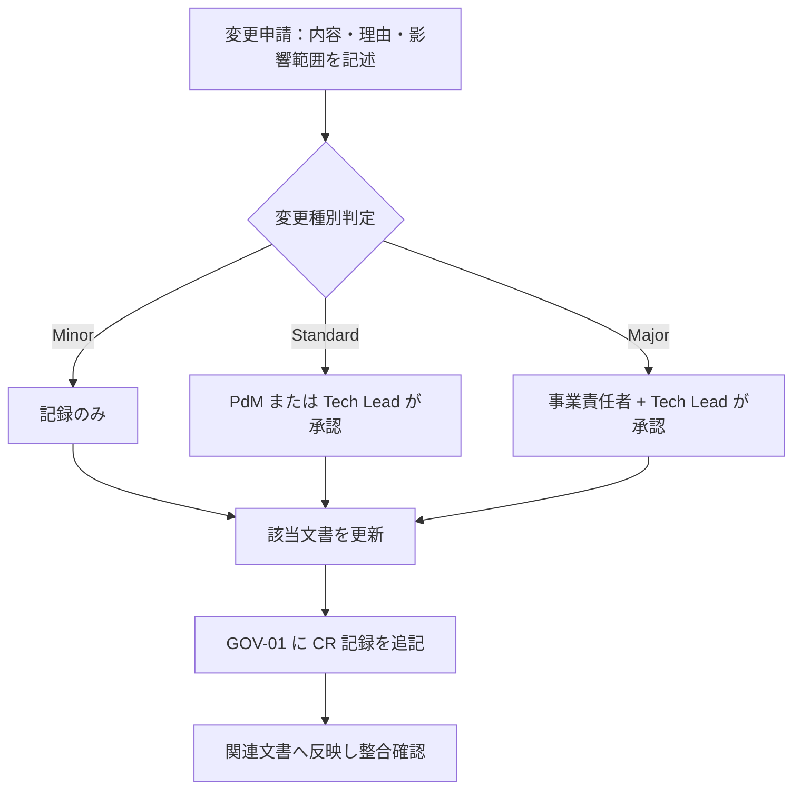

# 01-decision-log.md — 意思決定ログテンプレート

## このセクションの目的

重要な意思決定を時系列で記録し、背景と影響範囲を追跡できるようにする。**全フェーズ横断・プロジェクト開始初日から運用する**。

## 0-H. ハイブリッド編集ガイド（要点）

- 推奨モード: Human-first または Hybrid
- 人間確認必須: 本当に決定済みか、決定者の明確性、影響範囲の漏れ

---

## 1. 凡例

| 区分 | 内容 |
| --- | --- |
| D-ID | 決定 ID（D-NNN 連番） |
| 日付 | 決定確定日（YYYY-MM-DD） |
| カテゴリ | 事業 / プロダクト / 設計 / 運用 |
| 決定内容 | 確定した方針・選択 |
| 背景 | 議論の発端、選択肢、選定理由 |
| 影響範囲 | 反映が必要な文書・コード |
| 決定者 | 最終承認者 |
| 関連 TBD | 解決された GOV-02 の TBD-ID |

---

## 2. 決定ログ

<!-- TEMPLATE: プロジェクトの重要決定を時系列で追加。会議メモから AI に候補抽出させる -->
<!-- SAMPLE START: フォーマット例 — 実際のプロジェクト決定に置き換えてください。
     ID は実エントリと衝突しないよう D-000 を書式見本として予約している -->
### D-000：[決定タイトル]（書式見本 — 実際の採番は D-001 から）

| 項目 | 内容 |
| --- | --- |
| 日付 | YYYY-MM-DD |
| カテゴリ | 事業 / プロダクト / 設計 / 運用（いずれか） |
| 決定内容 | [確定した方針・選択] |
| 背景 | [議論の発端、選択肢、選定理由] |
| 影響範囲 | [反映が必要な文書・コード] |
| 決定者 | [最終承認者] |
| 関連 TBD | [解決された GOV-02 の TBD-ID、または —] |
<!-- SAMPLE END -->

## 3. 記録すべき意思決定の種別

- 顧客セグメントの変更
- MVP スコープの追加 / 除外
- 価格改定・無料層設計の変更
- 認証・権限・セキュリティ方針の変更
- データモデル（PRD-01）の変更
- 技術スタックの変更（DEV-01 §1 確定スタック・§2 機能別標準・§3 不採用リストの変更はすべてここに記録）
- AI 機能採否の変更
- インフラ・デプロイ戦略の変更
- 契約条件・SLA の変更

---

## 4. 正仕様承認ゲート

### 4-1. 正仕様の定義

「正仕様」とは、関係者が合意し、開発・運用・契約の判断基準として参照できる状態の文書セットを指す。必須文書の status が `approved` に達し、本セクションの承認記録が残った時点で正仕様とみなす。

### 4-2. 承認条件

- 必須文書の status が `approved`（必須文書セットは適用フローにより異なる — 00_README §4。デモ・受託の軽量フローでは対象文書のみで可）
- 主要な未決事項が GOV-02 で追跡されている
- 開発着手を止める重大な未決がない
- 承認者が承認記録に記録されている

### 4-3. 承認記録フォーマット

<!-- TEMPLATE: 正仕様が承認されたら記録する -->

| 承認 ID | 承認日 | 承認対象文書リスト | 承認者 | 承認時の未決事項数 | 備考 |
| --- | --- | --- | --- | --- | --- |
| APR-001 | YYYY-MM-DD | BIZ-01〜03, PRD-01〜05, DEV-01〜10, OPS-01〜02, GOV-01, GOV-02 | [承認者名] | [件数]（GOV-02 で管理） | [備考] |

---

## 5. 変更管理フロー（Change Request）

### 5-1. 目的

正仕様承認後に仕様変更が生じた場合、影響範囲を特定し、無承認で実装が進むことを防ぐ。

### 5-2. 変更種別と承認レベル

| 変更種別 | 定義 | 承認レベル |
| --- | --- | --- |
| Minor | 誤字・表現修正・説明補足など内容の実質変更なし | 記録のみ（承認不要） |
| Standard | 既存方針の調整・機能スコープの変更・要件追加 / 削除 | PdM または Tech Lead いずれか 1 名の承認 |
| Major | アーキテクチャ・認証・料金・SLA・権限モデル・技術スタック（DEV-01）の変更 | 事業責任者 + Tech Lead の承認 |

少人数チーム（兼務前提）を想定し、厳格な承認は Major のみとする。

### 5-3. 変更管理フロー

### 5-4. 変更申請記録フォーマット

<!-- TEMPLATE: 正仕様承認後に変更申請が出たら記録する -->

| CR-ID | 申請日 | 変更内容 | 種別 | 影響文書 | 承認者 | 承認日 | 反映状況 |
| --- | --- | --- | --- | --- | --- | --- | --- |
| CR-001 | YYYY-MM-DD | [変更内容の概要] | Minor / Standard / Major | [影響文書] | [承認者] | YYYY-MM-DD | 完了 / 反映中 |

---

## 6. 運用ルール

- 新たな決定が出たら本書に追記する。GOV-02 の TBD は解決時点で D-NNN に転記
- 決定の取り消し・変更は新しい D-NNN として記録し、旧 D-NNN に「→ D-MMM で置換」と注記
- 文書間で矛盾が見つかった場合、本書の最新決定が優先

---

## 7. 記入時チェックポイント

- 決定内容・背景・影響範囲が空欄になっていないか
- 決定者が明確か
- 関連 TBD（GOV-02）が転記されているか
- CR が時系列で追えるか
- Major 変更が 事業責任者 + Tech Lead に承認されているか
