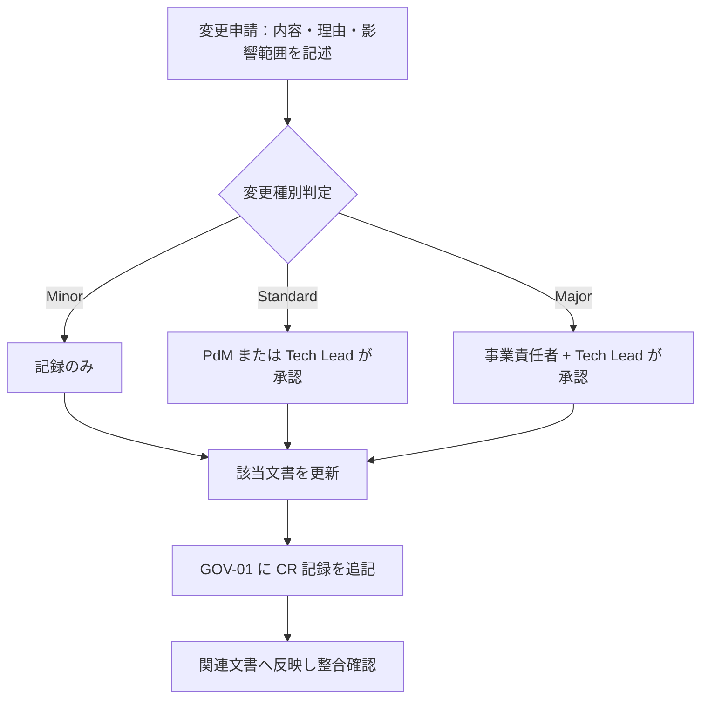

# 01-decision-log.md — 意思決定ログ

## このセクションの目的

重要な意思決定を時系列で記録し、背景と影響範囲を追跡できるようにする。**全フェーズ横断・プロジェクト開始初日から運用する**。

## 0-H. ハイブリッド編集ガイド（要点）

- 推奨モード: Human-first または Hybrid
- 人間確認必須: 本当に決定済みか、決定者の明確性、影響範囲の漏れ

---

## 1. 凡例

| 区分 | 内容 |
| --- | --- |
| D-ID | 決定 ID（D-NNN 連番） |
| 日付 | 決定確定日（YYYY-MM-DD） |
| カテゴリ | 事業 / プロダクト / 設計 / 運用 |
| 決定内容 | 確定した方針・選択 |
| 背景 | 議論の発端、選択肢、選定理由 |
| 影響範囲 | 反映が必要な文書・コード |
| 決定者 | 最終承認者 |
| 関連 TBD | 解決された GOV-02 の TBD-ID |

---

## 2. 決定ログ

### D-001：2 リポジトリ構成 → pnpm workspaces + Turborepo モノレポへの移行

| 項目 | 内容 |
| --- | --- |
| 日付 | 2026-08-17 |
| カテゴリ | 設計 |
| 決定内容 | 2 リポジトリ構成（public/admin）・npm から、1 リポジトリ内 `apps/public`/`apps/admin` + `packages/schema` の pnpm workspaces + Turborepo モノレポへ移行（`packages/types` は実際の利用箇所が出てから切り出す方針とし、見送り） |
| 背景 | 複数リポジトリ間の DB スキーマ手動コピーによる同期漏れ事故を構造的に防ぎ、ドキュメントも1箇所に集約して運用コストを下げるため（Cloudflare 公式推奨のモノレポ構成に合わせた）。`packages/config`/`packages/ui` は検討の上、実体のある共有内容がないため見送った。 |
| 影響範囲 | DEV-01 §1/§2/§3・§5, DEV-02, DEV-03, DEV-04, DEV-05, DEV-06, DEV-07 §9, DEV-08 §1/§2, DEV-09, DEV-10, PRD-01 §1-1, PRD-02 §1-3/§3, PRD-04, OPS-02 §3, 00_DEV_GUIDE.md, CLAUDE.md, README.md, 各 skill（schema-build/scaffold/admin-design/public-design/design-review）, ルート設定（package.json / pnpm-workspace.yaml / turbo.json / eslint.config.js / .prettierrc / .devcontainer） |
| 決定者 | Tech Lead |
| 関連 TBD | — |

### D-002：CI は GitHub Actions、CD は Cloudflare Workers Builds

| 項目 | 内容 |
| --- | --- |
| 日付 | 2026-08-18 |
| カテゴリ | 運用 |
| 決定内容 | 検査（CI）と デプロイ（CD）で基盤を分ける。CI は GitHub Actions（`.github/workflows/ci.yml`。`dev` 宛 PR で `pnpm check` + `pnpm build`）、CD は Cloudflare Workers Builds の GitHub 連携（リポジトリ内にデプロイ用ワークフローを持たない）。デプロイトリガーは staging ← `dev`、production ← `main`（`main` は案件 bootstrap 時に作成）。D1 マイグレーションは Workers Builds が自動実行しないため、`apps/admin` 側の Deploy command に `wrangler d1 migrations apply` を前置する |
| 背景 | DEV-08 §3 で Open だった CI/CD 基盤の決定。Workers Builds が Root directory / Build Watch Paths / Deploy command のカスタマイズ / Worker ごとの GitHub check run を備え、モノレポ 2 Worker 構成の要件（DEV-08 §2 のパスフィルタ）を満たすうえ、Cloudflare API トークンをリポジトリ側で管理せずに済むため CD はそちらに寄せた。一方 PR 時の品質ゲートは Workers Builds の範囲外で、hooks（`.claude/hooks/format-and-check.sh`）は Claude Code のセッション内でしか動かず強制力にならないため、CI は GitHub Actions で別途用意した。ブランチ名は docs が指していた `develop` が実在せず既定が `dev` であったため、docs 側を実態に合わせた |
| 影響範囲 | DEV-08 §2/§3, `.github/workflows/ci.yml`, CLAUDE.md, README.md |
| 決定者 | Tech Lead |
| 関連 TBD | — |

### D-003：事業仕様を別リポジトリから本リポジトリへ移行し、Astro + Cloudflare の技術スタックへ全面置換

| 項目 | 内容 |
| --- | --- |
| 日付 | 2026-08-18 |
| カテゴリ | 設計 |
| 決定内容 | 「保護犬おさんぽマッチングサービス」の事業・プロダクト仕様（旧リポジトリ `old-docs/`）を、本リポジトリの `docs/` に移行する。事業・プロダクト内容（BIZ / PRD の大部分）はそのまま踏襲し、技術記述（DEV 系）はすべて DEV-01 が定義する Cloudflare スタック（Astro SSR + Svelte + D1 + R2 + KV + Drizzle）に置き換える |
| 背景 | 旧リポジトリは事業立ち上げ初期に別の技術スタックを前提として書かれたが、本プロジェクトは `site-template`（Astro + Cloudflare）を基盤として開発を進める方針に転換した。事業内容・ドメインモデル・機能要件は技術非依存であり再利用可能なため、仕様の再検討コストを避けて移行する |
| 影響範囲 | docs/ 全体（1-business, 2-product, 3-development, 4-operations） |
| 決定者 | Tech Lead / 事業責任者 |
| 関連 TBD | — |

### D-004：ロール構成は super_admin/support（apps/admin）+ org_admin/org_staff（apps/public、organization_members の列で直書き）の 2 系統 4 ロール → D-011 で置換

| 項目 | 内容 |
| --- | --- |
| 日付 | 2026-08-18 |
| カテゴリ | 設計 |
| 決定内容 | 旧仕様（Platform 2 ロール + Organization 2 ロールの計 4 ロール、専用ロールライブラリの teams 機能で実装）を踏襲しつつ、ライブラリを使わず自前実装に変更する。`apps/admin` の AdminUser に `super_admin` / `support`、`apps/public` の OrganizationMember に `organization_id` + `role`（`org_admin` / `org_staff`）列を持たせる。Walker（お散歩参加者）はロールを持たずプロフィールの `status` で機能解禁を判定する（旧仕様のデータ駆動方式をそのまま踏襲） |
| 背景 | D1 + Drizzle 環境では旧仕様が使っていたようなロールライブラリが存在せず、DEV-01 の「自前実装」方針（ロールを列で持つ既存パターン）と整合させる方が実装が単純 |
| 影響範囲 | DEV-01 §2、DEV-02 §2、DEV-07（organization_members / admin_users）、PRD-01 §1-2 |
| 決定者 | Tech Lead |
| 関連 TBD | — |
| 置換 | 2026-08-19 付 D-011 により、Platform 側は `super_admin`/`support` の 2 ロールから単一 `admin` ロールへ変更。Organization 側（org_admin/org_staff）は変更なし |

### D-005：チャット・AI 機能は不採用（旧仕様の判断を継承）

| 項目 | 内容 |
| --- | --- |
| 日付 | 2026-08-18 |
| カテゴリ | プロダクト |
| 決定内容 | 旧仕様の決定（チャット・AI 機能不採用）をそのまま継承する。PRD-05 は不採用のまま、DEV-01 §2 の LLM 統合レイヤー（Vercel AI SDK）・Vector DB（Vectorize）は導入しない |
| 背景 | 事業要件（INTAKE 移行版）にチャット・AI 関連の要件がなく、通知はメール + アプリ内通知（DB）で足りるため |
| 影響範囲 | PRD-03（FG 一覧から除外）、PRD-05（不採用として記入） |
| 決定者 | PdM |
| 関連 TBD | — |

### D-006：本プロジェクトはテンプレート標準の「パターン A（コンテンツ主体サイト）」の適用範囲を超えるマーケットプレイス事業として実装する

| 項目 | 内容 |
| --- | --- |
| 日付 | 2026-08-18 |
| カテゴリ | 事業 |
| 決定内容 | 00_README §0-1 の自己診断基準ではパターン B（業務システム・マルチテナント SaaS）に該当し、本来は別テンプレートの対象だが、既に Astro + Cloudflare での実装を進めている本リポジトリ上でそのまま拡張する。多ロール権限・マーケットプレイス決済（Stripe Connect）・ジオコーディングを DEV-01 に追加することで対応する |
| 背景 | 事業自体（お散歩参加者 × 保護団体の二者間マーケットプレイス）を変更する選択肢はなく、技術基盤を `site-template` 前提で進める意思決定が先に確定していたため、テンプレートの適用範囲外を承知の上で拡張する判断をした |
| 影響範囲 | DEV-01 §0、00_README（本リポジトリでは §0-1 の基準を適用外とする）、PRD-01〜04 全体 |
| 決定者 | 事業責任者 / Tech Lead |
| 関連 TBD | — |

### D-007：保護団体ページ（org_admin/org_staff 用の管理画面）は apps/admin ではなく apps/public 側に配置する

| 項目 | 内容 |
| --- | --- |
| 日付 | 2026-08-18 |
| カテゴリ | 設計 |
| 決定内容 | 旧仕様では公開画面・保護団体ページ・プラットフォーム管理画面の 3 領域を単一アプリで提供していたが、本プロジェクトでは `apps/public` が「公開ブラウジング + Walker マイページ + 保護団体ページ（`/organization/*`）」を、`apps/admin` が「プラットフォーム運営者専用（admin）」を担当する 2 Worker 構成に再配置する |
| 背景 | 保護団体スタッフは外部の利用者（プラットフォーム運営者ではない）であり、性質上 Walker と同じ「サービス利用者」に近い。内部運営専用の `apps/admin` に外部利用者のログインを混在させるより、既存の 2 Worker 構成（apps/public = 対外、apps/admin = 対内）の境界に忠実な方が権限境界の説明が単純になる |
| 影響範囲 | DEV-01 §1、DEV-02 §1〜§3、DEV-05、DEV-06、PRD-01 §1-1、PRD-04 §3、CLAUDE.md（apps/public の D1 アクセス・認証ルートに関する記述、`eslint.config.js` の `boundaries/elements` は反映済み） |
| 決定者 | Tech Lead |
| 関連 TBD | — |

### D-008：決済は Stripe SDK 直接利用 + Stripe Connect を採用（旧仕様の判断を継承）

| 項目 | 内容 |
| --- | --- |
| 日付 | 2026-08-18 |
| カテゴリ | 設計 |
| 決定内容 | 参加費の都度課金は Stripe Payment Intent / Checkout、保護団体への還元送金は Stripe Connect（Connected Account への Transfer）を用いる |
| 背景 | 旧仕様の決定（サブスク課金向けの決済ライブラリではなく Stripe SDK 直接利用）をそのまま踏襲。DEV-01 §2 の Stripe（`stripe` npm パッケージ、`nodejs_compat` 要）に Connect 利用を明記した |
| 影響範囲 | DEV-01 §2、DEV-07、DEV-09、DEV-10 §2 |
| 決定者 | Tech Lead |
| 関連 TBD | — |

### D-009：エリア・距離検索は Google Maps Platform Geocoding API を採用（旧仕様の判断を継承）

| 項目 | 内容 |
| --- | --- |
| 日付 | 2026-08-18 |
| カテゴリ | 設計 |
| 決定内容 | 保護団体・お散歩枠の住所を Google Maps Platform Geocoding API で緯度経度へ変換し、距離計算は D1 に対する SQL（バインド変数使用）による Haversine 公式で行う |
| 背景 | 旧仕様の決定を踏襲。D1（SQLite）に専用の空間拡張はないため、想定規模であれば Haversine 公式による計算で十分と判断 |
| 影響範囲 | DEV-01 §2、DEV-02、DEV-07、DEV-10 §9 |
| 決定者 | Tech Lead |
| 関連 TBD | — |

### D-010：非同期処理（旧仕様の Queue Job 相当）は Cloudflare Queues ではなく `ctx.waitUntil()` + Cron Triggers で代替する

| 項目 | 内容 |
| --- | --- |
| 日付 | 2026-08-18 |
| カテゴリ | 設計 |
| 決定内容 | 旧仕様で非同期ジョブキューが担っていた処理（Stripe Webhook 後処理・メール送信・監査ログ記録・月次 Payout 集計・データ保持期限の自動削除）を、リクエスト内の後処理は `ctx.waitUntil()`、定期バッチは Cloudflare Cron Triggers（`apps/admin` の Scheduled Worker）に置き換える |
| 背景 | CLAUDE.md のハード制約（Cloudflare Queues 不採用）および DEV-01 §3 の既定方針に従う。マーケットプレイス特有の月次集計・送金処理も Cron Triggers で対応可能と判断 |
| 影響範囲 | DEV-01 §4、DEV-05、DEV-08、DEV-09、DEV-10、OPS-02 §4-3 |
| 決定者 | Tech Lead |
| 関連 TBD | — |

### D-011：ロール構成を「apps/admin: admin 単一ロール」+「apps/public: org_admin/org_staff」の 1 系統 3 ロールに簡素化（D-004 を置換）

| 項目 | 内容 |
| --- | --- |
| 日付 | 2026-08-19 |
| カテゴリ | 設計 |
| 決定内容 | D-004 で決定した「Platform 2 ロール（`super_admin`/`support`）+ Organization 2 ロールの計 4 ロール」構成を撤回する。`apps/admin` の AdminUser は、読み取り専用のサポート担当ロールを設けず、単一ロール `admin`（全操作を実行可能）とする。ロールが常に 1 種類のみとなるため、AdminUser テーブルは `role` 列を持たない（列自体を廃止）。`apps/public` の OrganizationMember（`org_admin`/`org_staff` の 2 ロール）・Walker（ロールなし、`status` で機能解禁を判定）は D-004 のまま変更しない |
| 背景 | 事業側の確定方針として、プラットフォーム管理者はサポート担当などの追加ロールを持たない 1 ロール構成とすることが決まった。D-004 時点では旧仕様の Platform 2 ロール構成をそのまま踏襲していたが、実際の運用体制は Tech Lead / PdM 等の兼務前提の少人数チームであり、書き込み不可の read-only ロールを分けて運用する実態がないため撤回する |
| 影響範囲 | DEV-01 §2、DEV-02 §2、DEV-03、DEV-04、DEV-05、DEV-06、DEV-07（admin_users）、DEV-08、DEV-09、DEV-10、PRD-01 §1-2、PRD-02、PRD-03、PRD-04、OPS-02、00_INTAKE.md |
| 決定者 | 事業責任者 / Tech Lead |
| 関連 TBD | — |

### D-012：コードジェネレータを持たず、実装系スキルは `schema-build` と `scaffold` の 2 つとする

| 項目 | 内容 |
| --- | --- |
| 日付 | 2026-09-09 |
| カテゴリ | 設計 |
| 決定内容 | 旧リポジトリの仕様書が前提としていた Plop ベースの雛形生成器（`backend-scaffold` / `page-skeleton` / `resource-scaffold` の 3 スキルと `apps/admin/plopfile.mjs`）は採用しない。実装系スキルは `schema-build`（DEV-07 → Drizzle スキーマ → migration）と `scaffold`（`inquiries` の参照実装に倣って Service / Zod バリデーション / API ルートを書く）の 2 つのみとする |
| 背景 | 移行先リポジトリには該当スキルも `plopfile.mjs` も存在せず、実在する `scaffold` スキルは「正解は動く参照実装であって雛形ではない」という方針で作られている。旧仕様書の記述は移行元リポジトリの構想を写したもので、実装と食い違っていた。雛形生成器は生成直後から実装とドリフトするため、参照実装（`apps/admin/src/lib/server/services/inquiries.ts` と `apps/admin/tests/unit/inquiries.test.ts`）を正とする方式を維持する |
| 影響範囲 | 00_DEV_GUIDE §1・§3・§4、DEV-01 §1・§9、DEV-05 §1・§12、PRD-04 §3 |
| 決定者 | Tech Lead |
| 関連 TBD | — |

### D-013：読み物系コンテンツの置き場所を「D1 / Content Collections / ページ直書き」の 3 択で振り分ける

| 項目 | 内容 |
| --- | --- |
| 日付 | 2026-09-09 |
| カテゴリ | 設計 |
| 決定内容 | 公開画面のコンテンツは、**閲覧者によって出し分けるか**と**改定履歴が要るか**で置き場所を決める。①お知らせ（News）は `audience` によるログイン状態依存の出し分けと `published_until` の時限公開を持つため **D1**。②利用規約・プライバシーポリシーは改定履歴が同意記録と対になるため **Content Collections**（`packages/content/legal/`、frontmatter に `version`）。③トップページのコピー・FAQ・利用ガイド・安全に利用するために・特定商取引法に基づく表示・各種完了案内ページは全閲覧者に同一内容で改定履歴も不要のため **ページ直書き**。④メール文面は `render*Email()` テンプレート関数としてコードで管理する。この結果 `faqs` テーブルと FAQ 管理画面（旧 SYS-26〜28。削除に伴い後続画面を繰り上げ、現在の SYS-26〜28 はお問い合わせ一覧・詳細と管理操作履歴）は作らない。**PRD-04 の全画面（SCR-01〜45 / ADM-00〜23 / SYS-01〜28）を DEV-06 §1-1 の ①〜⑥ に振り分け済みで、未判断の画面は残していない** |
| 背景 | 旧リポジトリの仕様書は Content Collections が存在しなかった時代のもので、コンテンツを一律 D1 に置く前提で書かれていた。Cloudflare の課金は D1 の行読み取りに乗るため、閲覧数の多い公開ページを D1 で賄うと管理画面の実装コストと運用コストの両方を払うことになる。一方で利用規約は F-01-06 の同意記録が「どの版に同意したか」を指す必要があり、git による版管理がそのまま証跡になる Content Collections が適する。あわせて `walker_profiles` に `terms_agreed_version` 列を追加する（同意日時だけでは版が復元できないため） |
| 影響範囲 | PRD-01 §1-1・§3-2・§5、PRD-02 §6-1・§6-2、PRD-03 FG-14・FG-15、PRD-04 §3-1・§3-3、DEV-01 §1、DEV-04 §5-5・§5-14、DEV-06 §1-1、DEV-07 §3-2・§5-3・§5-21・§5-22 |
| 決定者 | 事業責任者 / Tech Lead |
| 関連 TBD | GOV-02 TBD-41（FAQ を運営が自己編集する要求が出た場合の D1 移行） |

### D-014：テンプレート標準のブログ CMS（Post / Category / Tag / PostTag）は採用しない

| 項目 | 内容 |
| --- | --- |
| 日付 | 2026-09-09 |
| カテゴリ | 設計 |
| 決定内容 | テンプレート標準の `posts` / `categories` / `tags` / `post_tags` の 4 テーブルと対応する Service / API / 管理画面を作らない。記事型コンテンツは News（D1、D-013）のみとする |
| 背景 | 旧 DEV-07 §3-2 は 4 テーブルを「必須」としていたが、PRD-04 の公開サイトマップ（SCR-01〜45）にも管理画面（SYS-NN）にも対応する画面が 1 つも定義されていなかった。テンプレートから引き継いだまま残っていた残骸である。CLAUDE.md の制約により不要機能の削除は最初の `pnpm db:generate` より前に行う必要があり、本リポジトリは `packages/schema/migrations/` が未生成のため今が最後のタイミングだった。将来コーポレート発信の記事が必要になった場合は、まず `packages/content` の Content Collections を検討する（D-013 の判断軸） |
| 影響範囲 | PRD-01 §1-1・§3-2、PRD-02 §1-2・§1-3・§6-1、DEV-05 §1、DEV-07 §2-1・§3-2・§4・§10・§12、DEV-09 §1・§2-13、DEV-10 §4-2 |
| 決定者 | Tech Lead |
| 関連 TBD | — |

### D-015：サーバー共通基盤は `packages/server-kit` に置き、両アプリが import する（アプリ内 `db/`・`http/` の二重実装を置換）

| 項目 | 内容 |
| --- | --- |
| 日付 | 2026-09-15 |
| カテゴリ | 設計 |
| 決定内容 | D1 クライアント（`createDb`）は `packages/schema/src/client.ts`、HTTP エンベロープ・`AppError` 系・カーソルページネーションは `packages/server-kit/src/http/`、パスワードハッシュ・セッショントークン/TTL/期限判定・ロックアウトカウンタは `packages/server-kit/src/auth/` に置き、`apps/public` と `apps/admin` が `@app/schema/client` / `@app/server-kit/http` / `@app/server-kit/auth` として同じ実装を import する。アプリ配下に `src/lib/server/db/` および `src/lib/server/http/` を作らない。ワークスペースのパッケージ名は `@app/*` スコープ（`@app/schema` / `@app/server-kit` / `@app/content`） |
| 背景 | 旧リポジトリの仕様書は共有パッケージが `packages/schema` だけだった時期に書かれており、レスポンス整形・ページネーション・ロックアウトを「アプリごとに独立実装する」と定めていた（旧 DEV-04 §3-2、旧 DEV-05 §1）。移行先リポジトリには `packages/server-kit` が既に存在し、`apps/admin` の実装もそこを import している。エンベロープとエラー形は 2 つの Worker で同一でなければ API 仕様（DEV-04 §3）が成立せず、二重実装はドリフトの温床になる。一方で「どのテーブルを引くか・どのクッキーを読むか」は系統ごとに分離したまま（DEV-02 §1-4 の禁止事項は維持）とし、共有するのは純粋関数に限る |
| 影響範囲 | DEV-01 §1・§5-3・§8、DEV-02 §1-4・§7、DEV-03 §3-1、DEV-04 §3-2・§8、DEV-05 §1・§2、DEV-06 §1 |
| 決定者 | Tech Lead |
| 関連 TBD | GOV-02 TBD-45（`apps/public` 内 2 系統のロックアウトキーのスコープ分け） |

---

## 3. 記録すべき意思決定の種別

- 顧客セグメントの変更
- MVP スコープの追加 / 除外
- 価格改定・無料層設計の変更
- 認証・権限・セキュリティ方針の変更
- データモデル（PRD-01）の変更
- 技術スタックの変更（DEV-01 §1 確定スタック・§2 機能別標準・§3 不採用リストの変更はすべてここに記録）
- AI 機能採否の変更
- インフラ・デプロイ戦略の変更
- 契約条件・SLA の変更

---

## 4. 正仕様承認ゲート

### 4-1. 正仕様の定義

「正仕様」とは、関係者が合意し、開発・運用・契約の判断基準として参照できる状態の文書セットを指す。必須文書の status が `approved` に達し、本セクションの承認記録が残った時点で正仕様とみなす。

### 4-2. 承認条件

- 必須文書の status が `approved`（必須文書セットは適用フローにより異なる — 00_README §4。デモ・受託の軽量フローでは対象文書のみで可）
- 主要な未決事項が GOV-02 で追跡されている
- 開発着手を止める重大な未決がない
- 承認者が承認記録に記録されている

### 4-3. 承認記録フォーマット

| 承認 ID | 承認日 | 承認対象文書リスト | 承認者 | 承認時の未決事項数 | 備考 |
| --- | --- | --- | --- | --- | --- |
| APR-001 | 未実施 | BIZ-01〜03, PRD-01〜04（PRD-05 は不採用）, DEV-01〜10, OPS-01〜02, GOV-01, GOV-02 | `Open` | GOV-02 で管理（旧仕様から移行した TBD 多数、うち P0 相当が複数） | 事業責任者による料金・保険・契約条項（OPS-01 §6・§10）の確認が承認の前提 |

---

## 5. 変更管理フロー（Change Request）

### 5-1. 目的

正仕様承認後に仕様変更が生じた場合、影響範囲を特定し、無承認で実装が進むことを防ぐ。

### 5-2. 変更種別と承認レベル

| 変更種別 | 定義 | 承認レベル |
| --- | --- | --- |
| Minor | 誤字・表現修正・説明補足など内容の実質変更なし | 記録のみ（承認不要） |
| Standard | 既存方針の調整・機能スコープの変更・要件追加 / 削除 | PdM または Tech Lead いずれか 1 名の承認 |
| Major | アーキテクチャ・認証・料金・SLA・権限モデル・技術スタック（DEV-01）の変更 | 事業責任者 + Tech Lead の承認 |

少人数チーム（兼務前提）を想定し、厳格な承認は Major のみとする。

### 5-3. 変更管理フロー

### 5-4. 変更申請記録フォーマット

| CR-ID | 申請日 | 変更内容 | 種別 | 影響文書 | 承認者 | 承認日 | 反映状況 |
| --- | --- | --- | --- | --- | --- | --- | --- |
| — | — | （現時点で変更申請なし。正仕様承認前のため §2 の決定ログで管理）| — | — | — | — | — |

---

## 6. 運用ルール

- 新たな決定が出たら本書に追記する。GOV-02 の TBD は解決時点で D-NNN に転記
- 決定の取り消し・変更は新しい D-NNN として記録し、旧 D-NNN に「→ D-MMM で置換」と注記
- 文書間で矛盾が見つかった場合、本書の最新決定が優先

---

## 7. 記入時チェックポイント

- 決定内容・背景・影響範囲が空欄になっていないか
- 決定者が明確か
- 関連 TBD（GOV-02）が転記されているか
- CR が時系列で追えるか
- Major 変更が 事業責任者 + Tech Lead に承認されているか
